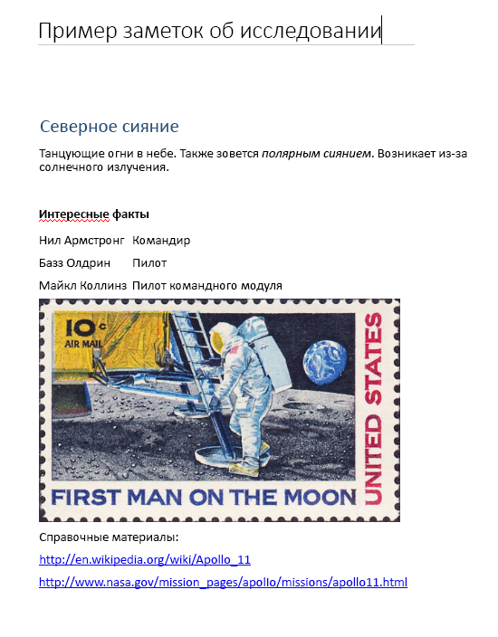

# <a name="input-and-output-html-on-onenote-pages"></a>Входной и выходной код HTML на страницах OneNote

HTML-код, определяющий содержимое и структуру страницы при [создании](onenote-create-page.md) или [обновлении](onenote-update-page.md) страницы OneNote, называется *входным HTML-кодом*. 

HTML-код, возвращаемый при [получении содержимого страницы](onenote-get-content.md), называется *выходным HTML-кодом*. Выходной HTML-код не совпадает со входным.

API OneNote в Microsoft Graph сохраняют семантическое содержимое и базовую структуру входного HTML-кода, но преобразовывают ее в набор [поддерживаемых элементов HTML и свойств CSS](onenote-create-page.md#supported-html-and-css-for-onenote-pages). API также добавляют настраиваемые атрибуты, поддерживающие функции OneNote.
 
В этой статье описываются основные элементы и атрибуты входного и выходного HTML-кода. Разбираться во входном HTML-коде полезно при создании и обновлении содержимого страницы, а в выходном — при анализе возвращаемого содержимого страницы. 

## <a name="body-element"></a>Элемент body

HTML-содержимое в основном тексте страницы представляет содержимое и структуру страницы, включая изображения и файловые ресурсы. Элемент **body** может включать следующие атрибуты во входных и выходных данных HTML.

#### <a name="input-attributes"></a>Входные атрибуты

|Входной атрибут|Описание|
|:------|:------|
| data-absolute-enabled | Указывает, поддерживают ли во входном тексте элементы с [абсолютным положением](onenote-abs-pos.md). |
| style | <p>Свойства CSS [style](#styles) для основного текста. В выходном HTML-коде входные параметры могут быть встроены в соответствующие дочерние элементы.</p><p>В настоящее время цвет фона не поддерживается для элемента **body**.</p> |
 

#### <a name="output-attributes"></a>Выходные атрибуты

|Выходной атрибут|Описание|
|:------|:------|
| data-absolute-enabled | Указывает, поддерживаются ли в тексте элементы с [абсолютным положением](onenote-abs-pos.md). В выходном HTML-коде всегда задано значение **true**. |
| style | Свойства **font-family** и **font-size** основного текста. |


## <a name="div-elements"></a>Элементы div

Элементы **div** содержат текст, изображения и другой контент. Входной и выходной HTML-код для элемента **div** может содержать перечисленные ниже атрибуты.

#### <a name="input-attributes"></a>Входные атрибуты

|Входной атрибут|Описание|
|:------|:------|
| data-id | Ссылка на элемент.<br/><br/>Используется для [обновления содержимого страницы](onenote-update-page.md). |
| data-render-fallback | Резервное действие в случае ошибки [извлечения](onenote-extract-data.md): **render** (по умолчанию) или **none** |
| data-render-method | Выполняемый метод [извлечения](onenote-extract-data.md), например<br/>`extract.businesscard` или `extract.recipe` |
| data-render-src | Источник контента для [извлечения](onenote-extract-data.md). |
| style | Свойства положения, размера, шрифта и цвета для элемента div: <ul><li>**position** (только значение **absolute**), **left**, **top** и **width** (высота элементов Div настраивается автоматически).<br/><br/>Используется для создания элемента div с [абсолютным положением](onenote-abs-pos.md), только если он является непосредственным дочерним элементом основного текста, для которого задан атрибут `data-absolute-enabled="true"`.<br/><br/>Пример: `<div style="position:absolute;width:360px;top:350px;left:300px" ... />`</li><li>Свойства CSS [style](#styles) элемента. В выходных данных HTML эти значения возвращаются встроенными в соответствующие дочерние элементы.</li></ul> |
 

API OneNote в Microsoft Graph заключают все содержимое основного текста по крайней мере в один элемент div. API создает разделитель по умолчанию (с атрибутом `data-id="_default"`) для содержимого основного текста, если:

- Атрибут **data-absolute-enabled** входного элемента body отсутствует или имеет значение **fals** e. В этом случае все содержимое основного текста помещается в разделитель по умолчанию.

- Для входного атрибута **data-absolute-enabled** элемента body задано значение **true**, но входной HTML-код содержит непосредственные дочерние элементы&nbsp;**div**, **img** или **object** без [абсолютного положения](onenote-abs-pos.md). В этом случае непосредственные дочерние элементы &nbsp;**div**, **img** или **object** без [абсолютного положения](onenote-abs-pos.md) помещаются в элементы div по умолчанию.


#### <a name="output-attributes"></a>Выходные атрибуты

|Выходной атрибут|Описание|
|:------|:------|
| data-id | Ссылка на элемент.<br/><br/>Используется для [обновления содержимого страницы](onenote-update-page.md). |
| id | Уникальный сгенерированный ИД элемента. Возвращается [запросами GET к конечной точке *content* страницы](/graph/api/page-get) при использовании параметра запроса `includeIDs=true`.<br/><br/>Используется для [обновления содержимого страницы](onenote-update-page.md). |
| style | Свойства позиции и размера разделителя. |
 
### <a name="non-contributing-divs"></a>Вспомогательные разделители

Если элемент **div** во входных данных HTML не входит в структуру страницы и не переносит сведения, используемые приложением OneNote, API перемещает содержимое разделителя в родительский или используемый по умолчанию разделитель. Этот процесс показан в приведенных ниже примерах.

#### <a name="input-html"></a>Входной HTML-код

Содержит вспомогательный вложенный разделитель.

```html
<html>
    <head>
        <title>Page Title</title>
    </head>
    <body>
        <div>
            <p>Some text</p>
            <div>
                <p>More text inside a div that doesn't define page structure</p>
            </div>
        </div>
    </body>
</html>
```

#### <a name="output-html"></a>Выходной HTML-код

> [!NOTE]
> Содержимое разделителя перемещено в родительский разделитель, а вложенные теги `<div>` удалены. Элемент div был бы сохранен, если бы в нем были определены какие-либо семантические сведения, такие как **data-id** (пример: `<div data-id="keep-me">`).

```html
<html htmlns="https://www.w3.org/1999/xhtml" lang="en-US">
    <head>
        <title>Page Title</title>
    </head>
    <body data-absolute-enabled="true" style="font-family:Calibri;font-size:11px">
        <div data-id="_default" style="position:absolute;left:48px;top:120px;width:624px">
            <p>Some text</p>
            <p>More text inside a nested div</p>
        </div>
    </body>
</html>
```


## <a name="img-elements"></a>Элементы img

Для представления изображений на страницах OneNote используются элементы **img**. Входной и выходной HTML-код для элемента **img** может содержать перечисленные ниже атрибуты.

#### <a name="input-attributes"></a>Входные атрибуты

|Входной атрибут|Описание|
|:------|:------|
| alt | Предоставленный замещающий текст для изображения. |
| data-id | Ссылка на элемент.<br/><br/>Используется для [обновления содержимого страницы](onenote-update-page.md). |
| data-render-src |Должно было задано значение **data-render-src** или **src**.<br/><br/>Веб-страница, которая будет отображаться в виде битового изображения на странице OneNote:<br/><br/> - `data-render-src="https://..."` для общедоступного URL-адреса.<br/><br/> - `data-render-src="name:BlockName"` для части изображения в блоке Presentation [составного запроса](/graph/api/section-post-pages#example).<br/><br/>Этот метод удобно использовать, если веб-страница слишком сложна для достоверного отображения в OneNote или для использования страницы необходимы учетные данные.|
| data-tag | [Тег заметки](onenote-note-tags.md) для элемента. |
| style |Свойства положения и размера изображения: **position** (только **absolute**), **left**, **top**, **width** и **height**.<br/><br/>Размер можно задать для любого изображения.<br/><br/>Свойства положения используются для создания изображения с [абсолютным положением](onenote-abs-pos.md), только если изображение является непосредственным дочерним элементом основного текста, для которого задан атрибут `data-absolute-enabled="true"`.<br/><br/>Пример: ``<br/><br/>В выходном HTML-коде размеры изображения возвращаются по отдельности через атрибуты **width** и **height**. |
| src |Должно было задано значение **src** или **data-render-src**.<br/><br/>Изображение, отображаемое на странице OneNote:<br/><br/>- `src="https://..."`: URL-адрес общедоступного изображения в Интернете.<br/><br/> - `src="name:BlockName"`: именованная часть составного запроса, представляющая изображение.|
| width, height | Ширина и высота изображения в пикселях, но без обозначения px. Пример: `width="400"` |

> [!NOTE]
> API OneNote автоматически определяют тип входного изображения и возвращают его в качестве атрибута **data-fullres-src-type** в выходном коде HTML. API также возвращает тип оптимизированного изображения в атрибуте **data-src-type**.
 

#### <a name="output-attributes"></a>Выходные атрибуты

|Выходной атрибут|Описание|
|:------|:------|
| alt | Предоставленный замещающий текст для изображения. |
| data-id | Ссылка на элемент.<br/><br/>Используется для [обновления содержимого страницы](onenote-update-page.md). |
| data-index | Положение изображения. Для поддержки [разделения изображений](#split-images). |
| data-fullres-src | Конечная точка версии изображения, которая была изначально внедрена на странице. |
| data-fullres-src-type | Тип мультимедиа для ресурса **data-fullres-src**, например `image/png` или `image/jpeg`. |
| data-options | Тип источника: **printout** для PDF-файлов или **splitimage** для всех остальных. Применяется только к [разделенным изображениям](#split-images), созданным с помощью атрибута **data-render-src**. |
| data-render-original-src | Исходный URL-адрес источника изображения, если исходное изображение находится в общедоступной части Интернета и создано с использованием атрибута **data-render-src**. |
| data-src-type | Тип мультимедиа для ресурса **src**, например `image/png` или `image/jpeg`. |
| data-tag | [Тег заметки](onenote-note-tags.md) для элемента. |
| id | Уникальный сгенерированный ИД элемента. Возвращается [запросами GET к конечной точке *content* страницы](/graph/api/page-get) при использовании параметра запроса `includeIDs=true`.<br/><br/>Используется для [обновления содержимого страницы](onenote-update-page.md). |
| src | Конечная точка версии изображения, оптимизированного для веб-браузеров, а также мобильных телефонов и планшетов. |
| style | Свойства позиции изображения. |
| width, height | Ширина или высота изображения в пикселях. |
 

### <a name="output-html-examples-for-images"></a>Примеры выходного HTML-кода для изображений

Выходные элементы **img** содержат конечные точки для ресурсов файлов изображений и типа изображения, как показано ниже. Вы можете отправлять отдельные [запросы GET к конечным точкам ресурсов изображений](/graph/api/resource-get), чтобы получать их двоичное содержимое.

```html

```

В приведенных ниже примерах показаны сведения, которые может содержать элемент **img** в выходном HTML-коде.

#### <a name="image-with-web-ready-and-high-resolution-resources"></a>Изображение с ресурсами высокого разрешения для Интернета

```html

```

#### <a name="image-created-by-using-the-data-render-src-attribute"></a>Изображение, созданное с использованием атрибута *data-render-src*

```html

```

### <a name="split-images"></a>Разделенные изображения

Изображения, созданные с использованием атрибута **data-render-src** из URL-адреса веб-сайта или именованной части, можно разделять на несколько компонентов в целях повышения производительности и удобства отображения. Всем компонентам изображения назначается одно и то же значение **data-id**. У каждого компонента есть атрибут data-index (с отсчетом от нуля), который задает исходную вертикальную разметку.

#### <a name="split-image-with-three-component-images"></a>Разделенное изображение с тремя компонентами

```html
<div data-id="multi-component-image" style="position:absolute;left:48px;top:120px;width:624px">
    
    
    
</div>
```

Так как пользователи могут перемещать изображения на странице, порядок возвращаемых индексов может быть нарушен. Сортировка должна выполняться сверху вниз, а затем слева направо, если имеются конфликты значений по вертикали.

## <a name="iframe-elements"></a>Элементы iframe

Страницы OneNote могут содержать внедренные видео, представленные элементами **iframe**. 

> [!NOTE]
> Также можно [вложить видеофайл с помощью элемента **object**](onenote-images-files.md#adding-files).

#### <a name="input-attributes"></a>Входные атрибуты

|Входной атрибут|Описание|
|:------|:------|
| data-original-src | Обязательный. URL-адрес источника видео. См. [список поддерживаемых источников видео](onenote-images-files.md#adding-videos). <br/><br/>Пример: `data-original-src="https://www.youtube.com/watch?v=3Ztr44aKmQ8"` |
| width, height | Ширина или высота элемента iframe в пикселях. Пример: `width=300` |

#### <a name="output-attributes"></a>Выходные атрибуты

|Выходной атрибут|Описание|
|:------|:------|
| data-original-src | URL-адрес источника видео. |
| src | Ссылка на видео, внедренное в страницу OneNote. |
| width, height | Ширина или высота элемента iframe в пикселях.<br/><br/>Пример: `width=300` |
 
### <a name="output-html-example-for-videos"></a>Пример выходного HTML-кода для видео

Выходные элементы **iframe** содержат конечные точки, ссылающиеся на исходную страницу и видео, как показано ниже. 

```html
<iframe 
    width="340" height="280" 
    data-original-src="https://www.youtube.com/watch?v=3Ztr44aKmQ8" 
    src="https://www.youtube.com/embed/3Ztr44aKmQ8?feature=oembed&autoplay=true" />
``` 

## <a name="object-elements"></a>Элементы object

Страницы OneNote могут содержать вложения, представленные элементами **object**. Входной и выходной HTML-код для элемента **object** может содержать перечисленные ниже атрибуты.

> [!NOTE]
> API OneNote также может отображать содержимое файлов в виде изображений на странице, если файл отправлен как изображение и использует атрибут **data-render-src**.
> Пример: ``
 

#### <a name="input-attributes"></a>Входные атрибуты

|Входной атрибут|Описание|
|:------|:------|
| data | Обязательный параметр. Имя части, которая представляет файл в [составном запросе](/graph/api/section-post-pages#example). |
| data-attachment | Обязательный параметр. Имя файла. |
| data-id | Ссылка на элемент.<br/><br/>Используется для [обновления содержимого страницы](onenote-update-page.md). |
| style | Свойства положения и размера объекта: **position** (только **absolute**), **left**, **top** и **width**.<br/><br/>Используется для создания объекта с [абсолютным положением](onenote-abs-pos.md), только если объект является непосредственным дочерним элементом основного текста, для которого задан атрибут `data-absolute-enabled="true"`.<br/><br/>Пример: `<object style="position:absolute;top:350px;left:300px" ... />` |
| type | Обязательный.<br/><br/>Стандартный тип файла мультимедиа. Для известных типов файлов на странице OneNote отображаются связанные с ними значки. Для неизвестных типов файлов отображается стандартный значок. |
<!--todo: add link to known file types--> 

#### <a name="output-attributes"></a>Выходные атрибуты

|Выходной атрибут|Описание|
|:------|:------|
| data | Конечная точка файлового ресурса. |
| data-attachment | Имя файла. |
| data-id | Ссылка на элемент.<br/><br/>Используется для [обновления содержимого страницы](onenote-update-page.md). |
| id | Уникальный сгенерированный ИД элемента. Возвращается [запросами GET к конечной точке *content* страницы](/graph/api/page-get) при использовании параметра запроса `includeIDs=true`.<br/><br/>Используется для [обновления содержимого страницы](onenote-update-page.md). |
| style | Свойства позиции объекта. |
| type | Стандартный тип файла мультимедиа. |
 

#### <a name="output-html-example-for-objects"></a>Пример выходных данных HTML для объектов

Выходные элементы **object** содержат конечные точки, ссылающиеся на файловые ресурсы со страницы, как показано ниже. Вы можете отправлять отдельные [запросы GET к конечным точкам файловых ресурсов](/graph/api/resource-get), чтобы получать их двоичное содержимое.

```html
<object
    data="https://graph.microsoft.com/v1.0/me/onenote/resources/{file-id}/$value"
    data-attachment="fileName.pdf" 
    type="application/pdf" 
    [style="..."] />
``` 

## <a name="paragraphs-and-headings"></a>Абзацы и заголовки

Входной и выходной HTML-код для абзацев, заголовков и других текстовых контейнеров может содержать перечисленные ниже атрибуты.

#### <a name="input-attributes"></a>Входные атрибуты

|Входной атрибут|Описание|
|:------|:------|
| data-id | Ссылка на элемент.<br/><br/>Используется для [обновления содержимого страницы](onenote-update-page.md). |
| data-tag | [Тег заметки](onenote-note-tags.md) для элемента **p** или **h1** - **h6**. |
| style | Свойства CSS [style](#styles) для элемента. |
 

#### <a name="output-attributes"></a>Выходные атрибуты

|Выходной атрибут|Описание|
|:------|:------|
| data-id | Ссылка на элемент.<br/><br/>Используется для [обновления содержимого страницы](onenote-update-page.md). |
| data-tag | [Тег заметки](onenote-note-tags.md) для элемента **p** или **h1** - **h6**. |
| id | Уникальный сгенерированный ИД элемента. Возвращается [запросами GET к конечной точке *content* страницы](/graph/api/page-get) при использовании параметра запроса `includeIDs=true`.<br/><br/>Используется для [обновления содержимого страницы](onenote-update-page.md). |
| style | Свойства CSS [style](#styles) для элемента. В выходном HTML-коде эти значения могут быть встроены в элементы **span** или соответствующие дочерние элементы. |
 

В приведенных ниже примерах показан входной HTML-код, где используются разные способы определения стилей в текстовых контейнерах, и возвращаемый выходной HTML-код.

#### <a name="input-html-with-styles-defined-using-inline-character-styles-in-the-start-tag-and-within-a-span-element"></a>Входной HTML-код со стилями, определенными с помощью встроенных стилей знаков, в начальном теге внутри элемента span.

```html
<h1>Heading <i>One</i> text</h1>
<p style="font-size:8pt;color:green;font-family:Courier;text-align:center">Some text</p>
<p>Some <span  style="font-size:16px;color:#ff0000;font-family:Segoe UI Black">more</span> text</p>
``` 

#### <a name="output-html-with-the-i-character-style-and-the-font-settings-in-the-p-start-tag-returned-as-inline-css-styles-on-span-elements"></a>Выходной HTML-код со стилем знака `<i>` и параметрами шрифта в начальном теге `<p>`, возвращаемыми в виде встроенных стилей CSS в элементах span.

```html
<h1 style="font-size:16pt;color:#1e4e79;margin-top:11pt;margin-bottom:11pt">Heading <span style="font-style:italic">One</span> text</h1>
<p style="text-align:center"><span style="font-family:Courier;font-size:8pt;color:green">Some text</span></p>
<p>Some <span style="font-family:Segoe UI Black;font-size:12pt;color:red">more</span> text</p>
``` 


## <a name="lists"></a>Списки

Для представления списков используются элементы **ol** или **ul**, которые содержат элементы списка, представленные элементами **li**.

Входной и выходной HTML-код списков и их элементов может содержать перечисленные ниже атрибуты.

#### <a name="input-attributes"></a>Входные атрибуты

|Входной атрибут|Описание|
|:------|:------|
| data-id | Ссылка на элемент.<br/><br/>Используется для [обновления содержимого страницы](onenote-update-page.md). |
| data-tag | [Тег заметки](onenote-note-tags.md) в элементе **ul**, **ol** или **li**. |
| style | Свойство **list-style-type** и свойство CSS [style](#styles) для списка или его элемента. |
 

#### <a name="output-attributes"></a>Выходные атрибуты

|Выходной атрибут|Описание|
|:------|:------|
| data-id | Ссылка на элемент.<br/><br/>Используется для [обновления содержимого страницы](onenote-update-page.md). |
| data-tag |  [Тег заметки](onenote-note-tags.md) в элементе span внутри элемента **li**. |
| id | Уникальный сгенерированный ИД элемента. Возвращается [запросами GET к конечной точке *content* страницы](/graph/api/page-get) при использовании параметра запроса `includeIDs=true`.<br/><br/>Используется для [обновления содержимого страницы](onenote-update-page.md). |
| style | Свойство **list-style-type** и свойство CSS [style](#styles) для элемента. В выходном HTML-коде параметры на уровне списка возвращаются в элементах списка. Свойства по умолчанию не возвращаются. |
 
### <a name="list-styles"></a>Стили списков

API OneNote в Microsoft Graph поддерживают следующие стили списков:

|Упорядоченный список|Неупорядоченный список|
|:------|:------|
| none | none |
| 
decimal (по умолчанию) | 
disc (по умолчанию) |
| 
lower-alpha | 
circle |
| 
lower-roman | 

square |
| 
upper-alpha | &nbsp; |
| upper-roman | &nbsp; |
 
Вы можете применять глобальные стили для списка в элементе **ol** или **ul** входных данных HTML, но стили возвращаются в элементах **li**.

#### <a name="homogenous-list-style"></a>Однородный стиль списка

В этом примере показан входной HTML-код, который задает тип стиля списка в элементе **ol** и стили CSS для отдельных элементов списка.

```html
<ol style="list-style-type:upper-roman;color:blue">
    <li style="font-weight:bold">Jacksonville</li>
    <li style="text-decoration:line-through">Orlando</li>
    <li style="font-family:Courier">Naples</li>
</ol>
``` 

Ниже приводятся выходные данные HTML. Обратите внимание, что стили возвращаются встроенными в отдельные элементы **li** или **span**.

```html
<ol>
    <li style="list-style-type:upper-roman"><span style="color:blue;font-weight:bold">Jacksonville</span></li>
    <li style="list-style-type:upper-roman"><span style="color:blue;text-decoration:line-through">Orlando</span></li>
    <li style="list-style-type:upper-roman"><span style="font-family:Courier;color:blue">Naples</span></li>
</ol>
``` 

#### <a name="variable-list-styles"></a>Переменные стили списков

В этом примере показан входной HTML-код, который задает разные типы стилей списков в элементах **li**.

```html
<ul style="font-style:italic">
    <li style="list-style-type:square">square style</li>
    <li style="list-style-type:circle">circle style</li>
    <li style="list-style-type:disc">disc style (default)</li>
</ul>
``` 

Ниже приводятся выходные данные HTML. Обратите внимание, что стили возвращаются встроенными в отдельные элементы **li** или **span**.

```html
<ul>
    <li style="list-style-type:square"><span style="font-style:italic">square style</span></li>
    <li style="list-style-type:circle"><span style="font-style:italic">circle style</span></li>
    <li><span style="font-style:italic">disc style (default)</span></li>
</ul>
``` 


## <a name="tables"></a>таблицы;

Таблицы представляются как элементы **table**, которые могут содержать элементы **tr** и **td**. Поддерживаются вложенные таблицы.

Входной и выходной HTML-код для таблиц может содержать перечисленные ниже атрибуты. API OneNote не поддерживают атрибуты **rowspan** и **colspan**. 

#### <a name="input-attributes"></a>Входные атрибуты

|Входной атрибут|Описание|
|:------|:------|
| data-id | Ссылка на элемент.<br/><br/>Используется для [обновления содержимого страницы](onenote-update-page.md). |
| style | Свойства CSS [style](#styles) для элемента, а также:<br/> - **width**. Поддерживается в элементах **table** и **td** как количество пикселей или процент от ширины страницы.<br/><br/>Пример: `width="100px"` или `width="60%"` |
| граница | Складывает границы с таблицей указанной ширины |
| ширина | Ширина таблицы |
| bgcolor | Цвет фона таблицы |

> [!NOTE]
> Использование свойства **border** в стиле атрибута таблицы не поддерживается во входном HTML.

#### <a name="output-attributes"></a>Выходные атрибуты

|Выходной атрибут|Описание|
|:------|:------|
| data-id | Ссылка на элемент.<br/><br/>Используется для [обновления содержимого страницы](onenote-update-page.md). |
| id | Уникальный сгенерированный ИД элемента. Возвращается [запросами GET к конечной точке *content* страницы](/graph/api/page-get) при использовании параметра запроса `includeIDs=true`.<br/><br/>Используется для [обновления содержимого страницы](onenote-update-page.md). |
| style | Свойства CSS [style](#styles) для элемента. |
 

В приведенных ниже примерах показан входной HTML-код, где используются разные способы определения стилей для таблиц, и возвращаемый выходной HTML-код.

#### <a name="input-html-with-optional-settings-at-different-levels"></a>Входной HTML-код с необязательными параметрами на разных уровнях.

```html
<table border="1"; Width="500"; bgcolor = "green">
    <tr> 
        <td>Cell 1</td> 
        <td>Cell 2</td> 
        <td>Cell 3</td> 
    </tr> 
    <tr style="background-color:blue"> 
        <td style="text-align:right;background-color:red">Left</td> 
        <td style="text-align:center">Middle</td> 
        <td>Right</td> 
    </tr> 
</table>
```
 
#### <a name="output-html-with-css-styles-returned-inline-on-the-td-elements"></a>Выходной HTML-код со стилями CSS, которые возвращаются встроенными в элементы td.

```html
<table style="border:0px">
    <tr>
        <td style="background-color:green;width:166;border:0px">Cell 1</td>
        <td style="background-color:green;width:166;border:0px">Cell 2</td>
        <td style="background-color:green;width:166;border:0px">Cell 3</td>
    </tr>
    <tr>
        <td style="background-color:red;width:166;border:0px;text-align:right">Left</td>
        <td style="background-color:blue;width:166;border:0px;text-align:center">Middle</td>
        <td style="background-color:blue;width:166;border:0px">Right</td>
    </tr>
</table>
``` 


## <a name="styles"></a>Стили

API OneNote в Microsoft Graph поддерживают перечисленные ниже встроенные свойства CSS **style** для элементов основного текста страницы, например **body**, **div**, **p**, **li** и **span**.

|Свойство|Пример|
|:------|:------|
| background-color | `style="background-color:#66cc66"` (по умолчанию задан белый цвет)<br/><br/>Поддерживаются как шестнадцатеричный формат, так и именованные цвета. |
| color | `style="color:#ffffff"` (по умолчанию задан черный цвет) |
| font-family | `style="font-family:Courier"` (по умолчанию задан шрифт Calibri) |
| font-size | `style="font-size:10pt"` (по умолчанию задан размер 11 точек)<br/><br/>API принимают размер шрифта в единицах *pt* или *px*, но единицы *px* преобразуются в *pt*. Десятичные значения округляются до ближайшего значения n,0 или n,5 точек. |
| font-style | `style="font-style:italic"` (обычный или только курсив) |
| font-weight | `style="font-weight:bold"` (обычный или только полужирный) |
| strike-through | `style="text-decoration:line-through"` |
| text-align | `style="text-align:center"` (только для блочных элементов) |
| text-decoration | `style="text-decoration:underline"` (без оформления или только подчеркивание) |
 

Кроме того, поддерживаются следующие встроенные стили знаков:

<table id="simpletable">
<tr>
<td id="simplecell">&lt;b&gt;</td>
<td id="simplecell">&lt;i&gt;</td>
<td id="simplecell">&lt;u&gt;</td>
</tr>
<tr>
<td id="simplecell">&lt;em&gt;</td>
<td id="simplecell">&lt;strong&gt;</td>
<td id="simplecell">&lt;strike&gt;</td>
</tr>
<tr>
<td id="simplecell">&lt;sup&gt;</td>
<td id="simplecell">&lt;sub&gt;</td>
<td id="simplecell">&lt;del&gt;</td>
</tr>
<tr>
<td id="simplecell">&lt;cite&gt;</td>
<td id="simplecell">&nbsp;</td>
<td id="simplecell">&nbsp;</td>
</tr>
</table>

 
## <a name="input-and-output-html-example"></a>Пример входного и выходного HTML-кода

На приведенном ниже рисунке показана простая страница, созданная с помощью Microsoft Graph.



Ниже показан входной HTML-код, отправляемый в тексте сообщения для создания страницы.

```html
<html lang="en-US">
    <head>
        <title>Sample Study Notes</title>
        <meta name="created" content="2015-01-01T01:01"/>
    </head>
    <body>
        <h1>Aurora Borealis</h1>
        <p>Dancing lights in the sky. Also called <i>Northern Lights</i>. Caused by solar radiation.</p>
        <br />
        <p><b>Intersting facts</b></p>
        <table>
            <tr>
                <td>Neil Armstrong</td>
                <td>Commander</td>
            </tr>
            <tr>
                <td>Buzz Aldrin</td>
                <td>LM Pilot</td>
            </tr>
            <tr>
                <td>Michael Collins</td>
                <td>Command Module Pilot</td>
            </tr>
        </table>
        
        <p>References:</p>
        <p><a href="https://en.wikipedia.org/wiki/Apollo_11">https://en.wikipedia.org/wiki/Apollo_11</a></p>
        <p><a href="https://www.nasa.gov/mission_pages/apollo/missions/apollo11.html">https://www.nasa.gov/mission_pages/apollo/missions/apollo11.html</a></p>
    </body>
</html>
``` 

<br/>

Ниже показан выходной HTML-код, который Microsoft Graph возвращает при [получении содержимого страницы](onenote-get-content.md).

> [!NOTE]
> При [создании страницы](onenote-create-page.md) или [получении метаданных страницы](/graph/api/page-get) API возвращает URL-адрес конечной точки *content* для страницы в свойстве **contentUrl**.

```html
<html htmlns="https://www.w3.org/1999/xhtml" lang="en-US">
    <head>
        <title>Sample Study Notes</title>
    </head>
    <body data-absolute-enabled="true" style="font-family:Calibri;font-size:11pt">
        <div data-id="_default" style="position:absolute;left:48px;top:120px;width:624px">
            <h1 style="font-size:16pt;color:#1e4e79;margin-top:11pt;margin-bottom:11pt">American History 101: Moon Landing</h1>
            <p>First moon landing - July 20, 1969 with Apollo 11 (Eagle)</p>
            <br />
            <p><span style="font-weight:bold">Apollo 11 Astronauts</span></p>
            <table style="border:0px">
                <tr>
                    <td style="border:0px">Neil Armstrong</td>
                    <td style="border:0px">Commander</td>
                </tr>
                <tr>
                    <td style="border:0px">Buzz Aldrin</td>
                    <td style="border:0px">LM Pilot</td>
                </tr>
                <tr>
                    <td style="border:0px">Michael Collins</td>
                    <td style="border:0px">Command Module Pilot</td>
                </tr>
            </table>
            <br />
            
            <p>References:</p>
            <p><a href="https://en.wikipedia.org/wiki/Apollo_11">https://en.wikipedia.org/wiki/Apollo_11</a></p>
            <p><a href="https://www.nasa.gov/mission_pages/apollo/missions/apollo11.html">https://www.nasa.gov/mission_pages/apollo/missions/apollo11.html</a></p>
        </div>
    </body>
</html>
``` 

## <a name="see-also"></a>См. также

- [Получение содержимого и структуры OneNote](onenote-get-content.md)
- [Создание страниц OneNote](onenote-create-page.md)
- [Обновление содержимого страницы OneNote](onenote-update-page.md)
- [Добавление изображений, видео и файлов](onenote-images-files.md)
