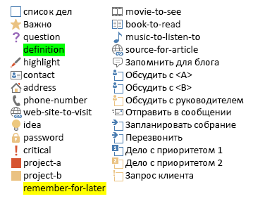

# <a name="use-note-tags-in-onenote-pages"></a>Использование тегов заметок на страницах OneNote

**Область применения:** Пользовательские записные книжки в OneDrive | Корпоративные записные книжки в Microsoft 365.

С помощью атрибута `data-tag` вы можете добавлять и изменять флажки, звездочки и другие встроенные теги заметок на странице OneNote, как показано на рисунке ниже.


<a name="attributes"></a>

## <a name="note-tag-attributes"></a>Атрибуты тегов заметок

В HTML-коде страницы OneNote тег заметки представлен атрибутом `data-tag`. Пример:

- Снятый флажок задачи: `<p data-tag="to-do">`

- Установленный флажок задачи: `<p data-tag="to-do:completed">`

- Звездочка: `<h2 data-tag="important">`

Значение `data-tag` состоит из фигуры и (иногда) из состояния (см. все [поддерживаемые значения](#built-in-note-tags-for-onenote)).

| Свойство | Описание |
|:------|:------|
| shape | Идентификатор тега заметки (пример: `to-do` или `important`). |
| status | Состояние тегов заметок с флажками. Это свойство используется только для установки флажков выполненных задач. |


<a name="note-tags"></a>

## <a name="add-or-update-note-tags"></a>Добавление или изменение тегов заметок

Добавить или изменить тег заметки можно с помощью атрибута `data-tag` в поддерживаемом элементе. Например, вот абзац, помеченный как важный:

```html
<p data-tag="important">...</p>
```

Разделение нескольких тегов заметок запятыми:

```html
<p data-tag="important, critical">...</p>
```

Вы можете задать атрибут `data-tag` для указанных ниже элементов.

- p
- ul, ol, li (см. дополнительные сведения о [тегах заметок в списках](#note-tags-on-lists))
- img
- h1–h6
- title

Список тегов заметок, которые можно использовать в Microsoft Graph, см. в разделе [Встроенные теги заметок](#built-in-note-tags-for-onenote). Добавление и изменение пользовательских тегов с помощью Microsoft Graph не поддерживается.

### <a name="examples"></a>Примеры

Ниже показан простой список дел, в котором первый элемент завершен.

```html
<p data-tag="to-do:completed" data-id="prep">Till garden bed</p>
<p data-tag="to-do" data-id="spring">Plant peas and spinach</p>
<p data-tag="to-do" data-id="summer">Plant tomatoes and peppers</p>
```

Обратите внимание, что теги `<p>` над каждым пунктом включают атрибут `data-id`. Это упрощает изменение тегов заметок с флажками. Например, показанный ниже запрос помечает элемент списка дел (посвященный весенней высадке растений) как выполненный.

```http
PATCH https://graph.microsoft.com/v1.0/me/onenote/notebooks/pages/{page-id}/content

Content-Type: application/json
Authorization: Bearer {token}

[
   {
    'target':'#spring',
    'action':'replace',
    'content':'<p data-tag="to-do:completed"  data-id="spring">Plant peas and spinach</p>'
  }
]
```

Показанный ниже запрос создает страницу, которая содержит все [встроенные теги заметок](#built-in-note-tags-for-onenote).

```html
POST https://graph.microsoft.com/v1.0/me/onenote/notebooks/pages

Content-Type: text/html
Authorization: Bearer {token}


<!DOCTYPE html>
<html>
  <head>
    <title data-tag="to-do:completed">All built-in note tags</title>
  </head>
  <body>
    <h1 data-tag="important">Paragraphs with built-in note tags</h1>
    <p data-tag="to-do">to-do</p>
    <p data-tag="important">important</p>
    <p data-tag="question">question</p>
    <p data-tag="definition">definition</p>
    <p data-tag="highlight">highlight</p>
    <p data-tag="contact">contact</p>
    <p data-tag="address">address</p>
    <p data-tag="phone-number">phone-number</p>
    <p data-tag="web-site-to-visit">web-site-to-visit</p>
    <p data-tag="idea">idea</p>
    <p data-tag="password">password</p>
    <p data-tag="critical">critical</p>
    <p data-tag="project-a">project-a</p>
    <p data-tag="project-b">project-b</p>
    <p data-tag="remember-for-later">remember-for-later</p>
    <p data-tag="movie-to-see">movie-to-see</p>
    <p data-tag="book-to-read">book-to-read</p>
    <p data-tag="music-to-listen-to">music-to-listen-to</p>
    <p data-tag="source-for-article">source-for-article</p>
    <p data-tag="remember-for-blog">remember-for-blog</p>
    <p data-tag="discuss-with-person-a">discuss-with-person-a</p>
    <p data-tag="discuss-with-person-b">discuss-with-person-b</p>
    <p data-tag="discuss-with-manager">discuss-with-manager</p>
    <p data-tag="send-in-email">send-in-email</p>
    <p data-tag="schedule-meeting">schedule-meeting</p>
    <p data-tag="call-back">call-back</p>
    <p data-tag="to-do-priority-1">to-do-priority-1</p>
    <p data-tag="to-do-priority-2">to-do-priority-2</p>
    <p data-tag="client-request">client-request</p>
    <h1 data-tag="important">Paragraphs with check boxes marked with "completed" status</h1>
    <p data-tag="to-do:completed">to-do:completed</p>
    <p data-tag="discuss-with-person-a:completed">discuss-with-person-a:completed</p>
    <p data-tag="discuss-with-person-b:completed">discuss-with-person-b:completed</p>
    <p data-tag="discuss-with-manager:completed">discuss-with-manager:completed</p>
    <p data-tag="schedule-meeting:completed">schedule-meeting:completed</p>
    <p data-tag="call-back:completed">call-back:completed</p>
    <p data-tag="to-do-priority-1:completed">to-do-priority-1:completed</p>
    <p data-tag="to-do-priority-2:completed">to-do-priority-2:completed</p>
    <p data-tag="client-request:completed">client-request:completed</p>
    <h1 data-tag="important">Multiple note tags</h1>
    <p data-tag="project-a,  client-request:completed">Two note tags:  project-a, client-request:completed</p>
    <p data-tag="idea, send-in-email, question">Three note tags:  idea, send-in-email, question</p>
    <h1 data-tag="important">Using note tags with other elements</h1>
    <p><b>Note tag on a list item:</b></p>
    <ul>
      <li data-tag="to-do-priority-1:completed">Make a to-do list</li>
    </ul>
    <p><b>Note tag on an image:</b></p>
    
    <p><b>Note tag with embedded style:</b></p>
    <p data-tag="important">Next time, <b>don't</b> forget to invite <span style="background-color:yellow">Dan</span>.</p>
  </body>
</html>
```

Дополнительные сведения о создании страниц см. в статье [Создание страниц в OneNote](onenote-create-page.md). Дополнительные сведения об изменении страниц см. в статье [Обновление страниц в OneNote](onenote-update-page.md).


<a name="note-tags-lists"></a>

## <a name="note-tags-on-lists"></a>Теги заметок в списках

Ниже приведены рекомендации по работе с тегами заметок в списках.

- Используйте элементы `p` для списков дел. Они не отображают маркеры или числа, и их проще изменять.

- Для создания или обновления списков, в которых отображается **один и тот же** тег заметки для всех элементов списка, определите атрибут `data-tag` в элементе `ul` или `ol`. Чтобы изменить весь список, вам потребуется повторно определить атрибут `data-tag` в элементе `ul` или `ol`.

- Для создания или обновления списков, в которых отображается **уникальный** тег заметки для некоторых или всех элементов списка, определите атрибут `data-tag` в элементах `li` и не вкладывайте элементы `li` в элемент `ul` или `ol`. Чтобы изменить весь список, вам потребуется удалить элемент `ul`, возвращенный в выходном HTML-коде, и предоставить только невложенные элементы `li`.

- Чтобы обновить определенные элементы `li`, настройте элементы `li` индивидуально и определите атрибут `data-tag` в элементе `li`. Любой элемент `li` с индивидуальной адресацией можно изменить так, чтобы он отображал уникальный тег заметки независимо от того, как изначально был определен список.

  Рекомендации основаны на указанных ниже правилах, применяемых Microsoft Graph.

  - Параметр `data-tag` для элемента `ul` или `ol` переопределяет все параметры в дочерних элементах `li`. Это правило применяется, даже если в элементах `ul` или `ol` не указан атрибут `data-tag`, но он указан в дочерних элементах `li`.

    Например, если вы создаете элемент `ul` или `ol`, который определяет атрибут `data-tag="project-a"`, то все его элементы будут отображать тег заметки *Project A*. Если элемент `ul` или `ol` не определяет атрибут `data-tag`, ни один из его элементов не будет отображать тег заметки. Это переопределение происходит независимо от любых явных параметров в дочерних элементах `li`.

- Уникальные параметры `data-tag` применяются к элементам списка в указанных ниже условиях.

  - Элементы `li` не вложены в элемент `ul` или `ol` в запросе на создание или изменение.

  - Элемент `li` имеет индивидуальную адресацию в запросе на изменение.

- Невложенные элементы `li`, отправленные во входном HTML-коде, возвращаются в элементе `ul` в выходном HTML-коде.

- В выходном HTML-коде все параметры списка `data-tag` определены в элементах `span` в элементах списка.


В приведенном ниже коде показано, как применять некоторые из этих правил. Входной HTML-код создает два списка с тегами заметок. Выходной HTML-код — это то, что система возвращает для списков, когда вы получаете контент страницы.

#### <a name="input-html"></a>Входной HTML-код

```html
<!--To display the same note tag on all list items, define note tags on the ul or ol.-->
<ul data-tag="project-a" data-id="agenda">
  <li>An item with a Project A note tag</li>
  <li>An item with a Project A note tag</li>
</ul>

<!--To display unique note tags on list items, don't nest li elements in a ul or ol.-->
<li data-tag="idea" data-id="my-idea">An item with an Idea note tag</li>
<li data-tag="question" data-id="my-question">An item with a Question note tag</li>
```

#### <a name="output-html"></a>Выходной HTML-код

```html
<ul>
  <li><span data-tag="project-a">An item with a Project A note tag</span></li>
  <li><span data-tag="project-a">An item with a Project A note tag</span></li>
</ul>
<br />
<ul>
  <li style="..."><span data-tag="idea">An item with an Idea note tag</span></li>
  <li style="..."><span data-tag="question">An item with a Question note tag</span></li>
</ul>
```

<a name="output-html"></a>

## <a name="retrieve-note-tags"></a>Получение тегов заметок

Встроенные теги заметок включаются в выходной HTML, когда вы получаете контент страницы:

`GET ../api/v1.0/pages/{page-id}/content`

Атрибут `data-tag` в выходном HTML-коде всегда включает значение фигуры. Он включает состояние, только если он представляет тег заметки с установленным флажком (для выполненного элемента списка). В примерах ниже показан входной HTML-код, используемый для создания некоторых тегов заметок, и возвращаемый выходной HTML-код.

#### <a name="input-html"></a>Входной HTML-код

```html
<h1>Status meeting</h1>
<p data-tag="important">Next week's meeting has been moved to <b>Wednesday</b>.</p>
<p data-tag="question">What are the exact dates for the conference?</p>
<p>Upcoming training opportunities. See Katie for more info.</p>
<p data-tag="project-a">Around the room updates.</p>
<ul data-tag="critical">
  <li>Design handouts</li>
  <li>Plan keynote</li>
</ul>
```

#### <a name="output-html"></a>Выходной HTML-код

```html
<h1 style="...">Status meeting</h1>
<p data-tag="important">Next week's meeting has been moved to <span style="font-weight:bold">Wednesday</span>.</p>
<p data-tag="question">What are the exact dates for the conference?</p>
<p>Upcoming training opportunities. See Katie for more info.</p>
<p data-tag="project-a">Around the room updates.</p>
<ul>
  <li><span data-tag="critical">Design handouts</span></li>
  <li><span data-tag="critical">Plan keynote</span></li>
</ul>
```

Обратите внимание, что атрибут `data-tag`, определенный на уровне списка, передается в его элементы списка. Дополнительные сведения об использовании тегов заметок со списками см. в статье [Теги заметок в списках](#note-tags-on-lists).

> **Примечание.** В выходном HTML-коде определение и теги заметок "Запомнить" возвращаются в виде атрибута `data-tag="remember-for-later"`. Элемент `title` не возвращает никаких сведений о тегах заметок.


<a name="built-in-tags"></a>

## <a name="built-in-note-tags-for-onenote"></a>Встроенные теги заметок для OneNote

В OneNote имеются указанные ниже встроенные теги заметок.



Значения, которые можно присвоить атрибуту `data-tag`, показаны в следующем списке. Пользовательские теги не поддерживаются.

- `shape[:status]`
- `to-do`
- `to-do:completed`
- `important`
- `question`
- `definition`
- `highlight`
- `contact`
- `address`
- `phone-number`
- `web-site-to-visit`
- `idea`
- `password`
- `critical`
- `project-a`
- `project-b`
- `remember-for-later`
- `movie-to-see`
- `book-to-read`
- `music-to-listen-to`
- `source-for-article`
- `remember-for-blog`
- `discuss-with-person-a`
- `discuss-with-person-a:completed`
- `discuss-with-person-b`
- `discuss-with-person-b:completed`
- `discuss-with-manager`
- `discuss-with-manager:completed`
- `send-in-email`
- `schedule-meeting`
- `schedule-meeting:completed`
- `call-back`
- `call-back:completed`
- `to-do-priority-1`
- `to-do-priority-1:completed`
- `to-do-priority-2`
- `to-do-priority-2:completed`
- `client-request`
- `client-request:completed`


<a name="request-response-info"></a>

## <a name="response-information"></a>Сведения в отклике

Microsoft Graph возвращает указанные ниже сведения в отклике.

| Данные в отклике | Описание |
|------|------|
| Код успешного завершения действия | Код состояния HTTP 201 при успешном выполнении запроса POST и код состояния HTTP 204 при успешном выполнении запроса PATCH. |
| Ошибки | Дополнительные сведения об ошибках OneNote, которые может возвращать Microsoft Graph, см. в статье [Коды ошибок для API OneNote в Microsoft Graph](onenote-error-codes.md). |


<a name="permissions"></a>

## <a name="permissions"></a>Разрешения

Чтобы можно было создавать или изменять страницы OneNote, вам придется запросить соответствующие разрешения. Выберите минимальный уровень разрешений, необходимый для работы вашего приложения.

#### <a name="permissions-for-post-pages"></a>Разрешения для запросов POST со страницами

- Notes.Create
- Notes.ReadWrite
- Notes.ReadWrite.All

#### <a name="permissions-for-patch-pages"></a>Разрешения в случае запросов PATCH для страниц

- Notes.ReadWrite
- Notes.ReadWrite.All

Дополнительные сведения об областях разрешений и принципе их работы см. в разделе [Области разрешений OneNote](permissions-reference.md).


<a name="see-also"></a>

## <a name="see-also"></a>См. также

- [Создание страниц OneNote](onenote-create-page.md)
- [Обновление содержимого страницы OneNote](onenote-update-page.md)
- [Интеграция с OneNote](integrate-with-onenote.md)
- [Блог разработчиков OneNote](https://go.microsoft.com/fwlink/?LinkID=390183)
- [Вопросы разработки OneNote на сайте «Вопросы и ответы Майкрософт»](/answers/topics/microsoft-graph-notes.html)
- [Репозитории GitHub OneNote](https://go.microsoft.com/fwlink/?LinkID=390178)
