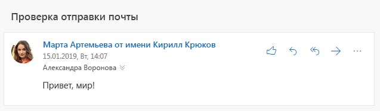

# <a name="send-outlook-messages-from-another-user"></a>Отправка сообщений Outlook от другого пользователя

Exchange Online предусматривает [разрешения для почтового ящика](/Exchange/recipients/mailbox-permissions), позволяющие пользователю отправлять электронную почту таким образом, чтобы в качестве отправителя значился другой пользователь, список рассылки, группа, ресурс или общий почтовый ящик. Microsoft Graph также поддерживает эту функцию, но конечный результат может отличаться в зависимости от точных разрешений, предоставленных в Exchange Online, а также того, какие API были использованы для отправки электронной почты.

## <a name="permissions"></a>Разрешения

К сообщениям, отправляемым от другого пользователя, применяются два типа разрешений: [разрешения Microsoft Graph](permissions-reference.md) и разрешения для почтового ящика.

### <a name="microsoft-graph-permissions"></a>Разрешения Microsoft Graph

Чтобы отправлять сообщения от другого пользователя, приложения, использующие маркеры пользователя, используют разрешение **Mail.Send.Shared**.

> [!NOTE]
> Приложения, использующие маркеры приложения вместо маркеров пользователя и имеющие разрешение **Mail.Send**, предоставленное администратором, могут отправлять почту как любой пользователь в организации, отправляя сообщение в обычном порядке с почтового ящика пользователя.

### <a name="mailbox-permissions"></a>Разрешения для почтового ящика

На конечный результат отправки сообщения от другого пользователя влияют два разрешения: **Отправить от имени** и **Отправить как**. Пользователь, который выполнил вход в приложение, используя разрешение **Mail.Send.Shared**, ДОЛЖЕН иметь по крайней мере одно из таких разрешений, предоставленных для почтового ящика, группы или списка рассылки, которые значатся в качестве отправителя.

#### <a name="send-on-behalf"></a>Отправить от имени

С таким разрешением получатель почты получает указание в почтовом клиенте, что сообщение было отправлено пользователем приложения от имени другого пользователя.



В Microsoft Graph это представлено в виде свойств `sender` (пользователь, который фактически отправил сообщение) и `from` (пользователь, группа или другое, отображаемые в качестве отправителя).

```json
{
  "id": "AAMkAGE1...",
  "subject": "Send mail test",
  "sender": {
    "emailAddress": {
      "name": "Adele Vance",
      "address": "AdeleV@contoso.com"
    }
  },
  "from": {
    "emailAddress": {
      "name": "Pradeep Gupta",
      "address": "PradeepG@contoso.com"
    }
  }
}
```

Пользователь может предоставлять это разрешение для своего почтового ящика другому пользователю, [используя Outlook](https://support.office.com/article/Allow-someone-else-to-manage-your-mail-and-calendar-41C40C04-3BD1-4D22-963A-28EAFEC25926). Администраторы могут предоставить это разрешение для любого почтового ящика, группы или списка рассылки в [Центре администрирования Microsoft 365](/office365/admin/add-users/give-mailbox-permissions-to-another-user?view=o365-worldwide).

#### <a name="send-as"></a>Отправить как

С таким разрешением нет указаний относительного того, что сообщение было отправлено от другого пользователя. Свойства `sender` и `from` имеют одинаковое значение.

Пользователи не могут предоставить это разрешение своим почтовым ящикам. Администраторы могут предоставлять это разрешение в Центре администрирования Microsoft 365.

## <a name="sending-with-microsoft-graph"></a>Отправка с помощью Microsoft Graph

Вы можете отправлять сообщения от другого пользователя, [отправляя их напрямую](/graph/api/user-sendmail?view=graph-rest-1.0) либо [создавая черновик](/graph/api/user-post-messages?view=graph-rest-1.0), а затем [отправляя его](/graph/api/message-send?view=graph-rest-1.0).

Чтобы отправлять сообщения от другого пользователя, задайте свойство `from` в [сообщении](/graph/api/resources/message?view=graph-rest-1.0), отправляемом на адрес электронной почты пользователя, который должен значиться в качестве отправителя. Вам не нужно задавать свойство `sender` — Microsoft Graph задаст его надлежащим образом, на основе разрешений почтового ящика, предоставленных пользователю, который выполнил вход.

Например, для отправки электронной почты от группы `sales@contoso.com` задайте настройки сообщения как указано ниже.

```json
{
  "subject": "January sales report",
  "toRecipients": [
    {
      "emailAddress": {
        "address": "MeganB@contoso.com"
      }
    }
  ],
  "from": {
    "emailAddress": {
      "address": "sales@contoso.com"
    }
  }
}
```

## <a name="sent-items-behavior"></a>Порядок сохранения в папке "Отправленные"

После отправки сообщения его можно сохранить в папке "Отправленные" фактического отправителя, в папке "Отправленные" пользователя, который значится как отправитель, или в обеих папках. Кроме того, его можно не сохранять.

> [!NOTE]
> Если сообщение будет отправлено с адреса, который не имеет почтового ящика (например, список рассылки), папки "Отправленные" у пользователя, значащегося в качестве отправителя, нет.

- Если ваше приложение выполняет отправку с использованием конечной точки `/me` (или `/users/{user-id}`, где `user-id` соответствует пользователю, который выполнил вход), по умолчанию сообщение будет сохранено в папке "Отправленные" пользователя, являющегося отправителем.
- Если ваше приложение выполняет отправку с использованием `/users/{user-id}`, где `user-id` соответствует пользователю, значащемуся в качестве отправителя, по умолчанию сообщение будет сохранено в папке "Отправленные" пользователя, значащегося как отправитель.
    > [!IMPORTANT]
    > Чтобы отправить таким образом, фактический отправитель должен иметь разрешение для почтового ящика **Полный доступ**, помимо разрешения **Отправить от имени** или **Отправить как**.

Порядок по умолчанию может меняться в зависимости других сторонних факторов.

- Администраторы могут обновить почтовый ящик пользователя, значащегося в качестве отправителя, таким образом, чтобы [всегда сохранять копии сообщений, отправленных делегированным пользователем,](/exchange/recipients-in-exchange-online/manage-user-mailboxes/automatically-save-sent-items-in-delegator-s-mailbox) в его папке "Отправленные".
- Задав свойство `saveToSentItems` как `false` в запросе [отправить почту](/graph/api/user-sendmail?view=graph-rest-1.0), вы можете отменить сохранение элемента в папке "Отправленные". Тем не менее, если администратор настроил параметр "всегда сохранять копию", сообщения будут по-прежнему сохраняться в папке "Отправленные" пользователя, значащегося как отправитель.

## <a name="examples"></a>Примеры

### <a name="example-1-successful-send-through-me-endpoint"></a>Пример 1. Успешная отправка через конечную точку /me endpoint

В этом примере Александру Воронову предоставлено разрешение **Отправить от имени** на почтовый ящик Алексея Виноградова.

#### <a name="request"></a>Запрос

```http
POST /me/sendmail
Content-Type: application/json

{
  "message": {
    "subject": "Expense reports",
    "body": {
      "contentType": "text",
      "content": "Have you submitted your expense reports yet?"
    },
    "toRecipients": [
      {
        "emailAddress": {
          "address": "MeganB@contoso.com"
        }
      }
    ],
    "from": {
      "emailAddress": {
        "address": "AllanD@contoso.com"
      }
    }
  }
}
```

#### <a name="response"></a>Ответ

```http
HTTP/1.1 202 Accepted
```

### <a name="example-2-unsuccessful-attempt-to-send-without-permissions"></a>Пример 2. Неудачная попытка отправки без разрешений

В этом примере Александр Воронов пытается отправить сообщение электронной почты от Полины Кольцовой, однако ему не предоставлено разрешение **Отправить от имени** или **Отправить как**. Ответ содержит ошибку `ErrorSendAsDenied`.

<!-- markdownlint-disable MD024 -->

#### <a name="request"></a>Запрос

```http
POST /me/sendmail
Content-Type: application/json

{
  "message": {
    "subject": "Support ticket",
    "body": {
      "contentType": "text",
      "content": "I noticed you opened a support ticket yesterday..."
    },
    "toRecipients": [
      {
        "emailAddress": {
          "address": "MeganB@contoso.com"
        }
      }
    ],
    "from": {
      "emailAddress": {
        "address": "PattiF@contoso.com"
      }
    }
  }
}
```

#### <a name="response"></a>Ответ

```http
HTTP/1.1 403 Forbidden
Content-Type: application/json

{
  "error": {
    "code": "ErrorSendAsDenied",
    "message": "The user account which was used to submit this request does not have the right to send mail on behalf of the specified sending account. Cannot submit message.",
    "innerError": {
      "request-id": "24e7991e-01ae-4cc2-8e06-532a96fd8948",
      "date": "2019-01-16T18:53:25"
    }
  }
}
```

## <a name="next-steps"></a>Дальнейшие действия

Дополнительные сведения:

- [Зачем выполнять интеграцию с почтой Outlook?](outlook-mail-concept-overview.md)
- [Использование API почты](/graph/api/resources/mail-api-overview?view=graph-rest-1.0) и [вариантов использования](/graph/api/resources/mail-api-overview?view=graph-rest-1.0#common-use-cases) API почты в Microsoft Graph 1.0.

<!--
{
  "type": "#page.annotation",
  "suppressions": [
    "Error: /concepts/outlook-send-mail-from-other-user.md:\r\n      FileNotFound: '[/exchange/recipients-in-exchange-online/manage-user-mailboxes/automatically-save-sent-items-in-delegator-s-mailbox](always save a copy of messages sent from a delegate)'.",
    "Error: /concepts/outlook-send-mail-from-other-user.md:\r\n      InvalidUrlFormat '[/office365/admin/add-users/give-mailbox-permissions-to-another-user?view=o365-worldwide](Office 365 admin center)'.",
    "Error: /concepts/outlook-send-mail-from-other-user.md:\r\n      FileNotFound: '[/Exchange/recipients/mailbox-permissions](mailbox permissions)'. "
  ]
}
-->
