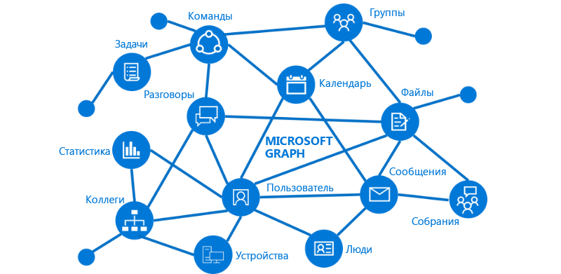

# Обзор Microsoft Graph

Microsoft Graph открывает доступ к данным и средствам искусственного интеллекта в Microsoft 365. С помощью единой модели программируемости Microsoft Graph можно работать с колоссальным объемом данных в Office 365, Enterprise Mobility + Security и Windows 10. 

Применяя API Microsoft Graph, можно создавать приложения для организаций и клиентов, которые работают с данными миллионов пользователей. С помощью Microsoft Graph можно подключаться к различным ресурсам, отношениям и средствам искусственного интеллекта через одну конечную точку — `https://graph.microsoft.com`.

## Что есть в Microsoft Graph?
В Microsoft Graph доступны API:

- для Azure Active Directory;
- служб Office 365 (SharePoint, OneDrive, Outlook, Exchange, Microsoft Teams, OneNote, Планировщика, Excel);
- служб Enterprise Mobility + Security (Identity Manager, Intune, Advanced Threat Analytics, Advanced Threat Protection);
- служб Windows 10 (действия и устройства);
- образовательных учреждений.

Дополнительные сведения см. в статье [Основные службы и компоненты в Microsoft Graph](../concepts/overview-major-services.md).

Microsoft Graph подключает все ресурсы в этих службах с помощью отношений. Например, отношением [memberOf](../api-reference/v1.0/api/user_list_memberof.md) пользователь может быть связан с группой, а отношением [manager](../api-reference/v1.0/api/user_list_manager.md) — с другим пользователем. Приложение может просматривать эти отношения для доступа к этим связанным ресурсам и выполнения действий с ними через API.

Вы также можете получать ценную статистику и оповещения о данных из Microsoft Graph. Например, вы можете получить список файлов пользователя, [с которыми он часто работает](../api-reference/beta/resources/insights_trending.md), или [наиболее важных людей](../api-reference/beta/api/user_list_people.md) в его компании.

Узнайте о возможностях, которые открывают отношения в Microsoft Graph.

## Что можно делать с помощью Microsoft Graph? 

С помощью Microsoft Graph можно создавать решения, которые работают в уникальном контексте пользователя, повышая эффективность его работы. Представьте приложение, которое...

- Находит ваше следующее собрание и помогает подготовиться к нему, показывая информацию об участниках (в том числе их должности и списки их партнеров), а также сведения о последних документах и проектах, над которыми они работают.
- Проверяет ваш календарь и предлагает оптимальное время для следующего собрания команды.
- Получает диаграмму с перспективной оценкой продаж из файла Excel в OneDrive и позволяет обновлять прогноз в реальном времени с мобильного телефона.
- Подписывается на изменения вашего календаря, отправляет вам оповещение, если вы слишком много времени проводите на собраниях, и рекомендует, какие собрания можно пропустить или поручить кому-нибудь другому (в зависимости от того, насколько их участники важны для вас).
- Помогает вам упорядочивать личные и рабочие данные на телефоне. Например, приложение может группировать изображения, предназначенные для личного хранилища OneDrive, и накладные, которые следует хранить в OneDrive для бизнеса.

Все это и многое другое возможно с API Microsoft Graph.

>**Примечание.** Используя API Microsoft Graph, вы соглашаетесь с [условиями использования Microsoft Graph](../misc/terms-of-use.md) и [заявлением Майкрософт о конфиденциальности](https://go.microsoft.com/fwlink/?LinkId=521839).

### Популярные запросы

Ознакомьтесь с некоторыми из популярных сценариев работы с API Microsoft Graph. Ссылки ведут на [песочницу Graph](https://developer.microsoft.com/ru-RU/graph/graph-explorer).

| **Операция** | **URL-адрес** |
|:--------------------------|:----------------------------------------|
|   GET мой профиль |    [`https://graph.microsoft.com/v1.0/me`](https://developer.microsoft.com/graph/graph-explorer/?request=me&version=v1.0) |
|   Получение своих файлов | [`https://graph.microsoft.com/v1.0/me/drive/root/children`](https://developer.microsoft.com/graph/graph-explorer/?request=me%2Fdrive%2Froot%2Fchildren&version=v1.0) |
|   Получение своей фотографии | [`https://graph.microsoft.com/v1.0/me/photo/$value`](https://developer.microsoft.com/graph/graph-explorer/?request=me%2Fphoto%2F%24value&version=v1.0) |
|   Получение своей почты |   [`https://graph.microsoft.com/v1.0/me/messages`](https://developer.microsoft.com/graph/graph-explorer/?request=me%2Fmessages&version=v1.0) |
|   GET моя почта высокой важности | [`https://graph.microsoft.com/v1.0/me/messages?$filter=importance%20eq%20'high'`](https://developer.microsoft.com/graph/graph-explorer/?request=me%2Fmessages%3F%24filter%3Dimportance%2520eq%2520'high'&version=v1.0) |
|   GET события в моем календаре |    [`https://graph.microsoft.com/v1.0/me/events`](https://developer.microsoft.com/graph/graph-explorer/?request=me%2Fevents&version=v1.0) |
|   GET мой руководитель  | [`https://graph.microsoft.com/v1.0/me/manager`](https://developer.microsoft.com/graph/graph-explorer/?request=me%2Fmanager&version=v1.0) |
|   GET последний пользователь, изменивший файл foo.txt |  [`https://graph.microsoft.com/v1.0/me/drive/root/children/foo.txt/lastModifiedByUser`](https://developer.microsoft.com/graph/graph-explorer/?request=me%2Fdrive%2Froot%2Fchildren%2Ffoo.txt%2FlastModifiedByUser&version=v1.0) |
|   GET группы Office 365, в которые я вхожу| [`https://graph.microsoft.com/v1.0/me/memberOf/$/microsoft.graph.group?$filter=groupTypes/any(a:a%20eq%20'unified')`](https://developer.microsoft.com/graph/graph-explorer/?request=me%2FmemberOf%2F%24%2Fmicrosoft.graph.group%3F%24filter%3DgroupTypes%2Fany(a%3Aa%2520eq%2520'unified')&version=v1.0) |
|   GET пользователи в моей организации     | [`https://graph.microsoft.com/v1.0/users`](https://developer.microsoft.com/graph/graph-explorer/?request=users&version=v1.0) |
|   GET группы в моей организации | [`https://graph.microsoft.com/v1.0/groups`](https://developer.microsoft.com/graph/graph-explorer/?request=groups&version=v1.0) |
|   GET пользователи, связанные со мной    | [`https://graph.microsoft.com/v1.0/me/people`](https://developer.microsoft.com/graph/graph-explorer/?request=me%2Fpeople&version=beta)  |
|   GET элементы, популярные в моей компании |  [`https://graph.microsoft.com/beta/me/insights/trending`](https://developer.microsoft.com/graph/graph-explorer/?request=me%2Finsights%2Ftrending&version=beta) |
|   GET мои заметки |  [`https://graph.microsoft.com/v1.0/me/onenote/notebooks`](https://developer.microsoft.com/graph/graph-explorer/?request=me%2Fonenote%2Fnotebooks&version=beta) |

## Дальнейшие действия

- Ознакомьтесь с [представленными сценариями](../concepts/featured_scenarios.md).
- Опробуйте пример запроса в [песочнице Graph](https://developer.microsoft.com/graph/graph-explorer).
- Воспользуйтесь [краткой инструкцией](https://developer.microsoft.com/graph/quick-start), чтобы настроить готовый к работе пример приложения.
- Откройте раздел **сведений**, указанный в содержании, чтобы прочесть о службах и компонентах, которые можно использовать в сценариях. 
- Узнайте, как [обеспечить получение маркера проверки подлинности](../concepts/auth_overview.md) в приложении.
- Начните [использовать API](../concepts/use_the_api.md).

## Отзывы

Ваш отзыв важен для нас. Для связи с нами используйте сайт [Stack Overflow](http://stackoverflow.com/questions/tagged/office365+or+microsoftgraph). Помечайте свои вопросы тегом {MicrosoftGraph}.

