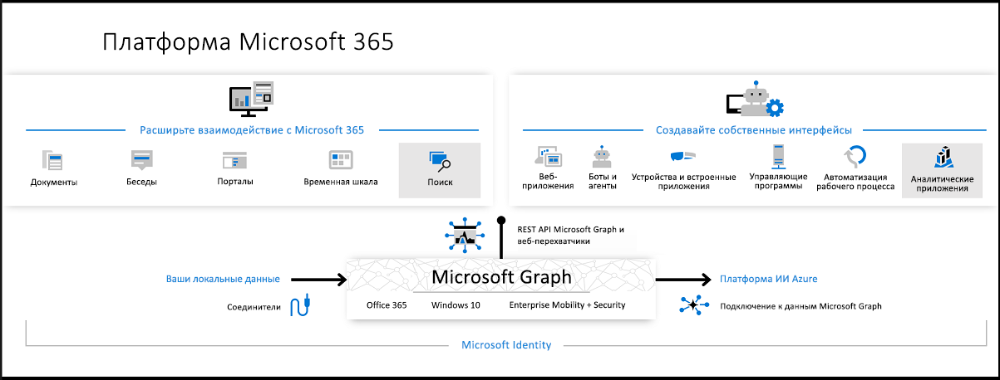

# Обзор Microsoft GraphOverview of Microsoft Graph

Microsoft Graph открывает доступ к данным и средствам искусственного интеллекта в Microsoft 365.Microsoft Graph is the gateway to data and intelligence in Microsoft 365. Вы получите единую модель программируемости, которую можно использовать для доступа к колоссальному объему данных в Office 365, Windows 10 и Enterprise Mobility + Security.It provides a unified programmability model that you can use to access the tremendous amount of data in Office 365, Windows 10, and Enterprise Mobility + Security. Используйте многочисленные данные в Microsoft Graph и создавайте приложения с миллионной аудиторией для организаций и пользователей.Use the wealth of data in Microsoft Graph to build apps for organizations and consumers that interact with millions of users.

## Расширение возможностей платформы Microsoft 365Powering the Microsoft 365 platform

Три основных компонента платформы Microsoft 365 упрощают доступ к данным и их поток:In the Microsoft 365 platform, three main components facilitate the access and flow of data:

- API Microsoft Graph обеспечивает единую конечную точку, `https://graph.microsoft.com`, для доступа к ценным данным о пользователях и аналитическим сведениям, которые предоставляют ресурсы служб Microsoft 365.The Microsoft Graph API offers a single endpoint, `https://graph.microsoft.com`, to provide access to rich, people-centric data and insights exposed as resources of Microsoft 365 services. С помощью интерфейсов REST API и пакетов SDK вы можете получить доступ к конечной точке и создавать приложения, которые поддерживают сценарии для повышения продуктивности, улучшения совместной работы и обучения, обеспечения безопасности, проверки удостоверений и прав доступа, управления устройствами и многого другого.You can use REST APIs or SDKs to access the endpoint and build apps that support scenarios spanning across productivity, collaboration, education, security, identity, access, device management, and much more.
- [Соединители Microsoft Graph (предварительная версия)](/microsoftsearch/connectors-overview) работают во входящем направлении, доставляя данные, не входящие в Microsoft Cloud, в службы и приложения Microsoft Graph, чтобы расширить возможности Microsoft 365, такие как Поиск (Майкрософт).[Microsoft Graph connectors (preview)](/microsoftsearch/connectors-overview) work in the incoming direction, delivering data external to the Microsoft cloud into Microsoft Graph services and applications, to enhance Microsoft 365 experiences such as Microsoft Search.
- [Подключение к данным Microsoft Graph](#access-microsoft-graph-data-at-scale-using-microsoft-graph-data-connect) предоставляет набор инструментов для оптимизации безопасности и масштабируемой доставки данных Microsoft Graph в популярные хранилища данных Azure.[Microsoft Graph data connect](#access-microsoft-graph-data-at-scale-using-microsoft-graph-data-connect) provides a set of tools to streamline secure and scalable delivery of Microsoft Graph data to popular Azure data stores. Эти кэшированные данные используются в качестве источников данных для средств разработки Azure, с помощью которых можно создавать интеллектуальные приложения.This cached data serves as data sources for Azure development tools that you can use to build intelligent applications.

Одновременное использование API Microsoft Graph, соединителей (предварительной версии) и подключения к данным позволяет расширить возможности платформы Microsoft 365.Together, the Microsoft Graph API, data connect, and connectors (private preview) power the Microsoft 365 platform. Благодаря доступу к данным Microsoft Graph и другим наборам данных для получения статистики и аналитики вы можете расширить возможности Microsoft 365 и создавать уникальные интеллектуальные приложения.With the ability to access Microsoft Graph data and other datasets to derive insights and analytics, you can extend Microsoft 365 experiences, or build unique, intelligent applications.

> [!NOTE]
> Соединители Microsoft Graph доступны в предварительной версии.Microsoft Graph connectors is in private preview. Дополнительные сведения о предварительной версии см. в статье [Предварительная версия соединителей](https://docs.microsoft.com/MicrosoftSearch/connectors-preview).To learn more about the preview, see [connectors preview](https://docs.microsoft.com/MicrosoftSearch/connectors-preview). Чтобы принять участие в программе предварительной оценки, необходимо сначала отправить [форму для регистрации на предварительную версию соединителей Microsoft Graph](https://forms.office.com/Pages/ResponsePage.aspx?id=v4j5cvGGr0GRqy180BHbRxWYgu82J_RFnMMATAS6_chUNVYwNU1CMDNZUDBSSDZKWVo2RDJDRjRLQi4u).To participate in the preview, you must first submit the [Microsoft Graph connectors preview signup form](https://forms.office.com/Pages/ResponsePage.aspx?id=v4j5cvGGr0GRqy180BHbRxWYgu82J_RFnMMATAS6_chUNVYwNU1CMDNZUDBSSDZKWVo2RDJDRjRLQi4u).

## Из чего состоит Microsoft Graph?What's in Microsoft Graph?

Microsoft Graph предоставляет интерфейсы REST API и клиентские библиотеки для доступа к данным в таких службах Microsoft 365:Microsoft Graph exposes REST APIs and client libraries to access data on the following Microsoft 365 services:

- Службы Office 365: Delve, Excel, Microsoft Bookings, Microsoft Teams, OneDrive, OneNote, Outlook/Exchange, Планировщик и SharePointOffice 365 services: Delve, Excel, Microsoft Bookings, Microsoft Teams, OneDrive, OneNote, Outlook/Exchange, Planner, and SharePoint
- Службы Enterprise Mobility and Security: Advanced Threat Analytics, Advanced Threat Protection, Azure Active Directory, Identity Manager и IntuneEnterprise Mobility and Security services: Advanced Threat Analytics, Advanced Threat Protection, Azure Active Directory, Identity Manager, and Intune
- Службы Windows 10: действия, устройства, уведомленияWindows 10 services: activities, devices, notifications
- Dynamics 365 Business CentralDynamics 365 Business Central

Дополнительные сведения см. в статье [Основные службы и компоненты в Microsoft Graph](overview-major-services.md).To find out more, see [Major services and features in Microsoft Graph](overview-major-services.md).

## Что можно делать с помощью Microsoft Graph?What can you do with Microsoft Graph?

> [!VIDEO https://www.youtube-nocookie.com/embed/PI9NO5rayiY]

Microsoft Graph позволяет обрабатывать уникальный контекст пользователя и делать его более результативным.Use Microsoft Graph to build experiences around the user's unique context to help them be more productive. Представьте приложение, которое...Imagine an app that...

- Просматривает следующее собрание и помогает подготовиться к нему, предоставляя информацию об участниках, их должностях и руководителях, а также сведения о последних документах, с которыми работаете вы и ваши сотрудники.Looks at your next meeting and helps you prepare for it by providing profile information for attendees, including their job titles and managers, as well as information about the latest documents they're working on, and people they're collaborating with.
- Проверяет ваш календарь и предлагает оптимальное время для следующего собрания команды.Scans your calendar, and suggests the best times for the next team meeting.
- Получает диаграмму с перспективной оценкой продаж из файла Excel в OneDrive и позволяет обновлять прогноз в реальном времени с мобильного телефона.Fetches the latest sales projection chart from an Excel file in your OneDrive and lets you update the forecast in real time, all from your phone.
- Подписывается на изменения вашего календаря, отправляет вам оповещение, если вы слишком много времени проводите на собраниях, и рекомендует, какие собрания можно пропустить или поручить кому-нибудь другому (в зависимости от того, насколько их участники важны для вас).Subscribes to changes in your calendar, sends you an alert when you’re spending too much time in meetings, and provides recommendations for the ones you can miss or delegate based on how relevant the attendees are to you.
- Помогает вам упорядочивать личные и рабочие данные на телефоне. Например, приложение может группировать изображения, предназначенные для личного хранилища OneDrive, и накладные, которые следует хранить в OneDrive для бизнеса.Helps you sort out personal and work information on your phone; for example, by categorizing pictures that should go to your personal OneDrive and business receipts that should go to your OneDrive for Business.
- Анализирует масштабируемые данные Office 365, чтобы лица, принимающие решения, видели важные закономерности сотрудничества и распределения во времени, необходимые для повышения производительности работы.Analyzes at-scale Office 365 data so that decision makers can unlock valuable insights into time allocation and collaboration patterns that improve business productivity.
- Вносит пользовательские бизнес-данные в Microsoft Graph и индексирует их для поиска наряду с данными из служб Microsoft 365.Brings custom business data into Microsoft Graph, indexing it to make it searchable along with data from Microsoft 365 services.

В качестве примера выберите первый сценарий поиска участников собрания.Pick the first scenario about researching meeting attendees as an example. С помощью API Microsoft Graph вы можете:With the Microsoft Graph API, you can:

1. Получить адреса электронной почты участников [собрания](/graph/api/resources/event?view=graph-rest-1.0).Get the email addresses of the [meeting event](/graph/api/resources/event?view=graph-rest-1.0) attendees.
2. Просмотреть информацию о каждом из них как о [пользователе](/graph/api/resources/user?view=graph-rest-1.0) в Azure Active Directory и [получить сведения о профиле](/graph/api/user-get?view=graph-rest-1.0).Look them up individually as a [user](/graph/api/resources/user?view=graph-rest-1.0) in Azure Active Directory to [get their profile information](/graph/api/user-get?view=graph-rest-1.0).

С помощью связей вы можете перейти к другим ресурсам:You can then navigate to other resources using relationships:

- Связаться с его руководителем через [связь с руководителем](/graph/api/user-list-manager?view=graph-rest-1.0).Connect to their manager through a [manager relationship](/graph/api/user-list-manager?view=graph-rest-1.0).
- Получить полезные сведения, в том числе о популярных файлах, [которые отслеживает](/graph/api/resources/insights-trending?view=graph-rest-beta) пользователь.Get valuable insights and intelligence including the popular files [trending around](/graph/api/resources/insights-trending?view=graph-rest-beta) the user.
- [Узнать, какие люди больше всего связаны](/graph/api/user-list-people?view=graph-rest-beta) с пользователем.[Get the most relevant people](/graph/api/user-list-people?view=graph-rest-beta) around the user.
- Расширить сценарий с помощью связи [memberOf](/graph/api/user-list-memberof?view=graph-rest-1.0), чтобы узнать, в какие группы входит пользовательExtend the scenario to get to the user's groups through a [memberOf](/graph/api/user-list-memberof?view=graph-rest-1.0) relationship
- [Найти других участников в каждой группе](/graph/api/group-list-members?view=graph-rest-1.0).[Reach other members in each group](/graph/api/group-list-members?view=graph-rest-1.0).
- Подключиться к другим сценариям, созданным [группами](office365-groups-concept-overview.md), например по [обучению](education-concept-overview.md) и [командной работе](teams-concept-overview.md).Tap into other scenarios enabled by [groups](office365-groups-concept-overview.md), such as [education](education-concept-overview.md) and [teamwork](teams-concept-overview.md).

Microsoft Graph продолжает открывать возможности платформы Microsoft 365 для разработчиков, но исключительно при наличии соответствующих разрешений.Microsoft Graph continues to open up the Microsoft 365 platform for developers, and always only with the appropriate permissions.

> [!NOTE]
> Используя API Microsoft Graph, вы соглашаетесь с [условиями использования API Microsoft](/legal/microsoft-apis/terms-of-use?context=/graph/context) и [заявлением Майкрософт о конфиденциальности](https://go.microsoft.com/fwlink/?LinkId=521839).When you use the Microsoft Graph API, you agree to the [Microsoft APIs Terms of Use](/legal/microsoft-apis/terms-of-use?context=/graph/context) and the [Microsoft Privacy Statement](https://go.microsoft.com/fwlink/?LinkId=521839).

### Популярные запросы APIPopular API requests

Ознакомьтесь с некоторыми из популярных сценариев работы с API Microsoft Graph.Check out some of these common scenarios for working with the Microsoft Graph API. Ссылки ведут на [песочницу Graph](https://developer.microsoft.com/graph/graph-explorer).The links take you to the [Graph Explorer](https://developer.microsoft.com/graph/graph-explorer).

| **Операция****Operation** | **URL-адрес****URL** |
|:--------------------------|:----------------------------------------|
|   GET мой профильGET my profile | [`https://graph.microsoft.com/v1.0/me`](https://developer.microsoft.com/graph/graph-explorer/?request=me&version=v1.0) |
|   Получение своих файловGET my files | [`https://graph.microsoft.com/v1.0/me/drive/root/children`](https://developer.microsoft.com/graph/graph-explorer/?request=me%2Fdrive%2Froot%2Fchildren&version=v1.0) |
|   Получение своей фотографииGET my photo | [`https://graph.microsoft.com/v1.0/me/photo/$value`](https://developer.microsoft.com/graph/graph-explorer/?request=me%2Fphoto%2F%24value&version=v1.0) |
|   Получение своей почтыGET my mail | [`https://graph.microsoft.com/v1.0/me/messages`](https://developer.microsoft.com/graph/graph-explorer/?request=me%2Fmessages&version=v1.0) |
|   GET моя почта высокой важностиGET my high importance email | [`https://graph.microsoft.com/v1.0/me/messages?$filter=importance%20eq%20'high'`](https://developer.microsoft.com/graph/graph-explorer/?request=me%2Fmessages%3F%24filter%3Dimportance%2520eq%2520'high'&version=v1.0) |
|   GET события в моем календареGET my calendar events | [`https://graph.microsoft.com/v1.0/me/events`](https://developer.microsoft.com/graph/graph-explorer/?request=me%2Fevents&version=v1.0) |
|   GET мой руководительGET my manager | [`https://graph.microsoft.com/v1.0/me/manager`](https://developer.microsoft.com/graph/graph-explorer/?request=me%2Fmanager&version=v1.0) |
|   GET последний пользователь, изменивший файл foo.txtGET last user to modify file foo.txt | [`https://graph.microsoft.com/v1.0/me/drive/root/children/foo.txt/lastModifiedByUser`](https://developer.microsoft.com/graph/graph-explorer/?request=me%2Fdrive%2Froot%2Fchildren%2Ffoo.txt%2FlastModifiedByUser&version=v1.0) |
|   GET группы Office 365, в которые я вхожуGET Office365 groups I’m member of| [`https://graph.microsoft.com/v1.0/me/memberOf/$/microsoft.graph.group?$filter=groupTypes/any(a:a%20eq%20'unified')`](https://developer.microsoft.com/graph/graph-explorer/?request=me%2FmemberOf%2F%24%2Fmicrosoft.graph.group%3F%24filter%3DgroupTypes%2Fany(a%3Aa%2520eq%2520'unified')&version=v1.0) |
|   GET пользователи в моей организацииGET users in my organization  | [`https://graph.microsoft.com/v1.0/users`](https://developer.microsoft.com/graph/graph-explorer/?request=users&version=v1.0) |
|   GET группы в моей организацииGET groups in my organization | [`https://graph.microsoft.com/v1.0/groups`](https://developer.microsoft.com/graph/graph-explorer/?request=groups&version=v1.0) |
|   GET пользователи, связанные со мнойGET people related to me | [`https://graph.microsoft.com/v1.0/me/people`](https://developer.microsoft.com/graph/graph-explorer/?request=me%2Fpeople&version=beta)  |
|   GET элементы, популярные в моей компанииGET items trending around me | [`https://graph.microsoft.com/beta/me/insights/trending`](https://developer.microsoft.com/graph/graph-explorer/?request=me%2Finsights%2Ftrending&version=beta) |
|   GET мои заметкиGET my notes | [`https://graph.microsoft.com/v1.0/me/onenote/notebooks`](https://developer.microsoft.com/graph/graph-explorer/?request=me%2Fonenote%2Fnotebooks&version=beta) |

## Перенос данных из внешнего источника контента в Microsoft Graph (предварительная версия)Bring data from an external content source to Microsoft Graph (preview)

Используйте _соединители_ Microsoft Graph для переноса данных, не входящих в Microsoft Cloud, в Microsoft Graph.Use Microsoft Graph _connectors_ to bring data that is external to the Microsoft cloud into Microsoft Graph. Примерами таких данных могут быть база данных отдела кадров организации или каталог продуктов, размещенные локально, в общедоступных или частных облаках.Examples of such data can be an organization's human resources database or product catalog, hosted on-premises or in the public or private clouds. 

Соединители Microsoft Graph позволяют создавать подключения к внешним источникам данных, индексировать данные и хранить их как внешние настраиваемые элементы и файлы.Microsoft Graph connectors create connections to external data sources, index the data, and store it as external custom items and files. После индексирования эти элементы могут отображаться в Поиске (Майкрософт), а также для приложений, использующих [API Поиска (Майкрософт)](search-concept-overview.md).Once indexed, those items can show up in Microsoft Search, and for apps that use the [Microsoft Search API](search-concept-overview.md).

## Масштабируемый доступ к данным Microsoft Graph с помощью подключения к данным Microsoft GraphAccess Microsoft Graph data at scale using Microsoft Graph data connect

Используйте _подключение к данным_ Microsoft Graph для получения масштабируемого доступа к данным в Microsoft Graph, предоставляя администраторам точечные разрешения и полный доступ к этим данным.Microsoft Graph data connect provides a set of tools to access data on Microsoft Graph at scale, while allowing administrators granular consent and full control over their Microsoft Graph data. Подключение к данным помогает оптимизировать их доставку в Microsoft Azure.Data connect streamlines the delivery of this data to Microsoft Azure.

С помощью средств Azure можно создавать интеллектуальные приложения с такими функциями:Using Azure tools, you can then build intelligent apps that:

- Поиск ближайшего специалиста по вопросу в вашей организацииFind you the closest expert on a topic to you in your organization
- Автоматизация создания базы знанийAutomate knowledge base creation
- Анализ приглашений на собрания для предоставления статистики об использовании конференц-заловAnalyze meeting requests to provide insights into conference room utilization
- Выявление мошенничества с данными производительности и взаимодействияDetect fraud with productivity and communication data

## Когда следует использовать API Microsoft Graph или подключение к данным?When should I use Microsoft Graph API or data connect?

Подключение к данным Microsoft Graph обеспечивает новый способ взаимодействия с данными, доступными через API Microsoft Graph.Microsoft Graph data connect provides a new way for you to interact with the data that's available through Microsoft Graph APIs. Подключение к данным предоставляет уникальный набор инструментов, которые помогают оптимизировать создание интеллектуальных приложений в рамках облака Майкрософт.Data connect provides a unique set of tools that streamline the building of intelligent applications, all within the Microsoft cloud.

|**Функция****Feature**| **API Microsoft Graph****Microsoft Graph API** | **Подключение к данным Microsoft Graph****Microsoft Graph data connect** |
|:----------|:------------------------|:--------------------------------------|
| **Область доступа****Access scope** | Один пользователь или весь клиентSingle user or entire tenant | Несколько пользователей или группMany users or groups |
| **Шаблон доступа****Access pattern** | В режиме реального времениReal time | Повторяющееся расписаниеRecurrent schedule |
| **Операции с данными****Data operations** | Работает с оригиналом данныхOperates on data master | Работает с кэшем данныхOperates on a cache of the data |
| **Защита данных****Data protection** | Данные защищены в пределах Microsoft 365Data is protected while in Microsoft 365 | Защита данных распространяется на кэш данных в подписке AzureData protection is extended to the cache of data in your Azure subscription |
| **Согласие пользователя****User consent** | СамостоятельноеSelf Типы ресурсовResource types | НетNone |
| **Согласие администратора****Admin consent** | Вся организацияEntire organization Типы ресурсовResource types | Выбор групп пользователейSelect groups of users Типов и свойства ресурсовResource types and properties Исключает пользователейExcludes users |
| **Средства доступа****Access tools** | Веб-запросы с применением RESTRESTful web queries | Фабрика данных AzureAzure Data Factory |

 См. статью [Подключение к данным Microsoft Graph](data-connect-overview.md), чтобы получить дополнительные сведения и [приступить к работе с подключением к данным](data-connect-concept-overview.md).See [Microsoft Graph data connect](data-connect-overview.md) for more information, and [get started using Microsoft Graph data connect](data-connect-concept-overview.md).

## Дальнейшие действияNext steps

- Ознакомьтесь с [представленными сценариями](https://developer.microsoft.com/graph/examples).Check out some [featured scenarios](https://developer.microsoft.com/graph/examples).
- Опробуйте пример запроса в [песочнице Graph](https://developer.microsoft.com/graph/graph-explorer).Try a sample request in the [Graph Explorer](https://developer.microsoft.com/graph/graph-explorer).
- Воспользуйтесь [кратким руководством](https://developer.microsoft.com/graph/quick-start), чтобы настроить готовый к работе пример приложения.Use the [quick start](https://developer.microsoft.com/graph/quick-start) to set up a ready-to-run sample app.
- Найдите в оглавлении, в разделе **Обучение**, службы и функции, которые вас интересуют, и почитайте о них.Look under **Learn** in the table of contents to read about services and features that you can use in your scenarios.
- Узнайте, как [получить маркер аутентификации](auth/auth-concepts.md) в приложении.Find out how to [get an auth token](auth/auth-concepts.md) in your app.
- Начните [использовать API](use-the-api.md).Start [using the API](use-the-api.md).
