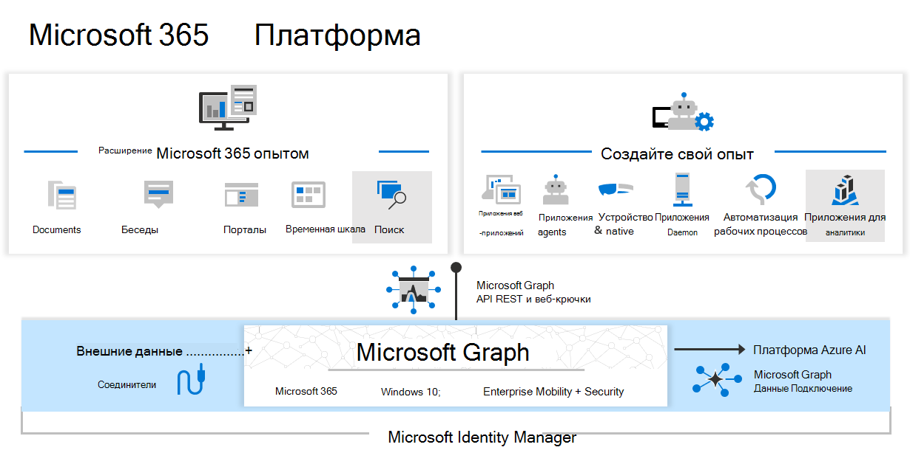
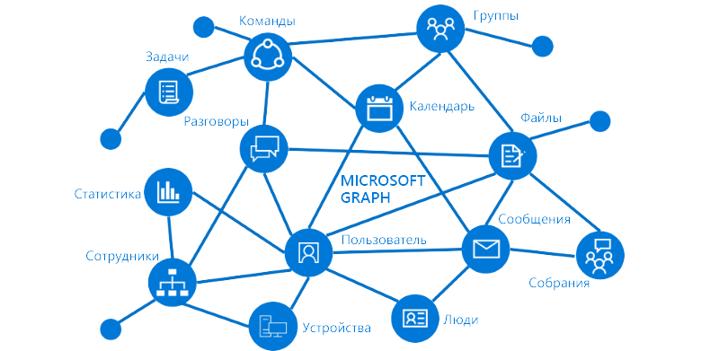

# Обзор Microsoft Graph

Microsoft Graph открывает доступ к данным и средствам искусственного интеллекта в Microsoft 365. Благодаря этому вы получите единую модель программируемости, которую можно использовать для доступа к колоссальному объему данных в Microsoft 365, Windows и Enterprise Mobility + Security. Используйте многочисленные данные в Microsoft Graph и создавайте приложения с миллионной аудиторией для организаций и пользователей.

## Данные и службы для расширения возможностей платформы Microsoft 365
Три основных компонента платформы Microsoft 365 упрощают доступ к данным и их поток:

- **API Microsoft Graph** предлагает единую конечную точку (`https://graph.microsoft.com`) для доступа к **сложным, ориентированным на пользователя данным и аналитике в Microsoft Cloud**, включая Microsoft 365, Windows и Enterprise Mobility + Security. С помощью интерфейсов REST API и пакетов SDK вы можете получить доступ к конечной точке и создавать приложения, которые поддерживают сценарии Microsoft 365 для повышения продуктивности, улучшения совместной работы и обучения, социальной и рабочей аналитики и многого другого. В Microsoft Graph также включен мощный набор служб для управления удостоверениями пользователей и устройств, доступом, соблюдением требований, безопасностью и защиты организаций от утечки или потери данных.
- **[Соединители Microsoft Graph](#bring-data-from-an-external-content-source-to-microsoft-graph)** работают во входящем направлении, **доставляя данные, не входящие в Microsoft Cloud, в службы и приложения Microsoft Graph**, чтобы расширить возможности Microsoft 365, такие как Поиск (Майкрософт). Существуют соединители для многих часто используемых источников данных, например Box, Google Drive, Jira и Salesforce.
- **[Подключение к данным Microsoft Graph](#access-microsoft-graph-data-at-scale)** предоставляет набор инструментов для упрощения безопасной и масштабируемой **доставки данных Microsoft Graph в популярные хранилища данных Azure**. Эти кэшированные данные используются в качестве источников данных для средств разработки Azure, с помощью которых можно создавать интеллектуальные приложения.

Одновременное использование API Microsoft Graph, соединителей и подключения к данным позволяет расширить возможности платформы Microsoft 365. Благодаря доступу к данным Microsoft Graph и другим наборам данных вы можете получить статистику и аналитику, расширить возможности Microsoft 365 и создавать уникальные интеллектуальные приложения.

## Из чего состоит Microsoft Graph?

Microsoft Graph предоставляет интерфейсы REST API и клиентские библиотеки для доступа к данным в нижеуказанных облачных службах Майкрософт:

- Основные службы Microsoft 365: Bookings, Календарь, Delve, Excel, обнаружение электронных данных в Центре соответствия требованиям Microsoft 365, Поиск (Майкрософт), OneDrive, OneNote, Outlook/Exchange, Люди (контакты Outlook), Планировщик, SharePoint, Teams, Список дел, Рабочая аналитика
- Службы Enterprise Mobility + Security: Advanced Threat Analytics, Расширенная защита от угроз, Azure Active Directory, Identity Manager и Intune
- Службы Windows: действия, устройства, уведомления, универсальная печать
- Dynamics 365 Business Central

Дополнительные сведения см. в статье [Основные службы и компоненты в Microsoft Graph](overview-major-services.md).

## Что можно делать с помощью Microsoft Graph?

> [!VIDEO https://www.youtube-nocookie.com/embed/PI9NO5rayiY]

Используйте Microsoft Graph для создания интерфейсов, которые работают в уникальном контексте пользователя, повышая эффективность его работы. Представьте приложение, которое...

- Просматривает следующее собрание и помогает подготовиться к нему, предоставляя информацию об участниках, их должностях и руководителях, а также сведения о последних документах, с которыми работаете вы и ваши сотрудники.
- Проверяет ваш календарь и предлагает оптимальное время для следующего собрания команды.
- Получает диаграмму с перспективной оценкой продаж из файла Excel в OneDrive и позволяет обновлять прогноз в реальном времени с мобильного телефона.
- Подписывается на изменения вашего календаря, отправляет вам оповещение, если вы слишком много времени проводите на собраниях, и рекомендует, какие собрания можно пропустить или поручить кому-нибудь другому (в зависимости от того, насколько их участники важны для вас).
- Помогает вам упорядочивать личные и рабочие данные на телефоне. Например, приложение может группировать изображения, предназначенные для личного хранилища OneDrive, и накладные, которые следует хранить в OneDrive для бизнеса.
- Анализирует масштабируемые данные Microsoft 365, чтобы лица, принимающие решения, видели важные закономерности сотрудничества и распределения во времени, необходимые для повышения производительности работы.
- Вносит пользовательские бизнес-данные в Microsoft Graph и индексирует их для поиска наряду с данными из служб Microsoft 365.

В качестве примера выберите первый сценарий поиска участников собрания. С помощью API Microsoft Graph вы можете:

1. Получить адреса электронной почты участников [собрания](/graph/api/resources/event).
2. Просмотреть информацию о каждом из них как о [пользователе](/graph/api/resources/user) в Azure Active Directory и [получить сведения о профиле](/graph/api/user-get).

С помощью связей вы можете перейти к другим ресурсам:

- Связаться с его руководителем через [связь с руководителем](/graph/api/user-list-manager).
- Получить полезные сведения, в том числе о популярных файлах, [которые отслеживает](/graph/api/resources/insights-trending) пользователь.
- [Узнать, какие люди больше всего связаны](/graph/api/user-list-people?view=graph-rest-beta&preserve-view=true) с пользователем.
- Расширить сценарий с помощью связи [memberOf](/graph/api/user-list-memberof), чтобы узнать, в какие группы входит пользователь.
- [Найти других участников в каждой группе](/graph/api/group-list-members).
- Подключиться к другим сценариям, созданным [группами](office365-groups-concept-overview.md), например по [обучению](education-concept-overview.md) и [командной работе](teams-concept-overview.md).

Microsoft Graph продолжает открывать возможности платформы Microsoft 365 для разработчиков, но исключительно при наличии соответствующих разрешений.

> [!NOTE]
> Используя API Microsoft Graph, вы соглашаетесь с [условиями использования API Microsoft](/legal/microsoft-apis/terms-of-use?context=/graph/context) и [заявлением Майкрософт о конфиденциальности](https://go.microsoft.com/fwlink/?LinkId=521839).

### Популярные запросы API

Ознакомьтесь с некоторыми из популярных сценариев работы с API Microsoft Graph. Ссылки ведут на [песочницу Graph](https://developer.microsoft.com/graph/graph-explorer).

| **Операция** | **URL-адрес** |
|:--------------------------|:----------------------------------------|
|   GET мой профиль | [`https://graph.microsoft.com/v1.0/me`](https://developer.microsoft.com/graph/graph-explorer/?request=me&version=v1.0) |
|   Получение своих файлов | [`https://graph.microsoft.com/v1.0/me/drive/root/children`](https://developer.microsoft.com/graph/graph-explorer/?request=me%2Fdrive%2Froot%2Fchildren&version=v1.0) |
|   Получение своей фотографии | [`https://graph.microsoft.com/v1.0/me/photo/$value`](https://developer.microsoft.com/graph/graph-explorer/?request=me%2Fphoto%2F%24value&version=v1.0) |
|   Получение своей почты | [`https://graph.microsoft.com/v1.0/me/messages`](https://developer.microsoft.com/graph/graph-explorer/?request=me%2Fmessages&version=v1.0) |
|   GET моя почта высокой важности | [`https://graph.microsoft.com/v1.0/me/messages?$filter=importance%20eq%20'high'`](https://developer.microsoft.com/graph/graph-explorer/?request=me%2Fmessages%3F%24filter%3Dimportance%2520eq%2520'high'&version=v1.0) |
|   GET события в моем календаре | [`https://graph.microsoft.com/v1.0/me/events`](https://developer.microsoft.com/graph/graph-explorer/?request=me%2Fevents&version=v1.0) |
|   GET мой руководитель | [`https://graph.microsoft.com/v1.0/me/manager`](https://developer.microsoft.com/graph/graph-explorer/?request=me%2Fmanager&version=v1.0) |
|   GET последний пользователь, изменивший файл foo.txt | [`https://graph.microsoft.com/v1.0/me/drive/root/children/foo.txt/lastModifiedByUser`](https://developer.microsoft.com/graph/graph-explorer/?request=me%2Fdrive%2Froot%2Fchildren%2Ffoo.txt%2FlastModifiedByUser&version=v1.0) |
|   Получение групп Microsoft 365, участником которых я являюсь| [`https://graph.microsoft.com/v1.0/me/memberOf/$/microsoft.graph.group?$filter=groupTypes/any(a:a%20eq%20'unified')`](https://developer.microsoft.com/graph/graph-explorer/?request=me%2FmemberOf%2F%24%2Fmicrosoft.graph.group%3F%24filter%3DgroupTypes%2Fany(a%3Aa%2520eq%2520'unified')&version=v1.0) |
|   GET пользователи в моей организации  | [`https://graph.microsoft.com/v1.0/users`](https://developer.microsoft.com/graph/graph-explorer/?request=users&version=v1.0) |
|   GET группы в моей организации | [`https://graph.microsoft.com/v1.0/groups`](https://developer.microsoft.com/graph/graph-explorer/?request=groups&version=v1.0) |
|   GET пользователи, связанные со мной | [`https://graph.microsoft.com/v1.0/me/people`](https://developer.microsoft.com/graph/graph-explorer/?request=me%2Fpeople&version=beta)  |
|   GET элементы, популярные в моей компании | [`https://graph.microsoft.com/beta/me/insights/trending`](https://developer.microsoft.com/graph/graph-explorer/?request=me%2Finsights%2Ftrending&version=v1.0) |
|   GET мои заметки | [`https://graph.microsoft.com/v1.0/me/onenote/notebooks`](https://developer.microsoft.com/graph/graph-explorer/?request=me%2Fonenote%2Fnotebooks&version=beta) |

## Перенос данных из внешнего источника контента в Microsoft Graph

Используйте [соединители Microsoft Graph](connecting-external-content-connectors-overview.md) для переноса данных, не входящих в Microsoft Cloud, в Microsoft Graph. Примерами таких данных могут быть база данных отдела кадров организации или каталог продуктов, размещенные локально, в общедоступных или частных облаках.

Соединители Microsoft Graph позволяют создавать подключения к внешним источникам данных, индексировать данные и хранить их как внешние настраиваемые элементы и файлы. После индексирования эти элементы могут отображаться в Поиске (Майкрософт), а также для приложений, использующих [API Поиска (Майкрософт)](search-concept-overview.md).

## Доступ к данным Microsoft Graph в масштабе

Используйте [подключение к данным Microsoft Graph](data-connect-concept-overview.md) для получения масштабируемого доступа к данным в Microsoft Graph, предоставляя администраторам точечные разрешения и полный доступ к этим данным. Подключение к данным помогает оптимизировать их доставку в Microsoft Azure.

С помощью средств Azure можно создавать интеллектуальные приложения с такими функциями:

- Поиск ближайшего специалиста по теме в вашей организации.
- Автоматизация создания базы знаний.
- Анализ приглашений на собрания для предоставления статистики об использовании конференц-залов.
- Выявление мошенничества с данными производительности и взаимодействия.

## Когда следует использовать API Microsoft Graph или подключение к данным?

Microsoft Graph Data Connect предоставляет новый способ взаимодействия с данными, доступными с помощью интерфейсов API Microsoft Graph. Подключение к данным предоставляет уникальный набор инструментов, которые помогают оптимизировать создание интеллектуальных приложений в рамках облака Майкрософт.

|**Функция**| **API Microsoft Graph** | **Microsoft Graph Data Connect** |
|:----------|:------------------------|:--------------------------------------|
| **Область доступа** | Один пользователь или весь клиент | Несколько пользователей или групп |
| **Шаблон доступа** | В режиме реального времени | Повторяющееся расписание |
| **Операции с данными** | Работает с оригиналом данных | Работает с кэшем данных |
| **Защита данных** | Данные защищены в пределах Microsoft 365 | Защита данных распространяется на кэш данных в подписке Azure |
| **Согласие пользователя** | Самостоятельное Типы ресурсов | Нет |
| **Согласие администратора** | Вся организация Типы ресурсов | Выбор групп пользователей Типов и свойства ресурсов Исключает пользователей |
| **Средства доступа** | Веб-запросы с применением REST | Фабрика данных Azure |

## Дальнейшие действия

- Ознакомьтесь с некоторыми [решениями партнеров](https://developer.microsoft.com/graph/partners).
- Опробуйте пример запроса в [песочнице Graph](https://developer.microsoft.com/graph/graph-explorer).
- Воспользуйтесь [кратким руководством](https://developer.microsoft.com/graph/quick-start), чтобы настроить готовый к работе пример приложения.
- Найдите в оглавлении, в разделе **Обучение**, службы и функции, которые вас интересуют, и почитайте о них.
- Узнайте, как [получить маркер аутентификации](auth/auth-concepts.md) в приложении.
- Начните [использовать API](use-the-api.md).
