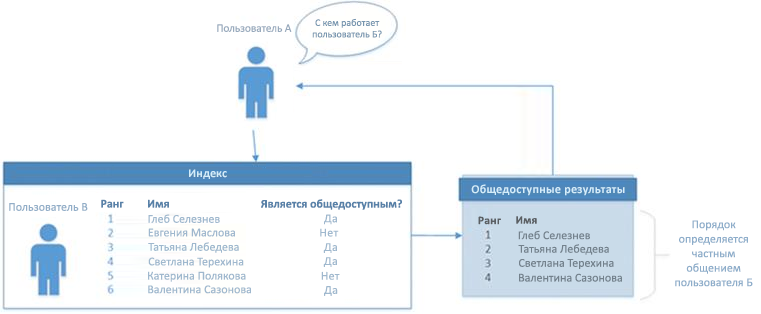

# <a name="use-the-people-api-in-microsoft-graph-to-get-information-about-the-people-most-relevant-to-you"></a>Использование API People в Microsoft Graph для получения сведений о наиболее релевантных для вас людях

Приложения Microsoft Graph могут использовать API People для получения сведений о наиболее релевантных для пользователя людях. Релевантность определяется шаблонами общения и совместной работы пользователя, а также его бизнес-отношениями. В качестве людей могут выступать локальные контакты, контакты из каталога организации, а также лица, с которыми пользователь недавно общался. Наряду с функцией создания таких сведений в API People поддерживается поиск с нечетким соответствием, а также возможность получать список пользователей, релевантных для другого пользователя, в организации пользователя, выполнившего вход в систему.
Особенно удобно использовать API People в сценариях выбора людей при написании электронных писем, создании собраний и т. д. Например, вы можете использовать API People в сценариях написания электронных писем.

## <a name="authorization"></a>Authorization

Чтобы ваше приложение в Microsoft Graph могло вызывать API People, ему потребуются указанные ниже разрешения.

* Разрешение People.Read используется для совершения общих вызовов к API People. Пример: `https://graph.microsoft.com/v1.0/me/people/`. Для использования разрешения People.Read требуется согласие пользователя.
* Разрешение People.Read.All необходимо для получения людей, наиболее релевантных для указанного пользователя, в вызовах организации пользователя, выполнившего вход в систему (`https://graph.microsoft.com/v1.0/users/{id}/people`). Для использования разрешения People.Read.All требуется согласие администратора.

## <a name="browse-people"></a>Просмотр людей

С помощью описанных в этом разделе запросов можно получить данные о людях, наиболее релевантных для вошедшего пользователя (`/me`) или для конкретного пользователя из его организации. Для таких запросов требуется разрешение People.Read или People.Read.All соответственно. По умолчанию в каждом отклике возвращается 10 записей, но вы можете задать другое количество, используя параметр запроса *$top*.

### <a name="get-a-collection-of-relevant-people"></a>Получение коллекции релевантных людей

С помощью указанного ниже запроса можно получить людей, наиболее релевантных для пользователя, выполнившего вход в систему (`/me`), на основании его шаблонов общения и совместной работы, а также бизнес-отношений.

```http
GET https://graph.microsoft.com/v1.0/me/people/
```

В примере ниже показан отклик. По умолчанию в каждом отклике возвращается 10 записей. Вы можете изменить количество возвращаемых записей с помощью параметра запроса *$top*. В этом примере показано, как использовать параметр запроса *$top* для ограничения количества записей (до 3 шт.) в отклике.

```http
HTTP/1.1 200 OK
Content-type: application/json

{
  "value": [
    {
      "id": "8CE6E1DE-CB84-4BF5-971D-D3ECF452E2B5",
      "displayName": "Lorrie Frye",
      "givenName": "Lorrie",
      "surname": "Frye",
      "birthday": "",
      "personNotes": "",
      "isFavorite": false,
      "jobTitle": "Paralegal",
      "companyName": null,
      "yomiCompany": "",
      "department": "Legal",
      "officeLocation": "20/1109",
      "profession": "",
      "userPrincipalName": "LorrieF@contoso.onmicrosoft.com",
      "imAddress": "sip:LorrieF@contoso.onmicrosoft.com",
      "scoredEmailAddresses": [
        {
          "address": "LorrieF@contoso.onmicrosoft.com",
          "relevanceScore": 8
        }
      ],
      "phones": [
        {
          "type": "Business",
          "number": "+1 980 555 0101"
        }
      ],
      "postalAddresses": [],
      "websites": [],
      "personType": {
        "class": "Person",
        "subclass": "OrganizationUser"
      }
    },
    {
      "id": "5767393D-42BA-4E5C-BEE4-52BB25639CF4",
      "displayName": "Maynard Denman",
      "givenName": "Maynard",
      "surname": "Denman",
      "birthday": "",
      "personNotes": "",
      "isFavorite": false,
      "jobTitle": "Web Marketing Manager",
      "companyName": null,
      "yomiCompany": "",
      "department": "Sales & Marketing",
      "officeLocation": "20/1101",
      "profession": "",
      "userPrincipalName": "MaynardD@contoso.onmicrosoft.com",
      "imAddress": "sip:MaynardD@contoso.onmicrosoft.com",
      "scoredEmailAddresses": [
        {
          "address": "MaynardD@contoso.onmicrosoft.com",
          "relevanceScore": 8
        }
      ],
      "phones": [
        {
          "type": "Business",
          "number": "+1 918 555 0101"
        }
      ],
      "postalAddresses": [],
      "websites": [],
      "personType": {
        "class": "Person",
        "subclass": "OrganizationUser"
      }
    },
    {
      "id": "914B5191-11FA-4C0B-A354-0FA8C8EFD585",
      "displayName": "Darrel Halsey",
      "givenName": "Darrel",
      "surname": "Halsey",
      "birthday": "",
      "personNotes": "",
      "isFavorite": false,
      "jobTitle": "Attorney",
      "companyName": null,
      "yomiCompany": "",
      "department": "Legal",
      "officeLocation": "14/1102",
      "profession": "",
      "userPrincipalName": "DarrelH@contoso.onmicrosoft.com",
      "imAddress": "sip:DarrelH@contoso.onmicrosoft.com",
      "scoredEmailAddresses": [
        {
          "address": "DarrelH@contoso.onmicrosoft.com",
          "relevanceScore": 8
        }
      ],
      "phones": [
        {
          "type": "Business",
          "number": "+1 205 555 0103"
        }
      ],
      "postalAddresses": [],
      "websites": [],
      "personType": {
        "class": "Person",
        "subclass": "OrganizationUser"
      }
    }
  ]
}
```

### <a name="request-a-subsequent-page-of-people"></a>Запрос последующей страницы с людьми

Если в первом отклике содержится неполный список релевантных людей, вы можете создать второй запрос, используя параметры *$top* и *$skip*, чтобы запросить дополнительные страницы информации. Если в предыдущем запросе есть дополнительная информация, то при последующем запросе будет получена следующая страница с людьми с сервера.

```http
GET https://graph.microsoft.com/v1.0/me/people/?$top=3&$skip=10
```

В примере ниже показан отклик. По умолчанию в каждом отклике возвращается 10 записей. Вы можете изменить количество возвращаемых записей с помощью параметра запроса *$top*. В этом примере показано, как использовать параметр запроса *$top* для ограничения количества записей (до 3 шт.) в отклике.

```http
HTTP/1.1 200 OK
Content-type: application/json

{
  "value": [
    {
      "id": "1F28616D-BDFE-4080-8F06-03366A851688",
      "displayName": "Felix Coppola",
      "givenName": "Felix",
      "surname": "Coppola",
      "birthday": "",
      "personNotes": "",
      "isFavorite": false,
      "jobTitle": "CVP Legal",
      "companyName": null,
      "yomiCompany": "",
      "department": "Legal",
      "officeLocation": "19/2109",
      "profession": "",
      "userPrincipalName": "FelixC@contoso.onmicrosoft.com",
      "imAddress": "sip:FelixC@contoso.onmicrosoft.com",
      "scoredEmailAddresses": [
        {
          "address": "FelixC@contoso.onmicrosoft.com",
          "relevanceScore": 8
        }
      ],
      "phones": [
        {
          "type": "Business",
          "number": "+1 309 555 0104"
        }
      ],
      "postalAddresses": [],
      "websites": [],
      "personType": {
        "class": "Person",
        "subclass": "OrganizationUser"
      }
    },
    {
      "id": "8A3FC021-6DBB-44AC-8884-B7B500CC260A",
      "displayName": "Lenora Rowland",
      "givenName": "Lenora",
      "surname": "Rowland",
      "birthday": "",
      "personNotes": "",
      "isFavorite": false,
      "jobTitle": "Marketing Assistant",
      "companyName": null,
      "yomiCompany": "",
      "department": "Sales & Marketing",
      "officeLocation": "18/1106",
      "profession": "",
      "userPrincipalName": "LenoraR@contoso.onmicrosoft.com",
      "imAddress": "sip:LenoraR@contoso.onmicrosoft.com",
      "scoredEmailAddresses": [
        {
          "address": "LenoraR@contoso.onmicrosoft.com",
          "relevanceScore": 8
        }
      ],
      "phones": [
        {
          "type": "Business",
          "number": "+1 954 555 0118"
        }
      ],
      "postalAddresses": [],
      "websites": [],
      "personType": {
        "class": "Person",
        "subclass": "OrganizationUser"
      }
    },
    {
      "id": "032C9919-4DF9-4715-8C46-4D0FAE7B3EB2",
      "displayName": "Manuel Collette",
      "givenName": "Manuel",
      "surname": "Collette",
      "birthday": "",
      "personNotes": "",
      "isFavorite": false,
      "jobTitle": "Accountant II",
      "companyName": null,
      "yomiCompany": "",
      "department": "Finance",
      "officeLocation": "98/2202",
      "profession": "",
      "userPrincipalName": "ManuelC@contoso.onmicrosoft.com",
      "imAddress": "sip:ManuelC@contoso.onmicrosoft.com",
      "scoredEmailAddresses": [
        {
          "address": "ManuelC@contoso.onmicrosoft.com",
          "relevanceScore": 8
        }
      ],
      "phones": [
        {
          "type": "Business",
          "number": "+20 255501070"
        }
      ],
      "postalAddresses": [],
      "websites": [],
      "personType": {
        "class": "Person",
        "subclass": "OrganizationUser"
      }
    }
  ]
}
```

### <a name="sort-the-response"></a>Сортировка в отклике

По умолчанию люди в отклике отсортированы по их релевантности вашему запросу. Вы можете изменить порядок людей в отклике, используя параметр *$orderby*. Этот запрос выбирает наиболее релевантных для вас людей, сортирует их по полю **displayName**, а затем возвращает первые 10 людей в отсортированном списке.

```http
GET https://graph.microsoft.com/v1.0/me/people/?$orderby=displayName
```

В примере ниже показан отклик. По умолчанию в каждом отклике возвращается 10 записей. Вы можете изменить количество возвращаемых записей с помощью параметра *$top*. В примере ниже показано, как с помощью параметра *$top* уменьшить количество записей в отклике до трех штук.

```http
HTTP/1.1 200 OK
Content-type: application/json

{
  "value": [
    {
      "id": "818E29A1-E6BB-4EDA-AB20-8230B4B1E290",
      "displayName": "Adriana Ramos",
      "givenName": "Adriana",
      "surname": "Ramos",
      "birthday": "",
      "personNotes": "",
      "isFavorite": false,
      "jobTitle": "Product Marketing Manager",
      "companyName": null,
      "yomiCompany": "",
      "department": "Sales & Marketing",
      "officeLocation": "18/2111",
      "profession": "",
      "userPrincipalName": "AdrianaR@contoso.onmicrosoft.com",
      "imAddress": "sip:AdrianaR@contoso.onmicrosoft.com",
      "scoredEmailAddresses": [
        {
          "address": "AdrianaR@contoso.onmicrosoft.com",
          "relevanceScore": 8
        }
      ],
      "phones": [
        {
          "type": "Business",
          "number": "+1 425 555 0109"
        }
      ],
      "postalAddresses": [],
      "websites": [],
      "personType": {
        "class": "Person",
        "subclass": "OrganizationUser"
      }
    },
    {
      "id": "62633BAA-1CB9-4FA2-9B8F-55AB1840B69D",
      "displayName": "Alyce Cooley",
      "givenName": "Alyce",
      "surname": "Cooley",
      "birthday": "",
      "personNotes": "",
      "isFavorite": false,
      "jobTitle": "Marketing Assistant",
      "companyName": null,
      "yomiCompany": "",
      "department": "Sales & Marketing",
      "officeLocation": "131/1104",
      "profession": "",
      "userPrincipalName": "AlyceC@contoso.onmicrosoft.com",
      "imAddress": "sip:AlyceC@contoso.onmicrosoft.com",
      "scoredEmailAddresses": [
        {
          "address": "AlyceC@contoso.onmicrosoft.com",
          "relevanceScore": 8
        }
      ],
      "phones": [
        {
          "type": "Business",
          "number": "+1 858 555 0110"
        }
      ],
      "postalAddresses": [],
      "websites": [],
      "personType": {
        "class": "Person",
        "subclass": "OrganizationUser"
      }
    },
    {
      "id": "6BB54D2C-EF20-48DA-ADD9-AE757DD30C4E",
      "displayName": "Alyssa Clarke",
      "givenName": "Alyssa",
      "surname": "Clarke",
      "birthday": "",
      "personNotes": "",
      "isFavorite": false,
      "jobTitle": "Corporate Security Officer",
      "companyName": null,
      "yomiCompany": "",
      "department": "Operations",
      "officeLocation": "24/1106",
      "profession": "",
      "userPrincipalName": "AlyssaC@contoso.onmicrosoft.com",
      "imAddress": "sip:AlyssaC@contoso.onmicrosoft.com",
      "scoredEmailAddresses": [
        {
          "address": "AlyssaC@contoso.onmicrosoft.com",
          "relevanceScore": 8
        }
      ],
      "phones": [
        {
          "type": "Business",
          "number": "+1 262 555 0106"
        }
      ],
      "postalAddresses": [],
      "websites": [],
      "personType": {
        "class": "Person",
        "subclass": "OrganizationUser"
      }
    }
  ]
}
```

### <a name="change-the-number-of-people-and-fields-returned"></a>Изменение количества возвращаемых людей и полей

Вы можете изменить количество людей, возвращаемых в отклике, настроив параметр *$top*.

В примере ниже показано, как запросить 1000 людей, наиболее релевантных для пользователя `/me`. Кроме того, в запросе можно ограничить количество данных, отправляемых с сервера. Для этого запрашивается только параметр **displayName** человека.

```http
GET https://graph.microsoft.com/v1.0/me/people/?$top=1000&$Select=displayName
```

Ниже показан пример отклика.

```http
HTTP/1.1 200 OK
Content-type: application/json

{
  "value": [
    {
      "id": "8CE6E1DE-CB84-4BF5-971D-D3ECF452E2B5",
      "displayName": "Lorrie Frye"
    },
    {
      "id": "5767393D-42BA-4E5C-BEE4-52BB25639CF4",
      "displayName": "Maynard Denman"
    },
    {
      "id": "914B5191-11FA-4C0B-A354-0FA8C8EFD585",
      "displayName": "Darrel Halsey"
    },
    {
      "id": "E3C5B235-DE15-4566-B7B1-7A8E32426540",
      "displayName": "Roscoe Seidel"
    },
    {
      "id": "6BB54D2C-EF20-48DA-ADD9-AE757DD30C4E",
      "displayName": "Alyssa Clarke"
    },
    {
      "id": "818E29A1-E6BB-4EDA-AB20-8230B4B1E290",
      "displayName": "Adriana Ramos"
    },
    {
      "id": "62633BAA-1CB9-4FA2-9B8F-55AB1840B69D",
      "displayName": "Alyce Cooley"
    },
    {
      "id": "6BB9CC1F-418D-4DDF-AB0C-6A1C4ABCDBF4",
      "displayName": "Wayne Leeper"
    },
    {
      "id": "E7D40AC5-0078-4575-B1F3-F738124C4BC9",
      "displayName": "Jan Travis"
    },
    {
      "id": "6F99D1CC-4FCC-49E4-9160-E8AB01BF3E83",
      "displayName": "Charlotte Delacruz"
    },
    {
      "id": "1F28616D-BDFE-4080-8F06-03366A851688",
      "displayName": "Felix Coppola"
    },
    {
      "id": "8A3FC021-6DBB-44AC-8884-B7B500CC260A",
      "displayName": "Lenora Rowland"
    },
    {
      "id": "032C9919-4DF9-4715-8C46-4D0FAE7B3EB2",
      "displayName": "Manuel Collette"
    }
  ]
}
```
### <a name="types-of-results-included"></a>Типы включаемых результатов
По умолчанию Microsoft Graph предоставляет результаты только для почтового ящика, то есть ваши сохраненные контакты или людей, с которыми вы наиболее часто взаимодействуете. Чтобы получить результаты для каталога всей организации, укажите заголовок HTTP, как показано ниже.

```http
"X-PeopleQuery-QuerySources: Mailbox,Directory”
```
### <a name="select-the-fields-to-return"></a>Выбор возвращаемых полей

Вы можете ограничить объем данных, возвращаемых с сервера, выбрав одно или несколько полей с помощью параметра *$select*. Поле `@odata.id` возвращается всегда.

В примере ниже показано, как ограничить перечень полей, возвращаемых в отклике, полями **displayName** и **scoredEmailAddresses** для 10 наиболее релевантных людей.

```http
GET https://graph.microsoft.com/v1.0/me/people/?$select=displayName,scoredEmailAddresses
```

В примере ниже показан отклик. По умолчанию в каждом отклике возвращается 10 записей. Вы можете изменить количество возвращаемых записей с помощью параметра *$top*. В этом примере показано, как использовать параметр запроса *$top* для ограничения количества записей (до 3 шт.) в отклике.

```http
HTTP/1.1 200 OK
Content-type: application/json

{
  "value": [
    {
      "id": "8CE6E1DE-CB84-4BF5-971D-D3ECF452E2B5",
      "displayName": "Lorrie Frye",
      "scoredEmailAddresses": [
        {
          "address": "LorrieF@contoso.onmicrosoft.com",
          "relevanceScore": 8
        }
      ]
    },
    {
      "id": "5767393D-42BA-4E5C-BEE4-52BB25639CF4",
      "displayName": "Maynard Denman",
      "scoredEmailAddresses": [
        {
          "address": "MaynardD@contoso.onmicrosoft.com",
          "relevanceScore": 8
        }
      ]
    },
    {
      "id": "914B5191-11FA-4C0B-A354-0FA8C8EFD585",
      "displayName": "Darrel Halsey",
      "scoredEmailAddresses": [
        {
          "address": "DarrelH@contoso.onmicrosoft.com",
          "relevanceScore": 8
        }
      ]
    }
  ]
}
```

### <a name="use-a-filter-to-limit-the-response"></a>Использование фильтра для ограничения количества информации в отклике

Вы можете использовать параметр *$filter*, чтобы ограничить количество информации в отклике и возвращать только тех людей, записи которых содержат указанные критерии.

При выполнении указанного ниже запроса информация в отклике ограничивается экземплярами **person** со свойством **personType**, причем экземпляр **person** назначается как **класс**, а **organizationUser** — как **подкласс**.

```http
GET https://graph.microsoft.com/v1.0/me/people/?$filter=personType/class eq 'Person' and personType/subclass eq 'OrganizationUser'
```

В примере ниже показан отклик. По умолчанию в каждом отклике возвращается 10 записей. Вы можете изменить количество возвращаемых записей с помощью параметра *$top*. В этом примере показано, как использовать параметр запроса *$top* для ограничения количества записей (до 3 шт.) в отклике.

```http
HTTP/1.1 200 OK
Content-type: application/json

{
  "value": [
    {
      "id": "8CE6E1DE-CB84-4BF5-971D-D3ECF452E2B5",
      "displayName": "Lorrie Frye",
      "givenName": "Lorrie",
      "surname": "Frye",
      "birthday": "",
      "personNotes": "",
      "isFavorite": false,
      "jobTitle": "Paralegal",
      "companyName": null,
      "yomiCompany": "",
      "department": "Legal",
      "officeLocation": "20/1109",
      "profession": "",
      "userPrincipalName": "LorrieF@contoso.onmicrosoft.com",
      "imAddress": "sip:LorrieF@contoso.onmicrosoft.com",
      "scoredEmailAddresses": [
        {
          "address": "LorrieF@contoso.onmicrosoft.com",
          "relevanceScore": 8
        }
      ],
      "phones": [
        {
          "type": "Business",
          "number": "+1 980 555 0101"
        }
      ],
      "postalAddresses": [],
      "websites": [],
      "personType": {
        "class": "Person",
        "subclass": "OrganizationUser"
      }
    },
    {
      "id": "5767393D-42BA-4E5C-BEE4-52BB25639CF4",
      "displayName": "Maynard Denman",
      "givenName": "Maynard",
      "surname": "Denman",
      "birthday": "",
      "personNotes": "",
      "isFavorite": false,
      "jobTitle": "Web Marketing Manager",
      "companyName": null,
      "yomiCompany": "",
      "department": "Sales & Marketing",
      "officeLocation": "20/1101",
      "profession": "",
      "userPrincipalName": "MaynardD@contoso.onmicrosoft.com",
      "imAddress": "sip:MaynardD@contoso.onmicrosoft.com",
      "scoredEmailAddresses": [
        {
          "address": "MaynardD@contoso.onmicrosoft.com",
          "relevanceScore": 8
        }
      ],
      "phones": [
        {
          "type": "Business",
          "number": "+1 918 555 0101"
        }
      ],
      "postalAddresses": [],
      "websites": [],
      "personType": {
        "class": "Person",
        "subclass": "OrganizationUser"
      }
    },
    {
      "id": "914B5191-11FA-4C0B-A354-0FA8C8EFD585",
      "displayName": "Darrel Halsey",
      "givenName": "Darrel",
      "surname": "Halsey",
      "birthday": "",
      "personNotes": "",
      "isFavorite": false,
      "jobTitle": "Attorney",
      "companyName": null,
      "yomiCompany": "",
      "department": "Legal",
      "officeLocation": "14/1102",
      "profession": "",
      "userPrincipalName": "DarrelH@contoso.onmicrosoft.com",
      "imAddress": "sip:DarrelH@contoso.onmicrosoft.com",
      "scoredEmailAddresses": [
        {
          "address": "DarrelH@contoso.onmicrosoft.com",
          "relevanceScore": 8
        }
      ],
      "phones": [
        {
          "type": "Business",
          "number": "+1 205 555 0103"
        }
      ],
      "postalAddresses": [],
      "websites": [],
      "personType": {
        "class": "Person",
        "subclass": "OrganizationUser"
      }
    }
  ]
}
```

### <a name="select-the-fields-to-return-in-a-filtered-response"></a>Выбор полей, которые возвращаются в отфильтрованном отклике

Сочетая параметры *$select* и *$filter*, вы можете создать настраиваемый список людей, релевантных для пользователя, и получать только те поля, которые необходимы вашему приложению.

В примере ниже показано, как получить значения полей **displayName** и **scoredEmailAddresses** для людей, чьи отображаемые имена совпадают с заданными. В этом примере показано, как возвратить людей c отображаемыми именами Lorrie Frye.

```http
GET https://graph.microsoft.com/v1.0/me/people/?$select=displayName,scoredEmailAddresses&$filter=displayName eq 'Lorrie Frye'
```

Ниже приводится пример отклика.

```http
HTTP/1.1 200 OK
Content-type: application/json

{
  "value": [
    {
      "id": "8CE6E1DE-CB84-4BF5-971D-D3ECF452E2B5",
      "displayName": "Lorrie Frye",
      "scoredEmailAddresses": [
        {
          "address": "LorrieF@contoso.onmicrosoft.com",
          "relevanceScore": 8
        }
      ]
    }
  ]
}
```

### <a name="browse-another-users-relevant-people"></a>Просмотр людей, релевантных для другого пользователя

Указанный ниже запрос возвращает данные о людях, наиболее релевантных для другого пользователя из организации вошедшего в систему пользователя, как описано в статье о [реализации функции «Работа с»](#implementation-of-the-working-with-feature). Для выполнения этого запроса требуется разрешение People.Read.All. Применяются также все параметры запроса, описанные в предыдущих разделах.

В этом примере отображаются люди, релевантные для пользователя Roscoe Seidel.

```http
GET https://graph.microsoft.com/v1.0/users('roscoes@contoso.com')/people/
```

В примере ниже показан отклик. По умолчанию в каждом отклике возвращается 10 записей. Вы можете изменить количество возвращаемых записей с помощью параметра *$top*. В примере ниже параметр запроса *$top* используется для ограничения количества записей в отклике до 3 шт.

```http
HTTP/1.1 200 OK
Content-type: application/json

{
  "value": [
    {
      "id": "56155636-703F-47F2-B657-C83F01F49BBC",
      "displayName": "Clifton Clemente",
      "givenName": "Clifton",
      "surname": "Clemente",
      "birthday": "",
      "personNotes": "",
      "isFavorite": false,
      "jobTitle": "Director",
      "companyName": null,
      "yomiCompany": "",
      "department": "Legal",
      "officeLocation": "19/2106",
      "profession": "",
      "userPrincipalName": "CliftonC@contoso.onmicrosoft.com",
      "imAddress": "sip:CliftonC@contoso.onmicrosoft.com",
      "scoredEmailAddresses": [
        {
          "address": "CliftonC@contoso.onmicrosoft.com",
          "relevanceScore": 20
        }
      ],
      "phones": [
        {
          "type": "Business",
          "number": "+1 309 555 0101"
        }
      ],
      "postalAddresses": [],
      "websites": [],
      "personType": {
        "class": "Person",
        "subclass": "OrganizationUser"
      }
    },
    {
      "id": "6BF27D5A-AB4F-4C43-BED0-7DAD9EB0C1C4",
      "displayName": "Sheree Mitchell",
      "givenName": "Sheree",
      "surname": "Mitchell",
      "birthday": "",
      "personNotes": "",
      "isFavorite": false,
      "jobTitle": "Product Manager",
      "companyName": null,
      "yomiCompany": "",
      "department": "Sales & Marketing",
      "officeLocation": "20/2107",
      "profession": "",
      "userPrincipalName": "ShereeM@contoso.onmicrosoft.com",
      "imAddress": "sip:ShereeM@contoso.onmicrosoft.com",
      "scoredEmailAddresses": [
        {
          "address": "ShereeM@contoso.onmicrosoft.com",
          "relevanceScore": 10
        }
      ],
      "phones": [
        {
          "type": "Business",
          "number": "+1 918 555 0107"
        }
      ],
      "postalAddresses": [],
      "websites": [],
      "personType": {
        "class": "Person",
        "subclass": "OrganizationUser"
      }
    },
    {
      "id": "B3E5302D-EAF0-4E8B-8C6C-A2AE64B4B163",
      "displayName": "Vincent Matney",
      "givenName": "Vincent",
      "surname": "Matney",
      "birthday": "",
      "personNotes": "",
      "isFavorite": false,
      "jobTitle": "CVP Engineering",
      "companyName": null,
      "yomiCompany": "",
      "department": "Engineering",
      "officeLocation": "23/2102",
      "profession": "",
      "userPrincipalName": "VincentM@contoso.onmicrosoft.com",
      "imAddress": "sip:VincentM@contoso.onmicrosoft.com",
      "scoredEmailAddresses": [
        {
          "address": "VincentM@contoso.onmicrosoft.com",
          "relevanceScore": 10
        }
      ],
      "phones": [
        {
          "type": "Business",
          "number": "+1 502 555 0102"
        }
      ],
      "postalAddresses": [],
      "websites": [],
      "personType": {
        "class": "Person",
        "subclass": "OrganizationUser"
      }
    }
  ]
}
```

## <a name="search-people"></a>Поиск людей

С помощью описанных в этом разделе запросов вы можете выполнить поиск людей, релевантных для пользователя, выполнившего вход в систему (`/me`), а также для других пользователей в организации пользователя, выполнившего вход в систему. Для выполнения таких запросов необходимо разрешение People.Read (за исключением случаев поиска людей, релевантных для другого пользователя, в которых требуется разрешение People.Read.All). По умолчанию в каждом отклике возвращается 10 записей, но вы можете задать другое количество записей с помощью параметра *$top*.

### <a name="use-search-to-select-people"></a>Использование поиска для выбора людей

Используйте параметр *$search* для выбора людей, удовлетворяющих определенному набору критериев.

Приведенный ниже поисковый запрос возвращает список релевантных для `/me` людей, чье свойство **displayName** или **emailAddress** содержит слово, начинающееся с буквы j.

```http
GET https://graph.microsoft.com/v1.0/me/people/?$search=j
```

В примере ниже показан отклик. По умолчанию в каждом отклике возвращается 10 записей. Вы можете изменить количество возвращаемых записей с помощью параметра *$top*. В этом примере показано, как использовать параметр запроса *$top* для ограничения количества записей (до 3 шт.) в отклике.

```http
HTTP/1.1 200 OK
Content-type: application/json

{
  "value": [
    {
      "id": "E3C5B235-DE15-4566-B7B1-7A8E32426540",
      "displayName": "Jan Travis",
      "givenName": "Jan",
      "surname": "Travis",
      "birthday": "",
      "personNotes": "",
      "isFavorite": false,
      "jobTitle": "VP Sales",
      "companyName": null,
      "yomiCompany": "",
      "department": "Sales & Marketing",
      "officeLocation": "19/3123",
      "profession": "",
      "userPrincipalName": "JanT@contoso.onmicrosoft.com",
      "imAddress": "sip:JanT@contoso.onmicrosoft.com",
      "scoredEmailAddresses": [
        {
          "address": "JanT@contoso.onmicrosoft.com",
          "relevanceScore": -12.297347783416837
        }
      ],
      "phones": [
        {
          "type": "Business",
          "number": "+1 732 555 0102"
        }
      ],
      "postalAddresses": [],
      "websites": [],
      "personType": {
        "class": "Person",
        "subclass": "OrganizationUser"
      }
    },
    {
      "id": "C43BF05E-5B6B-4DCF-B2FC-0837B09E0FA9",
      "displayName": "Jacob Cazares (TAILSPIN)",
      "givenName": null,
      "surname": null,
      "birthday": "",
      "personNotes": "",
      "isFavorite": false,
      "jobTitle": null,
      "companyName": null,
      "yomiCompany": "",
      "department": null,
      "officeLocation": null,
      "profession": "",
      "userPrincipalName": "",
      "imAddress": null,
      "scoredEmailAddresses": [
        {
          "address": "JacobC@tailspintoys.com",
          "relevanceScore": -12.298154282019846
        }
      ],
      "phones": [],
      "postalAddresses": [],
      "websites": [],
      "personType": {
        "class": "Person",
        "subclass": "PersonalContact"
      }
    },
    {
      "id": "6BB9CC1F-418D-4DDF-AB0C-6A1C4ABCDBF4",
      "displayName": "Jewell Montgomery",
      "givenName": "Jewell",
      "surname": "Montgomery",
      "birthday": "",
      "personNotes": "",
      "isFavorite": false,
      "jobTitle": null,
      "companyName": null,
      "yomiCompany": "",
      "department": null,
      "officeLocation": null,
      "profession": "",
      "userPrincipalName": "JewellM@contoso.onmicrosoft.com",
      "imAddress": null,
      "scoredEmailAddresses": [
        {
          "address": "JewellM@contoso.onmicrosoft.com",
          "relevanceScore": -12.531408487977451
        }
      ],
      "phones": [],
      "postalAddresses": [],
      "websites": [],
      "personType": {
        "class": "Person",
        "subclass": "OrganizationUser"
      }
    }
  ]
}
```

### <a name="perform-a-fuzzy-search"></a>Нечеткий поиск

Для поиска используется алгоритм нечеткого соответствия. Возвращаются результаты, основанные на точном совпадении, а также на выводы, связанные с целью поиска. Предположим, в коллекции **people** вошедшего пользователя есть пользователь с отображаемым именем Tyler Lee и электронным адресом tylerle@example.com. Этот пользователь появится в результатах поиска по всем приведенным ниже запросам.

```http
GET https://graph.microsoft.com/v1.0/me/people?$search="tyler"                //matches both Tyler's name and email
GET https://graph.microsoft.com/v1.0/me/people?$search="tylerle"              //matches Tyler's email
GET https://graph.microsoft.com/v1.0/me/people?$search="tylerle@example.com"  //matches Tyler's email. Note the quotes to enclose '@'.
GET https://graph.microsoft.com/v1.0/me/people?$search="tiler"                //fuzzy match with Tyler's name
GET https://graph.microsoft.com/v1.0/me/people?$search="tyler lee"            //matches Tyler's name. Note the quotes to enclose the space.
```

### <a name="implementation-of-the-working-with-feature"></a>Реализация функции «Работа с»
 
Должна существовать общедоступной связь между владельцем профиля и другими людьми, чтобы эти люди отображались в списке владельца профиля. На приведенном ниже рисунке показаны пользователь A, индекс связи с другими пользователями (пользователь Б) и общедоступный профиль с подмножеством связей пользователя.


 
Ниже приведены примеры общедоступных связей:

- Люди, объединенные в организационную диаграмму: менеджер, прямой подчиненный, коллеги (с общим руководителем) 
- Члены общедоступной группы или списка рассылки с менее чем 30 участниками. Список членов общедоступных групп доступен в каталоге.
 
Если владелец профиля связывается с кем-то, и между этими людьми нет общедоступной связи, например, подключение к организационной диаграмме или общая группа, факт данной связи не будет виден другим. 

Ранжирование людей, т. е порядок, в котором они отображаются на странице профиля владельца, определяется частной и общедоступной коммуникацией владельца профиля и людей из списка.
 
Примеры частной коммуникации:
- Отправка электронных сообщений друг другу, где имя другого человека указано в строке "Кому"
- Приглашение пользователей на собрания, включая имя пользователя в приглашении в календаре 
 
Примеры общедоступной коммуникации:
- Отправка и получение писем друг другу в рамках общедоступной группы 
- Приглашение пользователей на собрания в рамках группы, когда приглашено больше X людей
 
Ранжирование не меняется на основании того, кто является пользователем A (человек, который ищет чужую страницу). Ранжирование определяется уровнем взаимодействия между пользователем Б (владелец профиля) и пользователем В (человек, отображающийся в списке владельца профиля).
 
Чтобы пользователь В появился в списке, владелец профиля должен состоять в относительно небольшой группе/списке рассылки с этим пользователем, которые являются общедоступными (т.е список участников доступен в каталоге).
 
Люди за пределами организации не будут отображаться в списке владельца профиля. Люди, с которыми они общаются по электронной почте или встречаются, но которые не являются частью той же организации, также не отображаются как люди, с которыми работает владелец.
