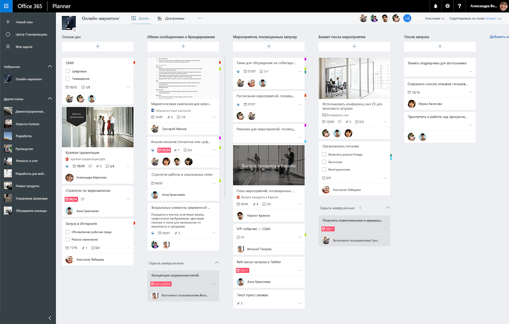

# Обзор API планов и заданий Планировщика

API Планировщика в Microsoft Graph — удобное средство для визуальной организации работы команд. С помощью Планировщика пользователи могут создавать планы, упорядочивать и назначать задачи, делиться сведениями о ходе выполнения, а также совместно работать над контентом. Планировщик включает несколько интерактивных интерфейсов, в том числе доску задач, страницу диаграмм и представление расписаний, а также интеграцию между службами Microsoft 365.

**Доска задач Планировщика в Microsoft 365**

## Преимущества интеграции с задачами Планировщика
Планировщик предоставляет возможности отслеживания задач в решениях для совместной работы в Microsoft 365. Если в ваших сценариях требуется отслеживать задачи и упорядочивать работу команды или группы пользователей, то Планировщик отлично вам подойдет. Интеграция с Планировщиком поможет вам связываться с миллионами пользователей, совместно работающих в Microsoft 365. 

### Организация работы в команде
Планировщик предоставляет общее пространство, где вы можете собрать команду, [создавать задачи](/graph/api/planner-post-tasks) и назначать их другим пользователям в команде. Планировщик помогает всем узнавать, чем занимаются другие пользователи и как продвигается работа над проектом. Вы можете обновлять задачи, добавляя такие сведения, как даты выполнения, ход выполнения и описания, а также упорядочивать задачи с помощью настраиваемых сегментов и меток категорий.   

### Совместная работа в Microsoft 365
Планировщик интегрируется в решения Microsoft 365 для совместной работы. Помимо веб-клиента и мобильного клиента Планировщика, пользователям доступны возможности просмотра и обновления планов и задач из SharePoint и Microsoft Teams.  

Сам Планировщик также работает на платформе Microsoft Graph и службы групп Microsoft 365. Файлы, отправляемые и вкладываемые в задачи Планировщика, хранятся в SharePoint. Примечания в Планировщике основаны на беседах групп Outlook.

<!-- Add image
Note: Put an image here showing the relationship between Planner and other things
-->

### Автоматизация создания планов и задач
Работаете над повторяющимся процессом или типом проекта? С помощью API Планировщика вы можете автоматизировать создания плана и списка задач.  
 
## Основные задачи API Планировщика

|Операция|URL-адрес|
|:--------|:--|
|Просмотр всех [планов](/graph/api/resources/plannerplan) для группы|GET [https://graph.microsoft.com/v1.0/groups/{id}/planner/plans](https://developer.microsoft.com/graph/graph-explorer?request=groups/{id}/planner/plans&version=v1.0)|
|Просмотр [задач](/graph/api/resources/plannertask) в плане|GET [https://graph.microsoft.com/v1.0/planner/plans/{id}/tasks](https://developer.microsoft.com/graph/graph-explorer?request=planner/plans/{id}/tasks&version=v1.0)|
|Просмотр всех [личных задач](/graph/api/planneruser-list-tasks), назначенных мне во всех планах|GET [https://graph.microsoft.com/v1.0/me/planner/tasks/](https://developer.microsoft.com/graph/graph-explorer?request=me/planner/tasks/&version=v1.0)|
|[Создание задачи](/graph/api/planner-post-tasks)|POST [https://graph.microsoft.com/v1.0/planner/tasks](https://developer.microsoft.com/graph/graph-explorer?request=groups/{id}/planner/plans&version=v1.0)|
|[Обновление задачи](/graph/api/plannertask-update)|PATCH [https://graph.microsoft.com/v1.0/planner/tasks/{task-id}](https://developer.microsoft.com/graph/graph-explorer?request=groups/{id}/planner/plans&version=v1.0)|
|[Удаление задачи](/graph/api/plannertask-delete)|DELETE [https://graph.microsoft.com/v1.0/planner/tasks/{id}](https://developer.microsoft.com/graph/graph-explorer?request=groups/{id}/planner/plans&version=v1.0)|

## Справочные материалы по API

Ищете справочные материалы по API для этой службы?

- [API Планировщика в Microsoft Graph 1.0](/graph/api/resources/planner-overview?view=graph-rest-1.0&preserve-view=true)
- [API Планировщика в бета-версии Microsoft Graph](/graph/api/resources/planner-overview?view=graph-rest-beta&preserve-view=true)

## Дальнейшие действия

- [Работа с планами](/graph/api/resources/planner-overview#plans)
- [Работа с задачами](/graph/api/resources/planner-overview#tasks)
