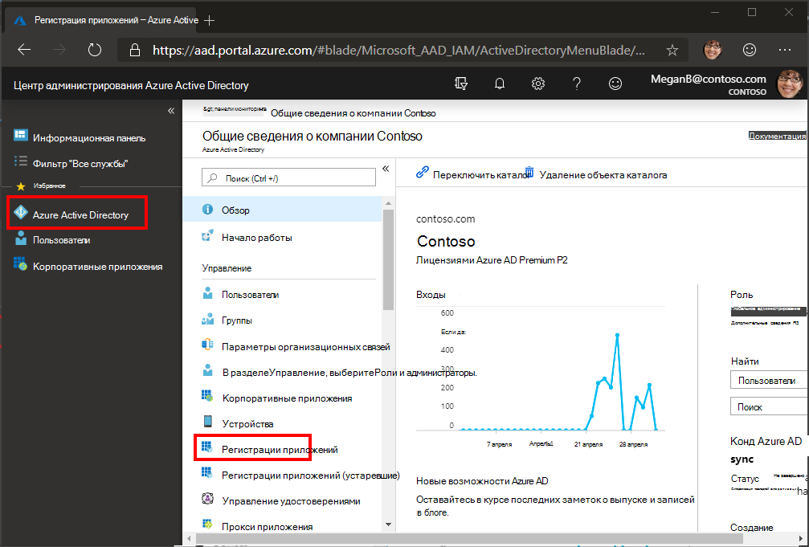
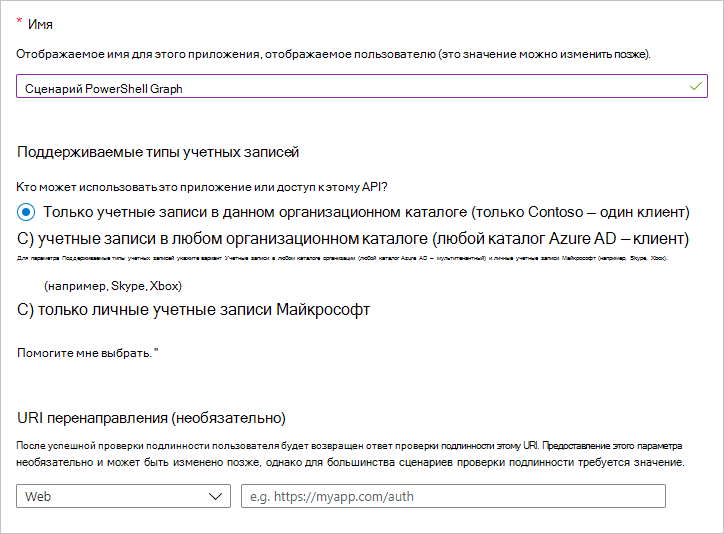
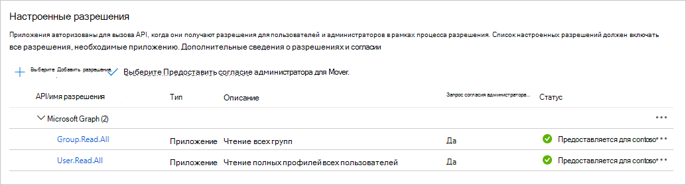

# <a name="use-app-only-authentication-with-the-microsoft-graph-powershell-sdk"></a>Использование проверки подлинности только для приложений с помощью SDK microsoft Graph PowerShell

SDK PowerShell поддерживает два типа проверки подлинности: [делегированную](..\auth-v2-user.md)проверку подлинности и доступ только [для приложений.](..\auth-v2-service.md) В этом руководстве основное внимание будет уделяться конфигурации, необходимой для обеспечения доступа только для приложений.

> [!IMPORTANT]
> Доступ только к приложению предоставляет разрешения непосредственно приложению и требует от администратора согласия на необходимые области разрешений. Дополнительные сведения о доступе только к приложениям см. в платформа удостоверений Майкрософт и потоке учетных данных клиентов [OAuth 2.0.](/azure/active-directory/develop/v2-oauth2-client-creds-grant-flow)

Давайте рассмотрим настройку доступа только для приложений для простого скрипта для списка пользователей и групп в Microsoft 365 клиента.

## <a name="configuration"></a>Настройка

Прежде чем использовать доступ только для приложений с помощью SDK, необходимо следующее.

- Сертификат, который можно использовать в качестве учетных данных для приложения. Это может быть самозаверяемый сертификат или сертификат от органа. Дополнительные [рекомендации](#see-also) по созданию самозаверяемого сертификата см. в разделе См. также.
- [Зарегистрируйте приложение](/azure/active-directory/develop/app-objects-and-service-principals) в Azure AD, настройте его с помощью необходимых для сценария областей разрешений и поделитесь общедоступным ключом для сертификата.

### <a name="certificate"></a>Сертификат

Вам потребуется сертификат X.509, установленный в надежном хранилище пользователя на компьютере, где будет запускаться сценарий. Вам также потребуется общедоступный ключ сертификата, экспортируемый в формате .cer, .pem или .crt. Вам потребуется значение субъекта сертификата или его отпечатка пальца.

### <a name="register-the-application"></a>Регистрация приложения

Вы можете зарегистрировать приложение на портале [Azure Active Directory](https://aad.portal.azure.com)или с помощью PowerShell.

# <a name="portal"></a>[Портал](#tab/azure-portal)

1. Откройте браузер и перейдите в центр [администрирования Azure Active Directory и](https://aad.portal.azure.com) войдите с помощью администратора Microsoft 365 организации клиента.

1. Выберите **Azure Active Directory** на панели навигации слева, затем выберите **Регистрация приложений** в разделе **Управление**.

    

1. Выберите **Новая регистрация**. На странице **Зарегистрировать приложение** задайте необходимые значения следующим образом.

    - Введите **имя** `Graph PowerShell Script`.
    - Установите **поддерживаемые типы учетных** записей только для учетных записей в **этом организационном каталоге.**
    - Оставьте **URI перенаправления** пустым.

    

1. Нажмите **Зарегистрировать**. На странице **Graph PowerShell скопируйте** значения **ID приложения (клиента)** и **каталога (клиента)** и сохраните их.

    

1. Выберите **разрешения API в** статье **Управление**. Выберите **Добавить разрешение.**

1. Выберите **microsoft Graph,** а затем **разрешения приложений**. Добавьте **User.Read.All** и **Group.Read.All**, а затем выберите **Добавить разрешения.**

1. В **настроенных разрешениях** удалите делегированную разрешения **User.Read** в **microsoft Graph, выбрав** **...** справа от разрешения и выбрав **Удаление разрешения**. Выберите **Да, удалите,** чтобы подтвердить.

1. Выберите разрешение **администратора гранта для...** кнопки, а затем выберите **да,** чтобы предоставить согласие администратора для настроенных разрешений приложения. Столбец **Состояние** в таблице **Настраиваемых разрешений** изменяется на **Granted for ...**.

    

1. Выберите **Сертификаты и секреты** в разделе **Управление**. Выберите **кнопку Upload сертификата.** Просмотрите общедоступный файл ключа сертификата и выберите **Добавить**.

# <a name="powershell"></a>[PowerShell](#tab/powershell)

> [!NOTE]
> Необходимо установить [SDK](installation.md) microsoft Graph PowerShell, прежде чем следовать этим шагам.

Может возникнуть вопрос: "Я могу использовать SDK PowerShell для регистрации приложения, чтобы использовать SDK PowerShell?" Конечно! В этом случае используется SDK PowerShell с делегированным доступом, вход в качестве администратора и создание регистрации приложения. Затем, используя эту регистрацию приложений, вы можете использовать SDK PowerShell с доступом только для приложений, что позволяет без присмотра сценариев.

1. Используйте текстовый редактор для создания нового файла **с именемRegisterAppOnly.ps1**. Вставьте в файл следующий код.

    :::code language="powershell" source="RegisterAppOnly.ps1":::

1. Сохраните файл. Откройте PowerShell в каталоге,RegisterAppOnly.ps1 **и** запустите следующую команду.

    ```powershell
    .\RegisterAppOnly.ps1 -AppName "Graph PowerShell Script" -CertPath "PATH_TO_PUBLIC_KEY_FILE"
    ```

1. Откройте браузер по запросу. Вопишите в учетную запись администратора и примите разрешения.

1. Просмотрите вывод для запроса `Please go to the following URL in your browser to provide admin consent` . Скопируйте предоставленный URL-адрес и вклейте его в браузер. Ворегистрируйтесь с учетной записью администратора, чтобы предоставить согласие администратора вашему недавно зарегистрированному приложению.

    > [!NOTE]
    > После предоставления согласия администратора браузер отображает ошибку: `AADSTS500113: No reply address is registered for the application` . Это происходит потому, что регистрация приложения не включает URL-адрес перенаправления. Эту ошибку можно игнорировать.

1. Просмотрите остальную часть вывода PowerShell для команды, предварительно заполненной значениями `Connect-MgGraph` для регистрации приложения.

---

## <a name="authenticate"></a>Проверка подлинности

После выполнения вышеуказанных действий конфигурации необходимо иметь три части информации.

- Субъект сертификата или отпечатки пальцев сертификата, загруженного на регистрацию приложения Azure AD.
- ID приложения для регистрации приложения.
- Ваш ID клиента.

Давайте использовать их для проверки подлинности. Откройте PowerShell и запустите следующую команду, заменив их данными.

```powershell
Connect-MgGraph -ClientID YOUR_APP_ID -TenantId YOUR_TENANT_ID -CertificateName YOUR_CERT_SUBJECT ## Or -CertificateThumbprint instead of -CertificateName
```

Если это удастся, вы увидите `Welcome To Microsoft Graph!` . `Get-MgContext`Запустите, чтобы убедиться, что вы проверили подлинность только для приложений. Выход должен выглядеть следующим образом.

```powershell
ClientId              : YOUR_APP_ID
TenantId              : YOUR_TENANT_ID
CertificateThumbprint :
Scopes                : {Group.Read.All, User.Read.All}
AuthType              : AppOnly
CertificateName       : YOUR_CERT_SUBJECT
Account               :
AppName               : Graph PowerShell Script
ContextScope          : Process
```

## <a name="create-the-script"></a>Создание сценария

Создайте новый файл **сGraphAppOnly.ps1** и добавьте следующий код.

```powershell
# Authenticate
Connect-MgGraph -ClientID YOUR_APP_ID -TenantId YOUR_TENANT_ID -CertificateName YOUR_CERT_SUBJECT

Write-Host "USERS:"
Write-Host "======================================================"
# List first 50 users
Get-MgUser -Property "id,displayName" -PageSize 50 | Format-Table DisplayName, Id

Write-Host "GROUPS:"
Write-Host "======================================================"
# List first 50 groups
Get-MgGroup -Property "id,displayName" -PageSize 50 | Format-Table DisplayName, Id

# Disconnect
Disconnect-MgGraph
```

Замените в команде местообнажителей `Connect-MgGraph` информацией. Сохраните файл, а затем откройте PowerShell в каталоге, где вы создали файл. Запустите сценарий со следующей командой.

```powershell
.\GraphAppOnly.ps1
```

Сценарий выводит список пользователей и групп, аналогичных приведенной ниже (усеченной для краткости).

```powershell
Welcome To Microsoft Graph!
USERS:
======================================================

DisplayName              Id
-----------              --
Conf Room Adams          88d1ba68-8ff5-4de2-90ed-768c00abcfae
Adele Vance              3103c7b9-cfe6-4cd3-a696-f88909b9a609
MOD Administrator        da3a885e-2d97-41de-9347-5271ef321b58
...

GROUPS:
======================================================

DisplayName                         Id
-----------                         --
App Development                     06dce3e5-d310-4add-ab2c-be728fb9076e
All Employees                       1a1cd42d-9801-4e9d-9b77-5215886174ef
Mark 8 Project Team                 2bf1b0d0-81f6-4e80-b971-d1db69f8d651
...
```


## <a name="see-also"></a>См. также

+ [Как: создать самозаверяемый общедоступный сертификат для проверки подлинности приложения](/azure/active-directory/develop/howto-create-self-signed-certificate)