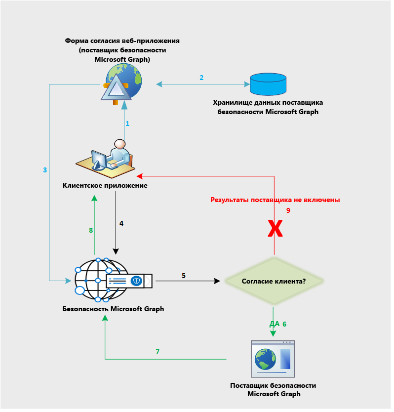

# Поток данных API безопасности Microsoft Graph

API безопасности Microsoft Graph объединяет в федерацию запросы ко всем поставщикам услуг в экосистеме безопасности Microsoft Graph. Она основана на согласии поставщика услуг безопасности, предоставляемом приложением, как показано на схеме ниже. Рабочий процесс получения согласия относится только к сторонним поставщикам услуг.

Ниже приведено описание потока:

1. Пользователь входит в приложение поставщика для просмотра формы согласия поставщика услуг. Эта интерфейс, в котором отображается форма согласия, принадлежит поставщику и относится к сторонним поставщикам. Форма требуется только для получения явного согласия клиентов на отправку запросов к API безопасности Microsoft Graph.
2. Согласие клиента хранится у поставщика услуг.
3. Служба согласия поставщика услуг вызывает API безопасности Microsoft Graph, чтобы утвердить согласие соответствующего клиента.
4. Приложение отправляет запрос в API безопасности Microsoft Graph.
5. API безопасности Microsoft Graph проверяет сведения разрешения для этого клиента, сопоставляя их с различными поставщиками услуг.
6. API безопасности Microsoft Graph вызывает всех поставщиков услуг, которым клиент предоставил явное согласие с помощью их специальных форм.
7. Возвращается ответ от всех поставщиков, которые получили согласие этого клиента.
8. Ответ в виде набора результатов возвращается в приложение.
9. Если клиент не давал согласия ни одному поставщику услуг, их результаты не включаются в ответ.
