# <a name="integrate-security-api-alerts-with-your-siem-using-azure-monitor"></a><span data-ttu-id="11056-101">Интеграция оповещений API безопасности с SIEM при помощи Azure Monitor</span><span class="sxs-lookup"><span data-stu-id="11056-101">Integrate security API alerts with your SIEM using Azure Monitor</span></span>

<span data-ttu-id="11056-102">API безопасности в Microsoft Graph предоставляет возможность управлять оповещениями системы безопасности от множества средств обеспечения безопасности (так называемых поставщиков) через одну конечную точку REST.</span><span class="sxs-lookup"><span data-stu-id="11056-102">The security API in Microsoft Graph provides the ability to manage security alerts from many different security products, known as providers, through a single REST endpoint.</span></span> <span data-ttu-id="11056-103">В некоторых организациях в решения SIEM через Azure Monitor уже могут приниматься данные журналов, относящиеся к Azure.</span><span class="sxs-lookup"><span data-stu-id="11056-103">Some organizations might already ingest Azure specific log data through Azure Monitor into SIEM solutions.</span></span> <span data-ttu-id="11056-104">Для простоты интеграции оповещения системы безопасности, доступные через REST API, также предоставляются через Azure Monitor.</span><span class="sxs-lookup"><span data-stu-id="11056-104">To facilitate ease of integration, the security alerts available through the REST API are also made available through Azure Monitor.</span></span> <span data-ttu-id="11056-105">Если в вашей организации уже настроена интеграция Azure Monitor с решением SIEM, теперь вы можете с легкостью добавлять оповещения системы безопасности вашей организации к данным, доступным через Azure Monitor.</span><span class="sxs-lookup"><span data-stu-id="11056-105">If your organization has already configured Azure Monitor integration with your SIEM solution, you can now easily add your organization’s security alerts to the data available through Azure Monitor.</span></span> <span data-ttu-id="11056-106">В этой статье представлено пошаговое руководство по включению этой интеграции.</span><span class="sxs-lookup"><span data-stu-id="11056-106">This article will guide you through the steps to enable this integration.</span></span>

<span data-ttu-id="11056-107">Azure Monitor поддерживает несколько соединителей SIEM от различных поставщиков.</span><span class="sxs-lookup"><span data-stu-id="11056-107">Azure Monitor supports several different SIEM connectors from various vendors.</span></span> <span data-ttu-id="11056-108">Неполный список средств SIEM с соединителями для данных Azure Monitor представлен в статье [Отправка данных мониторинга в концентратор событий](https://docs.microsoft.com/ru-RU/azure/monitoring-and-diagnostics/monitor-stream-monitoring-data-event-hubs#what-can-i-do-with-the-monitoring-data-being-sent-to-my-event-hub).</span><span class="sxs-lookup"><span data-stu-id="11056-108">For a non-exhaustive list of SIEM tools with connectors for Azure Monitor data, see the article [Send monitoring data to an event hub](https://docs.microsoft.com/ru-RU/azure/monitoring-and-diagnostics/monitor-stream-monitoring-data-event-hubs#what-can-i-do-with-the-monitoring-data-being-sent-to-my-event-hub).</span></span> <span data-ttu-id="11056-109">Инструкции, приведенные в этапах 1 и 2 этой статьи, применимы ко всем соединителям Azure Monitor, поддерживающим получение данных через концентратор событий.</span><span class="sxs-lookup"><span data-stu-id="11056-109">The instructions in Step 1 and Step 2 of this article are relevant for all Azure Monitor connectors supporting consumption via event hub.</span></span> <span data-ttu-id="11056-110">В этой статье представлено полное руководство по настройке соединителя Splunk SIEM.</span><span class="sxs-lookup"><span data-stu-id="11056-110">This article describes the end-to-end configuration for the Splunk SIEM connector.</span></span>

<span data-ttu-id="11056-111">Процесс интеграции состоит из следующих этапов:</span><span class="sxs-lookup"><span data-stu-id="11056-111">The integration process involves the following steps:</span></span>

1. [<span data-ttu-id="11056-112">Настройка концентратора событий Azure на получение оповещений системы безопасности для клиента</span><span class="sxs-lookup"><span data-stu-id="11056-112">Set up Azure your event hub to receive security alerts for your tenant</span></span>](#step-1-set-up-an-event-hubs-namespace-in-azure-to-receive-security-alerts-for-your-tenant)
2. [<span data-ttu-id="11056-113">Настройка Azure Monitor на отправку оповещений системы безопасности из клиента в концентратор событий</span><span class="sxs-lookup"><span data-stu-id="11056-113">Configure Azure Monitor to send security alerts from your tenant to the event hub</span></span>](#step-2-configure-azure-monitor-to-send-security-alerts-from-your-tenant-to-the-event-hub)
3. [<span data-ttu-id="11056-114">Скачивание и установка надстройки Azure Monitor для Splunk, с помощью которой Splunk может получать оповещения системы безопасности</span><span class="sxs-lookup"><span data-stu-id="11056-114">Download and install the Azure Monitor Add-on for Splunk which will allow Splunk to consume security alerts</span></span>](#step-3-download-and-install-the-azure-monitor-add-on-for-splunk-which-will-allow-splunk-to-consume-security-alerts)
4. [<span data-ttu-id="11056-115">Регистрация приложения в клиенте Azure Active Directory, с помощью которого Splunk будет считывать данные из концентратора событий</span><span class="sxs-lookup"><span data-stu-id="11056-115">Register an application with your tenant Azure Active Directory which Splunk will use to read from the event hub</span></span>](#step-4-register-an-application-with-your-tenant-azure-active-directory-which-splunk-will-use-to-read-from-the-event-hub )
5. [<span data-ttu-id="11056-116">Создание хранилища Azure Key Vault для хранения ключа доступа к концентратору событий</span><span class="sxs-lookup"><span data-stu-id="11056-116">Create an Azure Key vault to store the access key for the event hub</span></span>](#step-5-create-an-azure-key-vault-to-store-the-access-key-for-the-event-hub)
6. [<span data-ttu-id="11056-117">Настройка каналов входных данных Splunk на получение оповещений системы безопасности, хранящихся в концентраторе событий</span><span class="sxs-lookup"><span data-stu-id="11056-117">Configure the Splunk data inputs to consume security alerts stored in the event hub</span></span>](#step-6-configure-the-splunk-data-inputs-to-consume-security-alerts-stored-in-the-event-hub)

<span data-ttu-id="11056-118">После выполнения этих действий Splunk Enterprise будет получать оповещения системы безопасности от всех интегрированных с Microsoft Graph средств обеспечения безопасности, лицензии на которые есть в клиенте.</span><span class="sxs-lookup"><span data-stu-id="11056-118">After you complete these steps, your Splunk Enterprise will consume security alerts from all the Microsoft Graph integrated security products for which your tenant is licensed.</span></span> <span data-ttu-id="11056-119">Все новые лицензированные средства обеспечения безопасности также будут отправлять оповещения через это соединение по той же схеме. Дополнительная интеграция не требуется.</span><span class="sxs-lookup"><span data-stu-id="11056-119">Any new security products that you license will also send alerts through this connection, in the same schema with no further integration work needed.</span></span>

## <a name="step-1-set-up-an-event-hubs-namespace-in-azure-to-receive-security-alerts-for-your-tenant"></a><span data-ttu-id="11056-120">Этап 1. Настройка пространства имен для концентраторов событий в Azure на получение оповещений системы безопасности для клиента</span><span class="sxs-lookup"><span data-stu-id="11056-120">Step 1: Set up an Event Hubs namespace in Azure to receive security alerts for your tenant</span></span>

<span data-ttu-id="11056-121">Для начала необходимо создать пространство имен концентраторов событий Microsoft Azure и новый концентратор событий.</span><span class="sxs-lookup"><span data-stu-id="11056-121">To begin, you need to create a Microsoft Azure Event Hubs namespace and event hub.</span></span> <span data-ttu-id="11056-122">Это пространство имен и концентратор событий будут пунктом назначения для всех оповещений системы безопасности в организации.</span><span class="sxs-lookup"><span data-stu-id="11056-122">This namespace and event hub is the destination for all your organization’s security alerts.</span></span> <span data-ttu-id="11056-123">Пространство имен концентраторов событий — это логическая группа концентраторов событий с одной и той же политикой доступа.</span><span class="sxs-lookup"><span data-stu-id="11056-123">An Event Hubs namespace is a logical grouping of event hubs that share the same access policy.</span></span> <span data-ttu-id="11056-124">Обратите внимание на несколько особенностей этого пространства имен и создаваемых вами концентраторов событий.</span><span class="sxs-lookup"><span data-stu-id="11056-124">Note a few details about the Event Hubs namespace and event hubs that you create:</span></span>

- <span data-ttu-id="11056-125">Рекомендуем использовать стандартное пространство имен концентраторов событий, особенно при отправке других данных мониторинга Azure через те же концентраторы событий.</span><span class="sxs-lookup"><span data-stu-id="11056-125">We recommend using a Standard Event Hubs namespace, particularly if you are sending other Azure monitoring data through these same event hubs.</span></span>
- <span data-ttu-id="11056-126">Как правило, требуется только одна единица пропускной способности.</span><span class="sxs-lookup"><span data-stu-id="11056-126">Typically, only one throughput unit is necessary.</span></span> <span data-ttu-id="11056-127">Если активность использования концентратора повысится, вы можете вручную увеличивать количество единиц пропускной способности для пространства имен или включить автоматическое расширение.</span><span class="sxs-lookup"><span data-stu-id="11056-127">If you need to scale up as your usage increases, you can always manually increase the number of throughput units for the namespace later or enable auto inflation.</span></span>
- <span data-ttu-id="11056-128">Количество единиц пропускной способности позволяет повышать масштаб пропускной способности для концентраторов событий.</span><span class="sxs-lookup"><span data-stu-id="11056-128">The number of throughput units allows you to increase throughput scale for your event hubs.</span></span> <span data-ttu-id="11056-129">Путем изменения количества разделов вы можете параллелизовать потребление для множества пользователей.</span><span class="sxs-lookup"><span data-stu-id="11056-129">The number of partitions allows you to parallelize consumption across many consumers.</span></span> <span data-ttu-id="11056-130">Скорость одного раздела может достигать 20 МБ/с или приблизительно 20 000 сообщений в секунду.</span><span class="sxs-lookup"><span data-stu-id="11056-130">A single partition can do up to 20MBps, or approximately 20,000 messages per second.</span></span> <span data-ttu-id="11056-131">Поддержка получения данных из нескольких разделов зависит от того, какое средство получает данные.</span><span class="sxs-lookup"><span data-stu-id="11056-131">Depending on the tool consuming the data, it may or may not support consuming from multiple partitions.</span></span> <span data-ttu-id="11056-132">Если вы не уверены, сколько разделов следует создать, рекомендуем начать с четырех.</span><span class="sxs-lookup"><span data-stu-id="11056-132">If you're not sure about the number of partitions to set, we recommend starting with four partitions.</span></span>
- <span data-ttu-id="11056-133">Рекомендуем задать для концентратора событий срок хранения сообщений, составляющий 7 дней.</span><span class="sxs-lookup"><span data-stu-id="11056-133">We recommend that you set message retention on your event hub to 7 days.</span></span> <span data-ttu-id="11056-134">Благодаря этому, если средство получения данных выйдет из строя более чем на день, оно сможет продолжить работу с того же момента (для событий не старше 7 дней).</span><span class="sxs-lookup"><span data-stu-id="11056-134">If your consuming tool goes down for more than a day, this ensures that the tool can pick up where it left off (for events up to 7 days old).</span></span>
- <span data-ttu-id="11056-135">Рекомендуем использовать для концентратора событий группу потребителей по умолчанию.</span><span class="sxs-lookup"><span data-stu-id="11056-135">We recommend using the default consumer group for your event hub.</span></span> <span data-ttu-id="11056-136">Создавать другие группы потребителей или использовать отдельную группу не требуется, если вы не планируете получать данные из одного концентратора событий с помощью двух разных средств.</span><span class="sxs-lookup"><span data-stu-id="11056-136">You don't need to create other consumer groups or use a separate consumer group unless you plan to have two different tools consume the same data from the same event hub.</span></span>
- <span data-ttu-id="11056-137">Как правило, на компьютере, получающем данные из концентратора событий, должны быть открыты порты 5671 и 5672.</span><span class="sxs-lookup"><span data-stu-id="11056-137">Typically, port 5671 and 5672 must be opened on the machine consuming data from the event hub.</span></span>

<span data-ttu-id="11056-138">См. также: [Часто задаваемые вопросы о концентраторах событий в Azure](https://docs.microsoft.com/ru-RU/azure/event-hubs/event-hubs-faq).</span><span class="sxs-lookup"><span data-stu-id="11056-138">Also see the [Azure Event Hubs FAQ](https://docs.microsoft.com/ru-RU/azure/event-hubs/event-hubs-faq).</span></span>

1. <span data-ttu-id="11056-139">Войдите на [портал Azure](https://portal.azure.com/) и нажмите **Создать ресурс** в левой верхней части экрана.</span><span class="sxs-lookup"><span data-stu-id="11056-139">Log on to the [Azure portal](https://portal.azure.com/) and choose **Create a resource** at the top left of the screen.</span></span>

    

2. <span data-ttu-id="11056-141">Выберите **"Интернет вещей"**, а затем — **Концентраторы событий**.</span><span class="sxs-lookup"><span data-stu-id="11056-141">Select **Internet of Things** and choose **Event Hubs**.</span></span>

    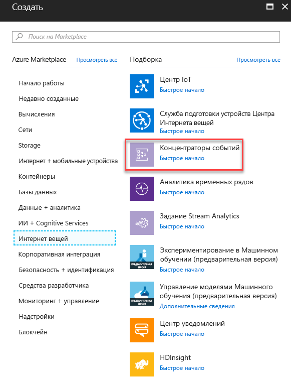

3. <span data-ttu-id="11056-143">В поле **Создать пространство имен** введите имя пространства имен.</span><span class="sxs-lookup"><span data-stu-id="11056-143">In **Create namespace**, enter a namespace name.</span></span> <span data-ttu-id="11056-144">Убедившись, что имя пространства имен доступно, выберите ценовую категорию (базовую или стандартную).</span><span class="sxs-lookup"><span data-stu-id="11056-144">After making sure the namespace name is available, choose the pricing tier (Basic or Standard).</span></span> <span data-ttu-id="11056-145">Кроме того, выберите подписку Azure, группу ресурсов и расположение для создания ресурса.</span><span class="sxs-lookup"><span data-stu-id="11056-145">Also, choose an Azure subscription, resource group, and location in which to create the resource.</span></span> <span data-ttu-id="11056-146">Нажмите кнопку **Создать**, чтобы создать пространство имен.</span><span class="sxs-lookup"><span data-stu-id="11056-146">Choose **Create** to create the namespace.</span></span> <span data-ttu-id="11056-147">Возможно, вам потребуется подождать несколько минут, чтобы система полностью подготовила ресурсы.</span><span class="sxs-lookup"><span data-stu-id="11056-147">You might have to wait a few minutes for the system to fully provision the resources.</span></span>

    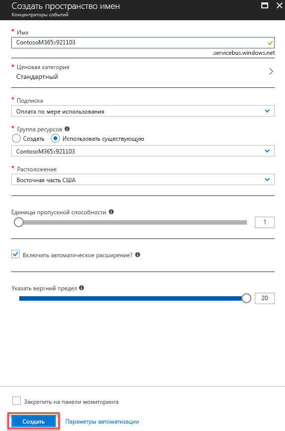

## <a name="step-2-configure-azure-monitor-to-send-security-alerts-from-your-tenant-to-the-event-hub"></a><span data-ttu-id="11056-149">Этап 2. Настройка Azure Monitor на отправку оповещений системы безопасности из клиента в концентратор событий</span><span class="sxs-lookup"><span data-stu-id="11056-149">Step 2: Configure Azure Monitor to send security alerts from your tenant to the event hub</span></span>

<span data-ttu-id="11056-150">Достаточно один раз включить потоковую передачу оповещений от системы безопасности организации через Azure Monitor для всего клиента Azure Active Directory (Azure AD).</span><span class="sxs-lookup"><span data-stu-id="11056-150">Enabling the streaming of your organization’s security alerts through Azure Monitor is done one time for your entire Azure Active Directory (Azure AD) tenant.</span></span> <span data-ttu-id="11056-151">Все продукты с поддержкой и лицензией на API безопасности начнут отправлять оповещения системы безопасности в Azure Monitor, выполняя потоковую передачу данных принимающим приложениям.</span><span class="sxs-lookup"><span data-stu-id="11056-151">All security API licensed and enabled products will begin sending security alerts to Azure Monitor, streaming data to consuming applications.</span></span> <span data-ttu-id="11056-152">Все остальные продукты с поддержкой API безопасности, лицензированные и развернутые в организации, автоматически начнут потоковую передачу оповещений системы безопасности с использованием той же конфигурации Azure Monitor.</span><span class="sxs-lookup"><span data-stu-id="11056-152">Any additional security API-enabled products licensed and deployed by your organization will automatically stream security alerts through this same Azure Monitor configuration.</span></span> <span data-ttu-id="11056-153">От организации не потребуется дополнительных действий по интеграции.</span><span class="sxs-lookup"><span data-stu-id="11056-153">No further integration work is needed from the organization.</span></span>

<span data-ttu-id="11056-154">Оповещения системы безопасности обладают широкими правами, и их обычно могут просматривать только сотрудники групп реагирования и глобальные администраторы организации.</span><span class="sxs-lookup"><span data-stu-id="11056-154">Security alerts are highly privileged data typically viewable only by security response personnel and global administrators within an organization.</span></span> <span data-ttu-id="11056-155">По этой причине, чтобы настроить интеграцию оповещений системы безопасности в клиенте с системами SIEM, необходима учетная запись глобального администратора Azure AD.</span><span class="sxs-lookup"><span data-stu-id="11056-155">For this reason, the steps required to configure the integration of a tenant’s security alerts with SIEM systems require an Azure AD Global Administrator account.</span></span> <span data-ttu-id="11056-156">Эта учетная запись потребуется только один раз, во время настройки, чтобы запросить отправку оповещений от службы безопасности организации в Azure Monitor.</span><span class="sxs-lookup"><span data-stu-id="11056-156">This account is only needed one time, during setup, to request your organization’s security alerts be sent to Azure Monitor.</span></span>

> <span data-ttu-id="11056-157">**Примечание.** В настоящее время колонка параметров диагностики в Azure Monitor не поддерживает настройку ресурсов на уровне клиента.</span><span class="sxs-lookup"><span data-stu-id="11056-157">**Note:** At this time, the Azure Monitor Diagnostic settings blade does not allow configuration of tenant-level resources.</span></span> <span data-ttu-id="11056-158">Оповещения API безопасности являются ресурсом на уровне клиента, поэтому необходимо использовать API Azure Resource Manager, чтобы настроить Azure Monitor на получение оповещений от системы безопасности организации.</span><span class="sxs-lookup"><span data-stu-id="11056-158">Because  security API alerts is a tenant-level resource, you have to use the Azure Resource Manager API to configure Azure Monitor for your organization’s security alerts.</span></span>

1. <span data-ttu-id="11056-159">В подписке Azure зарегистрируйте "microsoft.insights" (Azure Monitor) в качестве поставщика ресурсов.</span><span class="sxs-lookup"><span data-stu-id="11056-159">In your Azure subscription, register "microsoft.insights" (Azure Monitor) as a resource provider.</span></span>  
> <span data-ttu-id="11056-160">**Примечание.** Не указывайте поставщика на уровне клиента "Microsoft.SecurityGraph" (API Security Graph) в качестве поставщика ресурсов в своей подписке Azure.</span><span class="sxs-lookup"><span data-stu-id="11056-160">**Note:** Do not register "Microsoft.SecurityGraph" (Security Graph API) as a resource provider in your Azure subscription since "Microsoft.SecurityGraph" is a tenant level provider.</span></span> <span data-ttu-id="11056-161">Настройка на уровне клиента рассматривается в п. 6 ниже.</span><span class="sxs-lookup"><span data-stu-id="11056-161">Tenant level configuration will be part of #6 below.</span></span> 

2. <span data-ttu-id="11056-162">Чтобы настроить Azure Monitor с помощью API Azure Resource Manager, приобретите средство [ARMClient](https://github.com/projectkudu/ARMClient).</span><span class="sxs-lookup"><span data-stu-id="11056-162">To configure Azure Monitor using the Azure Resource Manager API, obtain the [ARMClient](https://github.com/projectkudu/ARMClient) tool.</span></span> <span data-ttu-id="11056-163">С его помощью можно отправлять вызовы REST API на портал Azure из командной строки.</span><span class="sxs-lookup"><span data-stu-id="11056-163">This tool will be used to send REST API calls to the Azure portal from a command line.</span></span>

3. <span data-ttu-id="11056-164">Подготовьте примерно такой файл JSON с запросом параметров диагностики:</span><span class="sxs-lookup"><span data-stu-id="11056-164">Prepare a diagnostic setting request JSON file like the following:</span></span>

    ``` json
    {
      "location": "",
      "properties": {
        "name": "securityApiAlerts",
        "serviceBusRuleId": "/subscriptions/SUBSCRIPTION_ID/resourceGroups/RESOURCE_GROUP/providers/Microsoft.EventHub/namespaces/EVENT_HUB_NAMESPACE/authorizationrules/RootManageSharedAccessKey",
        "logs": [
          {
            "category": "Alert",
            "enabled": true,
            "retentionPolicy": {
              "enabled": true,
              "days": 7
            }
          }
        ]
      }
    }
    ```

    <span data-ttu-id="11056-165">Замените значения в файле JSON, как указано ниже.</span><span class="sxs-lookup"><span data-stu-id="11056-165">Replace the values in the JSON file as follows:</span></span>

     <span data-ttu-id="11056-166">**SUBSCRIPTION_ID** — это ИД подписки Azure, где размещаются группа ресурсов и пространство имен концентраторов событий, в которые будут отправляться оповещения системы безопасности из вашей организации.</span><span class="sxs-lookup"><span data-stu-id="11056-166">**SUBSCRIPTION_ID** is the Subscription ID of the Azure subscription hosting the resource group and event hub namespace where you will be sending security alerts from your organization.</span></span>
     
     <span data-ttu-id="11056-167">**RESOURCE_GROUP** — это группа ресурсов, содержащая пространство имен концентраторов событий, в которое будут отправляться оповещения системы безопасности из вашей организации.</span><span class="sxs-lookup"><span data-stu-id="11056-167">**RESOURCE_GROUP** is the resource group containing the event hub namespace where you will be sending security alerts from your organization.</span></span>
     
     <span data-ttu-id="11056-168">**EVENT_HUB_NAMESPACE** — это пространство концентраторов событий, в которое будут отправляться оповещения системы безопасности из вашей организации.</span><span class="sxs-lookup"><span data-stu-id="11056-168">**EVENT_HUB_NAMESPACE** is the event hub namespace where you will be sending security alerts from your organization.</span></span>
     
     <span data-ttu-id="11056-169">**"days":** 7 — это количество дней, в течение которого в концентраторе событий будут храниться сообщения.</span><span class="sxs-lookup"><span data-stu-id="11056-169">**“days”:** 7 is the number of days you want to retain messages in your event hub.</span></span>

4. <span data-ttu-id="11056-170">Сохраните файл в формате JSON в том же каталоге, где будет запускаться программа ARMClient.exe.</span><span class="sxs-lookup"><span data-stu-id="11056-170">Save the file as JSON to the directory where you will invoke ARMClient.exe.</span></span> <span data-ttu-id="11056-171">Например, назовите файл **AzMonConfig.json.**</span><span class="sxs-lookup"><span data-stu-id="11056-171">For example, name the file **AzMonConfig.json.**</span></span>

5. <span data-ttu-id="11056-172">Выполните приведенную ниже команду, чтобы войти в средство ARMClient.</span><span class="sxs-lookup"><span data-stu-id="11056-172">Run the following command to sigh in to the ARMClient tool.</span></span> <span data-ttu-id="11056-173">Необходимо использовать учетные данные глобального администратора.</span><span class="sxs-lookup"><span data-stu-id="11056-173">You will need to be using Global Administrator account credentials.</span></span>

    ``` shell
    ARMClient.exe login
    ```

6. <span data-ttu-id="11056-174">Выполните приведенную ниже команду, чтобы настроить Azure Monitor на отправку оповещений системы безопасности в пространство имен концентраторов событий.</span><span class="sxs-lookup"><span data-stu-id="11056-174">Run the following command to configure Azure Monitor to send security alerts to your event hub namespace.</span></span> <span data-ttu-id="11056-175">При этом в пространстве имен будет автоматически подготовлен концентратор событий, в который будет запущен поток оповещений системы безопасности.</span><span class="sxs-lookup"><span data-stu-id="11056-175">This will automatically provision an event hub within the namespace and start the flow of security alerts into the event hub.</span></span> <span data-ttu-id="11056-176">Убедитесь, что имя параметра (в данном примере — **securityApiAlerts**) совпадает с указанным в поле **name** JSON-файла.</span><span class="sxs-lookup"><span data-stu-id="11056-176">Ensure that the setting name (in this example, **securityApiAlerts**) matches the setting name you specified in the JSON file for the **name** field.</span></span>

    ``` shell
    ARMClient.exe put https://management.azure.com/providers/Microsoft.SecurityGraph/diagnosticSettings/securityApiAlerts?api-version=2017-04-01-preview  @".\AzMonConfig.json"
    ```

7. <span data-ttu-id="11056-177">Чтобы убедиться, что параметры применены должным образом, выполните приведенную ниже команду и убедитесь, что выходные данные совпадают с параметрами из JSON-файла.</span><span class="sxs-lookup"><span data-stu-id="11056-177">To verify the settings were applied correctly, run this command and verify that the output matches your JSON file settings.</span></span>

    ``` shell
    ARMClient.exe get https://management.azure.com/providers/Microsoft.SecurityGraph/diagnosticSettings/securityApiAlerts?api-version=2017-04-01-preview
    ```
8. <span data-ttu-id="11056-178">Закройте средство ARMClient.</span><span class="sxs-lookup"><span data-stu-id="11056-178">Exit the ARMClient tool.</span></span> <span data-ttu-id="11056-179">Теперь Azure Monitor настроен на отправку оповещений системы безопасности из клиента в концентратор событий.</span><span class="sxs-lookup"><span data-stu-id="11056-179">You have now completed the configuration of Azure Monitor to send security alerts from your tenant to event hub.</span></span>

## <a name="step-3-download-and-install-the-azure-monitor-add-on-for-splunk-which-will-allow-splunk-to-consume-security-alerts"></a><span data-ttu-id="11056-180">Этап 3. Скачивание и установка надстройки Azure Monitor для Splunk, с помощью которой Splunk может получать оповещения системы безопасности</span><span class="sxs-lookup"><span data-stu-id="11056-180">Step 3: Download and install the Azure Monitor Add-on for Splunk which will allow Splunk to consume security alerts</span></span>

1. <span data-ttu-id="11056-181">Скачайте **Splunk Enterprise** или используйте имеющуюся установку Splunk Enterprise.</span><span class="sxs-lookup"><span data-stu-id="11056-181">Download **Splunk Enterprise** or use an existing Splunk Enterprise installation.</span></span>
2. <span data-ttu-id="11056-182">Скачайте и установите [Надстройку Azure Monitor для Splunk](https://github.com/Microsoft/AzureMonitorAddonForSplunk).</span><span class="sxs-lookup"><span data-stu-id="11056-182">Download and install the [Azure Monitor Add-on for Splunk](https://github.com/Microsoft/AzureMonitorAddonForSplunk).</span></span> <span data-ttu-id="11056-183">Подробные инструкции по установке и см. в статье [Установка](https://github.com/Microsoft/AzureMonitorAddonForSplunk/wiki/Installation).</span><span class="sxs-lookup"><span data-stu-id="11056-183">For detailed installation instructions, see [Installation](https://github.com/Microsoft/AzureMonitorAddonForSplunk/wiki/Installation).</span></span>
3. <span data-ttu-id="11056-184">Требуется выполнить еще одно действие, так как надстройка Azure Monitor для Splunk была создана до того, как оповещения API безопасности стали доступны при интеграции с Azure Monitor.</span><span class="sxs-lookup"><span data-stu-id="11056-184">One additional step is necessary because the Azure Monitor Add-on for Splunk was created before security API alerts were available in Azure Monitor integration.</span></span> <span data-ttu-id="11056-185">Необходимо изменить два файла конфигурации Splunk, чтобы Splunk распознавал новую категорию журнала, которую использует API безопасности для Azure Monitor, а также имя концентратора событий, заданное для оповещений от системы безопасности организации.</span><span class="sxs-lookup"><span data-stu-id="11056-185">Two Splunk configuration files need to be changed to allow Splunk to understand the new log category used by the security API for Azure Monitor, and the name of the event hub that you configured for your organization’s security alerts.</span></span>

    <span data-ttu-id="11056-186">А.</span><span class="sxs-lookup"><span data-stu-id="11056-186">a.</span></span>  <span data-ttu-id="11056-187">Откройте файл **logCategories.json** из папки **\etc\apps\TA-Azure_Monitor\bin\app** в каталоге установки Splunk.</span><span class="sxs-lookup"><span data-stu-id="11056-187">Open the file **logCategories.json** from the path                 **\etc\apps\TA-Azure_Monitor\bin\app** within your Splunk installation directory.</span></span>
   <span data-ttu-id="11056-188">Добавьте приведенную ниже строку в список стандартных категорий журнала.</span><span class="sxs-lookup"><span data-stu-id="11056-188">Append the following line to the list of standard log categories:</span></span>  
    `“MICROSOFT.SECURITYGRAPH/ALERT”: “_json”`  
    <span data-ttu-id="11056-189">Эта строка сообщает надстройке Azure Monitor для Splunk, что тип журнала следует рассматривать как JSON.</span><span class="sxs-lookup"><span data-stu-id="11056-189">This tells the Azure Monitor Addon for Splunk the log type is to be treated as JSON.</span></span>

    <span data-ttu-id="11056-190">Б.</span><span class="sxs-lookup"><span data-stu-id="11056-190">b.</span></span> <span data-ttu-id="11056-191">Откройте файл **hubs.json** из папки **\etc\apps\TA-Azure_Monitor\bin\app** в каталоге установки Splunk.</span><span class="sxs-lookup"><span data-stu-id="11056-191">Open the file **hubs.json** from the path **\etc\apps\TA-Azure_Monitor\bin\app** within your Splunk installation directory.</span></span>  
    <span data-ttu-id="11056-192">Добавьте приведенную ниже строку в список стандартных концентраторов событий.</span><span class="sxs-lookup"><span data-stu-id="11056-192">Append the following line to the list of standard event hubs:</span></span>  
    `“insights-logs-alert”: “tenantId”`  
    <span data-ttu-id="11056-193">Эта строка сообщает надстройке Azure Monitor для Splunk имя концентратора событий и указывает, что ИД ресурса представляет собой ИД клиента Azure AD, так как эти оповещения системы безопасности являются ресурсом на уровне клиента.</span><span class="sxs-lookup"><span data-stu-id="11056-193">This tells the Azure Monitor Add-on for Splunk the name of the event hub and indicates that the resource ID is the Azure AD tenant ID because these security alerts are a tenant-level resource.</span></span> <span data-ttu-id="11056-194">Обязательно измените имя концентратора событий (insights-logs-alert), если ранее в ходе подготовки вы выбрали другое имя.</span><span class="sxs-lookup"><span data-stu-id="11056-194">Be sure to change the event hub name (insights-logs-alert) here if you chose a custom name for your event hub during provisioning earlier.</span></span>

4. <span data-ttu-id="11056-195">Как указано в инструкциях по установке надстройки, она будет работать при помощи цикла отключения и включения на странице "Управление приложениями" сайта Splunk.</span><span class="sxs-lookup"><span data-stu-id="11056-195">As indicated in the Add-on installation instructions, the add-on will work by doing a disable/enable cycle on the Manage Apps page in Splunk Web.</span></span> <span data-ttu-id="11056-196">Вы также можете перезапустить Splunk.</span><span class="sxs-lookup"><span data-stu-id="11056-196">Or, you can restart Splunk.</span></span>

## <a name="step-4-register-an-application-with-your-tenant-azure-active-directory-which-splunk-will-use-to-read-from-the-event-hub"></a><span data-ttu-id="11056-197">Этап 4. Регистрация приложения в клиенте Azure Active Directory, с помощью которого Splunk будет считывать данные из концентратора событий</span><span class="sxs-lookup"><span data-stu-id="11056-197">Step 4: Register an application with your tenant Azure Active Directory which Splunk will use to read from the event hub</span></span>

<span data-ttu-id="11056-198">Приложение Splunk должно быть зарегистрировано в службе Azure Active Directory организации, чтобы получить разрешения и секреты, необходимые для считывания оповещений от системы безопасности из концентратора событий.</span><span class="sxs-lookup"><span data-stu-id="11056-198">Splunk needs an application registration in your organization’s Azure Active Directory to obtain the permissions and secrets it needs to read the security alerts from the event hub.</span></span> <span data-ttu-id="11056-199">Зарегистрировать приложение может любая стандартная учетная запись пользователя на домене.</span><span class="sxs-lookup"><span data-stu-id="11056-199">Any standard user account in the domain can register an app.</span></span> 

1. <span data-ttu-id="11056-200">На портале Azure перейдите к разделу **Регистрация приложений** и нажмите **Регистрация нового приложения**.</span><span class="sxs-lookup"><span data-stu-id="11056-200">In the Azure portal, go to **App Registrations** and select **New application registration**.</span></span>

    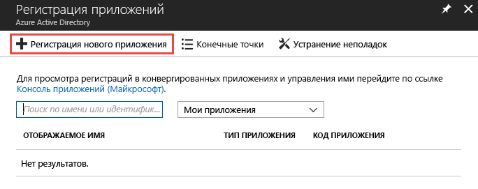

2. <span data-ttu-id="11056-202">Укажите имя приложения, а также выберите тип **Веб-приложение / API** и URL-адрес **`http://localhost`** для входа.</span><span class="sxs-lookup"><span data-stu-id="11056-202">Select a name for your application, choose **Web app / API** for the type, and **`http://localhost`** for the sign-on URL.</span></span> <span data-ttu-id="11056-203">Затем нажмите кнопку **Создать**.</span><span class="sxs-lookup"><span data-stu-id="11056-203">Then select **Create**.</span></span>

    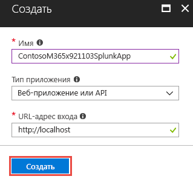

3. <span data-ttu-id="11056-205">После создания приложения скопируйте **ИД приложения** и сохраните его для последующего использования при настройке каналов входных данных Splunk.</span><span class="sxs-lookup"><span data-stu-id="11056-205">After the application is created, copy the **Application ID** and save for later use configuring the Splunk data inputs.</span></span> <span data-ttu-id="11056-206">Затем перейдите к параметрам приложения и выберите **Ключи**.</span><span class="sxs-lookup"><span data-stu-id="11056-206">Then go to the application settings and choose **Keys**.</span></span>

    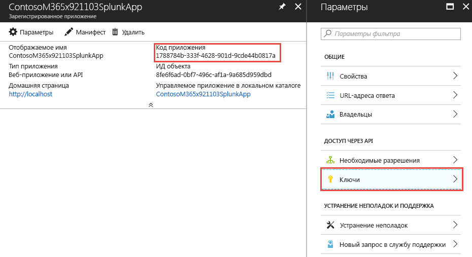

    <span data-ttu-id="11056-208">Благодаря этому вы сможете создать ключ, называемый секретом приложения.</span><span class="sxs-lookup"><span data-stu-id="11056-208">This will allow you to generate a new key, known as an Application Secret.</span></span> <span data-ttu-id="11056-209">После его создания скопируйте значение из поля **Секрет приложения** и сохраните его для последующего использования при настройке каналов входных данных Splunk.</span><span class="sxs-lookup"><span data-stu-id="11056-209">After it's generated, copy the **Application Secret** and save for later use configuring the Splunk data inputs.</span></span>

4. <span data-ttu-id="11056-210">Назначьте приложению роль **Читатель** в подписке Azure, содержащей концентратор событий с оповещениями системы безопасности организации.</span><span class="sxs-lookup"><span data-stu-id="11056-210">Grant the application the role of **Reader** in the Azure subscription containing the event hub with your organization’s security alerts.</span></span>

    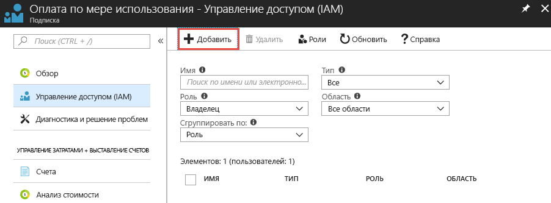

    <span data-ttu-id="11056-212">Выберите подписку, а затем выберите **Управление доступом (IAM)**.</span><span class="sxs-lookup"><span data-stu-id="11056-212">Select your subscription, choose **Access control (IAM)**.</span></span> <span data-ttu-id="11056-213">Нажмите **Добавить**, чтобы добавить разрешения.</span><span class="sxs-lookup"><span data-stu-id="11056-213">Select **Add** to add permissions.</span></span> <span data-ttu-id="11056-214">Выберите приложение и в поле **Роль** задайте значение **Читатель**.</span><span class="sxs-lookup"><span data-stu-id="11056-214">Select your application and choose the **Role** of **Reader** for your application.</span></span>

    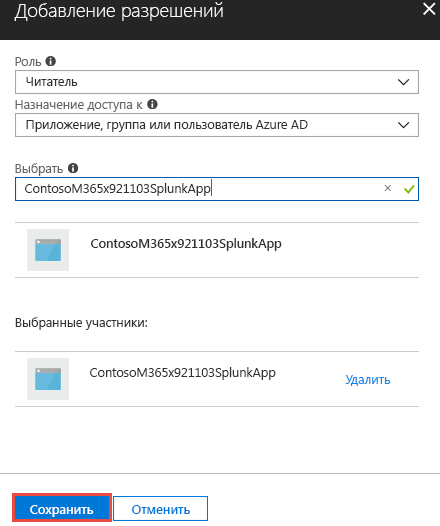

    <span data-ttu-id="11056-216">Нажмите кнопку **Сохранить**, чтобы добавить в подписку разрешения, предоставленные приложению.</span><span class="sxs-lookup"><span data-stu-id="11056-216">Select **Save** to add the permissions granted to your application to the subscription.</span></span>

## <a name="step-5-create-an-azure-key-vault-to-store-the-access-key-for-the-event-hub"></a><span data-ttu-id="11056-217">Этап 5. Создание хранилища Azure Key Vault для хранения ключа доступа к концентратору событий</span><span class="sxs-lookup"><span data-stu-id="11056-217">Step 5: Create an Azure Key vault to store the access key for the event hub</span></span>

<span data-ttu-id="11056-218">Хранилища ключей Azure используются для хранения таких секретов, как удостоверения, пароли и сертификаты для использования приложениями во время их выполнения.</span><span class="sxs-lookup"><span data-stu-id="11056-218">Azure key vaults are used to store secrets such as identities, passwords, and certificates for use at runtime by applications.</span></span> <span data-ttu-id="11056-219">На этом этапе мы создадим хранилище ключей Azure для хранения секретов, необходимых Splunk для подключения к концентраторам событий Azure, содержащим оповещения системы безопасности организации, и считывания данных.</span><span class="sxs-lookup"><span data-stu-id="11056-219">In this step you will create an Azure key vault to store the secrets needed for Splunk to connect and read from the Azure event hubs containing your organization’s security alerts.</span></span>

1. <span data-ttu-id="11056-220">На портале Azure перейдите к разделу **Хранилища ключей** и нажмите кнопку **Добавить**.</span><span class="sxs-lookup"><span data-stu-id="11056-220">In the Azure portal, go to **Key vaults** and select **Add**.</span></span>

    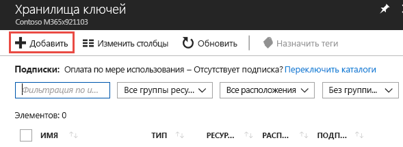

2. <span data-ttu-id="11056-222">При создании хранилища ключей выберите **Политики доступа**, чтобы добавить политику доступа для приложения, зарегистрированного на этапе 4.</span><span class="sxs-lookup"><span data-stu-id="11056-222">When creating the new key vault, select **Access policies** to add a new access policy for the application you just registered in Step 4.</span></span> <span data-ttu-id="11056-223">Предоставьте приложению разрешения на **получение** секрета.</span><span class="sxs-lookup"><span data-stu-id="11056-223">Grant the **Get** secret permissions to your application.</span></span> <span data-ttu-id="11056-224">Благодаря этому Splunk, выступая в качестве зарегистрированного приложения, сможет получать доступ к ключам (секретам) в этом хранилище ключей Azure.</span><span class="sxs-lookup"><span data-stu-id="11056-224">This will allow Splunk, acting as the registered application, to access the keys (secrets) stored in this Azure key vault.</span></span>

    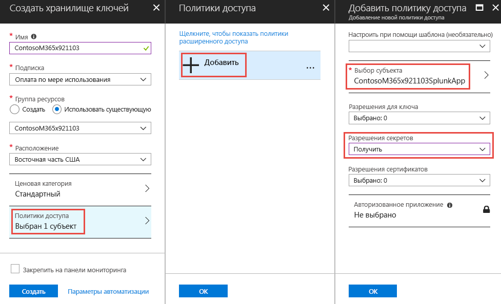

    <span data-ttu-id="11056-226">Нажмите кнопку **Создать**, чтобы завершить создание хранилища ключей Azure.</span><span class="sxs-lookup"><span data-stu-id="11056-226">Select **Create** to complete the creation of your new Azure key vault.</span></span>

3. <span data-ttu-id="11056-227">Создайте в хранилище ключей секрет для хранения ключа доступа к пространству имен концентраторов событий.</span><span class="sxs-lookup"><span data-stu-id="11056-227">Generate a new secret in your key vault to store the access key to your event hub namespace.</span></span> <span data-ttu-id="11056-228">Для начала получите ключ доступа к пространству имен концентраторов событий, открыв это пространство имен и выбрав **Политики общего доступа**.</span><span class="sxs-lookup"><span data-stu-id="11056-228">First, grab the access key to your event hub namespace by opening your event hub namespace and selecting **Shared access policies**.</span></span> <span data-ttu-id="11056-229">Выберите политику **RootManageSharedAccessKey** из списка и скопируйте **первичный ключ**.</span><span class="sxs-lookup"><span data-stu-id="11056-229">Select the **RootManageSharedAccessKey** policy from the list and copy the **Primary Key** from the list.</span></span>

    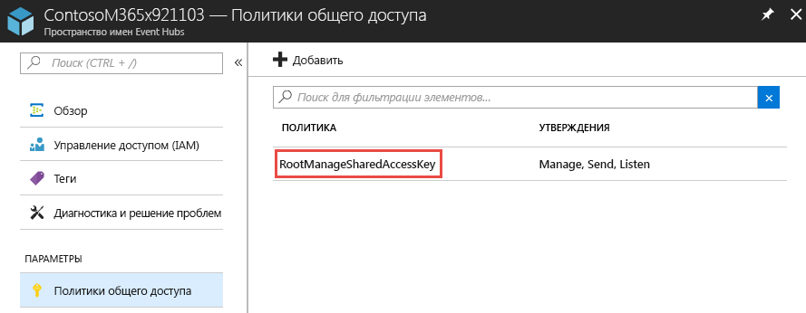

4. <span data-ttu-id="11056-231">Откройте хранилище ключей и выберите **Секреты**.</span><span class="sxs-lookup"><span data-stu-id="11056-231">Open your key vault and select **Secrets**.</span></span> <span data-ttu-id="11056-232">Нажмите **Создать/импортировать**, чтобы добавить секрет в хранилище ключей.</span><span class="sxs-lookup"><span data-stu-id="11056-232">Choose **Generate/Import** to add a new secret to the key vault.</span></span> <span data-ttu-id="11056-233">Вставьте **первичный ключ** из пространства имен для концентраторов событий **RootManageSharedAccessKey**.</span><span class="sxs-lookup"><span data-stu-id="11056-233">Paste in the **Primary key** from the event hub namespace **RootManageSharedAccessKey**.</span></span>

    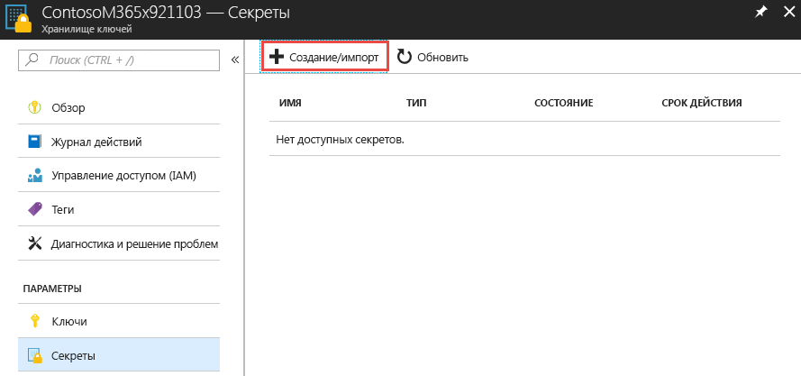

5. <span data-ttu-id="11056-235">После его создания выберите клиент и скопируйте значение из поля **Версия секрета**.</span><span class="sxs-lookup"><span data-stu-id="11056-235">After it's created, select the secret and copy the **Secret Version** of the secret.</span></span> <span data-ttu-id="11056-236">Он будет использоваться на этапе 6 для настройки каналов входных данных Splunk.</span><span class="sxs-lookup"><span data-stu-id="11056-236">This will be used later in Step 6 to configure Splunk data inputs.</span></span>

    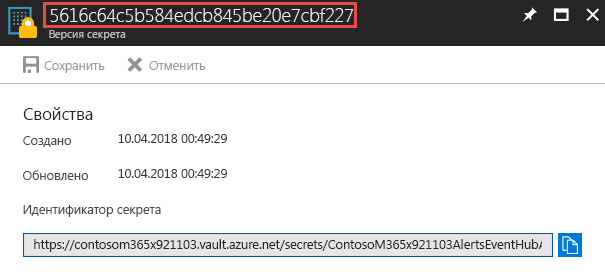

## <a name="step-6-configure-the-splunk-data-inputs-to-consume-security-alerts-stored-in-the-event-hub"></a><span data-ttu-id="11056-238">Этап 6. Настройка каналов входных данных Splunk на получение оповещений системы безопасности, хранящихся в концентраторе событий</span><span class="sxs-lookup"><span data-stu-id="11056-238">Step 6: Configure the Splunk data inputs to consume security alerts stored in the event hub</span></span>

<span data-ttu-id="11056-239">Последний этап — настройка каналов входных данных Splunk на использование концентратора событий, приложения и секретов, созданных на предыдущих этапах.</span><span class="sxs-lookup"><span data-stu-id="11056-239">The last step to complete the setup process is to configure Splunk data inputs to utilize the event hub, application, and secrets you created in previous steps.</span></span>

1. <span data-ttu-id="11056-240">Следуйте инструкциям из статьи [Настройка Splunk](https://github.com/Microsoft/AzureMonitorAddonForSplunk/wiki/Configuration-of-Splunk), чтобы открыть и настроить каналы входных данных Splunk для надстройки Azure Monitor.</span><span class="sxs-lookup"><span data-stu-id="11056-240">Follow the instructions in the [Configuration of Splunk](https://github.com/Microsoft/AzureMonitorAddonForSplunk/wiki/Configuration-of-Splunk) topic to open and configure Splunk data inputs for the Azure Monitor Add-on.</span></span> <span data-ttu-id="11056-241">Перейдите к разделу **Параметры** и выберите **Входные данные**.</span><span class="sxs-lookup"><span data-stu-id="11056-241">Go to **Settings** and **Data Inputs**.</span></span> <span data-ttu-id="11056-242">Выберите **Журналы диагностики Azure Monitor**.</span><span class="sxs-lookup"><span data-stu-id="11056-242">Choose **Azure Monitor Diagnostic Logs**.</span></span>
2. <span data-ttu-id="11056-243">Нажмите кнопку **Создать** и заполните все обязательные поля, используя значения, собранные на предыдущих этапах.</span><span class="sxs-lookup"><span data-stu-id="11056-243">Select **New** and input all the required fields using the values obtained in the previous steps.</span></span> <span data-ttu-id="11056-244">На приведенном ниже изображении показаны все обязательные поля со значениями из предыдущих примеров в этой статье.</span><span class="sxs-lookup"><span data-stu-id="11056-244">The following image shows all the required fields using the values from the previous examples in this article.</span></span>

    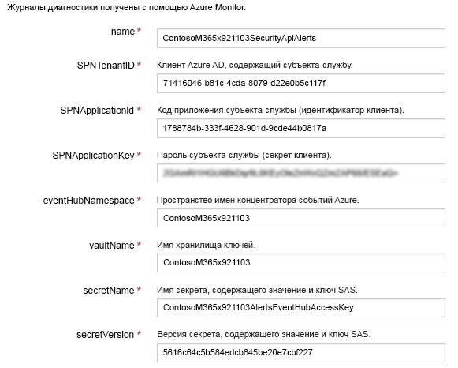

3. <span data-ttu-id="11056-246">Нажмите кнопку **Далее** и приступите к поиску оповещений от системы безопасности организации, полученных из Azure Monitor.</span><span class="sxs-lookup"><span data-stu-id="11056-246">Select **Next** and begin searching your organization’s security alerts ingested from Azure Monitor.</span></span>
