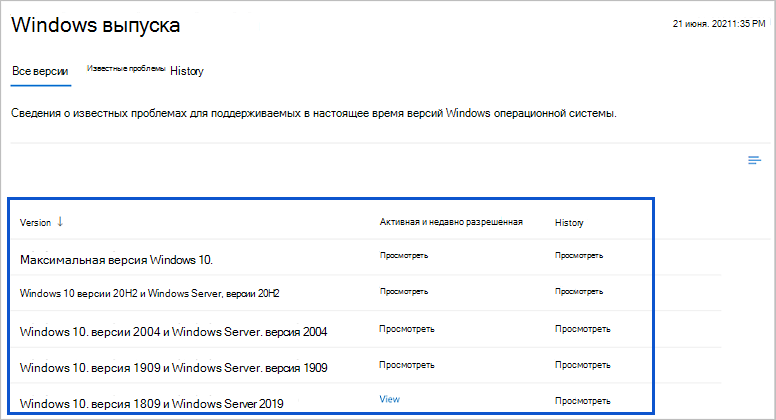

# Обзор доступа к сведениям о работоспособности и взаимодействии служб в Microsoft Graph
Вы можете использовать API взаимодействия служб в Microsoft Graph для доступа к состоянию работоспособности и записям центра сообщений об облачных службах (Майкрософт). Фактическое состояние работоспособности и записи соответствуют службам Microsoft 365 и Dynamics 365, которые поддерживаются API-интерфейсом и подписка на которые есть у клиента.

## Зачем интегрировать данные о работоспособности и взаимодействии служб?

### Получение сведений о работоспособности служб и записей центра сообщений для клиента
Клиенты могут просматривать актуальные или архивные данные о работоспособности поддерживаемых служб Майкрософт. При возникновении проблем со службой Майкрософт они могут проверить ее состояние работоспособности, чтобы узнать, идентифицирована ли проблема и выполняется ли работа по ее решению, прежде чем звонить в службу поддержки или тратить время на устранение неполадок. 

Клиенты могут регулярно проверять записи в центре сообщений, чтобы отслеживать ожидаемые новые функции и обновления, а также другие важные объявления. Благодаря этому они могут предвидеть, как эти изменения повлияют на пользователей, и подготовить соответствующий план действий.

### Интеграция данных о взаимодействии служб в пользовательские рабочие процессы
Разработчики приложений могут интегрировать сведения об активных проблемах с работоспособностью служб в пользовательские приложения, позволяя администраторам рассматривать и делиться сведениями о состоянии с затронутой аудиторией.

Приложения могут поддерживать пользовательские рабочие процессы для администраторов с целью проверки, назначения и рассмотрения сообщений об изменениях в центре сообщений.

### Создание панелей мониторинга для клиентов

Создавайте приложения с панелями мониторинга для клиентов, чтобы отображать работоспособность служб Майкрософт и позволить клиентам отслеживать предстоящие изменения и другие важные объявления о службах.

## Примеры панелей мониторинга в Центре администрирования Microsoft 365
В этом разделе показаны примеры в [Центре администрирования Microsoft 365](https://admin.microsoft.com/Adminportal/Home?source=applauncher#/homepage), который использует API взаимодействия служб для создания соответствующих панелей мониторинга о работоспособности. Войдите в Центр администрирования с помощью учетной записи администратора и щелкните **Работоспособность**, чтобы увидеть следующие панели мониторинга.
- [Работоспособность служб](#service-health-dashboard)
- [Работоспособность выпуска Windows](#windows-release-health-dashboard)
- [Центр сообщений](#message-center-dashboard)

### Панель мониторинга работоспособности служб

На панели мониторинга **Работоспособность служб** можно просмотреть работоспособность служб Майкрософт, на которые у вас есть подписка. К ним могут относиться Office в Интернете, Yammer, Microsoft Dynamics CRM и облачные службы управления мобильными устройствами. См. примеры, показанные на рис. 1.

**Рис. 1. Панель мониторинга работоспособности служб в Центре администрирования Microsoft 365**

### Панель мониторинга работоспособности выпуска Windows

На панели мониторинга **Работоспособность выпуска Windows** можно просмотреть важную информацию о ежемесячных исправлениях и обновлениях компонентов, а также о новейшие функции и улучшения для Windows. См. пример, показанный на рис. 2.

**Рис. 2. Панель мониторинга работоспособности выпуска Windows в Центре администрирования Microsoft 365**

### Панель мониторинга центра сообщений
На панели мониторинга **Центр сообщений** вы можете просматривать предстоящие изменения, в том числе новые и измененные компоненты, запланированное обслуживание и другие важные объявления. См. примеры, показанные на рис. 3.

**Рис. 3. Панель мониторинга центра сообщений в Центре администрирования Microsoft 365**

## Дальнейшие действия

- Попробуйте примеры запросов взаимодействия служб в [песочнице Graph](https://developer.microsoft.com/graph/graph-explorer/?request=admin%2FserviceAnnouncement%2FhealthOverviews&version=v1.0).

- Дополнительные сведения об [API взаимодействия служб 1.0](/graph/api/resources/service-communications-api-overview?view=graph-rest-1.0&preserve-view=true).

- Дополнительные сведения о [бета-версии API взаимодействия служб](/graph/api/resources/service-communications-api-overview?view=graph-rest-beta&preserve-view=true).

