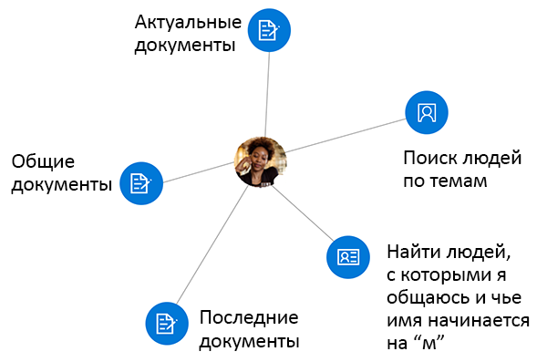

# <a name="overview-of-social-intelligence-and-analytics-in-microsoft-graph"></a><span data-ttu-id="0e71a-106">Обзор социальной аналитики в Microsoft Graph</span><span class="sxs-lookup"><span data-stu-id="0e71a-106">Overview of social intelligence and analytics in Microsoft Graph</span></span>

<span data-ttu-id="0e71a-107">Сотни миллионов пользователей облачных служб Microsoft 365 составляют часть ядра Microsoft Graph.</span><span class="sxs-lookup"><span data-stu-id="0e71a-107">The hundreds of millions of users of Microsoft 365 cloud services form part of the core of Microsoft Graph.</span></span> <span data-ttu-id="0e71a-108">Службы Microsoft Graph управляют данными пользователей, защищают их и при наличии необходимых разрешений предоставляют к ним доступ, чтобы стимулировать работу и креатив в компаниях.</span><span class="sxs-lookup"><span data-stu-id="0e71a-108">The users' data is carefully managed, protected, and with proper authorization, made available by Microsoft Graph services to drive productivity and creativity in businesses.</span></span> <span data-ttu-id="0e71a-109">Среди всех данных пользователя, доступных в Microsoft Graph, особый интерес представляют данные о его социальных взаимодействиях.</span><span class="sxs-lookup"><span data-stu-id="0e71a-109">As ubiquitous the user's data is in Microsoft Graph, data derived from the user's social interactions is particularly interesting.</span></span> <span data-ttu-id="0e71a-110">Их анализ дает возможность получить ответы на следующие вопросы:</span><span class="sxs-lookup"><span data-stu-id="0e71a-110">It provides intelligent insights that can answer questions such as the following:</span></span>

- <span data-ttu-id="0e71a-111">"К кому должен обращаться пользователь для получения информации по этой теме?"</span><span class="sxs-lookup"><span data-stu-id="0e71a-111">"Who should this user contact for information on this topic?"</span></span>
- <span data-ttu-id="0e71a-112">"Какие документы ему интереснее всего?"</span><span class="sxs-lookup"><span data-stu-id="0e71a-112">"Which documents are most interesting to this person?"</span></span>

<span data-ttu-id="0e71a-113">Вы можете использовать API людей и API аналитики в Microsoft Graph для создания более удобных приложений с доступом к важным для пользователя людям и документам.</span><span class="sxs-lookup"><span data-stu-id="0e71a-113">You can use the people API and insights API in Microsoft Graph to build smarter apps that can, respectively, access the relevant people and documents for a user.</span></span>

<span data-ttu-id="0e71a-114">API людей возвращает людей, упорядоченных по релевантности для пользователя на основе его контактов, информации о нем из социальных сетей, каталога организации и недавнего общения по электронной почте и в Skype.</span><span class="sxs-lookup"><span data-stu-id="0e71a-114">The people API returns people ordered by relevance to a user, based on that user's contacts, social networks, organization directory, and recent communications on email and Skype.</span></span> <span data-ttu-id="0e71a-115">Это особенно полезно в сценариях выбора людей.</span><span class="sxs-lookup"><span data-stu-id="0e71a-115">This is particularly useful for people-picking scenarios.</span></span>

<span data-ttu-id="0e71a-116">API аналитики использует расширенную аналитику и машинное обучение для предоставления наиболее релевантных файлов, необходимых пользователю в течение рабочего дня.</span><span class="sxs-lookup"><span data-stu-id="0e71a-116">The insights API uses advanced analytics and machine learning to provide the most relevant files users need throughout their work day.</span></span> <span data-ttu-id="0e71a-117">API обеспечивает работу привычных функций Office 365, в том числе Office Delve, начальной страницы SharePoint, представления Discover в OneDrive для бизнеса и Outlook в Интернете.</span><span class="sxs-lookup"><span data-stu-id="0e71a-117">The API powers familiar Office 365 experiences, including Office Delve, SharePoint Home, the Discover view in OneDrive for Business, and Outlook on the web.</span></span>



## <a name="why-integrate-with-people-data"></a><span data-ttu-id="0e71a-119">Преимущества интеграции с данными о людях</span><span class="sxs-lookup"><span data-stu-id="0e71a-119">Why integrate with people data?</span></span>

<span data-ttu-id="0e71a-120">API людей возвращает данные одной сущности, [person](/graph/api/resources/person?view=graph-rest-1.0), которые включают типичные данные о физическом лице в современном деловом мире.</span><span class="sxs-lookup"><span data-stu-id="0e71a-120">The people API returns data of a single entity, [person](/graph/api/resources/person?view=graph-rest-1.0), which includes typical data of an individual in today's business world.</span></span> <span data-ttu-id="0e71a-121">Что делает данные **person** особенно полезными? Их _релевантность_ для пользователя Microsoft Graph.</span><span class="sxs-lookup"><span data-stu-id="0e71a-121">What makes this **person** data especially useful is its _relevance_ with respect to a Microsoft Graph user.</span></span> <span data-ttu-id="0e71a-122">Релевантность указывается в баллах для каждого человека, которые рассчитываются на основе шаблонов общения и взаимодействия пользователя, а также его деловых связей.</span><span class="sxs-lookup"><span data-stu-id="0e71a-122">Relevance is noted in a relevance score of each person, calculated based on the user's communication and collaboration patterns and business relationships.</span></span> <span data-ttu-id="0e71a-123">Данные о _релевантности_ применяются в основном тремя способами.</span><span class="sxs-lookup"><span data-stu-id="0e71a-123">There are 3 main types of application of this _relevance_ data.</span></span>

### <a name="browse-people-by-relevance"></a><span data-ttu-id="0e71a-124">Просмотр людей по релевантности</span><span class="sxs-lookup"><span data-stu-id="0e71a-124">Browse people by relevance</span></span>

<span data-ttu-id="0e71a-125">При наличии соответствующих [разрешений](people-example.md#authorization) вы можете просматривать людей, связанных с вошедшим пользователем или другими пользователями из его организации.</span><span class="sxs-lookup"><span data-stu-id="0e71a-125">You can browse people who are related to the signed-in user or to some other user in the signed-in user's organization, provided you have got the appropriate [authorization](people-example.md#authorization).</span></span> <span data-ttu-id="0e71a-126">Вы получаете коллекцию объектов **person**, упорядоченных по релевантности.</span><span class="sxs-lookup"><span data-stu-id="0e71a-126">You get a collection of **person** objects that are ordered by relevance.</span></span> <span data-ttu-id="0e71a-127">Вы можете дополнительно [настроить](people-example.md#browse-people) коллекцию возвращаемых объектов **person**, указав параметры запроса `top`, `skip`, `orderby`, `select` и `filter`.</span><span class="sxs-lookup"><span data-stu-id="0e71a-127">You can further [customize](people-example.md#browse-people) the collection of **person** objects that is returned in the response by specifying the query parameters `top`, `skip`, `orderby`, `select`, and `filter`.</span></span>

### <a name="fuzzy-searches-based-on-people-criteria"></a><span data-ttu-id="0e71a-128">Нестрогий поиск на основе критериев людей</span><span class="sxs-lookup"><span data-stu-id="0e71a-128">Fuzzy searches based on people criteria</span></span>

<span data-ttu-id="0e71a-129">API людей позволяет искать людей, релевантных для вошедшего пользователя, если приложение получило разрешения от такого пользователя.</span><span class="sxs-lookup"><span data-stu-id="0e71a-129">The people API lets you search for people relevant to the signed-in user, provided that your app has got permissions by that user.</span></span> <span data-ttu-id="0e71a-130">(Узнайте больше о [разрешениях для пользователей](permissions-reference.md#people-permissions).)</span><span class="sxs-lookup"><span data-stu-id="0e71a-130">(Read more on [people permissions](permissions-reference.md#people-permissions).)</span></span>

<span data-ttu-id="0e71a-131">Нестрогий поиск возвращает результаты на основе точных совпадений, а также выводов о целях поиска.</span><span class="sxs-lookup"><span data-stu-id="0e71a-131">Fuzzy searches return results based on an exact match and also on inferences about the intent of the search.</span></span> <span data-ttu-id="0e71a-132">В приведенном ниже примере возвращаются объекты **person**, релевантные для вошедшего пользователя. Имя _или адрес электронной почты_ такого пользователя содержит слово, начинающееся с буквы "j".</span><span class="sxs-lookup"><span data-stu-id="0e71a-132">To illustrate this, the following example returns **person** objects relevant to the signed-in user whose name, _or email address_, contains a word that starts with 'j'.</span></span>

<!-- { "blockType": "ignored" } -->
```http
GET /me/people/?$search=j
```

### <a name="fuzzy-searches-based-on-topic-criteria"></a><span data-ttu-id="0e71a-133">Нестрогий поиск на основе критериев темы</span><span class="sxs-lookup"><span data-stu-id="0e71a-133">Fuzzy searches based on topic criteria</span></span>

<span data-ttu-id="0e71a-134">API людей также позволяет искать людей, релевантных для вошедшего пользователя, которые при общении с ним выразили интерес к определенным "темам".</span><span class="sxs-lookup"><span data-stu-id="0e71a-134">The people API also lets you perform searches for people who are relevant to the signed-in user, and have expressed an interest in communicating with that user over certain "topics".</span></span> <span data-ttu-id="0e71a-135">Темы — это просто слова, которые пользователи чаще всего использовали в своих сообщениях.</span><span class="sxs-lookup"><span data-stu-id="0e71a-135">Topics are just words that have been used most by users in email conversations.</span></span> <span data-ttu-id="0e71a-136">Майкрософт извлекает и индексирует эти слова без учета контекста, чтобы искать по неточному соответствию было проще.</span><span class="sxs-lookup"><span data-stu-id="0e71a-136">Microsoft extracts such words, free of their contexts, and creates an index for this data to facilitate fuzzy searches.</span></span>

<span data-ttu-id="0e71a-137">Следующий пример иллюстрирует выводы о цели поиска по теме "жук" (англ. "beetle"):</span><span class="sxs-lookup"><span data-stu-id="0e71a-137">The following example illustrates inferences about the intent of a search on the topic "beetle":</span></span>

<!-- { "blockType": "ignored" } -->
```http
GET /me/people/?$search="topic:beetle" 
```

<span data-ttu-id="0e71a-138">Нестрогий поиск по индексу данных темы возвращает экземпляры, означающие насекомое, знаменитый автомобиль "Фольксваген Жук", группу Beatles и другие определения.</span><span class="sxs-lookup"><span data-stu-id="0e71a-138">A fuzzy search in the topic data index return instances that mean the beetle insect, the iconic Volkswagen Beetle car, the Beatles band, and other definitions.</span></span>


## <a name="why-integrate-with-document-based-insights-preview"></a><span data-ttu-id="0e71a-139">Преимущества интеграции аналитики на основе документов (предварительная версия)</span><span class="sxs-lookup"><span data-stu-id="0e71a-139">Why integrate with document-based insights (preview)?</span></span>

### <a name="use-intelligence-to-improve-collaboration"></a><span data-ttu-id="0e71a-140">Используйте аналитику для улучшения совместной работы</span><span class="sxs-lookup"><span data-stu-id="0e71a-140">Use intelligence to improve collaboration</span></span>

<span data-ttu-id="0e71a-141">Во время повседневной деятельности пользователи часто работают с огромными объемами информации, хранящейся во многих документах, и взаимодействуют с другими пользователями различными способами.</span><span class="sxs-lookup"><span data-stu-id="0e71a-141">During a typical work day, users often interact with large amounts of information stored across many documents and collaborate with other users in many different ways.</span></span> <span data-ttu-id="0e71a-142">Важно, чтобы они всегда могли найти нужную информацию в нужный момент.</span><span class="sxs-lookup"><span data-stu-id="0e71a-142">It's important that they can always can find what they need, when they need it.</span></span>

<span data-ttu-id="0e71a-143">Используйте API аналитики, который включает API [популярных](/graph/api/resources/insights-trending?view=graph-rest-beta), [общих](/graph/api/resources/insights-shared?view=graph-rest-beta) и [использованных](/graph/api/resources/insights-used?view=graph-rest-beta) файлов, чтобы показывать файлы Office 365 на основе текущего контекста и потребностей пользователей, повышая их продуктивность и улучшая совместную работу в организации.</span><span class="sxs-lookup"><span data-stu-id="0e71a-143">You can use the insights API, which includes the [trending](/graph/api/resources/insights-trending?view=graph-rest-beta), [shared](/graph/api/resources/insights-shared?view=graph-rest-beta), and [used](/graph/api/resources/insights-used?view=graph-rest-beta) APIs, to surface files from across Office 365 based on your users' current context and needs, making users more productive and improving collaboration in your organization.</span></span>

<span data-ttu-id="0e71a-144">Результаты API аналитики легко отобразить в приложении.</span><span class="sxs-lookup"><span data-stu-id="0e71a-144">It is easy to render the results from the insights API in your app.</span></span> <span data-ttu-id="0e71a-145">Каждый результат поступает вместе с набором общих свойств визуализации, например URL-адресом изображения или текстом для предварительного просмотра.</span><span class="sxs-lookup"><span data-stu-id="0e71a-145">Every result comes with a set of common visualization properties, like a preview image URL or preview text.</span></span>

### <a name="make-relevant-content-visible"></a><span data-ttu-id="0e71a-146">Сделайте релевантное содержимое видимым</span><span class="sxs-lookup"><span data-stu-id="0e71a-146">Make relevant content visible</span></span>

<span data-ttu-id="0e71a-147">В Office 365 Delve использует аналитические сведения _trending_, чтобы пользователям было проще находить документы, интересующие их в данный момент.</span><span class="sxs-lookup"><span data-stu-id="0e71a-147">In Office 365, Delve uses the _trending_ insight to help users discover the documents that are most interesting to them right now.</span></span> <span data-ttu-id="0e71a-148">См. рисунок 1.</span><span class="sxs-lookup"><span data-stu-id="0e71a-148">See figure 1.</span></span>

<span data-ttu-id="0e71a-149">Вы можете использовать сущность [trending](/graph/api/resources/insights-trending?view=graph-rest-beta) в API аналитики программным способом, чтобы обеспечить аналогичное взаимодействие с пользователями приложения.</span><span class="sxs-lookup"><span data-stu-id="0e71a-149">Programmatically, you can use the [trending](/graph/api/resources/insights-trending?view=graph-rest-beta) entity in the insights API to provide your app customers a similar experience.</span></span> <span data-ttu-id="0e71a-150">Используйте сущность **trending**, чтобы подключаться к популярным документам, важным для пользователя.</span><span class="sxs-lookup"><span data-stu-id="0e71a-150">Use the **trending** entity to connect to documents that are trending around and relevant to the user.</span></span> <span data-ttu-id="0e71a-151">API [перечисления популярных документов](/graph/api/insights-list-trending?view=graph-rest-beta) возвращает отсортированные по релевантности файлы, хранящиеся на сайтах групп в OneDrive или SharePoint. Первыми идут наиболее важные.</span><span class="sxs-lookup"><span data-stu-id="0e71a-151">[Listing trending documents](/graph/api/insights-list-trending?view=graph-rest-beta) returns those files stored on OneDrive or SharePoint team sites, sorted by relevance with the most important ones first.</span></span> 

<span data-ttu-id="0e71a-152">**Рисунок 1. Delve в Office 365 возвращает популярные документы**</span><span class="sxs-lookup"><span data-stu-id="0e71a-152">**Figure 1. Delve in Office 365 showing popular documents for a user**</span></span>


### <a name="allow-users-to-collaborate-and-get-back-to-work"></a><span data-ttu-id="0e71a-154">Разрешите пользователям работать с коллегами и возвращаться к работе</span><span class="sxs-lookup"><span data-stu-id="0e71a-154">Allow users to collaborate and get back to work</span></span>

<span data-ttu-id="0e71a-155">Новые карточки людей Office 365 подключаются к аналитическим сведениям _used_ и _shared_ для установления связей между людьми и единицами знания.</span><span class="sxs-lookup"><span data-stu-id="0e71a-155">The new Office 365 people cards tap into the _used_ and _shared_ insights to connect the dots between people and units of knowledge.</span></span> <span data-ttu-id="0e71a-156">На карточке человека отображаются релевантные для него документы.</span><span class="sxs-lookup"><span data-stu-id="0e71a-156">The people card identifies and displays relevant documents about a person.</span></span> <span data-ttu-id="0e71a-157">Карточки людей отображаются во всех программах набора, например в Outlook в Интернете.</span><span class="sxs-lookup"><span data-stu-id="0e71a-157">Users can see people cards across the suite, for example, in Outlook on the web.</span></span> <span data-ttu-id="0e71a-158">См. рисунок 2.</span><span class="sxs-lookup"><span data-stu-id="0e71a-158">See figure 2.</span></span>

<span data-ttu-id="0e71a-159">API аналитики предоставляет аналогичную функциональность с сущностями [used](/graph/api/resources/insights-used?view=graph-rest-beta) и [shared](/graph/api/resources/insights-shared?view=graph-rest-beta).</span><span class="sxs-lookup"><span data-stu-id="0e71a-159">The insights API provides a similar functionality with the [used](/graph/api/resources/insights-used?view=graph-rest-beta) and [shared](/graph/api/resources/insights-shared?view=graph-rest-beta) entities.</span></span> <span data-ttu-id="0e71a-160">Они возвращают объекты, которые пользователь недавно просматривал или применял в работе или которыми с ним недавно поделились коллеги в Office 365.</span><span class="sxs-lookup"><span data-stu-id="0e71a-160">They return what a user has been viewing or working on most recently, or what colleagues have shared with the user most recently in Office 365.</span></span>

<span data-ttu-id="0e71a-161">**Рисунок 2. Outlook в Интернете отображает карточку пользователя**</span><span class="sxs-lookup"><span data-stu-id="0e71a-161">**Figure 2. Outlook on the web showing a people card for a user**</span></span>


## <a name="api-reference"></a><span data-ttu-id="0e71a-163">Справочные материалы по API</span><span class="sxs-lookup"><span data-stu-id="0e71a-163">API reference</span></span>
<span data-ttu-id="0e71a-164">Ищете справочные материалы по API для этих служб?</span><span class="sxs-lookup"><span data-stu-id="0e71a-164">Looking for the API reference for these services?</span></span>

- [<span data-ttu-id="0e71a-165">API людей в Microsoft Graph версии 1.0</span><span class="sxs-lookup"><span data-stu-id="0e71a-165">People API in Microsoft Graph v1.0</span></span>](/graph/api/resources/social-overview?view=graph-rest-1.0)
- [<span data-ttu-id="0e71a-166">API социальной аналитики в бета-версии Microsoft Graph</span><span class="sxs-lookup"><span data-stu-id="0e71a-166">API for social intelligence and analytics in Microsoft Graph beta</span></span>](/graph/api/resources/social-overview?view=graph-rest-beta)

## <a name="next-steps"></a><span data-ttu-id="0e71a-167">Дальнейшие действия</span><span class="sxs-lookup"><span data-stu-id="0e71a-167">Next steps</span></span>

* <span data-ttu-id="0e71a-168">Опробуйте API людей и аналитики с собственными файлами в [песочнице Graph](https://developer.microsoft.com/graph/graph-explorer).</span><span class="sxs-lookup"><span data-stu-id="0e71a-168">Use the [Graph Explorer](https://developer.microsoft.com/graph/graph-explorer) to try out the people and insight APIs with your own files.</span></span> <span data-ttu-id="0e71a-169">Выполните вход и выберите **Показать другие примеры** в столбце слева.</span><span class="sxs-lookup"><span data-stu-id="0e71a-169">Sign in, and choose **Show more samples** in the column on the left.</span></span> <span data-ttu-id="0e71a-170">Включите в меню параметры **Люди** и **Аналитика (бета-версия)**.</span><span class="sxs-lookup"><span data-stu-id="0e71a-170">Use the menu to turn on **People** and **Insights (beta)**.</span></span>
* <span data-ttu-id="0e71a-171">Узнайте больше об [API людей](people-example.md) и сущности [person](/graph/api/resources/person?view=graph-rest-1.0).</span><span class="sxs-lookup"><span data-stu-id="0e71a-171">Find more about the [people API](people-example.md) and the [person](/graph/api/resources/person?view=graph-rest-1.0) entity.</span></span>
* <span data-ttu-id="0e71a-172">Перед использованием API аналитики ознакомьтесь с разделом [Использование API аналитики](/graph/api/resources/insights?view=graph-rest-beta).</span><span class="sxs-lookup"><span data-stu-id="0e71a-172">To get started with insights API, see [Use the insights API](/graph/api/resources/insights?view=graph-rest-beta).</span></span>
