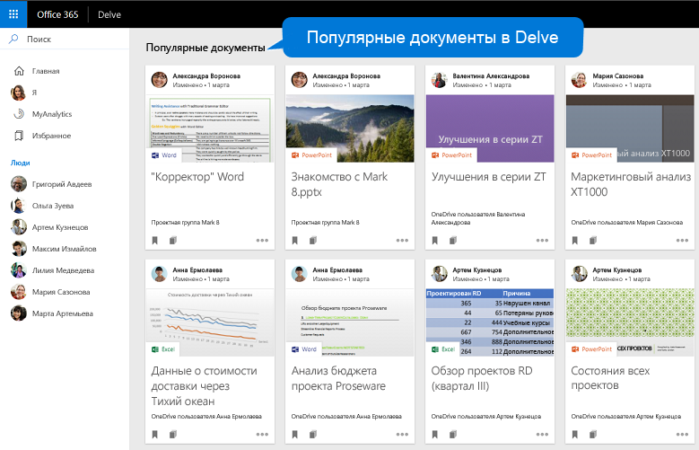
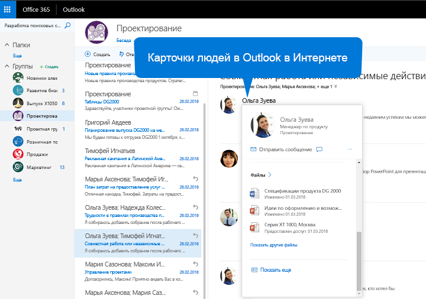

# <a name="people-and-workplace-intelligence-in-microsoft-graph"></a>Обзор данных о людях и рабочей аналитики в Microsoft Graph

Сотни миллионов пользователей облачных служб Microsoft 365 составляют часть ядра Microsoft Graph. Службы Microsoft Graph управляют данными пользователей, защищают их и при наличии необходимых разрешений предоставляют к ним доступ, чтобы стимулировать работу и креатив в компаниях. 

_API профилей_ позволяет разработчикам приложений моделировать и представлять людей в службах Microsoft 365, а API карточки профиля позволяет администраторам управлять информацией, которая отображается на карточках профилей пользователей в организации.

Среди всех данных пользователя, доступных в Microsoft Graph, особый интерес представляют данные о его социальных взаимодействиях. Их анализ дает возможность получить ответы на следующие вопросы:

- «Поиск людей, имена которых начинаются с буквы "J"»
- "Какие документы ему интереснее всего?"

Вы можете использовать _API людей_ и _API аналитики_ в Microsoft Graph для создания более удобных приложений с доступом к важным для пользователя людям и документам.

API людей возвращает людей, упорядоченных по релевантности для пользователя на основе его контактов, информации о нем из социальных сетей, каталога организации и недавнего общения по электронной почте. Это особенно удобно в сценариях выбора людей.

API аналитики использует расширенную аналитику и машинное обучение для предоставления наиболее релевантных файлов, необходимых пользователю в течение рабочего дня. API обеспечивает работу привычных функций Microsoft 365, в том числе Office Delve, начальной страницы SharePoint, представления Discover в OneDrive для бизнеса и Outlook в Интернете.


## <a name="why-integrate-with-people-data"></a>Преимущества интеграции с данными о людях

API людей возвращает данные одной сущности, [person](/graph/api/resources/person), которые включают типичные данные о физическом лице в современном деловом мире. Что делает данные **person** особенно полезными? Их _релевантность_ для пользователя Microsoft Graph. Релевантность указывается в баллах для каждого человека, которые рассчитываются на основе шаблонов общения и взаимодействия пользователя, а также его деловых связей. Данные о _релевантности_ применяются в основном тремя способами.

### <a name="browse-people-by-relevance"></a>Просмотр людей по релевантности

При наличии соответствующих [разрешений](people-example.md#authorization) вы можете просматривать людей, связанных с вошедшим пользователем или другими пользователями из его организации. Вы получаете коллекцию объектов **person**, упорядоченных по релевантности. Вы можете дополнительно [настроить](people-example.md#browse-people) коллекцию возвращаемых объектов **person**, указав параметры запроса `top`, `skip`, `orderby`, `select` и `filter`.

### <a name="fuzzy-searches-based-on-people-criteria"></a>Нестрогий поиск на основе критериев людей

API людей позволяет искать людей, релевантных для вошедшего пользователя, если приложение получило разрешения от такого пользователя. (Узнайте больше о [разрешениях для пользователей](permissions-reference.md#people-permissions).)

Нестрогий поиск возвращает результаты на основе точных совпадений, а также выводов о целях поиска. В приведенном ниже примере возвращаются объекты **person**, релевантные для вошедшего пользователя. Имя _или адрес электронной почты_ такого пользователя содержит слово, начинающееся с буквы "j".

<!-- { "blockType": "ignored" } -->
```http
GET /me/people/?$search=j
```

## <a name="why-integrate-with-the-profile-api-preview"></a>Зачем выполнять интеграцию с API профилей (предварительная версия)?

API [профилей](/graph/api/resources/profile) — это новое поколение механизма моделирования и представления людей в службах Microsoft 365. Данные профиля можно использовать вместе с данными о любых для создания настраиваемых представлений на основе Microsoft Graph.

## <a name="why-configure-profile-cards-in-your-organization-preview"></a>Зачем настраивать карточки профиля в вашей организации (предварительный просмотр)?

Карточки профиля позволяют пользователям в организации видеть информацию друг о друге, например их имена и контактные данные. Администраторы могут использовать API[карточки профиля](/graph/api/resources/profilecardproperty)для настройки информации об их организации в среде пользователей Microsoft 365.

## <a name="why-integrate-with-document-based-insights"></a>Преимущества интеграции аналитики на основе документов

### <a name="use-intelligence-to-improve-collaboration"></a>Используйте аналитику для улучшения совместной работы

Во время повседневной деятельности пользователи часто работают с огромными объемами информации, хранящейся во многих документах, и взаимодействуют с другими пользователями различными способами. Важно, чтобы они всегда могли найти нужную информацию в нужный момент.

Используйте API аналитики, который включает API [популярных](/graph/api/resources/insights-trending), [общих](/graph/api/resources/insights-shared) и [использованных](/graph/api/resources/insights-used) файлов, чтобы показывать файлы Microsoft 365 на основе текущего контекста и потребностей пользователей, повышая их продуктивность и улучшая совместную работу в организации. Организации могут [настраивать параметры конфиденциальности](insights-customize-item-insights-privacy.md)для этих данных на основе документов, а также контролировать их доступность в конкретных приложениях Microsoft 365.

Результаты API аналитики легко отобразить в приложении. Каждый результат поступает вместе с набором общих свойств визуализации, например URL-адресом изображения или текстом для предварительного просмотра.

### <a name="make-relevant-content-visible"></a>Сделайте релевантное содержимое видимым

В Microsoft 365 Delve использует анализ _тенденций_, чтобы пользователям было проще находить документы, интересующие их в данный момент. См. рисунок 1.

Вы можете использовать сущность [trending](/graph/api/resources/insights-trending) в API аналитики программным способом, чтобы обеспечить аналогичное взаимодействие с пользователями приложения. Используйте сущность **trending**, чтобы подключаться к популярным документам, важным для пользователя. API [перечисления популярных документов](/graph/api/insights-list-trending) возвращает отсортированные по релевантности файлы, хранящиеся на сайтах групп в OneDrive или SharePoint. Первыми идут наиболее важные. 

**Рисунок 1. Delve в Microsoft 365 показывает популярные документы для пользователя**



### <a name="allow-users-to-collaborate-and-get-back-to-work"></a>Разрешите пользователям работать с коллегами и возвращаться к работе

Новые карточки людей Microsoft 365 подключаются к аналитическим сведениям _используемым_ и _обменивающимся_ для установления связей между людьми и единицами знания. На карточке человека отображаются релевантные для него документы. Карточки людей отображаются во всех программах набора, например в Outlook в Интернете. См. рисунок 2.

API аналитики предоставляет аналогичную функциональность с сущностями [used](/graph/api/resources/insights-used) и [shared](/graph/api/resources/insights-shared). Они возвращают объекты, которые пользователь недавно просматривал или применял в работе или которыми с ним недавно поделились коллеги в Microsoft 365.

**Рисунок 2. Outlook в Интернете отображает карточку пользователя**



## <a name="why-integrate-with-microsoft-viva-insights-preview"></a>Зачем выполнять интеграцию с Microsoft Viva Insights (предварительная версия)?

[Microsoft Viva Insights](/viva/insights/introduction) предоставляет сведения о том, как и с кем пользователи проводят свое время. Эти данные помогают пользователям спланировать свой день, получить аналитику о различных рабочих закономерностях и обеспечить баланс работы и личной жизни.

API аналитики позволяет синхронизировать и интегрировать пользовательские данные аналитики с настраиваемым сторонним приложением, чтобы поддерживать широкий набор сценариев для повышения производительности пользователей и улучшения совместной работы. Например, вы можете интегрировать данные Viva Insights с действиями на мобильных устройствах, чтобы помочь пользователям отслеживать свою рабочую и социальную активность и планировать свой день в одном приложении.
 
## <a name="api-reference"></a>Справочные материалы по API

Ищете справочные материалы по API для этих служб?

- [Используйте API Microsoft Graph для интеграции людей и средств искусственного интеллекта рабочего места в приложении (версия 1.0)](/graph/api/resources/social-overview)
- [Используйте API Microsoft Graph для интеграции людей и средств искусственного интеллекта рабочего места в приложении (бета-версия)](/graph/api/resources/social-overview?view=graph-rest-beta&preserve-view=true)
- Персональный ресурс People [API](/graph/api/resources/person) 
- [Профиль (предварительная версия)](/graph/api/resources/profile)ресурс
- [Свойство карточки профиля (предварительная версия)](/graph/api/resources/profilecardproperty) ресурс
- [API аналитики](/graph/api/resources/officegraphinsights)
- [API аналитики (предварительная версия)](/graph/api/resources/useranalytics)

## <a name="next-steps"></a>Дальнейшие действия

* Опробуйте API людей, сведений и аналитики с собственными файлами в [песочнице Graph](https://developer.microsoft.com/graph/graph-explorer). Выполните вход, разверните узел **Люди** или **Аналитика** в столбце слева и попробуйте соответствующие примеры запросов.
* Узнайте больше об [пользовательском API](people-example.md).
* Узнайте как [настроить карточку профиля](add-properties-profilecard.md).
* Узнайте больше об [аналитике элементов](item-insights-overview.md), [настройке конфиденциальности аналитики элементов для пользователей (предварительная версия)](insights-customize-item-insights-privacy.md) и [API параметров аналитики элементов (предварительная версия)](/graph/api/resources/iteminsightssettings?view=graph-rest-beta&preserve-view=true) с поддержкой настройки.
* Узнайте больше об [API аналитики](/graph/api/resources/social-overview#help-users-balance-work-and-life).
* Узнайте больше об [API профилей](/graph/api/resources/profile?view=graph-rest-beta&preserve-view=true).
