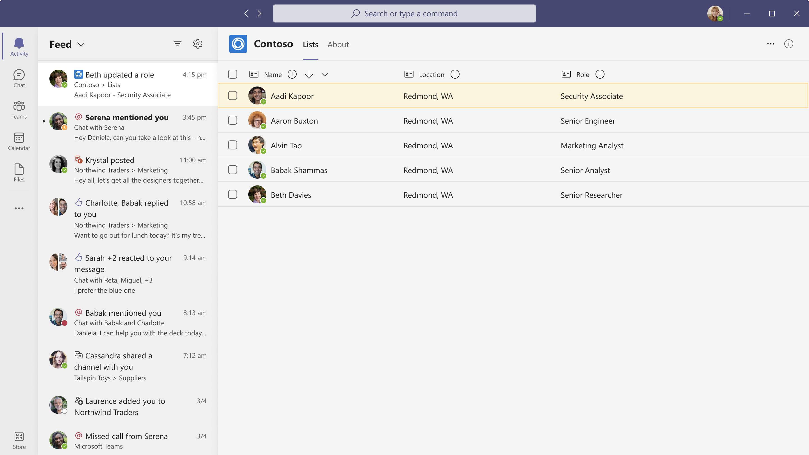

# Рекомендации по использованию уведомлений веб-канала действий Microsoft Teams

В этой статье рассматриваются рекомендации по использованию уведомлений веб-канала действий Microsoft Teams в Microsoft Graph. Эти рекомендации применимы к:
* Создание уведомлений о призыве к действию
* Запрос ответов на уведомления
* Создание уведомлений о внешних событиях

На следующем рисунке показан пример уведомления веб-канала действий в Teams:

При реализации уведомлений веб-канала действий учитывайте следующие моменты:
* Всплывающие уведомления перенаправляют пользователей в веб-канал действий, а не в приложение. Чтобы просмотреть другое действие, пользователи должны выбрать соответствующее уведомление в веб-канале действий.
* Пользователи могут управлять параметрами уведомлений только после того, как выбранное приложение отправит уведомление.
* Значок для каждого уведомления включается в манифест приложения. Microsoft Graph не поддерживает настройку значка.
* Уведомления о приоритетах не поддерживаются.

## Улучшение интерфейса уведомлений

Microsoft Teams отображает уведомления как в веб-канале активности, так и в формате всплывающего уведомления. Пользователи получают уведомления из нескольких источников в чатах, каналах, собраниях или других приложениях. Чтобы улучшить взаимодействие с пользователем, примените следующие рекомендации:

* Локализация содержимого во всплывающем уведомлении или веб-канале. Локализация происходит только в том случае, если содержимое приложения [локализовано](/microsoftteams/platform/concepts/build-and-test/apps-localization).
* Укажите соответствующие заголовки и описания для **типов действий**. Используйте короткие заголовки, **например @mention** и **объявления**. Избегайте длинных заголовков **, таких как** действие пользователя по указанному имени и действие **создания после публикации**.
* Уведомления должны передавать важные сведения, относящиеся к пользователю. Например, *Хи, назначенный вам билет на* продажу, является соответствующим сообщением; *Джони покинул группу продаж.*
* Избегайте отправки уведомлений, которые являются рекламными по своей природе, например *опробуйте новую функцию в приложении "Циклический"*.
* Избегайте повторяющихся уведомлений из сообщений бота и уведомлений веб-канала действий. Дополнительные сведения см. в [разделе "Выбор уведомлений веб-канала действий или сообщений платформы ботов"](#choose-activity-feed-notifications-or-bot-framework-messages).
* Используйте раздел **предварительного просмотра** текста в уведомлениях. Предоставьте сведения, которые помогут пользователю определить важность уведомления и при необходимости принять меры.
* Не добавляйте точку в конце заголовка уведомления, чтобы она была согласована со всеми другими параметрами уведомлений в Teams.
* Сделайте связь между уведомлением и его содержимым понятным пользователю. Например, когда пользователь получает уведомление об утверждении выхода, уведомление должно перенаправлять его в соответствующий раздел приложения. Если уведомление относится к удалению или удалению сущностей, таких как пользователи и задачи, перенаправление получателя к содержимому и указание требуемого действия.
* Убедитесь, что веб-канал является автономным. Например, все всплывающие окна и модальные окна должны оставаться в приложении.
* Убедитесь, что приложение не отправляет более 10 уведомлений в минуту для каждого пользователя. Уведомления будут автоматически регулироваться, если число превышает 10.
* Убедитесь, что время загрузки приложения не влияет на работу пользователей при переключении между уведомлениями в веб-канале.
* Сообщите пользователю о периоде хранения уведомлений в веб-канале действий. В Microsoft Teams период хранения — 30 дней.
    > [!NOTE]
    > Ограничение хранилища в 30 дней применяется ко всем уведомлениям. Это не только уведомления, отправляемые через API уведомлений веб-канала действий.

## Выбор уведомлений веб-канала действий или сообщений платформы ботов

Вы можете использовать уведомления веб-канала действий или сообщения платформы ботов, но не используйте оба типа уведомлений. В следующих разделах описаны типы уведомлений и время их использования.

### Уведомления ленты новостей

Уведомления веб-канала действий отображаются в веб-канале действий Teams и могут содержать ссылки на различные расположения. Эти уведомления: 
* Разрешите пользователю принять меры или рассмотреть уведомление.
* Переведите пользователя на вкладку в чате или канале, личном приложении или сообщении чата или канала. 

API уведомлений веб-канала действий позволяет пользователям настраивать уведомления для каждого типа уведомлений **из параметров** уведомлений.

Если вы используете уведомления веб-канала действий, имейте в виду, что ваше приложение может отправлять двойные уведомления, если оно отправляет уведомления бота в чаты или каналы, а также в веб-канал активности. Отправка двойных уведомлений только в том случае, если это требуется для вашего сценария. 

Используйте делегированные уведомления, чтобы улучшить взаимодействие с уведомлениями. API уведомлений веб-канала действий может отправлять делегированные вызовы или вызовы только для приложений. В делегированных вызовах отправитель уведомления отображается как пользователь, иницивший уведомление, а в вызовах только для приложений отправитель отображается как приложение. 

Вы можете обновить существующее уведомление веб-канала действий вместо создания нового уведомления с помощью *параметра chainId* .

### Сообщения bot framework

Сообщения бота доставляются в виде сообщений чата или канала. Если пользователь включает уведомления чата или канала, активированные уведомления отправляются в виде сообщений чата или канала. Чтобы отправить сообщения бота, *@mention* имя пользователя для уведомления, которое будет отображаться в веб-канале действий.

Это полезно для того, чтобы оповещение использовало в качестве сообщения чата или канала. Например, сообщение, которое используется всеми членами канала.

## См. также

- [Разработка уведомлений веб-канала действий для Microsoft Teams](/microsoftteams/platform/concepts/design/activity-feed-notifications?tabs=mobile)
- [Обзор API Microsoft Teams](teams-concept-overview.md)