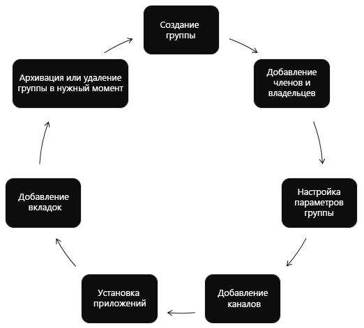

# Обзор API Microsoft Teams

[Microsoft Teams](https://products.office.com/microsoft-teams) — это единый центр для работы в группах и интеллектуального обмена данными. В основе Microsoft Teams лежат мощь и масштаб [Microsoft 365](https://products.office.com/) с более чем 120 млн пользователей. Microsoft Teams предоставляет средства для совместной работы на основе чатов, собраний, звонков и корпоративные голосовые функции.

> [!VIDEO https://www.youtube-nocookie.com/embed/KCvAhQEJmyY]

## Зачем выполнять интеграцию с Microsoft Teams?

### Автоматизация жизненных циклов команд

Если у вас возникла новая бизнес-проблема, с помощью Microsoft Graph вы можете [создать виртуальную команду](/graph/api/team-put-teams), [добавить в нее нужных пользователей](/graph/api/group-post-members) и настроить [каналы](/graph/api/channel-post), [вкладки](/graph/api/teamstab-add) и [приложения](/graph/api/teamsappinstallation-add) для команды.
Если вы хотите привлечь участников команды к обсуждению бизнес-проблемы, [добавьте новое событие](/graph/api/group-post-events) в календарь команды.

После того как бизнес-проблема решена, и вам больше не нужна команда, вы можете [выполнить архивацию](/graph/api/team-archive) или [удаление](/graph/api/group-delete) команды с помощью API Microsoft Teams. Если при создании команды вы заранее знаете максимальный срок ее работы, настройте для нее [политику завершения срока действия групп в Microsoft 365](https://support.office.com/article/office-365-group-expiration-policy-8d253fe5-0e09-4b3c-8b5e-f48def064733?ui=en-US&rs=en-US&ad=US), благодаря которой команда будет автоматически удалена согласно параметрам политики.

### Выполнение работы в отсутствие пользователей

Используйте [разрешения приложений](permissions-reference.md) для работы с [командами](/graph/api/resources/team), [каналами](/graph/api/resources/channel) и [вкладками](/graph/api/resources/teamstab) без человеческого вмешательства. Создайте канал, если ваш клиент разместил заказ.
Автоматически создавайте команды для занятий в начале учебного года и архивируйте их в конце.

### Создание команд, связанных с приложением

Разрешите пользователям создавать новые [команды](/graph/api/resources/team) и [каналы](/graph/api/resources/channel). 
[Установите ](/graph/api/teamsappinstallation-add) ваше [приложение Teams](/microsoftteams/platform/#pivot=home&panel=home-all) в новых командах. 
[Закрепите приложение на вкладке](/graph/api/teamstab-add) в новом канале. 
[Отправляйте сообщения](/graph/api/channel-post-message) в канал со ссылкой, возвращающей на ваш веб-сайт.

### Создание нескольких команд и каналов и управление ими

Microsoft Graph упрощает создание большого количества команд и наполнение их пользователями и каналами путем автоматического создания и управления [командами](/graph/api/resources/team), [каналами](/graph/api/resources/channel), [вкладками](/graph/api/resources/teamstab) и [приложениями](/graph/api/resources/teamsapp).
С помощью Microsoft Graph также можно [искать](teams-list-all-teams.md) и [архивировать](/graph/api/team-archive) команды, которые больше не используются. Это тот же API, на основе которого созданы [Центр администрирования Microsoft Teams](/microsoftteams/enable-features-office-365) и [командлеты PowerShell Teams](/microsoftteams/teams-powershell-overview).

### Разворачивание приложений в командах

[Перечислите команды в вашем клиенте](teams-list-all-teams.md) и [установите приложения](/graph/api/teamsappinstallation-add) для них. 
[Создайте вкладки](/graph/api/teamstab-add) в каналах, чтобы предоставить пользователям удобный доступ к приложениям.

### Использование Microsoft Graph в приложениях любого типа

Приложения Microsoft Teams предоставляют рабочим группам новое средство для повышения эффективности совместной работы. С помощью этих приложений пользователи в рабочих группах могут делиться ресурсами, взаимодействовать друг с другом в чате и планировать мероприятия в календаре группы. С помощью этих приложений можно также автоматизировать создание команд, каналов и бесед, расширяя возможности Microsoft Teams.

Можно создавать веб-сайты, службы и приложения на собственной платформе, работающие за пределами интерфейса Microsoft Teams, а также вызывать API Teams для автоматизации сценариев Teams.

**Типы приложений, которые разрешено использовать в Microsoft Teams**

Эти средства совместной работы включают вкладки или ботов с поддержкой Microsoft Graph, работающих в приложениях Microsoft Teams. Кроме того, вы можете вызывать Microsoft Graph из-за пределов приложения Microsoft Teams, например с веб-сайта или из веб-службы. Если вы уже включили поддержку Microsoft Graph на своем веб-сайте, вы можете использовать ее для работы с Microsoft Teams. Для этого с помощью [платформы разработки Microsoft Teams](/microsoftteams/platform/#pivot=home&panel=home-all) [создайте вкладку](/microsoftteams/platform/concepts/tabs/tabs-overview), использующую существующий код веб-сайта.

API Microsoft Teams могут расширять возможности приложений внутри и за пределами Teams:

|Тип приложения|Описание сценария|
|:-------|:-------------------|
| [Вкладки](/microsoftteams/platform/concepts/tabs/tabs-overview) |Отображение содержимого в Microsoft Teams.|
| [Боты](/microsoftteams/platform/concepts/bots/bots-overview) |Помощь пользователям в выполнении их задач в беседах.|
| [Соединители](/microsoftteams/platform/concepts/connectors/connectors) |Публикация обновлений из внешних служб в каналах.|
| [Сообщения с действиями](/microsoftteams/platform/concepts/cards/cards) |Добавление расширенного взаимодействия в карточки соединителей.|
| [Расширения для системы обмена сообщениями](/microsoftteams/platform/concepts/messaging-extensions) |Разрешение пользователям запрашивать сведения и делиться ими в беседах.|
|Веб-сайты| Предоставление доступа к расширенному контенту на ваших веб-страницах.|
|Службы|Дополнение клиентских приложений данными из Microsoft Graph через веб-службу.|
| [Веб-канал активности](/microsoftteams/platform/concepts/activity-feed)|Привлечение пользователей с помощью уведомлений в веб-каналах.|
| [Звонки и собрания по сети (предварительная версия)](/graph/api/resources/communications-api-overview) |Создание приложений Microsoft Teams с ботами, которые могут начинать аудио- или видеозвонки и участвовать в них, направлять и передавать звонки с учетом потоков интерактивной обработки голоса (IVR), а также участвовать в собраниях по сети.|

### Получение уведомлений об изменениях

Microsoft Teams поддерживает подписку на изменения (создание, обновление и удаление) в сообщениях [каналов](/graph/api/resources/channel) и [чатов](/graph/api/resources/chat), чтобы разрешить приложениям получать обновления почти мгновенно. Сведения о том, как подписаться на изменения, см. в статье [Получение уведомлений об изменениях для сообщений в каналах и чатах](teams-changenotifications-chatmessage.md).

## Справочные материалы по API

Ищете справочные материалы по API для этой службы?

См. статью [API Teams в Microsoft Graph](/graph/api/resources/teams-api-overview).

## Дальнейшие действия

- Просмотрите [видеообзор](https://aka.ms/teamsgraph/v1/video).
- Узнайте, как [использовать API Microsoft Teams](/graph/api/resources/teams-api-overview).
- Узнайте больше о методах, свойствах и связях ресурсов [team](/graph/api/resources/team), [channel](/graph/api/resources/channel) и [group](/graph/api/resources/group).
- Опробуйте API в [песочнице Graph](https://developer.microsoft.com/graph/graph-explorer).
- Узнайте больше о [модели программирования Microsoft Teams](/microsoftteams/platform/concepts/concepts-overview).
- Изучите [API облачных коммуникаций](/graph/api/resources/communications-api-overview).
- Быстро приступите к работе с помощью примеров кода: [Авиакомпания Contoso](https://github.com/microsoftgraph/contoso-airlines-teams-sample), [мини-примеры C#](https://github.com/microsoftgraph/csharp-teams-sample-graph)
