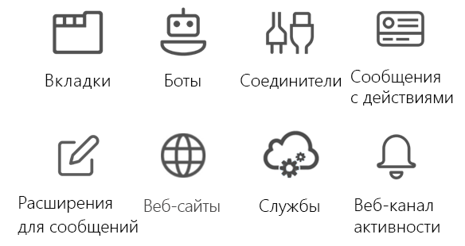

# Обзор API Microsoft Teams (предварительная версия)Microsoft Teams teamwork API overview

Microsoft Teams — это единый центр для работы в группах и интеллектуального обмена данными.Microsoft Teams is the ultimate hub for teamwork and intelligent communications. В основе Microsoft Teams лежат мощь и масштаб Office 365 с более чем 120 млн пользователей. В нем имеются средства для совместной работы на основе чатов, собраний, звонков и корпоративные голосовые функции.Built on the strength and scale of Office 365 with over 120 million users, Microsoft Teams delivers chat-based collaboration, meetings, calling, and enterprise voice features.

## Зачем выполнять интеграцию с Microsoft Teams?Why integrate with Microsoft Teams?

Интеграция с Microsoft Teams упрощает создание собственных служб и приложений, позволяет связаться с миллионами корпоративных пользователей и помогает людям совместно выполнять работу.Integrating with Microsoft Teams makes it easy for you to build your own services and apps, reaching millions of enterprise users and helping people get work done together. С помощью Microsoft Graph вы можете создавать группы, каналы, сообщения и многое другое, а также управлять ими.You can use Microsoft Graph to create and manage teams, channels, messages, and more.

### Использование Microsoft Graph в приложениях любого типаUse Microsoft Graph in any kind of app

Приложения Microsoft Teams, созданные на базе Microsoft Graph, предоставляют рабочим группам новое средство для повышения эффективности совместной работы.Microsoft Teams apps built on Microsoft Graph give work groups a new tool to make collaboration a more productive and compelling experience. С помощью Microsoft Teams пользователи в рабочих группах могут делиться ресурсами, взаимодействовать друг с другом в чате и планировать мероприятия в календаре группы.Using Microsoft Teams, work group users share assets, interact through chat, and schedule events on the team calendar. Повысьте удобство работы с Microsoft Teams, добавив средства автоматизации групп, каналов и бесед с помощью приложений, основанных на API Microsoft Teams.Enhance the value of Microsoft Teams by adding team, channel, and conversation automation via apps based on the Microsoft Teams API.

Веб-сайты, службы и собственные приложения платформы не выполняются в пользовательском интерфейсе Microsoft Teams, но их можно использовать для вызова API Microsoft Teams, которые позволяют использовать сценарии автоматизации Microsoft Teams.Websites, services, and native platform applications are not run within the Microsoft Teams user experience but can be used to call the Microsoft Teams APIs that enable Microsoft Teams automation scenarios.

**Типы приложений, которые разрешено использовать в Microsoft Teams****Types of apps enabled for Microsoft Teams**

Эти средства совместной работы включают вкладки или приложения-боты с поддержкой Microsoft Graph, работающие в Microsoft Teams.These collaboration tools include Microsoft Graph-enabled tab or bot apps running inside Microsoft Teams. Кроме того, вы можете вызывать Microsoft Graph из-за пределов приложения Microsoft Teams, например с веб-сайта или из веб-службы.You can also call Microsoft Graph outside of a Microsoft Teams app, such as from a website or a web service. Если вы уже включили поддержку Microsoft Graph на своем веб-сайте, вы можете использовать ее для работы с Microsoft Teams. Для этого с помощью [платформы разработки Microsoft Teams](https://docs.microsoft.com/en-us/microsoftteams/platform/#pivot=home&panel=home-all) создайте приложение вкладки, использующее существующий код веб-сайта.If you've already enabled your website for Microsoft Graph, you can use that work for Microsoft Teams by using the [Microsoft Teams developer platform](https://docs.microsoft.com/en-us/microsoftteams/platform/#pivot=home&panel=home-all) to create a tab app that uses the existing website code.

Если вкладка или приложение-бот Microsoft Teams не подходят для вашего сценария, выберите приложение одного из указанных ниже типов.If a Microsoft Teams tab or bot app is not the ideal way to complete your scenario, choose one of the following app types.

|Тип приложенияApp type|Описание сценарияScenario description|
|:-------|:-------------------|
|ВкладкиTabs|Показ расширенного контента в Microsoft Teams.Surface enhanced content within Microsoft Teams.|
|СоединителиConnectors|Публикация расширенных обновлений в каналах.Post enhanced updates to channels.|
|Сообщения с действиямиActionable messaging|Добавление расширенного взаимодействия в карточки соединителей.Add enhanced interaction to your connector cards.|
|Веб-сайтыWebsites|Предоставление доступа к расширенному контенту на ваших веб-страницах.Surface enhanced content in your web pages.|
|БотыBots|Помощь пользователям в выполнении их задач в беседах.Help users get tasks done in conversations.|
|Веб-канал активностиActivity feed|Привлечение пользователей с помощью уведомлений в веб-каналах.Engage users via feed notifications.|
|Расширения для системы обмена сообщениямиMessaging extensions|Разрешите пользователям запрашивать расширенные карточки и делиться ими в беседах.Allow users to query and share enhanced cards in conversations.|
|СлужбыServices|Дополнение клиентских приложений данными из Microsoft Graph через веб-службу.Enhance your client applications with Microsoft Graph data via your web service.|

### Создание нескольких групп и каналовCreate multiple teams and channels

Разрешите своим клиентам создавать [группы](../api-reference/beta/resources/team.md) и [каналы](../api-reference/beta/resources/channel.md), связанные с вашим приложением.Allow your customers to create new [teams](../api-reference/beta/resources/team.md) and [channels](../api-reference/beta/resources/channel.md) linked to your app. Упростите создание большого количества групп и наполнение их пользователями и каналами с помощью API Microsoft Teams.Make creating large numbers of teams and populating them with users and channels easy by using the Microsoft Teams API.

### Автоматизация жизненных циклов группAutomate team lifecycles

Если у вас возникла новая бизнес-проблема, с помощью Microsoft Graph вы можете создать виртуальную группу, [наполнить ее](../api-reference/v1.0/api/group_post_members.md) необходимыми пользователями и настроить каналы для группы.Use Microsoft Graph to create a new virtual team when a new business issue arises, [populate the team](../api-reference/v1.0/api/group_post_members.md) with the right people, and configure the team with channels. Чтобы начать обсуждение бизнес-проблемы в канале группы, вы можете разместить новую беседу в канале и опубликовать в ней приветственное сообщение для новых участников группы.To start a team channel discussion around the new business issue, you can seed the channel with a new conversation thread to post a welcome message to new team members. Если вы хотите привлечь участников группы к обсуждению бизнес-проблемы, добавьте новое мероприятие в календарь группы и пригласите на него участников группы.If you want to get the new team together to discuss the business issue, add a new event to the team calendar and then invite the members of the team to the event.

После того как бизнес-проблема решена, и вам больше не нужна виртуальная группа, вы можете уничтожить группу с помощью API Microsoft Teams.When the business issue is resolved and you no longer need the virtual team, use the Microsoft Teams API to tear down the team. Если при создании виртуальной группы вы заранее знаете максимальный срок ее работы, настройте для группы [политику завершения срока действия групп в Office 365](https://support.office.com/en-us/article/office-365-group-expiration-policy-8d253fe5-0e09-4b3c-8b5e-f48def064733?ui=en-US&rs=en-US&ad=US), благодаря которой группа будет автоматически удалена согласно параметрам политики.If you know the maximum duration of the virtual team when you create it, set an [Office 365 group expiration policy](https://support.office.com/en-us/article/office-365-group-expiration-policy-8d253fe5-0e09-4b3c-8b5e-f48def064733?ui=en-US&rs=en-US&ad=US) for the team that automatically removes the team according to the policy.

## Дальнейшие действияNext steps

- Узнайте, как [использовать API Microsoft Teams](../api-reference/beta/resources/teams_api_overview.md).Learn how to [use the Microsoft Teams API](../api-reference/beta/resources/teams_api_overview.md).
- Узнайте больше о методах, свойствах и связях ресурсов [team](../api-reference/beta/resources/team.md), [channel](../api-reference/beta/resources/channel.md) и [group](../api-reference/v1.0/resources/group.md).Drill down on the methods, properties, and relationships of the [team](../api-reference/beta/resources/team.md), [channel](../api-reference/beta/resources/channel.md), and [group](../api-reference/v1.0/resources/group.md) resources.
- Опробуйте API в [песочнице Graph](https://developer.microsoft.com/en-us/graph/graph-explorer).Try the API in the [Graph Explorer](https://developer.microsoft.com/en-us/graph/graph-explorer).
- Узнайте больше о [модели программирования Microsoft Teams](https://docs.microsoft.com/en-us/microsoftteams/platform/concepts/concepts-overview).Read more about the [Microsoft Teams programming model](https://docs.microsoft.com/en-us/microsoftteams/platform/concepts/concepts-overview).
- Быстро приступите к работе с помощью [примера кода](https://github.com/OfficeDev/microsoft-teams-sample-graph).Get a jump-start with [sample code](https://github.com/OfficeDev/microsoft-teams-sample-graph).
