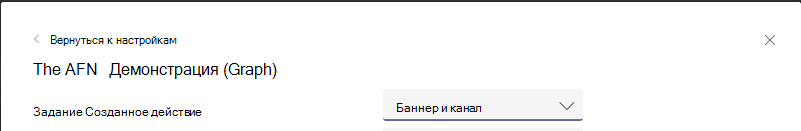

# <a name="send-activity-feed-notifications-to-users-in-microsoft-teams"></a>Отправка уведомлений о канале активности пользователям в Microsoft Teams

Канал Microsoft Teams позволяет пользователям делить элементы, которые требуют внимания, уведомляя их об изменениях. Вы можете использовать API уведомлений о каналах действий в Microsoft Graph, чтобы распространить эту функцию на приложения. Это позволяет приложениям предоставлять более богатые впечатления и лучше привлекать пользователей, помогая поддерживать их в курсе изменений в инструментах и рабочего процессах, которые они используют.

## <a name="understanding-the-basics-of-activity-feed-notification"></a>Основные принципы уведомлений ленты новостей

Уведомления каналов активности в Microsoft Teams состоят из нескольких битов информации, отображаемой вместе, как показано на следующем изображении.


Компоненты включают в себя:
- Актер, который инициировал действие
- Значок, представляющий тип действия
- Причина, по которой субъект выполнил действие
- Предварительный просмотр текста
- Метка времени
- Место действия

В следующем примере показано, как эти компоненты вместе предоставляют сведения об уведомлении. Этот пример — уведомление о пользователе, упомянутом в Yammer сообществе.


## <a name="requirements-for-using-the-activity-feed-notification-apis"></a>Требования к использованию API уведомлений о подаче уведомлений о действиях

API каналов активности работают с [приложением Teams.](/microsoftteams/platform/overview) Ниже приводится требование к отправке уведомлений о ленте действий:

- В манифесте Teams приложения должен быть добавлен ID приложения Azure AD в `webApplicationInfo` разделе. Подробные сведения см. в [схеме манифеста.](/microsoftteams/platform/resources/schema/manifest-schema)
- Типы действий должны быть объявлены в `activities` разделе. Подробные сведения см. в [схеме манифеста.](/microsoftteams/platform/resources/schema/manifest-schema)
- Приложение Teams должно быть установлено для получателя лично, [](/graph/api/resources/team?preserve-view=true) или в группе или чате, [в](/graph/api/resources/chat?preserve-view=true) который они входит. Дополнительные сведения см. [в Teams установки приложения.](/graph/api/resources/teamsappinstallation?preserve-view=true)

### <a name="teams-app-manifest-changes"></a>Teams изменения манифеста приложения

В этом разделе описываются изменения, которые необходимо добавить в манифест Teams приложения. Обратите внимание, что необходимо использовать версию манифеста [Teams или](/microsoftteams/platform/resources/schema/manifest-schema) `1.7` больше.

```json
"$schema": "https://developer.microsoft.com/json-schemas/teams/v1.7/MicrosoftTeams.schema.json",
"manifestVersion": "1.7",
````

#### <a name="webapplicationinfo-section-changes"></a>Изменения раздела webApplicationInfo

```json
"webApplicationInfo":
{
    "id": "a3111f15-658e-457c-9689-fd20fe907330",
    "resource": "https://contosoapp.com"
}
```

|Параметр|Тип|Описание|
|:---|:---|:---|
|id|string|ID приложения Azure AD (client ID).|
|resource|string|Ресурс, связанный с приложением Azure AD. Также известен как URL-адрес ответа или перенаправления на портале Azure.|

> **Примечание:** Вы можете получить ошибку, если Teams приложений в одной области (команда, чат или пользователь) используют одно и то же приложение Azure AD. Убедитесь, что вы используете уникальные приложения Azure AD.

#### <a name="activities-section-changes"></a>Изменения раздела действий

```json
"activities":
{
  "activityTypes": [
    {
      "type": "taskCreated",
      "description": "Task Created Activity",
      "templateText": "{actor} created task {taskId} for you"
    },
    {
      "type": "approvalRequired",
      "description": "Deployment requires your approval",
      "templateText": "{actor} created a new deployment {deploymentId}"
    }
  ]
}
```

|Параметр|Тип|Описание|
|:---|:---|:---|
|type|string|Тип действия. Это должно быть уникальным в определенном манифесте.|
|description|string|Краткое описание, считываемым человеком. Это будет видно на Microsoft Teams клиенте.|
|templateText|string|Текст шаблона для уведомления о действии. Вы можете объявить параметры, инкапсулируя параметры `{}` в .|

>**Примечание:** `actor` это специальный параметр, который всегда принимает имя вызываемого. В делегировании звонков имя `actor` пользователя. В вызовах только для приложений оно принимает имя Teams приложения.

### <a name="installing-the-teams-app"></a>Установка приложения Teams

Teams приложения могут быть установлены в команде, чате или лично для пользователя и могут распространяться несколькими способами. Подробные сведения см. [в Teams методах распространения приложений.](/microsoftteams/platform/concepts/deploy-and-publish/overview) Как правило, [для целей](/microsoftteams/platform/concepts/deploy-and-publish/apps-upload) разработки предпочтительна побочная загрузка. После разработки вы можете выбрать правильный метод распространения в зависимости от того, хотите ли вы распространять среди одного клиента или всех клиентов.

Вы также можете [использовать Teams API](/graph/api/resources/teamsappinstallation?preserve-view=true) установки приложений для управления Teams установок приложений.

## <a name="sending-activity-feed-notifications-to-users"></a>Отправка уведомлений о канале активности пользователям

Так как Teams приложение можно установить для пользователя, в команде или в чате, уведомления можно отправить и в этих трех контекстах:

- [Отправка уведомления пользователю в чате](/graph/api/chat-sendactivitynotification)
- [Отправка уведомления пользователю в команде](/graph/api/team-sendactivitynotification)
- [Отправка уведомления пользователю](/graph/api/userteamwork-sendactivitynotification)

Сведения о том, какие темы поддерживаются для каждого сценария, см. в конкретных API. Настраиваемые текстовые темы поддерживаются для всех сценариев.

> **Примечание:** Значок действия основан на контексте, в котором выполнен запрос. Если запрос выполнен с делегированными разрешениями, фотография пользователя отображается как аватар, а значок Teams — как значок действия. В контексте, доступном только для приложений, Teams используется в качестве аватара и значка действий.

### <a name="example-1-notify-a-user-about-a-task-created-in-a-chat"></a>Пример 1. Уведомление пользователя о задаче, созданной в чате

В этом примере показано, как можно отправить уведомление о ленте действий для новой задачи, созданной в чате. В этом случае Teams приложение должно быть установлено в чате с ИД, а пользователь также должен быть частью `chatId` `569363e2-4e49-4661-87f2-16f245c5d66a` чата.

#### <a name="request"></a>Запрос
<!-- {
  "blockType": "request",
  "name": "chat_sendactivitynotification"
}
-->
``` http
POST https://graph.microsoft.com/beta/chats/{chatId}/sendActivityNotification
Content-Type: application/json

{
    "topic": {
        "source": "entityUrl",
        "value": "https://graph.microsoft.com/beta/chats/{chatId}"
    },
    "activityType": "taskCreated",
    "previewText": {
        "content": "New Task Created"
    },
    "recipient": {
        "@odata.type": "microsoft.graph.aadUserNotificationRecipient",
        "userId": "569363e2-4e49-4661-87f2-16f245c5d66a"
    },
    "templateParameters": [
        {
            "name": "taskId",
            "value": "12322"
        }
    ]
}
```

#### <a name="response"></a>Отклик
<!-- {
  "blockType": "response",
  "truncated": false
}
-->
``` http
HTTP/1.1 204 No Content
```

### <a name="example-2-notify-a-user-about-a-task-created-in-a-team"></a>Пример 2. Уведомление пользователя о задаче, созданной в команде

В этом примере показано, как можно отправить уведомление о канале действий для группы. В этом примере владелец группы сообщает о новой задаче, которая требует их внимания.

#### <a name="request"></a>Запрос
<!-- {
  "blockType": "request",
  "name": "team_sendactivitynotification"
}
-->
``` http
POST https://graph.microsoft.com/beta/teams/{teamId}/sendActivityNotification
Content-Type: application/json

{
    "topic": {
        "source": "entityUrl",
        "value": "https://graph.microsoft.com/beta/teams/{teamId}"
    },
    "activityType": "taskCreated",
    "previewText": {
        "content": "New Task Created"
    },
    "recipient": {
        "@odata.type": "microsoft.graph.aadUserNotificationRecipient",
        "userId": "569363e2-4e49-4661-87f2-16f245c5d66a"
    },
    "templateParameters": [
        {
            "name": "taskId",
            "value": "12322"
        }
    ]
}
```

#### <a name="response"></a>Отклик
<!-- {
  "blockType": "response",
  "truncated": false
}
-->
``` http
HTTP/1.1 204 No Content
```

### <a name="example-3-notify-a-user-about-an-event-using-a-custom-topic"></a>Пример 3. Уведомление пользователя о событии с использованием настраиваемой темы

Как повествуют в предыдущих примерах, вы можете ссылаться на различные аспекты группы или чата. Однако, если вы хотите связаться с аспектом, который не входит в команду или не представлен Microsoft Graph, или если вы хотите настроить имя, вы можете установить источник и передать в настраиваемом значении для `topic` `text` него. Кроме того, `webUrl` требуется, когда вы используете `topic` источник в качестве `text` .

В Yammer, показанного ранее, используется настраиваемая тема, так как Yammer ресурсы Майкрософт не поддерживаются Graph.

> **Примечание:** `webUrl` должен начинаться с Microsoft Teams домена (например teams.microsoft.com).

#### <a name="request"></a>Запрос
<!-- {
  "blockType": "request",
  "name": "team_sendactivitynotification"
}
-->
``` http
POST https://graph.microsoft.com/beta/teams/{teamId}/sendActivityNotification
Content-Type: application/json

{
    "topic": {
        "source": "text",
        "value": "Deployment Approvals Channel",
        "webUrl": "https://teams.microsoft.com/l/message/19:448cfd2ac2a7490a9084a9ed14cttr78c@thread.skype/1605223780000?tenantId=c8b1bf45-3834-4ecf-971a-b4c755ee677d&groupId=d4c2a937-f097-435a-bc91-5c1683ca7245&parentMessageId=1605223771864&teamName=Approvals&channelName=Azure%20DevOps&createdTime=1605223780000"
    },
    "activityType": "approvalRequired",
    "previewText": {
        "content": "New deployment requires your approval"
    },
    "recipient": {
        "@odata.type": "microsoft.graph.aadUserNotificationRecipient",
        "userId": "569363e2-4e49-4661-87f2-16f245c5d66a"
    },
    "templateParameters": [
        {
            "name": "deploymentId",
            "value": "6788662"
        }
    ]
}
```

#### <a name="response"></a>Отклик
<!-- {
  "blockType": "response",
  "truncated": false
}
-->
``` http
HTTP/1.1 204 No Content
```

### <a name="example-4-notify-the-team-members-about-an-event"></a>Пример 4. Уведомление участников группы о событии

В этом примере показано, как можно отправить уведомление о канале действий всем участникам группы. В этом примере участники группы будут изве-за нового события. 

> **Примечание:** Возможность отправки уведомлений всем участникам группы в настоящее время доступна только в бета-версии.

#### <a name="request"></a>Запрос
<!-- {
  "blockType": "request",
  "name": "team_sendactivitynotification"
}
-->
``` http
POST https://graph.microsoft.com/beta/teams/7155e3c8-175e-4311-97ef-572edc3aa3db/sendActivityNotification
Content-Type: application/json

{
    "topic": {
        "source": "text",
        "value": "Weekly Virtual Social",
        "webUrl": "Teams webUrl"
    },
    "previewText": {
        "content": "It will be fun!"
    },
    "activityType": "eventCreated",
    "recipient": {
        "@odata.type": "microsoft.graph.teamMembersNotificationRecipient",
        "teamId": "7155e3c8-175e-4311-97ef-572edc3aa3db"
    }
}
```

#### <a name="response"></a>Отклик
<!-- {
  "blockType": "response",
  "truncated": false
}
-->
``` http
HTTP/1.1 204 No Content
```

### <a name="example-5-notify-the-channel-members-about-an-event"></a>Пример 5. Уведомление участников канала о событии

В этом примере показано, как можно отправить уведомление о канале действий всем участникам канала. В этом примере участникам канала сообщается о новом событии. 

> **Примечание:** Возможность отправки уведомлений всем участникам канала в настоящее время доступна только в бета-версии.

#### <a name="request"></a>Запрос
<!-- {
  "blockType": "request",
  "name": "team_sendactivitynotification"
}
-->
``` http
POST https://graph.microsoft.com/beta/teams/7155e3c8-175e-4311-97ef-572edc3aa3db/sendActivityNotification
Content-Type: application/json

{
    "topic": {
        "source": "text",
        "value": "Weekly Virtual Social",
        "webUrl": "Teams webUrl"
    },
    "previewText": {
        "content": "It will be fun!"
    },
    "activityType": "eventCreated",
    "recipient": {
        "@odata.type": "microsoft.graph.channelMembersNotificationRecipient",
        "teamId": "7155e3c8-175e-4311-97ef-572edc3aa3db",
        "channelId": "19:0ea5de04de4743bcb4cd20cb99235d99@thread.tacv2"
    }
}
```

#### <a name="response"></a>Отклик
<!-- {
  "blockType": "response",
  "truncated": false
}
-->
``` http
HTTP/1.1 204 No Content
```

### <a name="example-6-notify-the-chat-members-about-an-event"></a>Пример 6. Уведомление участников чата о событии

В этом примере показано, как можно отправить уведомление о канале действий всем участникам чата. В этом примере участники чата извечат о новом событии. 

> **Примечание:** Возможность отправлять уведомления всем участникам чата в настоящее время доступна только в бета-версии.

#### <a name="request"></a>Запрос
<!-- {
  "blockType": "request",
  "name": "chat_sendactivitynotification"
}
-->

``` http
POST https://graph.microsoft.com/beta/chats/19:d65713bc498c4a428c71ef9353e6ce20@thread.v2/sendActivityNotification
Content-Type: application/json

{
    "topic": {
        "source": "text",
        "value": "Weekly Virtual Social",
        "webUrl": "Teams webUrl"
    },
    "previewText": {
        "content": "It will be fun!"
    },
    "activityType": "eventCreated",
    "recipient": {
        "@odata.type": "microsoft.graph.chatMembersNotificationRecipient",
        "chatId": "19:d65713bc498c4a428c71ef9353e6ce20@thread.v2"
    }
}
```

#### <a name="response"></a>Отклик
<!-- {
  "blockType": "response",
  "truncated": false
}
-->
``` http
HTTP/1.1 204 No Content
```

## <a name="customizing-how-the-notifications-alert-you"></a>Настройка оповещения уведомлений

Microsoft Teams пользователи могут настраивать уведомления, которые они видят в своем канале, в качестве баннера и так далее. Также можно настроить уведомления, созданные с помощью API-каналов активности. Пользователи могут выбрать, как они уведомлены с помощью параметров в Microsoft Teams. Teams приложения будут отображаться в списке для выбора пользователя, как показано на следующем скриншоте.


Пользователи могут нажать **кнопку Изменить** рядом с приложением и настроить уведомления, как показано в следующем примере. Отображается `description` поле в манифесте Teams приложения.



## <a name="faqs"></a>Вопросы и ответы

### <a name="who-needs-to-install-the-teams-app"></a>Кто необходимо установить приложение Teams?

Целевой пользователь должен иметь Teams, которое отправляет уведомления.

### <a name="can-a-user-send-notifications-to-themselves"></a>Может ли пользователь отправлять уведомления самим себе?

Нет, пользователь не может отправлять уведомления себе. Для этого сценария используйте разрешения приложений.

### <a name="can-a-teams-app-control-how-the-notifications-are-shown-to-the-user"></a>Может ли Teams управлять тем, как показываются уведомления пользователю?

Нет, только пользователям разрешено изменять параметры уведомлений.

### <a name="i-installed-my-app-why-dont-i-see-notification-settings-under-the-user-account"></a>Я установила приложение, почему я не вижу параметры уведомлений в учетной записи пользователя?

Параметры будут отображаться после того, как первое уведомление будет отправлено Teams приложением. Это уменьшает количество параметров, которые видят пользователи.

### <a name="i-started-getting-a-409-conflict-error-how-do-i-resolve-it"></a>Я начал получать ошибку 409 (конфликт), как ее разрешить?

`Conflict`Ошибки в основном возникают, когда несколько Teams приложений, установленных в одной области (команда, чат, пользователь и так далее), имеют один и тот же appId Azure AD в разделе `webApplicationInfo` манифеста. Когда это произойдет, вы получите ошибку, такую как `Found multiple applications with the same Azure AD App ID 'Your AzureAD AppId'.` . Убедитесь, что вы используете уникальные приложения Azure AD для уникальных Teams приложений. Обратите внимание, что вы можете установить одно Teams в нескольких сферах (например, team + user).

## <a name="see-also"></a>См. также

[Лучшие практики для использования Microsoft Teams каналов активности.](teams-activity-feed-notifications-best-practices.md)
