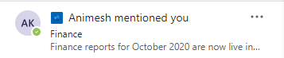

# <a name="send-activity-feed-notifications-to-users-in-microsoft-teams"></a>Отправка уведомлений веб-канала активности пользователям в Microsoft Teams

Веб-канал активности Microsoft Teams позволяет пользователям делить элементы, которые требуют внимания, уведомляя их об изменениях. Вы можете использовать API уведомлений веб-канала активности в Microsoft Graph, чтобы расширить эту функциональность для ваших приложений. Это позволяет приложениям предоставлять более богатые опытом и лучше привлекать пользователей, помогая поддерживать их в курсе изменений в средствах и рабочего процессах, которые они используют.

## <a name="understanding-the-basics-of-activity-feed-notification"></a>Основные принципы уведомлений веб-канала активности

Уведомления веб-канала активности в Microsoft Teams состоят из нескольких битов информации, отображаемой вместе, как показано на следующем изображении.


К компонентам относятся:
- Субъект, иницивший действие
- Значок, который представляет тип действия
- Причина, по которой субъект сделал действие
- Предварительный просмотр текста
- Отметка времени
- Расположение действия

В следующем примере показано, как эти компоненты предоставляют сведения об уведомлении. Этот пример является уведомлением о пользователе, упомянутом в сообществе Yammer.



## <a name="requirements-for-using-the-activity-feed-notification-apis"></a>Требования для использования API уведомлений веб-канала активности

API веб-каналов активности работают с [приложением Teams.](/microsoftteams/platform/overview) Ниже следующую следующую следующую погони за требованиями для отправки уведомлений веб-канала активности:

- Манифест приложения Teams должен иметь добавленный в раздел ИД приложения Azure `webApplicationInfo` AD. Подробные сведения [см. в схеме манифеста.](/microsoftteams/platform/resources/schema/manifest-schema)
- Типы действий должны быть объявлены в `activities` разделе. Подробные сведения [см. в схеме манифеста.](/microsoftteams/platform/resources/schema/manifest-schema)
- Приложение Teams должно быть установлено для получателя либо [](/graph/api/resources/team?preserve-view=true) лично, либо в команде или чате, [в](/graph/api/resources/chat?preserve-view=true) составе группы. Дополнительные сведения см. в [установке приложения Teams.](/graph/api/resources/teamsappinstallation?preserve-view=true)

### <a name="teams-app-manifest-changes"></a>Изменения манифеста приложения Teams

В этом разделе описываются изменения, которые необходимо добавить в манифест приложения Teams. Обратите внимание, что необходимо использовать версию манифеста [приложения Teams](/microsoftteams/platform/resources/schema/manifest-schema) или `1.7` более новую.

```json
"$schema": "https://developer.microsoft.com/json-schemas/teams/v1.7/MicrosoftTeams.schema.json",
"manifestVersion": "1.7",
````

#### <a name="webapplicationinfo-section-changes"></a>Изменения раздела webApplicationInfo

```json
"webApplicationInfo":
{
    "id": "a3111f15-658e-457c-9689-fd20fe907330",
    "resource": "https://contosoapp.com"
}
```

|Параметр|Тип|Описание|
|:---|:---|:---|
|id|string|ИД приложения Azure AD (ИД клиента).|
|resource|string|Ресурс, связанный с приложением Azure AD. Также называется URL-адресом ответа или перенаправления на портале Azure.|

> **Примечание.** Ошибка может возникнуть, если несколько приложений Teams в одной области (команда, чат или пользователь) используют одно и то же приложение Azure AD. Убедитесь, что вы используете уникальные приложения Azure AD.

#### <a name="activities-section-changes"></a>изменения раздела действий

```json
"activities":
{
  "activityTypes": [
    {
      "type": "taskCreated",
      "description": "Task Created Activity",
      "templateText": "{actor} created task {taskId} for you"
    },
    {
      "type": "approvalRequired",
      "description": "Deployment requires your approval",
      "templateText": "{actor} created a new deployment {deploymentId}"
    }
  ]
}
```

|Параметр|Тип|Описание|
|:---|:---|:---|
|type|string|Тип действия. Это должно быть уникальным в определенном манифесте.|
|description|string|Краткое описание, понятное человеку. Он будет виден в клиенте Microsoft Teams.|
|templateText|Строка|Текст шаблона уведомления об активности. Параметры можно объявить, инкапсулируя параметры в `{}` .|

>**Примечание.** `actor` — это специальный параметр, который всегда принимает имя вызываемого. В делегных вызовах `actor` это имя пользователя. В вызовах только для приложений он принимает имя приложения Teams.

### <a name="installing-the-teams-app"></a>Установка приложения Teams

Приложения Teams можно устанавливать в команде, чате или лично для пользователя, а также распространять их несколькими способами. Подробные сведения см. в [методах распространения приложений Teams.](/microsoftteams/platform/concepts/deploy-and-publish/overview) Как правило, [загрузка нео](/microsoftteams/platform/concepts/deploy-and-publish/apps-upload) боков предпочтительна в целях разработки. После разработки вы можете выбрать правильный способ распространения в зависимости от того, хотите ли вы распространять их на один или все клиенты.

Вы также можете использовать API установки приложений [Teams](/graph/api/resources/teamsappinstallation?preserve-view=true) для управления установками приложений Teams.

## <a name="sending-activity-feed-notifications-to-users"></a>Отправка уведомлений веб-канала активности пользователям

Так как приложение Teams можно установить для пользователя, в команде или в чате, уведомления также можно отправить в этих трех контекстах:

- [Отправка уведомления пользователю в чате](/graph/api/chat-sendactivitynotification)
- [Отправка уведомления пользователю в команде](/graph/api/team-sendactivitynotification)
- [Отправка уведомления пользователю](/graph/api/userteamwork-sendactivitynotification)

Подробные сведения о том, какие темы поддерживаются для каждого сценария, см. в определенных API. Настраиваемые текстовые разделы поддерживаются во всех сценариях.

### <a name="example-1-notify-a-user-about-a-task-created-in-a-chat"></a>Пример 1. Уведомление пользователя о задаче, созданной в чате

В этом примере показано, как можно отправить уведомление веб-канала активности для новой задачи, созданной в чате. В этом случае приложение Teams должно быть установлено в чате с ИД, а пользователь также должен быть частью `chatId` `569363e2-4e49-4661-87f2-16f245c5d66a` чата.

#### <a name="request"></a>Запрос
<!-- {
  "blockType": "request",
  "name": "chat_sendactivitynotification"
}
-->
``` http
POST https://graph.microsoft.com/beta/chats/{chatId}/sendActivityNotification
Content-Type: application/json

{
    "topic": {
        "source": "entityUrl",
        "value": "https://graph.microsoft.com/beta/chats/{chatId}"
    },
    "activityType": "taskCreated",
    "previewText": {
        "content": "New Task Created"
    },
    "recipient": {
        "@odata.type": "microsoft.graph.aadUserNotificationRecipient",
        "userId": "569363e2-4e49-4661-87f2-16f245c5d66a"
    },
    "templateParameters": [
        {
            "name": "taskId",
            "value": "12322"
        }
    ]
}
```

#### <a name="response"></a>Отклик
<!-- {
  "blockType": "response",
  "truncated": false
}
-->
``` http
HTTP/1.1 204 No Content
```

### <a name="example-2-notify-a-user-about-a-task-created-in-a-team"></a>Пример 2. Уведомление пользователя о задаче, созданной в команде

В этом примере показано, как можно отправить уведомление веб-канала активности для команды. В этом примере владельцу команды сообщается о новой задаче, которая требует внимания.

#### <a name="request"></a>Запрос
<!-- {
  "blockType": "request",
  "name": "team_sendactivitynotification"
}
-->
``` http
POST https://graph.microsoft.com/beta/teams/{teamId}/sendActivityNotification
Content-Type: application/json

{
    "topic": {
        "source": "entityUrl",
        "value": "https://graph.microsoft.com/beta/teams/{teamId}"
    },
    "activityType": "taskCreated",
    "previewText": {
        "content": "New Task Created"
    },
    "recipient": {
        "@odata.type": "microsoft.graph.aadUserNotificationRecipient",
        "userId": "569363e2-4e49-4661-87f2-16f245c5d66a"
    },
    "templateParameters": [
        {
            "name": "taskId",
            "value": "12322"
        }
    ]
}
```

#### <a name="response"></a>Отклик
<!-- {
  "blockType": "response",
  "truncated": false
}
-->
``` http
HTTP/1.1 204 No Content
```

### <a name="example-3-notify-a-user-about-an-event-using-a-custom-topic"></a>Пример 3. Уведомление пользователя о событии с помощью настраиваемой темы

Как видно из предыдущих примеров, вы можете ссылаться на различные аспекты команды или чата. Тем не менее, если вы хотите связать аспект, который не является частью команды или не представлен Microsoft Graph, или если вы хотите настроить имя, вы можете установить источник и передать для него пользовательское `topic` `text` значение. Кроме того, при использовании источника в `webUrl` качестве `topic` `text` .

В примере уведомления Yammer, показанного ранее, используется настраиваемый раздел, так как ресурсы Yammer не поддерживаются Microsoft Graph.

> **Примечание.** `webUrl` должен начинаться с домена Microsoft Teams (teams.microsoft.com например).

#### <a name="request"></a>Запрос
<!-- {
  "blockType": "request",
  "name": "team_sendactivitynotification"
}
-->
``` http
POST https://graph.microsoft.com/beta/teams/{teamId}/sendActivityNotification
Content-Type: application/json

{
    "topic": {
        "source": "text",
        "value": "Deployment Approvals Channel",
        "webUrl": "https://teams.microsoft.com/l/message/19:448cfd2ac2a7490a9084a9ed14cttr78c@thread.skype/1605223780000?tenantId=c8b1bf45-3834-4ecf-971a-b4c755ee677d&groupId=d4c2a937-f097-435a-bc91-5c1683ca7245&parentMessageId=1605223771864&teamName=Approvals&channelName=Azure%20DevOps&createdTime=1605223780000"
    },
    "activityType": "approvalRequired",
    "previewText": {
        "content": "New deployment requires your approval"
    },
    "recipient": {
        "@odata.type": "Microsoft.Teams.GraphSvc.aadUserNotificationRecipient",
        "userId": "569363e2-4e49-4661-87f2-16f245c5d66a"
    },
    "templateParameters": [
        {
            "name": "deploymentId",
            "value": "6788662"
        }
    ]
}
```

#### <a name="response"></a>Отклик
<!-- {
  "blockType": "response",
  "truncated": false
}
-->
``` http
HTTP/1.1 204 No Content
```

## <a name="customizing-how-the-notifications-alert-you"></a>Настройка оповещения уведомлений

Пользователи Microsoft Teams могут настраивать уведомления, которые они видят в веб-канале, в качестве баннера и так далее. Уведомления, созданные с помощью API веб-каналов активности, также можно настроить. Пользователи могут выбрать, как они будут уведомлены с помощью параметров в Microsoft Teams. Приложения Teams появятся в списке для выбора пользователем, как показано на следующем снимке экрана.


Пользователи могут **нажать** кнопку "Изменить" рядом с приложением и настроить уведомления, как показано в следующем примере. Отображается `description` поле в манифесте приложения Teams.


## <a name="faqs"></a>Вопросы и ответы

### <a name="who-needs-to-install-the-teams-app"></a>Кому необходимо установить приложение Teams?

У целевого пользователя должно быть установлено приложение Teams, которое отправляет уведомления.

### <a name="can-a-user-send-notifications-to-themselves"></a>Может ли пользователь отправлять уведомления себе?

Нет, пользователь не может отправлять уведомления себе. В этом сценарии используйте разрешения приложений.

### <a name="can-a-teams-app-control-how-the-notifications-are-shown-to-the-user"></a>Может ли приложение Teams управлять тем, как уведомления показываются пользователю?

Нет, изменять параметры уведомлений могут только пользователи.

### <a name="i-installed-my-app-why-dont-i-see-notification-settings-under-the-user-account"></a>Я установил свое приложение, почему я не вижу параметры уведомлений под учетной записью пользователя?

Параметры отображаются после того, как приложение Teams отправляет первое уведомление. Это уменьшает количество параметров, которые видят пользователи.

### <a name="i-started-getting-a-409-conflict-error-how-do-i-resolve-it"></a>Я начал получать ошибку 409 (конфликт), как ее устранить?

`Conflict` ошибки в основном возникают, когда несколько приложений Teams, установленных в одной области (команда, чат, пользователь и так далее), имеют одинаковый appId Azure AD в разделе `webApplicationInfo` манифеста. В этом случае вы получите такую ошибку, как `Found multiple applications with the same Azure AD App ID 'Your AzureAD AppId'.` . Убедитесь, что вы используете уникальные приложения Azure AD для уникальных приложений Teams. Обратите внимание, что одно и то же приложение Teams может быть установлено в нескольких сферах (например, для команды и пользователя).


