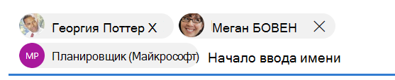

# <a name="people-picker-component-in-the-microsoft-graph-toolkit"></a>Компонент "Выбор людей" в Microsoft Graph Toolkit

Веб-компонент `mgt-people-picker` можно использовать для поиска людей и (или) групп. По умолчанию компонент ищет всех людей и пользователей в организации, но вы можете изменить его поведение, чтобы также искать группы или только группы. Вы также можете отфильтровать поиск по определенной группе. Кроме того, вы можете разрешить пользователю вводить и выбирать любой адрес электронной почты.

## <a name="example"></a>Пример

В примере ниже показан компонент `mgt-people-picker`. Начните поиск имени, чтобы отобразить результаты, и используйте редактор кода, чтобы увидеть, как [свойства](#properties) изменяют поведение компонента.

<iframe src="https://mgt.dev/iframe.html?id=components-mgt-people-picker--people-picker&source=docs" height="450"></iframe>

[Открыть этот пример в mgt.dev](https://mgt.dev/?path=/story/components-mgt-people-picker--people-picker&source=docs)

## <a name="properties"></a>Свойства

По умолчанию компонент `mgt-people-picker` извлекает людей из конечных точек `/me/people` и `/users`. Используйте следующие атрибуты, чтобы изменить его поведение.

| Атрибут | Свойство | Описание                                                                                                                                                                            |
| -------- | --------- | -------------------------------------------------------------------------------------------------------------------------------------------------------------------------------------- |
| show-max | showMax   | Числовое значение, указывающее максимальное количество отображаемых людей. Значение по умолчанию — 6.                                                                                             |
| group-id    | groupId     | Значение строки, принадлежащее определенной группе Microsoft Graph для дальнейшей фильтрации результатов поиска.                                                                            |
| transitive-search     | transitiveSearch      | Логическое значение для выполнения транзитивного поиска, возвращающего плоский список всех вложенных элементов. По умолчанию транзитивный поиск не используется.|
| type     | type      | Тип объектов, которые необходимо найти. Доступные варианты — `person`, `group`, `any`. Значение по умолчанию — `person`. Этот атрибут не оказывает влияния, если задано свойство `group-id`.         
| тип пользователя     | userType      | Тип пользователя, для поиска. Доступные параметры: `any` для пользователей организации или для `user` `contact` контактов. Значение по умолчанию — `any`. |
| group-type     | groupType      | Тип группы, которую необходимо найти. Доступные варианты — `unified`, `security`, `mailenabledsecurity`, `distribution`, `any`. Значение по умолчанию — `any`. Этот атрибут не оказывает влияния, если для свойства `type` задано значение `person`.  |
| selected-people  | selectedPeople     | Массив выбранных людей. Установите это значение, чтобы выбрать людей программным образом.|
| people   | people    | Массив людей, найденных и отображенных в результатах поиска. |
| placeholder   | placeholder    | Текст по умолчанию, который объясняет, как использовать компонент. Значение по умолчанию — `Start typing a name`.
| default-selected-user-ids | defaultSelectedUserIds | При предоставлении строки разделенных запятой ИД пользователей Microsoft Graph, компонент отображает соответствующих пользователей как выбранных после инициализации.
| по умолчанию выбранные группы-ids | defaultSelectedGroupIds | Как и в случае с ids, выбранными по умолчанию, при выделении строки разделенных запятой ID microsoft Graph, компонент предоставляет соответствующие группы, выбранные после инициализации.
| selection-mode | selectionMode | Используется, чтобы указать следует ли разрешить выбирать несколько элементов (пользователей или групп) или только один элемент. Доступные варианты — `single`, `multiple`. Значение по умолчанию — `multiple`.
| отключено | отключено | Задает отключение выборщика людей. При отключении пользователь не может искать или выбирать людей.
| allow-any-email | allowAnyEmail | Указывает, может ли выборщик людей принимать адреса электронной почты без выбора человека. Значение по умолчанию — `false`. Когда вы закончите вводить адрес электронной почты, вы можете нажать запятую (), запятую (), вкладку или ввести `,` `;` клавиши, чтобы добавить его.

Ниже приведен пример `show-max`.

```html
<mgt-people-picker show-max="4"> </mgt-people-picker>
```

## <a name="selected-people"></a>Выбранные люди

В разделе "Выбранные люди" компонента отображаются люди, выбранные разработчиком или пользователем. 



Вы можете заполнить данные о выбранных людях, выполнив одно из следующих действий.

- Задайте свойство `selectedPeople` напрямую, как показано в примере ниже.  

    ```javascript
    // personObject = User or Person from Microsoft Graph
    document.querySelector('mgt-people-picker').selectedPeople.push(personObject);
    ```

- Используйте метод `selectUsersById()`, принимающий массив [ИД пользователей](/graph/api/resources/users) Microsoft Graph, чтобы найти сведения о связанных пользователях для выбора.

     >**Примечание.** Если пользователь не найден по `id`, данные для этого `id` не будут отображаться.

    ```javascript
    // id = Microsoft graph User "id"
    document.querySelector('mgt-people-picker').selectUsersById(["id","id"])
    ```

## <a name="events"></a>События

Из компонента инициируются следующие события.

| Событие | Описание |
| --- | --- |
| `selectionChanged` | Пользователь добавил или удалил человека из списка выбранных людей.|

## <a name="css-custom-properties"></a>Настраиваемые свойства CSS

Компонент `mgt-people-picker` определяет следующие настраиваемые свойства CSS.

```css
mgt-people-picker {
    --input-border: 2px rgba(255, 255, 255, 0.5) solid; /* sets all input area border */

      /* OR individual input border sides */
    --input-border-bottom: 2px rgba(255, 255, 255, 0.5) solid;
    --input-border-right: 2px rgba(255, 255, 255, 0.5) solid;
    --input-border-left: 2px rgba(255, 255, 255, 0.5) solid;
    --input-border-top: 2px rgba(255, 255, 255, 0.5) solid;

    --input-background-color: #1f1f1f; /* input area background color */
    --input-border-color--hover: #008394; /* input area border hover color */
    --input-border-color--focus: #0f78d4; /* input area border focus color */

    --dropdown-background-color: #1f1f1f; /* selection area background color */
    --dropdown-item-hover-background: #333d47; /* person background color on hover */
    
    --selected-person-background-color: #f1f1f1; /* person item background color */
    
    --color: white; /* input area border focus color */
    --placeholder-color: #f1f1f1; /* placeholder text color */
    --placeholder-color--focus: rgba(255, 255, 255, 0.8); /* placeholder text focus color */
}
```

## <a name="templates"></a>Шаблоны

 Компонент `mgt-people-picker` поддерживает несколько [шаблонов](../customize-components/templates.md), позволяющих заменить его определенные части. Чтобы указать шаблон, добавьте элемент `<template>` в компонент и присвойте параметру `data-type` одно из следующих значений.

| Тип данных | Контекст данных | Описание |
| --- | --- | --- |
| default | null: нет данных | Шаблон, используемый для переопределения отображения всего компонента.
| loading | null: нет данных | Шаблон, используемый для отображения состояния средства выбора при выполнении запроса к Microsoft Graph. |
| error | null: нет данных | Шаблон, используемый в том случае, если поиск не возвращает пользователей. |
| no-data | null: нет данных | Альтернативный шаблон, используемый в том случае, если поиск не возвращает пользователей. |
| selected-person | person: объект сведений о пользователе | Шаблон, отображающий выбранных людей. |
| person | person: объект сведений о пользователе | Шаблон, отображающий людей в раскрывающемся списке. |

В следующих примерах показано, как использовать шаблон `error`.

```html
<mgt-people-picker>
  <template data-type="error">
    <p>Sorry, no people were found</p>
  </template>
</mgt-people-picker>
```

## <a name="microsoft-graph-permissions"></a>Разрешения Microsoft Graph

Этот компонент использует следующие API и разрешения Microsoft Graph.

| Конфигурация | Разрешение | API
| --- | ---------- | ------- |
| `group-id` set | People.Read, User.Read.All | [/groups/\${groupId}/members](/graph/api/group-list-members) |
| `type` установлено `Person` или `any` | People.Read | [/me/people](/graph/api/user-list-people) |
| `type`настройка или `Group` поиск пользователей и настройка `type` или `Group``any` | Group.Read.All | [/groups](/graph/api/group-list) |
| `default-selected-user-ids` set | User.ReadBasic.All | [/users](/graph/api/user-list) |
| поиск пользователей и `type` настройка `Person` или `any` | People.Read, User.ReadBasic.All | [/me/people](/graph/api/user-list-people), [/users](/graph/api/user-list) |

## <a name="authentication"></a>Проверка подлинности

В элементе управления используется глобальный поставщик проверки подлинности, описанный в [документации по проверке подлинности](../providers/providers.md).

## <a name="cache"></a>Кэш

|Хранилище объектов|Кэшные данные|Примечания|
|---------|-----------|-------|
|`groups`|Список групп|Используется, `type` когда установлено `PersonType.group`|
|`people`|List of people|Используется, `type` когда установлено `PersonType.person` или `PersonType.any`|
|`users`|Список пользователей|Используется при `groupId` указании|

Дополнительные сведения о настройке кэша см. в [caching.](../customize-components/cache.md)

## <a name="extend-for-more-control"></a>Расширение для дополнительного управления

В более сложных сценариях или настраиваемых пользовательских интерфейсах этот компонент предоставляет несколько методов `protected render*` для переопределения в расширениях компонента.

| Метод | Описание |
| - | - |
| renderInput | Отображает поле ввода. |
| renderSelectedPeople | Отображает маркеры выбранных людей. |
| renderSelectedPerson | Отображает маркер одного пользователя. |
| renderFlyout | Отображает хром всплывающего окна. |
| renderFlyoutContent | Отображает соответствующее состояние во всплывающем окне результатов. |
| renderLoading | Отображает состояние загрузки. |
| renderNoData | Отображает состояние, если для поискового запроса не найдено результатов. |
| renderSearchResults | Отображает список результатов поиска. |
| renderPersonResult | Отображает результаты поиска для одного пользователя. |
