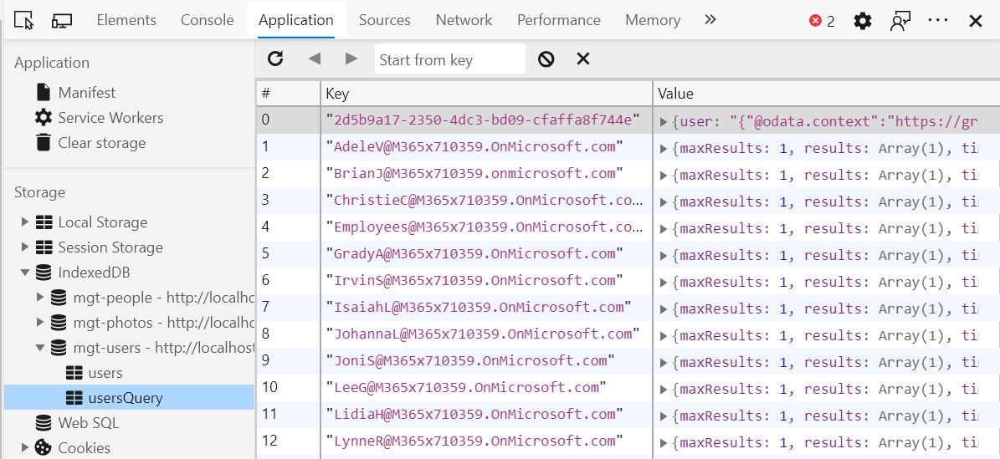

# <a name="microsoft-graph-toolkit-caching"></a>Кэширование Microsoft Graph Toolkit

Microsoft Graph Toolkit поддерживает кэширование выбранных вызовов API Microsoft Graph. Вызовы кэшироваться для каждого объекта, например людей, контактов, фотографий. Это позволяет одному компоненту получать данные и другие компоненты для повторного использования без вызова Microsoft Graph.

> [!TIP]
> Дополнительные сведения о том, какие объекты кэшются каждым компонентом, см. в документации компонента.

Базы данных, созданные mgt для кэшинга, префиксизются `mgt-` с . Данные для каждой сущности хранятся в отдельном хранилище объектов. Чтобы проверить кэш, используйте вкладку **Application** в панели разработчиков (средства F12) — в разделе **Хранение** нажмите на вкладку **IndexedDB.** 



## <a name="cache-configuration"></a>Конфигурация кэша

Вы можете читать и записывать параметры кэша с помощью объекта статического класса `CacheService.config`. Он форматируется, как показано.

```TypeScript
let config = {
  defaultInvalidationPeriod: number,
  isEnabled: boolean,
  people: {
    invalidationPeriod: number,
    isEnabled: boolean
  },
  photos: {
    invalidationPeriod: number,
    isEnabled: boolean
  },
  users: {
    invalidationPeriod: number,
    isEnabled: boolean
  },
  presence: {
    invalidationPeriod: number,
    isEnabled: boolean
  },
  groups: {
    invalidationPeriod: number,
    isEnabled: boolean
  },
  response: {
    invalidationPeriod: number,
    isEnabled: boolean
  }
};
```

Для отдельных периодов недействительности кэша в объекте конфигурации по умолчанию задано значение `null`, а общее значение по умолчанию для `defaultInvalidationPeriod` составляет 3 600 000 мс (60 минут). Любое значение, переданное в `config.x.invalidationPeriod`, переопределяет `defaultInvalidationPeriod`.

Единственным исключением является хранилище присутствия со значением по умолчанию 300 000 мс, или 5 минут.

### <a name="examples"></a>Примеры

Чтобы отключить хранилище, просто задайте для `isEnabled` в свойствах конфигурации хранилища значение false:
```JavaScript
import { CacheService } from '@microsoft/mgt';

CacheService.config.users.isEnabled = false;
```
Отключение кэша **не** очищает кэш.

Аналогичным образом можно изменить период недействительности:

```JavaScript
import { CacheService } from '@microsoft/mgt';

CacheService.config.users.invalidationPeriod = 1800000;
```

## <a name="clearing-the-cache"></a>Очистка кэша

Кэш автоматически очищается, когда пользователь выходит. Его также можно очистить вручную.

Чтобы очистить все хранилища в кэше, обслуживаемые CacheService, используется метод `clearCaches()` класса `CacheService`.

```JavaScript
import { CacheService } from '@microsoft/mgt';

CacheService.clearCaches();
```

## <a name="creating-your-own-cache-stores"></a>Создание собственных хранилищ кэша

Если вы хотите создать и заполнить собственные хранилища кэша для настраиваемых компонентов, можно использовать статический класс `CacheService`.

```JavaScript
CacheService.getCache(schema: CacheSchema, storeName: String);
```
> **Примечание.** Объект `storeName`, на который вы ссылаетесь в вызове `getCache()`, должен соответствовать одному из хранилищ, перечисленных в объекте `CacheSchema`.

Объект `CacheSchema` является словарем с парами "ключ-значение".

```TypeScript
import { CacheSchema } from '@microsoft/mgt';
const cacheSchema: CacheSchema = {
  name: string,
  stores: {
    store1: {},
    store2: {},
    ...
  },
  version: number
};
```

В примере ниже показана реализация кэша.

```TypeScript
import { CacheItem, CacheSchema, CacheService, CacheStore } from '@microsoft/mgt';

const cacheSchema: CacheSchema = {
  name: 'users',
  stores: {
    users: {},
    usersQuery: {}
  },
  version: 1
};

interface CacheUser extends CacheItem {
  user?: string;
}

// retrieves invalidation time from cache config
const getUserInvalidationTime = (): number =>
  CacheService.config.users.invalidationPeriod || CacheService.config.defaultInvalidationPeriod;

// checks for if cache is enabled
const usersCacheEnabled = (): boolean => CacheService.config.users.isEnabled && CacheService.config.isEnabled;

// declare the desired cache store
let cache: CacheStore<CacheUser>

// check if the cache is enabled
if (usersCacheEnabled()) {
  cache = CacheService.getCache<CacheUser>(cacheSchema, 'users');
  const user = await cache.getValue(query);

  // check if an item is retrieved, and if it's not expired
  if (user && getUserInvalidationTime() > Date.now() - user.timeCached) {
    return JSON.parse(user.user);
  }
}

// graph call
const graphRes = graph
  .api('me')
  .middlewareOptions(prepScopes('user.read'))
  .get();

// store graph result into the cache if cache is enabled
if (usersCacheEnabled()) {
  cache.putValue(userId, { user: JSON.stringify(graphRes) });
}
```
