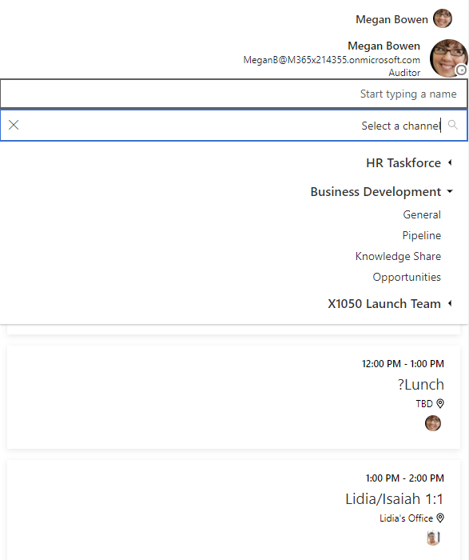

# <a name="display-microsoft-graph-toolkit-components-right-to-left-rtl"></a>Отображение компонентов Microsoft Graph Toolkit справа налево

Компоненты Microsoft Graph Toolkit поддерживают двунаправленные исправления для наборов знаков с написанием справа налево.

Чтобы изменить направление для всех компонентов на странице, задайте для атрибута `dir` в документе `html` или теге `body` значение `rtl`, как показано в следующих примерах.

```html
<body dir="rtl"></body>
```

или

```html
<html dir="rtl"></html>
```


