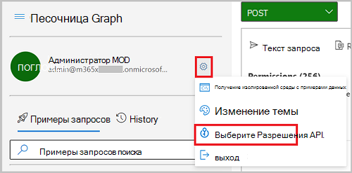

# <a name="tutorial-manage-access-to-resources-in-active-directory-entitlement-management-using-microsoft-graph-apis"></a>Руководство. Управление доступом к ресурсам в управлении правами Active Directory с помощью API Graph Microsoft

Управление доступом ко всем ресурсам, которые необходимы сотрудникам, таким как группы, приложения и сайты, является важной функцией для организаций. Вы хотите предоставить сотрудникам необходимый уровень доступа, чтобы они могли быть продуктивными, и удалить их доступ, когда он больше не нужен. [Azure Active Directory управления правами Azure AD](/azure/active-directory/governance/entitlement-management-overview) с помощью API microsoft Graph позволяет управлять этим типом доступа.

В этом руководстве вам было предложено разработать код для создания пакета ресурсов для маркетинговой кампании, которую внутренние пользователи могут запрашивать самостоятельно. Запросы не требуют утверждения, а срок доступа пользователя истекает через 30 дней. В этом руководстве ресурсы маркетинговой кампании являются только членством в одной группе, но это может быть коллекция групп, приложений или веб-сайтов SharePoint Online.

>**Примечание:** Объекты отклика, показанные в этом руководстве, могут быть сокращены для чтения. 

## <a name="prerequisites"></a>Предварительные требования

Чтобы успешно завершить этот учебник, убедитесь, что у вас есть необходимые предпосылки:
- Управление правами Azure AD требует определенных лицензий. Дополнительные сведения см. в [дополнительных сведениях о требованиях к лицензии.](/azure/active-directory/governance/entitlement-management-overview#license-requirements) В вашем клиенте требуются следующие лицензии:
    - Azure AD Premium P2
    - Enterprise Mobility + Security E5 (EMS)
- В этом руководстве предполагается, что вы используете песочницу Microsoft Graph, но вы можете использовать Postman или создать собственное клиентское приложение, чтобы вызывать Microsoft Graph. Чтобы вызвать API Microsoft Graph в этом руководстве, используйте учетную запись с ролью глобального администратора и соответствующими разрешениями. Для этого руководства необходимы `User.ReadWrite.All` разрешения `Group.ReadWrite.All` , и `EntitlementManagement.ReadWrite.All` делегированная. Чтобы настроить разрешения в песочнице Microsoft Graph, выполните следующие действия.
    1. Запустите [песочницу Microsoft Graph](https://developer.microsoft.com/graph/graph-explorer).
    2. Выберите вариант **Вход с помощью учетной записи Майкрософт** и войдите, используя учетную запись глобального администратора Azure AD. После успешного входа вы увидите данные учетной записи пользователя на панели слева.
    3. Щелкните значок параметров справа от сведений об учетной записи пользователя и нажмите **Выбор разрешений**.

        
        
    4. Прокрутите список разрешений до разрешений, расширите `Group` **Группу (2),** выберите **разрешение Group.ReadWrite.All.** Прокрутите далее список разрешений до разрешений, расширите пользователь `User` **(8)** и выберите **разрешение User.ReadWrite.All.**

        
    
    5. Нажмите **Согласие** и выберите **Принять**, чтобы согласиться принять разрешения. Вам не нужно предоставлять согласие от имени организации для этих разрешений.
    6. Поиск `EntitlementManagement` разрешений, расширение **EntitlementManagement (2),** выберите **разрешение Entitlement.ReadWrite.All,** а затем выберите **Согласие**. Так как это разрешение требует согласия администратора и необходимо учетной записи пользователя, которую вы создаете в этом учебнике, необходимо выбрать Согласие от имени **вашей организации.**

        

    7. Выберите **Accept,** чтобы принять согласие на разрешения.

## <a name="step-1-create-a-user-account-and-a-group"></a>Шаг 1. Создание учетной записи пользователя и группы

На этом этапе в  каталоге создается группа маркетинговых ресурсов, которая является целевым ресурсом для управления правами. Вы также создаете учетную запись пользователя, настроенную как внутренний запросчик.

### <a name="create-a-user-account"></a>Создание учетной записи пользователя

В этом руководстве создается учетная запись пользователя, которая используется для запроса доступа к ресурсам пакета доступа. Когда вы делаете эти вызовы, `contoso.onmicrosoft.com` измените доменное имя клиента. Информацию о клиенте можно найти на странице обзора в Azure Active Directory. Зафиксировать значение **свойства id,** которое возвращается для использования позже в учебнике.

#### <a name="request"></a>Запрос

``` http
POST https://graph.microsoft.com/v1.0/users
Content-type: application/json

{
  "accountEnabled":true,
  "displayName":"Requestor1",
  "mailNickname":"Requestor1",
  "userPrincipalName":"Requestor1@contoso.onmicrosoft.com",
  "passwordProfile": {
    "forceChangePasswordNextSignIn":true,
    "password":"Contoso1234"
  }
}
```

#### <a name="response"></a>Отклик

```http
{
  "@odata.context": "https://graph.microsoft.com/v1.0/$metadata#users/$entity",
  "id": "007d1c7e-7fa8-4e33-b678-5e437acdcddc",
  "deletedDateTime": null,
  "accountEnabled": true,
  "ageGroup": null,
  "businessPhones": [],
  "city": null,
  "createdDateTime": null,
  "creationType": null,
  "companyName": null,
  "consentProvidedForMinor": null,
  "country": null,
  "department": null,
  "displayName": "Requestor1",
  "employeeId": null,
  "faxNumber": null,
  "givenName": null,
  "imAddresses": [],
  "infoCatalogs": [],
  "isResourceAccount": null,
  "jobTitle": null,
  "legalAgeGroupClassification": null,
  "mail": null,
  "mailNickname": "Requestor1",
}
```

### <a name="create-a-group"></a>Создание группы

В этом руководстве создается группа маркетинговых **ресурсов,** которая является целевым ресурсом для управления правами. Можно использовать существующую группу, если она уже есть. Запись значения свойства **id,** которое возвращается для использования позже в этом руководстве. 

#### <a name="request"></a>Запрос

```http
POST https://graph.microsoft.com/v1.0/groups
Content-type: application/json

{
  "description":"Marketing group",
  "displayName":"Marketing resources",
  "mailEnabled":false,
  "mailNickname":"markres",
  "securityEnabled":true
}
```

#### <a name="response"></a>Отклик

```http
{
  "@odata.context": "https://graph.microsoft.com/v1.0/$metadata#groups/$entity",
  "id": "e93e24d1-2b65-4a6c-a1dd-654a12225487",
  "deletedDateTime": null,
  "classification": null,
  "createdDateTime": "2020-06-24T16:47:37Z",
  "createdByAppId": "de8bc8b5-d9f9-48b1-a8ad-b748da725064",
  "description": "Marketing group",
  "displayName": "Marketing resources",
  "expirationDateTime": null,
  "groupTypes": [],
  "infoCatalogs": [],
  "isAssignableToRole": null,
  "mail": null,
  "mailEnabled": false,
  "mailNickname": "markres"
}
```

## <a name="step-2-add-resources-to-a-catalog-and-create-an-access-package"></a>Шаг 2. Добавление ресурсов в каталог и создание пакета доступа

Пакет *доступа —* это набор ресурсов, необходимых команде или проекту и управляемых политиками. Пакеты доступа определяются в контейнерах, называемых каталогами. Каталоги могут ссылаться на ресурсы, такие как группы, приложения и сайты, которые используются в пакете доступа. На этом этапе создается пакет доступа **к маркетинговой** кампании в общем каталоге. Если у вас другой каталог, используйте его имя в следующем разделе.

### <a name="get-the-catalog-identifier"></a>Получить идентификатор каталога

Чтобы добавить ресурсы в каталог, сначала необходимо получить его идентификатор. Если вы используете общий каталог, запустите следующий запрос, чтобы получить его идентификатор. Если используется другой калалог, измените значение фильтра в запросе на имя каталога. Запись значения свойства **id,** которое возвращается для использования позже в этом руководстве.

#### <a name="request"></a>Запрос

```http
GET https://graph.microsoft.com/beta/identityGovernance/entitlementManagement/accessPackageCatalogs?$filter=(displayName eq 'General')
```

#### <a name="response"></a>Отклик

```http
{
  "@odata.context": "https://graph.microsoft.com/beta/$metadata#accessPackageCatalogs",
  "value": [ 
    {
      "id": "cec5d6ab-c75d-47c0-9c1c-92e89f66e384",
      "displayName": "General",
      "description": "Built-in catalog.",
      "catalogType": "ServiceDefault",
      "catalogStatus": "Published",
      "isExternallyVisible": true,
      "createdBy": "Azure AD",
      "createdDateTime": "2020-05-30T10:58:05.363Z",
      "modifiedBy": "Azure AD",
      "modifiedDateTime": "2020-05-30T10:58:05.363Z"
    }
  ]
}
```

Ответ должен содержать только каталог, имя которого вы предоставили в запросе. Если не возвращаются значения, проверьте правильность имени каталога перед началом работы.

### <a name="add-the-group-to-the-catalog"></a>Добавление группы в каталог

Чтобы добавить созданную группу в каталог, укайте следующие значения свойств:
- **catalogId** — **id** используемого каталога
- **displayName** — имя группы
- **описание** — описание группы
- **originId** — **id** созданной группы

#### <a name="request"></a>Запрос

```http
POST https://graph.microsoft.com/beta/identityGovernance/entitlementManagement/accessPackageResourceRequests
Content-type: application/json

{
  "catalogId":"cec5d6ab-c75d-47c0-9c1c-92e89f66e384",
  "requestType": "AdminAdd",
  "justification": "",
  "accessPackageResource": {
    "displayName": "Marketing resources",
    "description": "Marketing group",
    "resourceType": "AadGroup",
    "originId": "e93e24d1-2b65-4a6c-a1dd-654a12225487",
    "originSystem": "AadGroup"
  }
}
```

#### <a name="response"></a>Отклик

```http
{
  "@odata.context": "https://graph.microsoft.com/beta/$metadata#identityGovernance/entitlementManagement/accessPackageResourceRequests/$entity",
  "catalogId": "cec5d6ab-c75d-47c0-9c1c-92e89f66e384",
  "executeImmediately": false,
  "id": "44e521e0-fb6b-4d5e-a282-e7e68dc59493",
  "requestType": "AdminAdd",
  "requestState": "Delivered",
  "requestStatus": "Fulfilled",
  "isValidationOnly": false,
  "expirationDateTime": null,
  "justification": ""
}
```

### <a name="get-catalog-resources"></a>Получить ресурсы каталога

В последующих действиях в этом руководстве вам потребуется **id,** который был назначен групповому ресурсу в каталоге. Этот идентификатор, который представляет группу в качестве ресурса в каталоге, отличается от идентификатора самой группы в Microsoft Graph. Это потому, что в каталоге могут быть ресурсы, которые не представлены в Microsoft Graph.

В запросе укате **id** используемого каталога. Запись значения свойства **id** для ресурса каталога группы.

#### <a name="request"></a>Запрос

```http
GET https://graph.microsoft.com/beta/identityGovernance/entitlementManagement/accessPackageCatalogs/cec5d6ab-c75d-47c0-9c1c-92e89f66e384/accessPackageResources?$filter=(displayName eq 'Marketing resources')
```

#### <a name="response"></a>Отклик

```http
{
  "@odata.context": "https://graph.microsoft.com/beta/$metadata#accessPackageResources",
  "value": [
    {
      "id": "4a1e21c5-8a76-4578-acb1-641160e076e8",
      "displayName": "Marketing resources",
      "description": "Marketing group",
      "url": "https://account.activedirectory.windowsazure.com/r?tenantId=d3030981-8fb9-4919-9980-5580caeddd75#/manageMembership?objectType=Group&objectId=e93e24d1-2b65-4a6c-a1dd-654a12225487",
      "resourceType": "Security Group",
      "originId": "e93e24d1-2b65-4a6c-a1dd-654a12225487",
      "originSystem": "AadGroup",
      "isPendingOnboarding": false,
      "addedBy": "admin@contoso.onmicrosoft.com",
      "addedOn": "2020-08-21T19:27:29.967Z"
    }
  ]
}
```

### <a name="get-resources-roles"></a>Получить роли ресурсов

Пакет доступа назначает пользователям роли ресурса. Типичная роль группы — это роль участника. Другие ресурсы, например SharePoint сайты и приложения в Интернете, могут иметь много ролей. Типичная роль группы, используемой в пакете доступа, — это роль участника. Роль участника потребуется при добавлении роли ресурса в пакет доступа позже в этом учебнике. 

В запросе используйте **id** каталога и **id** группового ресурса в каталоге, который вы записали, чтобы получить **originId** роли ресурса Member. Зафиксировать значение **свойства originId,** используемого позже в этом руководстве.

#### <a name="request"></a>Запрос

```http
GET https://graph.microsoft.com/beta/identityGovernance/entitlementManagement/accessPackageCatalogs/cec5d6ab-c75d-47c0-9c1c-92e89f66e384/accessPackageResourceRoles?$filter=(originSystem+eq+%27AadGroup%27+and+accessPackageResource/id+eq+%274a1e21c5-8a76-4578-acb1-641160e076e8%27+and+displayName+eq+%27Member%27)&$expand=accessPackageResource
```

#### <a name="response"></a>Отклик

```http
{
  "@odata.context": "https://graph.microsoft.com/beta/$metadata#identityGovernance/entitlementManagement/accessPackageCatalogs('ede67938-cda7-4127-a9ca-7c7bf86a19b7')/accessPackageResourceRoles(accessPackageResource())",
  "value": [
    {
      "id": "00000000-0000-0000-0000-000000000000",
      "displayName": "Member",
      "description": null,
      "originSystem": "AadGroup",
      "originId": "Member_e93e24d1-2b65-4a6c-a1dd-654a12225487",
      "accessPackageResource@odata.context": "https://graph.microsoft.com/beta/$metadata#identityGovernance/entitlementManagement/accessPackageCatalogs('cec5d6ab-c75d-47c0-9c1c-92e89f66e384')/accessPackageResourceRoles('00000000-0000-0000-0000-000000000000')/accessPackageResource/$entity",
      "accessPackageResource": {
        "id": "4a1e21c5-8a76-4578-acb1-641160e076e8",
        "displayName": "Marketing resources",
        "description": "Marketing group",
        "url": "https://account.activedirectory.windowsazure.com/r?tenantId=d3030981-8fb9-4919-9980-5580caeddd75#/manageMembership?objectType=Group&objectId=e93e24d1-2b65-4a6c-a1dd-654a12225487",
        "resourceType": "Security Group",
        "originId": "e93e24d1-2b65-4a6c-a1dd-654a12225487",
        "originSystem": "AadGroup",
        "isPendingOnboarding": false,
        "addedBy": "admin@contoso.onmicrosoft.com",
        "addedOn": "2020-06-26T17:13:23.723Z",
        "accessPackageResourceScopes@odata.context": "https://graph.microsoft.com/beta/$metadata#identityGovernance/entitlementManagement/accessPackageCatalogs('cec5d6ab-c75d-47c0-9c1c-92e89f66e384')/accessPackageResourceRoles('00000000-0000-0000-0000-000000000000')/accessPackageResource/accessPackageResourceScopes",
        "accessPackageResourceScopes": []
      }
    }
  ]
}
```

В случае успешной работы возвращается одно значение, которое представляет роль участника этой группы. Если роли не возвращаются, проверьте значения **id** каталога и ресурса пакета доступа.

### <a name="create-the-access-package"></a>Создание пакета доступа

На этом этапе у вас есть каталог с групповым ресурсом, и вы знаете, что в пакете доступа используется роль ресурса участника группы. Следующий шаг — создание пакета доступа. После получения пакета доступа можно добавить в него роль ресурса и создать политику, которая позволяет пользователям запрашивать доступ к этой роли ресурсов. Для создания пакета доступа используется **id** каталога, записанный ранее. Запись **id пакета** доступа, который можно использовать позже в этом руководстве.

#### <a name="request"></a>Запрос

```http
POST https://graph.microsoft.com/beta/identityGovernance/entitlementManagement/accessPackages
Content-type: application/json

{
  "catalogId": "cec5d6ab-c75d-47c0-9c1c-92e89f66e384",
  "displayName": "Marketing Campaign",
  "description": "Access to resources for the campaign"
}
```

#### <a name="response"></a>Отклик

```http
{
  "@odata.context": "https://graph.microsoft.com/beta/$metadata#identityGovernance/entitlementManagement/accessPackages/$entity",
  "id": "88203d16-0e31-41d4-87b2-dd402f1435e9",
  "catalogId": "cec5d6ab-c75d-47c0-9c1c-92e89f66e384",
  "displayName": "Marketing Campaign",
  "description": "Access to resources for the campaign",
  "isHidden": false,
  "isRoleScopesVisible": false,
  "createdBy": "admin@contoso.onmicrosoft.com",
  "createdDateTime": "2020-08-21T19:45:33.2042281Z",
  "modifiedBy": "admin@contoso.onmicrosoft.com",
  "modifiedDateTime": "2020-08-21T19:45:33.2042281Z"
}
```

### <a name="add-a-resource-role-to-the-access-package"></a>Добавление роли ресурса в пакет доступа

Добавьте роль Участника группового ресурса в пакет доступа. В запросе укад. **id** пакета доступа. В теле запроса укажи **id** ресурса группового каталога для accessPackageResource и укажи **originId** роли Member, которую вы ранее записывали.

#### <a name="request"></a>Запрос

```http
POST https://graph.microsoft.com/beta/identityGovernance/entitlementManagement/accessPackages/88203d16-0e31-41d4-87b2-dd402f1435e9/accessPackageResourceRoleScopes
Content-type: application/json

{
  "accessPackageResourceRole": {
    "originId":"Member_e93e24d1-2b65-4a6c-a1dd-654a12225487",
    "displayName":"Member",
    "originSystem":"AadGroup",
    "accessPackageResource": {
      "id":"4a1e21c5-8a76-4578-acb1-641160e076e8","resourceType":"Security Group",  
      "originId":"e93e24d1-2b65-4a6c-a1dd-654a12225487","originSystem":"AadGroup"
    }
  },
  "accessPackageResourceScope": {
    "originId":"e93e24d1-2b65-4a6c-a1dd-654a12225487","originSystem":"AadGroup"
  }
}
```

#### <a name="response"></a>Отклик

```http
{
  "@odata.context": "https://graph.microsoft.com/beta/$metadata#identityGovernance/entitlementManagement/accessPackages('88203d16-0e31-41d4-87b2-dd402f1435e9')/accessPackageResourceRoleScopes/$entity",
  "id": "e081321b-2802-4834-a6ca-6f598ce3cdf7_6dbd2209-9d14-4c76-b92b-fcb00e835fe1",
  "createdBy": "admin@contoso.onmicrosoft.com",
  "createdDateTime": "2020-08-21T19:56:00.6320729Z",
  "modifiedBy": "admin@contoso.onmicrosoft.com",
  "modifiedDateTime": "2020-08-21T19:56:00.6320729Z"
}
```

Пакет доступа теперь имеет одну роль ресурса, которая является членством в группе. Роль назначена любому пользователю, у которого есть пакет доступа.

### <a name="create-an-access-package-policy"></a>Создание политики пакета доступа

Теперь, когда вы создали пакет доступа и добавили ресурсы и роли, вы можете решить, кто может получить к нему доступ, создав политику пакета доступа. В этом руководстве вы включаете созданную учетную запись **Requestor1** для запроса доступа к ресурсам пакета доступа. Для этой задачи нужны эти значения:
- **id** пакета доступа для значения **свойства accessPackageId**
- **id** **учетной записи пользователя Requestor1** для значения свойства **id** в **allowedRequestors**
 
Значение свойства **durationInDays** позволяет учетной записи **Requestor1** получать доступ к ресурсам в пакете доступа на срок до 30 дней. Запись значения свойства **id,** которое возвращается для использования позже в этом руководстве. 

#### <a name="request"></a>Запрос

```http
POST https://graph.microsoft.com/beta/identityGovernance/entitlementManagement/accessPackageAssignmentPolicies
Content-type: application/json

{
  "accessPackageId": "88203d16-0e31-41d4-87b2-dd402f1435e9",
  "displayName": "Specific users",
  "description": "Specific users can request assignment",
  "accessReviewSettings": null,
  "durationInDays": 30,
  "requestorSettings": {
    "scopeType": "SpecificDirectorySubjects",
    "acceptRequests": true,
    "allowedRequestors": [
       {
         "@odata.type": "#microsoft.graph.singleUser",
         "isBackup": false,
         "id": "007d1c7e-7fa8-4e33-b678-5e437acdcddc",
         "description": "Requestor1"
       }
    ]
  },
  "requestApprovalSettings": {
    "isApprovalRequired": false,
    "isApprovalRequiredForExtension": false,
    "isRequestorJustificationRequired": false,
    "approvalMode": "NoApproval",
    "approvalStages": []
  }
}
```

#### <a name="response"></a>Отклик

```http
{
  "@odata.context": "https://graph.microsoft.com/beta/$metadata#accessPackageAssignmentPolicies/$entity",
  "id": "db440482-1210-4a60-9b55-3ac7a72f63ba",
  "accessPackageId": "88203d16-0e31-41d4-87b2-dd402f1435e9",
  "displayName": "Specific users",
  "description": "Specific users can request assignment",
  "canExtend": false,
  "durationInDays": 30,
  "expirationDateTime": null,
  "createdBy": "admin@contoso.onmicrosoft.com",
  "createdDateTime": "2020-06-29T19:47:44.7399675Z",
  "modifiedBy": "admin@contoso.onmicrosoft.com",
  "modifiedDateTime": "2020-06-29T19:47:44.7555489Z",
  "accessReviewSettings": null,
  "requestorSettings": {
    "scopeType": "SpecificDirectorySubjects",
    "acceptRequests": true,
    "allowedRequestors": [
      {
        "@odata.type": "#microsoft.graph.singleUser",
        "isBackup": false,
        "id": "007d1c7e-7fa8-4e33-b678-5e437acdcddc",
        "description": "Requestor1"
      }
    ]
  },
  "requestApprovalSettings": {
    "isApprovalRequired": false,
    "isApprovalRequiredForExtension": false,
    "isRequestorJustificationRequired": false,
    "approvalMode": "NoApproval",
    "approvalStages": []
  }
}
```

## <a name="step-3-request-access"></a>Шаг 3. Запрос доступа

На этом этапе учетная запись **пользователя Requestor1** запрашивает доступ к ресурсам пакета доступа.

Чтобы запросить доступ к ресурсам в пакете доступа, необходимо упросить эти значения:
- **id** **учетной записи пользователя Requestor1,** созданной для значения **свойства targetId**
- **id** политики назначения для значения **свойства assignmentPolicyId**
- **id** пакета доступа для значения **свойства accessPackageId**

В ответе вы можете увидеть состояние Принято **и** состояние **Отправка**. Зафиксировать значение возвращаемого свойства **id,** чтобы получить состояние запроса позже.

Если вы еще этого не сделали, запишитесь из учетной записи администратора, которую вы использовали в Microsoft Graph Explorer. Вопишите в **созданную учетную запись пользователя Requestor1.** При первом входе вам будет предложено изменить пароль.

#### <a name="request"></a>Запрос

```http
POST https://graph.microsoft.com/beta/identityGovernance/entitlementManagement/accessPackageAssignmentRequests
Content-type: application/json

{
  "requestType": "UserAdd",
  "accessPackageAssignment":{
     "targetId":"007d1c7e-7fa8-4e33-b678-5e437acdcddc",
     "assignmentPolicyId":"db440482-1210-4a60-9b55-3ac7a72f63ba",
     "accessPackageId":"88203d16-0e31-41d4-87b2-dd402f1435e9"
  }
}
```

#### <a name="response"></a>Отклик

```http
{
  "@odata.context": "https://graph.microsoft.com/beta/$metadata#accessPackageAssignmentRequests/$entity",
    "createdDateTime": null,
    "completedDate": null,
    "id": "a6bb6942-3ae1-4259-9908-0133aaee9377",
    "requestType": "UserAdd",
    "requestState": "Submitted",
    "requestStatus": "Accepted",
    "isValidationOnly": false,
    "expirationDateTime": null,
    "justification": null
}
```

## <a name="step-4-validate-that-access-has-been-assigned"></a>Шаг 4. Проверка назначенного доступа

На этом шаге вы подтверждаете, что учетной записи **пользователя Requestor1** был назначен пакет доступа и что теперь они являются членом группы **маркетинговых ресурсов.**

Выпишитесь из учетной записи Requestor1 и впишитесь в учетную запись администратора, чтобы узнать состояние запроса.

### <a name="get-the-status-of-the-request"></a>Получить состояние запроса

Чтобы получить текущее состояние, используйте значение свойства **id** запроса. В ответе можно увидеть, как состояние изменено на **Fulfilled,** а состояние изменено на **Delivered**.

#### <a name="request"></a>Запрос

```http
GET https://graph.microsoft.com/beta/identityGovernance/entitlementManagement/accessPackageAssignmentRequests/a6bb6942-3ae1-4259-9908-0133aaee9377
```

#### <a name="response"></a>Отклик

```http
{
  "@odata.context": "https://graph.microsoft.com/beta/$metadata#accessPackageAssignmentRequests/$entity",
  "createdDateTime": "2020-06-29T20:24:24.683Z",
  "completedDate": "2020-06-29T20:24:47.937Z",
  "id": "a6bb6942-3ae1-4259-9908-0133aaee9377",
  "requestType": "UserAdd",
  "requestState": "Delivered",
  "requestStatus": "FulfilledNotificationTriggered",
  "isValidationOnly": false,
  "expirationDateTime": null,
  "justification": null
}
```

### <a name="get-access-package-assignments"></a>Назначение пакета доступа

Вы также можете использовать **id** созданной политики пакетов доступа, чтобы увидеть, что ресурсы назначены учетной записи **пользователя Requestor1.**

#### <a name="request"></a>Запрос

```http
GET https://graph.microsoft.com/beta/identityGovernance/entitlementManagement/accessPackageAssignments?$filter=accessPackageAssignmentPolicy/Id eq 'db440482-1210-4a60-9b55-3ac7a72f63ba'&$expand=target,accessPackageAssignmentResourceRoles
```

#### <a name="response"></a>Отклик

```http
{
  "@odata.context": "https://graph.microsoft.com/beta/$metadata#accessPackageAssignments",
  "value": [
    {
      "id": "a6bb6942-3ae1-4259-9908-0133aaee9377",
      "catalogId": "cec5d6ab-c75d-47c0-9c1c-92e89f66e384",
      "accessPackageId": "88203d16-0e31-41d4-87b2-dd402f1435e9",
      "assignmentPolicyId": "db440482-1210-4a60-9b55-3ac7a72f63ba",
      "targetId": "2bc42425-6dc5-4f2a-9ebb-7a7464481eb0",
      "assignmentStatus": "Delivered",
      "assignmentState": "Delivered",
      "isExtended": false,
      "expiredDateTime": null,
      "target": {
         "id": "8586ddc8-0ff7-4c24-9c79-f192bc3566e3",
         "objectId": "2bc42425-6dc5-4f2a-9ebb-7a7464481eb0"
      },
      "accessPackageAssignmentResourceRoles": [
         {
            "id": "bdb7e0a0-a927-42ab-bf30-c5b5533dc54a",
            "originSystem": "AadGroup",
            "status": "Fulfilled"
         }
      ]
    }
  ]
}
```

### <a name="get-the-members-of-the-group"></a>Получить участников группы

После предоставления запроса можно использовать **id,** записанный для  группы маркетинговых ресурсов, чтобы увидеть, что учетная запись пользователя **Requestor1** была добавлена в нее.

#### <a name="request"></a>Запрос

```http
GET https://graph.microsoft.com/v1.0/groups/e93e24d1-2b65-4a6c-a1dd-654a12225487/members
```

#### <a name="response"></a>Отклик:

```http
{
  "@odata.context": "https://graph.microsoft.com/beta/$metadata#directoryObjects",
  "value": [
    {
      "@odata.type": "#microsoft.graph.user",
      "id": "007d1c7e-7fa8-4e33-b678-5e437acdcddc",
      "deletedDateTime": null,
      "accountEnabled": true,
      "ageGroup": null,
      "businessPhones": [],
      "city": null,
      "createdDateTime": "2020-06-23T18:43:24Z",
      "creationType": null,
      "companyName": null,
      "consentProvidedForMinor": null,
      "country": null,
      "department": null,
      "displayName": "Requestor1",
      "employeeId": null,
      "faxNumber": null,
      "givenName": null,
      "imAddresses": [],
      "infoCatalogs": [],
      "isResourceAccount": null,
      "jobTitle": null,
      "legalAgeGroupClassification": null,
      "mail": null,
      "mailNickname": "Requestor1"
    }
  ]
}
```

## <a name="step-5-clean-up-resources"></a>Шаг 5. Очистка ресурсов

На этом шаге удалите внесенные изменения и удалите пакет доступа **к маркетинговой** кампании.

### <a name="remove-an-access-package-assignment"></a>Удаление назначения пакета доступа

Прежде чем удалить его, необходимо удалить все назначения в пакет доступа. Чтобы удалить его, используйте **id** запроса на назначение, записанного ранее.

#### <a name="request"></a>Запрос

```http
POST https://graph.microsoft.com/beta/identityGovernance/entitlementManagement/accessPackageAssignmentRequests
Content-type: application/json

{
  "requestType": "AdminRemove",
  "accessPackageAssignment":{
     "id": "a6bb6942-3ae1-4259-9908-0133aaee9377"
  }
}
```

#### <a name="response"></a>Отклик

```http
{
    "@odata.context": "https://graph.microsoft.com/beta/$metadata#accessPackageAssignmentRequests/$entity",
    "createdDateTime": null,
    "completedDate": null,
    "id": "78eaee8c-e6cf-48c9-8f99-aae44c35e379",
    "requestType": "AdminRemove",
    "requestState": "Submitted",
    "requestStatus": "Accepted",
    "isValidationOnly": false,
    "expirationDateTime": null,
    "justification": null
}
```

### <a name="delete-the-access-package-assignment-policy"></a>Удаление политики назначения пакета доступа

Чтобы удалить его, используйте **id** политики назначения, записанную ранее. Сначала убедитесь, что все назначения удаляются.

#### <a name="request"></a>Запрос

```http
DELETE https://graph.microsoft.com/beta/identityGovernance/entitlementManagement/accessPackageAssignmentPolicies/6c1f65ec-8c25-4a45-83c2-a1de2a6d0e9f
```

#### <a name="response"></a>Отклик

```http
No Content - 204
```

### <a name="delete-the-access-package"></a>Удаление пакета доступа

Чтобы удалить его, используйте **id** пакета доступа, который был записан ранее.

#### <a name="request"></a>Запрос

```http
DELETE https://graph.microsoft.com/beta/identityGovernance/entitlementManagement/accessPackages/cf54c6ca-d717-49bc-babe-d140d035dfdd
```

#### <a name="response"></a>Ответ

```http
No Content - 204
```

### <a name="delete-the-user-account"></a>Удаление учетной записи пользователя

Удаление **учетной записи пользователя Requestor1.**

#### <a name="request"></a>Запрос

```http
DELETE https://graph.microsoft.com/v1.0/users/ce02eca8-752b-4ecf-ac29-aa9bccd87606
```

#### <a name="response"></a>Отклик

```http
No Content - 204
```

### <a name="delete-the-group"></a>Добавлять и удалять участников группы.

Удаление **группы маркетинговых ресурсов.**

#### <a name="request"></a>Запрос

```http
DELETE https://graph.microsoft.com/v1.0/groups/a468eaea-ed6c-4290-98d2-a96bb1cb4209
```

#### <a name="response"></a>Отклик

```http
No Content - 204
```

## <a name="see-also"></a>См. также

В этом руководстве вы использовали множество API для выполнения задач. Ознакомьтесь со ссылкой на API для этих API, чтобы узнать больше о том, что могут делать API.


- [Работа с API управления правами Azure AD](/graph/api/resources/entitlementmanagement-root?view=graph-rest-beta&preserve-view=true)
- [accessPackageCatalog](/graph/api/resources/accesspackagecatalog?view=graph-rest-beta&preserve-view=true)
- [accessPackageResourceRequest](/graph/api/resources/accesspackageresourcerequest?view=graph-rest-beta&preserve-view=true)
- [accessPackage](/graph/api/resources/accesspackage?view=graph-rest-beta&preserve-view=true)
- [accessPackageResourceRoleScope](/graph/api/resources/accesspackageresourcerolescope?view=graph-rest-beta&preserve-view=true)
- [accessPackageAssignmentPolicy](/graph/api/resources/accesspackageassignmentpolicy?view=graph-rest-beta&preserve-view=true)
- [accessPackageAssignmentRequest](/graph/api/resources/accesspackageassignmentrequest?view=graph-rest-beta&preserve-view=true)
- [group](/graph/api/resources/group)
- [user](/graph/api/resources/user?)
