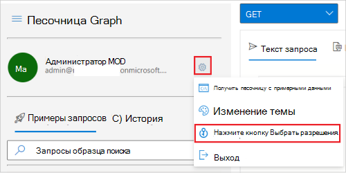

# <a name="tutorial-use-the-access-reviews-api-to-review-guest-access-to-your-microsoft-365-groups"></a><span data-ttu-id="2007b-103">Руководство. Используйте API обзоров доступа, чтобы просмотреть гостевой доступ к группам Microsoft 365.</span><span class="sxs-lookup"><span data-stu-id="2007b-103">Tutorial: Use the access reviews API to review guest access to your Microsoft 365 groups</span></span>

<span data-ttu-id="2007b-104">В этом руководстве Graph Explorer для создания и чтения отзывов доступа, которые ориентированы на все Microsoft 365 группы с гостевых пользователей в клиенте.</span><span class="sxs-lookup"><span data-stu-id="2007b-104">In this tutorial, you will use Graph Explorer to create and read access reviews that targets all Microsoft 365 groups with guest users in the tenant.</span></span> <span data-ttu-id="2007b-105">Для этого сначала с помощью Azure AD B2B вы сможете приглашать и создавать гостевого пользователя, также именуемого внешним удостоверением, в клиенте.</span><span class="sxs-lookup"><span data-stu-id="2007b-105">To achieve this, you'll first use Azure AD B2B to invite and create a guest user, also referred to as an external identity, in your tenant.</span></span> <span data-ttu-id="2007b-106">Затем перед созданием и чтением обзора доступа вы добавите этого гостевых пользователей в Microsoft 365 группу.</span><span class="sxs-lookup"><span data-stu-id="2007b-106">Then, you'll add this guest user to your Microsoft 365 group prior to creating and reading the access review.</span></span>

>[!NOTE]
><span data-ttu-id="2007b-107">Объекты отклика, показанные в этом руководстве, могут быть сокращены для чтения.</span><span class="sxs-lookup"><span data-stu-id="2007b-107">The response objects shown in this tutorial might be shortened for readability.</span></span>

## <a name="prerequisites"></a><span data-ttu-id="2007b-108">Предварительные требования</span><span class="sxs-lookup"><span data-stu-id="2007b-108">Prerequisites</span></span>

<span data-ttu-id="2007b-109">Для завершения этого руководства необходимы следующие ресурсы и привилегии:</span><span class="sxs-lookup"><span data-stu-id="2007b-109">To complete this tutorial, you need the following resources and privileges:</span></span>

+ <span data-ttu-id="2007b-110">Рабочий клиент Azure AD с включенной лицензией Azure AD Premium P2 или EMS E5.</span><span class="sxs-lookup"><span data-stu-id="2007b-110">A working Azure AD tenant with an Azure AD Premium P2 or EMS E5 license enabled.</span></span> 
+ <span data-ttu-id="2007b-111">Учетная запись в другом клиенте Azure AD или социальном удостоверении, которую можно пригласить в качестве гостевого пользователя (B2B-пользователя).</span><span class="sxs-lookup"><span data-stu-id="2007b-111">An account in a different Azure AD tenant or a social identity that you can invite as a guest user (B2B user).</span></span>
+ <span data-ttu-id="2007b-112">Вопишитесь [Graph Explorer](https://developer.microsoft.com/graph/graph-explorer) в качестве пользователя в роли глобального администратора.</span><span class="sxs-lookup"><span data-stu-id="2007b-112">Sign in to [Graph Explorer](https://developer.microsoft.com/graph/graph-explorer) as a user in a global administrator role.</span></span> 
+ <span data-ttu-id="2007b-113">Следующие делегированные разрешения: `User.Invite.All` `AccessReview.ReadWrite.All` , , `Group.ReadWrite.All` `User.ReadWrite.All` .</span><span class="sxs-lookup"><span data-stu-id="2007b-113">The following delegated permissions: `User.Invite.All`, `AccessReview.ReadWrite.All`, `Group.ReadWrite.All`, `User.ReadWrite.All`.</span></span>

<span data-ttu-id="2007b-114">Согласие на необходимые разрешения в Graph Explorer:</span><span class="sxs-lookup"><span data-stu-id="2007b-114">To consent to the required permissions in Graph Explorer:</span></span>
1. <span data-ttu-id="2007b-115">Выберите значок параметров справа от сведений учетной записи пользователя, а затем выберите **Выберите разрешения.**</span><span class="sxs-lookup"><span data-stu-id="2007b-115">Select the settings icon to the right of the user account details, and then choose **Select permissions**.</span></span>
   
   <span data-ttu-id="2007b-116">
   </span><span class="sxs-lookup"><span data-stu-id="2007b-116">
</span></span><!--:::image type="content" source="../images/../concepts/images/tutorial-accessreviews-api/settings.png" alt-text="Select the Microsoft Graph permissions":::-->

2. <span data-ttu-id="2007b-117">Прокрутите список разрешений для этих разрешений:</span><span class="sxs-lookup"><span data-stu-id="2007b-117">Scroll through the list of permissions to these permissions:</span></span>
   + <span data-ttu-id="2007b-118">AccessReviews (3), расширяйте и выберите **AccessReviews.ReadWrite.All**.</span><span class="sxs-lookup"><span data-stu-id="2007b-118">AccessReviews (3), expand and then select **AccessReviews.ReadWrite.All**.</span></span>
   + <span data-ttu-id="2007b-119">Группа (2), развиньте и выберите **Group.ReadWrite.All**.</span><span class="sxs-lookup"><span data-stu-id="2007b-119">Group (2), expand and then select **Group.ReadWrite.All**.</span></span>
   + <span data-ttu-id="2007b-120">Пользователь (8), расширить и затем выбрать **User.Invite.All** и **User.ReadWrite.All**.</span><span class="sxs-lookup"><span data-stu-id="2007b-120">User (8), expand and then select **User.Invite.All** and **User.ReadWrite.All**.</span></span>
   
   <span data-ttu-id="2007b-121">Нажмите **Согласие** и выберите **Принять**, чтобы согласиться принять разрешения.</span><span class="sxs-lookup"><span data-stu-id="2007b-121">Select **Consent**, and then select **Accept** to accept the consent of the permissions.</span></span> <span data-ttu-id="2007b-122">Вам не нужно предоставлять согласие от имени организации для этих разрешений.</span><span class="sxs-lookup"><span data-stu-id="2007b-122">You do not need to consent on behalf of your organization for these permissions.</span></span>
   
   <span data-ttu-id="2007b-123">
   </span><span class="sxs-lookup"><span data-stu-id="2007b-123">
</span></span><!--:::image type="content" source="../images/../concepts/images/tutorial-accessreviews-api/consentpermissions_M365.png" alt-text="Consent to the Microsoft Graph permissions":::-->

## <a name="step-1-create-a-test-user-in-your-tenant"></a><span data-ttu-id="2007b-124">Шаг 1. Создание тестового пользователя в клиенте</span><span class="sxs-lookup"><span data-stu-id="2007b-124">Step 1: Create a test user in your tenant</span></span>

### <a name="request"></a><span data-ttu-id="2007b-125">Запрос</span><span class="sxs-lookup"><span data-stu-id="2007b-125">Request</span></span>

```http
POST /users
Content-Type: application/json

{
    "accountEnabled": true,
    "displayName": "Aline Dupuy",
    "mailNickname": "AlineD",
    "userPrincipalName": "AlineD@contoso.com",
    "passwordProfile": {
        "forceChangePasswordNextSignIn": true,
        "password": "xWwvJ]6NMw+bWH-d"
    }
}
```

### <a name="response"></a><span data-ttu-id="2007b-126">Отклик</span><span class="sxs-lookup"><span data-stu-id="2007b-126">Response</span></span>

```http
HTTP/1.1 201 Created
Content-type: application/json

{
    "@odata.context": "https://graph.microsoft.com/beta/$metadata#users/$entity",
    "id": "c9a5aff7-9298-4d71-adab-0a222e0a05e4",
    "displayName": "Aline Dupuy",
    "userPrincipalName": "AlineD@contoso.com",
    "userType": "Member"
}
```

## <a name="step-2-invite-a-guest-user-into-your-tenant"></a><span data-ttu-id="2007b-127">Шаг 2. Приглашение гостевого пользователя в клиента</span><span class="sxs-lookup"><span data-stu-id="2007b-127">Step 2: Invite a guest user into your tenant</span></span>

<span data-ttu-id="2007b-128">Приглашение гостевого пользователя с адресом **электронной почты john@tailspintoys.com** клиенту.</span><span class="sxs-lookup"><span data-stu-id="2007b-128">Invite a guest user with the email address **john@tailspintoys.com** to your tenant.</span></span>

### <a name="request"></a><span data-ttu-id="2007b-129">Запрос</span><span class="sxs-lookup"><span data-stu-id="2007b-129">Request</span></span>

```http
POST https://graph.microsoft.com/beta/invitations
Content-Type: application/json

{
    "invitedUserDisplayName": "John Doe (Tailspin Toys)",
    "invitedUserEmailAddress": "john@tailspintoys.com",
    "sendInvitationMessage": false,
    "inviteRedirectUrl": "https://myapps.microsoft.com"
}
```

### <a name="response"></a><span data-ttu-id="2007b-130">Отклик</span><span class="sxs-lookup"><span data-stu-id="2007b-130">Response</span></span>

```http
HTTP/1.1 201 Created
Content-type: application/json

{
    "@odata.context": "https://graph.microsoft.com/beta/$metadata#invitations/$entity",
    "invitedUser": {
        "id": "baf1b0a0-1f9a-4a56-9884-6a30824f8d20"
    }    
}
```

## <a name="step-3-create-a-new-microsoft-365-group-and-add-the-guest-user"></a><span data-ttu-id="2007b-131">Шаг 3. Создание Microsoft 365 группы и добавление гостевого пользователя</span><span class="sxs-lookup"><span data-stu-id="2007b-131">Step 3: Create a new Microsoft 365 group and add the guest user</span></span>

<span data-ttu-id="2007b-132">На этом шаге:</span><span class="sxs-lookup"><span data-stu-id="2007b-132">In this step:</span></span>
1. <span data-ttu-id="2007b-133">Создайте новую Microsoft 365 с именем **маркетинговая кампания Feelgood.**</span><span class="sxs-lookup"><span data-stu-id="2007b-133">Create a new Microsoft 365 group named **Feelgood marketing campaign**.</span></span>
2. <span data-ttu-id="2007b-134">Назначьте себя владельцем группы.</span><span class="sxs-lookup"><span data-stu-id="2007b-134">Assign yourself as the group owner.</span></span>
3. <span data-ttu-id="2007b-135">Добавьте john@tailspintoys.com в качестве участника группы.</span><span class="sxs-lookup"><span data-stu-id="2007b-135">Add john@tailspintoys.com as a group member.</span></span> <span data-ttu-id="2007b-136">Их доступ к группе является предметом рассмотрения вами, владельцем группы.</span><span class="sxs-lookup"><span data-stu-id="2007b-136">Their access to the group is the subject of review by you, the group owner.</span></span>

### <a name="request"></a><span data-ttu-id="2007b-137">Запрос</span><span class="sxs-lookup"><span data-stu-id="2007b-137">Request</span></span>
<span data-ttu-id="2007b-138">В этом вызове замените:</span><span class="sxs-lookup"><span data-stu-id="2007b-138">In this call, replace:</span></span>
+ <span data-ttu-id="2007b-139">`cdb555e3-b33e-4fd5-a427-17fadacbdfa7` с **вашим id**. Чтобы получить свой **id,** `GET` запустите `https://graph.microsoft.com/beta/me` .</span><span class="sxs-lookup"><span data-stu-id="2007b-139">`cdb555e3-b33e-4fd5-a427-17fadacbdfa7` with your **id**. To retrieve your **id**, run `GET` on `https://graph.microsoft.com/beta/me`.</span></span>
+ <span data-ttu-id="2007b-140">`baf1b0a0-1f9a-4a56-9884-6a30824f8d20` с **john@tailspintoys.com**'s **id** из ответа в шаге 2.</span><span class="sxs-lookup"><span data-stu-id="2007b-140">`baf1b0a0-1f9a-4a56-9884-6a30824f8d20` with **john@tailspintoys.com**'s **id** from the response in Step 2.</span></span>

```http
POST https://graph.microsoft.com/beta/groups
Content-Type: application/json

{
    "description": "Feelgood Marketing Campaign with external partners and vendors.",
    "displayName": "Feelgood Marketing Campaign",
    "groupTypes": [
        "Unified"
    ],
    "mailEnabled": true,
    "mailNickname": "FeelGoodCampaign",
    "securityEnabled": true,
    "owners@odata.bind": [
        "https://graph.microsoft.com/beta/users/cdb555e3-b33e-4fd5-a427-17fadacbdfa7"
    ],
    "members@odata.bind": [
        "https://graph.microsoft.com/beta/users/baf1b0a0-1f9a-4a56-9884-6a30824f8d20"
    ]
}
```

### <a name="response"></a><span data-ttu-id="2007b-141">Отклик</span><span class="sxs-lookup"><span data-stu-id="2007b-141">Response</span></span>

```http
HTTP/1.1 201 Created
Content-type: application/json

{
    "@odata.context": "https://graph.microsoft.com/beta/$metadata#groups/$entity",
    "id": "59ab642a-2776-4e32-9b68-9ff7a47b7f6a",
    "displayName": "Feelgood Marketing Campaign",
    "groupTypes": [
        "Unified"
    ]
}
```

<span data-ttu-id="2007b-142">Теперь у вас Microsoft 365 группа с гостевых пользователей.</span><span class="sxs-lookup"><span data-stu-id="2007b-142">You now have a Microsoft 365 group with a guest user.</span></span>

## <a name="step-4-create-an-access-review-for-all-microsoft-365-groups-with-guest-users"></a><span data-ttu-id="2007b-143">Шаг 4. Создание обзора доступа для всех групп Microsoft 365 с гостевых пользователей</span><span class="sxs-lookup"><span data-stu-id="2007b-143">Step 4: Create an access review for all Microsoft 365 groups with guest users</span></span>

<span data-ttu-id="2007b-144">При создании серии повторяющихся обзоров доступа для всех групп Microsoft 365 с гостевых пользователей вы запланировать периодический обзор доступа гостей к группе Microsoft 365.</span><span class="sxs-lookup"><span data-stu-id="2007b-144">When you create a recurring access review series for all Microsoft 365 groups with guest users, you schedule a periodic review of the guests' access to the Microsoft 365 group.</span></span> <span data-ttu-id="2007b-145">Сделайте это для **группы маркетинговой кампании Feelgood.**</span><span class="sxs-lookup"><span data-stu-id="2007b-145">Do this for the **Feelgood Marketing Campaign** group.</span></span>

<span data-ttu-id="2007b-146">В серии обзоров доступа используются следующие параметры:</span><span class="sxs-lookup"><span data-stu-id="2007b-146">The access review series uses following settings:</span></span>
+ <span data-ttu-id="2007b-147">Это повторяющийся обзор доступа, который пересматривается ежеквартно.</span><span class="sxs-lookup"><span data-stu-id="2007b-147">It's a recurring access review and reviewed quarterly.</span></span>
+ <span data-ttu-id="2007b-148">Владельцы групп проверяют постоянный доступ гостевых пользователей.</span><span class="sxs-lookup"><span data-stu-id="2007b-148">The group owners review the continued access of guest users.</span></span>
+ <span data-ttu-id="2007b-149">Область обзора ограничивается только Microsoft 365 только с **гостевых пользователей.**</span><span class="sxs-lookup"><span data-stu-id="2007b-149">The review scope is limited to Microsoft 365 groups with **Guest users** only.</span></span> <span data-ttu-id="2007b-150">Дополнительные параметры настройки области см. в разделе [See also.](#see-also)</span><span class="sxs-lookup"><span data-stu-id="2007b-150">For more options for configuring the scope, see the [See also](#see-also) section.</span></span> 
+ <span data-ttu-id="2007b-151">Обозреватель резервного копирования.</span><span class="sxs-lookup"><span data-stu-id="2007b-151">A backup reviewer.</span></span> <span data-ttu-id="2007b-152">Это может быть пользователь с откатом или группа, которая может просмотреть доступ в случае, если у группы нет владельцев.</span><span class="sxs-lookup"><span data-stu-id="2007b-152">This can be a fallback user or a group that can review the access in case the group doesn't have any owners assigned.</span></span> <span data-ttu-id="2007b-153">Дополнительные возможности настройки рецензентов см. в разделе [See also.](#see-also)</span><span class="sxs-lookup"><span data-stu-id="2007b-153">For more options for configuring the reviewers, see the [See also](#see-also) section.</span></span>
+ <span data-ttu-id="2007b-154">**autoApplyDecisionsEnabled** установлено `true` для .</span><span class="sxs-lookup"><span data-stu-id="2007b-154">**autoApplyDecisionsEnabled** is set to `true`.</span></span> <span data-ttu-id="2007b-155">В этом случае решения применяются автоматически, как только рецензент завершит обзор доступа или закончится продолжительность обзора доступа.</span><span class="sxs-lookup"><span data-stu-id="2007b-155">In this case, decisions are applied automatically once the reviewer completes the access review or the access review duration ends.</span></span> <span data-ttu-id="2007b-156">Если он не включен, пользователь должен после завершения проверки применять решения вручную.</span><span class="sxs-lookup"><span data-stu-id="2007b-156">If not enabled, a user must, after the review completes, apply the decisions manually.</span></span>
+ <span data-ttu-id="2007b-157">Применить **действие removeAccessApplyAction** для отклонить гостевых пользователей.</span><span class="sxs-lookup"><span data-stu-id="2007b-157">Apply **removeAccessApplyAction** action to denied guest users.</span></span> <span data-ttu-id="2007b-158">Это удаляет членство в группе отклоненного гостя.</span><span class="sxs-lookup"><span data-stu-id="2007b-158">This removes the membership in the group of the denied guest.</span></span> <span data-ttu-id="2007b-159">Гостевой пользователь по-прежнему может войти в клиент.</span><span class="sxs-lookup"><span data-stu-id="2007b-159">The guest user can still sign in to your tenant.</span></span>

### <a name="request"></a><span data-ttu-id="2007b-160">Запрос</span><span class="sxs-lookup"><span data-stu-id="2007b-160">Request</span></span>
<span data-ttu-id="2007b-161">В этом вызове замените следующее:</span><span class="sxs-lookup"><span data-stu-id="2007b-161">In this call, replace the following:</span></span>

+ <span data-ttu-id="2007b-162">`c9a5aff7-9298-4d71-adab-0a222e0a05e4` с **ид пользователя,** назначенного в качестве резервного рецензента.</span><span class="sxs-lookup"><span data-stu-id="2007b-162">`c9a5aff7-9298-4d71-adab-0a222e0a05e4` with the **id** of the user you are designating as a backup reviewer.</span></span> <span data-ttu-id="2007b-163">Это **id из** ответа в шаге 1.</span><span class="sxs-lookup"><span data-stu-id="2007b-163">This is the **id** from the response in Step 1.</span></span>
+ <span data-ttu-id="2007b-164">Значение **startDate с** сегодняшней датой и **значением endDate** с датой один год с даты начала.</span><span class="sxs-lookup"><span data-stu-id="2007b-164">Value of **startDate** with today's date and value of **endDate** with a date one year from the start date.</span></span> 

```http
POST https://graph.microsoft.com/beta/identityGovernance/accessReviews/definitions
Content-type: application/json

{
    "displayName": "Group owners review guest across Microsoft 365 groups in the tenant (Quarterly)",
    "descriptionForAdmins": "",
    "descriptionForReviewers": "",
    "scope": {
        "query": "./members/microsoft.graph.user/?$count=true&$filter=(userType eq 'Guest')",
        "queryType": "MicrosoftGraph"
    },
    "instanceEnumerationScope": {
        "query": "/groups?$filter=(groupTypes/any(c:c+eq+'Unified'))&$count=true",
        "queryType": "MicrosoftGraph"
    },
    "reviewers": [
        {
            "query": "./owners",
            "queryType": "MicrosoftGraph",
            "queryRoot": null
        }
    ],
    "backupReviewers": [
        {
            "query": "/users/c9a5aff7-9298-4d71-adab-0a222e0a05e4",
            "queryType": "MicrosoftGraph",
            "queryRoot": null
        }
    ],
    "settings": {
        "mailNotificationsEnabled": true,
        "reminderNotificationsEnabled": true,
        "justificationRequiredOnApproval": true,
        "defaultDecisionEnabled": true,
        "defaultDecision": "Approve",
        "instanceDurationInDays": 0,
        "autoApplyDecisionsEnabled": true,
        "recommendationsEnabled": true,
        "recurrence": {
            "pattern": {
                "type": "absoluteMonthly",
                "interval": 3,
                "month": 0,
                "dayOfMonth": 0,
                "daysOfWeek": [],
                "firstDayOfWeek": "sunday",
                "index": "first"
            },
            "range": {
                "type": "numbered",
                "numberOfOccurrences": 0,
                "recurrenceTimeZone": null,
                "startDate": "2021-02-10",
                "endDate": "2022-12-21"
            }
        },
        "applyActions": [
            {
                "@odata.type": "#microsoft.graph.removeAccessApplyAction"
            }
        ]
    }
}
```

### <a name="response"></a><span data-ttu-id="2007b-165">Отклик</span><span class="sxs-lookup"><span data-stu-id="2007b-165">Response</span></span>

```http
HTTP/1.1 201 Created
Content-type: application/json

{
    "@odata.context": "https://graph.microsoft.com/beta/$metadata#identityGovernance/accessReviews/definitions/$entity",
    "id": "c22ae540-b89a-4d24-bac0-4ef35e6591ea",
    "displayName": "Group owners review guest across Microsoft 365 groups in the tenant (Quarterly)",
    "status": "NotStarted",
    "createdBy": {
        "id": "cdb555e3-b33e-4fd5-a427-17fadacbdfa7",
        "displayName": "MOD Administrator",
        "userPrincipalName": "admin@contoso.com"
    },
    "scope": {
        "query": "./members/microsoft.graph.user/?$count=true&$filter=(userType eq 'Guest')",
        "queryType": "MicrosoftGraph"
    },
    "instanceEnumerationScope": {
        "query": "/groups?$filter=(groupTypes/any(c:c+eq+'Unified'))&$count=true",
        "queryType": "MicrosoftGraph"
    },
    "reviewers": [
        {
            "query": "./owners",
            "queryType": "MicrosoftGraph",
            "queryRoot": null
        }
    ],
    "backupReviewers": [
        {
            "query": "/users/c9a5aff7-9298-4d71-adab-0a222e0a05e4",
            "queryType": "MicrosoftGraph",
            "queryRoot": null
        }
    ],
    "settings": {
        "defaultDecisionEnabled": true,
        "defaultDecision": "Approve",
        "autoApplyDecisionsEnabled": true,
        "recommendationsEnabled": true,
        "recurrence": {
            "pattern": {
                "type": "absoluteMonthly",
                "interval": 3,
                "month": 0,
                "dayOfMonth": 0,
                "daysOfWeek": [],
                "firstDayOfWeek": "sunday",
                "index": "first"
            },
            "range": {
                "type": "numbered",
                "numberOfOccurrences": 0,
                "recurrenceTimeZone": null,
                "startDate": "2021-02-10",
                "endDate": "2022-12-21"
            }
        },
        "applyActions": [
            {
                "@odata.type": "#microsoft.graph.removeAccessApplyAction"
            }
        ]
    }
}
```

## <a name="step-5-list-instances-of-the-access-review"></a><span data-ttu-id="2007b-166">Шаг 5. Список экземпляров обзора доступа</span><span class="sxs-lookup"><span data-stu-id="2007b-166">Step 5: List instances of the access review</span></span>

<span data-ttu-id="2007b-167">В следующем запросе перечислены все экземпляры определения обзора доступа.</span><span class="sxs-lookup"><span data-stu-id="2007b-167">The following query lists all instances of the access review definition.</span></span> <span data-ttu-id="2007b-168">Если клиент тестирования содержит другие группы Microsoft 365 с гостевых пользователей, этот запрос возвращает один экземпляр для каждой Microsoft 365 группы с гостевых пользователей в клиенте.</span><span class="sxs-lookup"><span data-stu-id="2007b-168">If your test tenant contains other Microsoft 365 groups with guest users, this request will return one instance for every Microsoft 365 group with guest users in the tenant.</span></span>

### <a name="request"></a><span data-ttu-id="2007b-169">Запрос</span><span class="sxs-lookup"><span data-stu-id="2007b-169">Request</span></span>
<span data-ttu-id="2007b-170">В этом вызове `c22ae540-b89a-4d24-bac0-4ef35e6591ea` замените **id** определения обзора доступа, возвращенного в шаге 4.</span><span class="sxs-lookup"><span data-stu-id="2007b-170">In this call, replace `c22ae540-b89a-4d24-bac0-4ef35e6591ea` with the **id** of your access review definition returned in Step 4.</span></span>

```http
GET https://graph.microsoft.com/beta/identityGovernance/accessReviews/definitions/c22ae540-b89a-4d24-bac0-4ef35e6591ea/instances
```

### <a name="response"></a><span data-ttu-id="2007b-171">Отклик</span><span class="sxs-lookup"><span data-stu-id="2007b-171">Response</span></span>
<span data-ttu-id="2007b-172">В этом ответе область включает группу с **id** (группа маркетинговой кампании `59ab642a-2776-4e32-9b68-9ff7a47b7f6a` **Feelgood,** созданная в шаге 3), так как у нее есть гость.</span><span class="sxs-lookup"><span data-stu-id="2007b-172">In this response, the scope includes a group with **id** `59ab642a-2776-4e32-9b68-9ff7a47b7f6a` (the **Feelgood marketing campaign** group created in Step 3) because it has a guest user.</span></span>

```http
HTTP/1.1 200 OK
Content-type: application/json

{
    "@odata.context": "https://graph.microsoft.com/beta/$metadata#identityGovernance/accessReviews/definitions('c22ae540-b89a-4d24-bac0-4ef35e6591ea')/instances",
    "value": [
        {
            "id": "6392b1a7-9c25-4844-83e5-34e23c88e16a",
            "startDateTime": "2021-02-10T17:00:36.96Z",
            "endDateTime": "2021-02-10T17:00:36.96Z",
            "status": "InProgress",
            "scope": {
                "query": "/groups/59ab642a-2776-4e32-9b68-9ff7a47b7f6a/members/microsoft.graph.user/?$count=true&$filter=(userType eq 'Guest')",
                "queryType": "MicrosoftGraph"
            }
        }
    ]
}
```
<span data-ttu-id="2007b-173">В этом ответе экземпляр проверки доступа в настоящее время `InProgress` .</span><span class="sxs-lookup"><span data-stu-id="2007b-173">In this response, the access review instance is currently `InProgress`.</span></span> <span data-ttu-id="2007b-174">Поскольку это ежеквартный обзор, каждые 3 месяца новый экземпляр обзора создается автоматически, и вы — рецензент — можете применять новые решения.</span><span class="sxs-lookup"><span data-stu-id="2007b-174">Because this is a quarterly review, every 3 months, a new review instance is created automatically and you—the reviewer—can apply new decisions.</span></span>

## <a name="step-6-get-decisions"></a><span data-ttu-id="2007b-175">Шаг 6. Принятие решений</span><span class="sxs-lookup"><span data-stu-id="2007b-175">Step 6: Get decisions</span></span>

<span data-ttu-id="2007b-176">Получите решения, принятые в случае проверки доступа.</span><span class="sxs-lookup"><span data-stu-id="2007b-176">Get the decisions taken for the instance of an access review.</span></span>

### <a name="request"></a><span data-ttu-id="2007b-177">Запрос</span><span class="sxs-lookup"><span data-stu-id="2007b-177">Request</span></span>
<span data-ttu-id="2007b-178">В этом вызове:</span><span class="sxs-lookup"><span data-stu-id="2007b-178">In this call:</span></span>
+ <span data-ttu-id="2007b-179">`c22ae540-b89a-4d24-bac0-4ef35e6591ea`Замените **id определения** обзора доступа, возвращенного в шаге 4.</span><span class="sxs-lookup"><span data-stu-id="2007b-179">Replace `c22ae540-b89a-4d24-bac0-4ef35e6591ea` with the **id** of your access review definition returned in Step 4.</span></span>
+ <span data-ttu-id="2007b-180">`6392b1a7-9c25-4844-83e5-34e23c88e16a`Замените **id экземпляра** обзора доступа, возвращенного в шаге 5.</span><span class="sxs-lookup"><span data-stu-id="2007b-180">Replace `6392b1a7-9c25-4844-83e5-34e23c88e16a` with the **id** of your access review instance returned in Step 5.</span></span>

```http
GET https://graph.microsoft.com/beta/identityGovernance/accessReviews/definitions/c22ae540-b89a-4d24-bac0-4ef35e6591ea/instances/6392b1a7-9c25-4844-83e5-34e23c88e16a/decisions
```

### <a name="response"></a><span data-ttu-id="2007b-181">Отклик</span><span class="sxs-lookup"><span data-stu-id="2007b-181">Response</span></span>

<span data-ttu-id="2007b-182">В следующем ответе показано решение, принятое для экземпляра обзора.</span><span class="sxs-lookup"><span data-stu-id="2007b-182">The following response shows the decision taken for the instance of the review.</span></span>

```http
HTTP/1.1 200 OK
Content-type: application/json

{
    "@odata.context": "https://graph.microsoft.com/beta/$metadata#identityGovernance/accessReviews/definitions('c22ae540-b89a-4d24-bac0-4ef35e6591ea')/instances('6392b1a7-9c25-4844-83e5-34e23c88e16a')/decisions",
    "@odata.count": 1,
    "value": [
        {
            "id": "0e76ee07-b4c6-469e-bc9d-e73fc9a8d660",
            "accessReviewId": "6392b1a7-9c25-4844-83e5-34e23c88e16a",
            "reviewedDateTime": "2021-02-10T17:06:26.147Z",
            "decision": "Approve",
            "justification": "",
            "appliedDateTime": null,
            "applyResult": "New",
            "recommendation": "Deny",
            "reviewedBy": {
                "id": "00000000-0000-0000-0000-000000000000",
                "displayName": "AAD Access Reviews",
                "userPrincipalName": "AAD Access Reviews"
            },
            "appliedBy": {
                "id": "00000000-0000-0000-0000-000000000000",
                "displayName": "",
                "userPrincipalName": ""
            },
            "target": {
                "@odata.type": "#microsoft.graph.accessReviewInstanceDecisionItemUserTarget",
                "userId": "baf1b0a0-1f9a-4a56-9884-6a30824f8d20",
                "userDisplayName": "John Doe (Tailspin Toys)",
                "userPrincipalName": "john@tailspintoys.com"
            },
            "principal": {
                "@odata.type": "#microsoft.graph.userIdentity",
                "id": "baf1b0a0-1f9a-4a56-9884-6a30824f8d20",
                "displayName": "John Doe (Tailspin Toys)",
                "userPrincipalName": "john@tailspintoys.com"
            }
        }
    ]
}
```

<span data-ttu-id="2007b-183">Так как это ежекварточный обзор, и пока определение по-прежнему активно, то есть периодичная дата повторения не является прошлой датой, каждые 3 месяца, когда создается новый экземпляр обзора, вы, как рецензент, можете применять новые решения. </span><span class="sxs-lookup"><span data-stu-id="2007b-183">Because this is a quarterly review and as long as the definition is still active, that is, the recurrence **endDate** is not a past date, every 3 months when a new review instance is created, you as the reviewer can apply new decisions.</span></span>

## <a name="step-7-clean-up-resources"></a><span data-ttu-id="2007b-184">Шаг 7. Очистка ресурсов</span><span class="sxs-lookup"><span data-stu-id="2007b-184">Step 7: Clean up resources</span></span>

<span data-ttu-id="2007b-185">Удалите ресурсы, созданные для этого руководства: группу маркетинговой кампании **Feelgood,** определение расписания обзоров доступа, гостевой пользователь и тестовый пользователь.</span><span class="sxs-lookup"><span data-stu-id="2007b-185">Delete the resources that you created for this tutorial—**Feelgood marketing campaign** group, the access review schedule definition, the guest user, and the test user.</span></span>

### <a name="delete-the-microsoft-365-group"></a><span data-ttu-id="2007b-186">Удаление Microsoft 365 группы</span><span class="sxs-lookup"><span data-stu-id="2007b-186">Delete the Microsoft 365 group</span></span>

#### <a name="request"></a><span data-ttu-id="2007b-187">Запрос</span><span class="sxs-lookup"><span data-stu-id="2007b-187">Request</span></span>
<span data-ttu-id="2007b-188">В этом вызове замените id маркетинговой кампании `59ab642a-2776-4e32-9b68-9ff7a47b7f6a` **Feelgood** Microsoft 365 группы. </span><span class="sxs-lookup"><span data-stu-id="2007b-188">In this call, replace `59ab642a-2776-4e32-9b68-9ff7a47b7f6a` with the **id** of your **Feelgood marketing campaign** Microsoft 365 group.</span></span>

```http
DELETE https://graph.microsoft.com/beta/groups/59ab642a-2776-4e32-9b68-9ff7a47b7f6a
```

#### <a name="response"></a><span data-ttu-id="2007b-189">Отклик</span><span class="sxs-lookup"><span data-stu-id="2007b-189">Response</span></span>

```http
HTTP/1.1 204 No Content
Content-type: text/plain
```

### <a name="delete-the-access-review-definition"></a><span data-ttu-id="2007b-190">Удаление определения обзора доступа</span><span class="sxs-lookup"><span data-stu-id="2007b-190">Delete the access review definition</span></span>

<span data-ttu-id="2007b-191">В этом вызове `c22ae540-b89a-4d24-bac0-4ef35e6591ea` замените **id** определения обзора доступа.</span><span class="sxs-lookup"><span data-stu-id="2007b-191">In this call, replace `c22ae540-b89a-4d24-bac0-4ef35e6591ea` with the **id** of your access review definition.</span></span> <span data-ttu-id="2007b-192">Так как определение расписания проверки доступа является планом обзора доступа, удаление определения удаляет параметры, экземпляры и решения, связанные с обзором доступа.</span><span class="sxs-lookup"><span data-stu-id="2007b-192">Since the access review schedule definition is the blueprint for the access review, deleting the definition will remove the settings, instances, and decisions associated with the access review.</span></span>

#### <a name="request"></a><span data-ttu-id="2007b-193">Запрос</span><span class="sxs-lookup"><span data-stu-id="2007b-193">Request</span></span>
```http
DELETE https://graph.microsoft.com/beta/identityGovernance/accessReviews/definitions/c22ae540-b89a-4d24-bac0-4ef35e6591ea
```

#### <a name="response"></a><span data-ttu-id="2007b-194">Отклик</span><span class="sxs-lookup"><span data-stu-id="2007b-194">Response</span></span>
```http
HTTP/1.1 204 No Content
Content-type: text/plain
```
### <a name="remove-the-guest-user"></a><span data-ttu-id="2007b-195">Удаление гостевого пользователя</span><span class="sxs-lookup"><span data-stu-id="2007b-195">Remove the guest user</span></span>

<span data-ttu-id="2007b-196">В этом вызове `baf1b0a0-1f9a-4a56-9884-6a30824f8d20` замените **id** гостевого пользователя john@tailspintoys.com.</span><span class="sxs-lookup"><span data-stu-id="2007b-196">In this call, replace `baf1b0a0-1f9a-4a56-9884-6a30824f8d20` with the **id** of the guest user, john@tailspintoys.com.</span></span>

#### <a name="request"></a><span data-ttu-id="2007b-197">Запрос</span><span class="sxs-lookup"><span data-stu-id="2007b-197">Request</span></span>
```http
DELETE https://graph.microsoft.com/beta/users/baf1b0a0-1f9a-4a56-9884-6a30824f8d20
```

#### <a name="response"></a><span data-ttu-id="2007b-198">Отклик</span><span class="sxs-lookup"><span data-stu-id="2007b-198">Response</span></span>
```http
HTTP/1.1 204 No Content
Content-type: text/plain
```

### <a name="delete-the-test-user"></a><span data-ttu-id="2007b-199">Удаление тестового пользователя</span><span class="sxs-lookup"><span data-stu-id="2007b-199">Delete the test user</span></span>

#### <a name="request"></a><span data-ttu-id="2007b-200">Запрос</span><span class="sxs-lookup"><span data-stu-id="2007b-200">Request</span></span>
<span data-ttu-id="2007b-201">В этом вызове `c9a5aff7-9298-4d71-adab-0a222e0a05e4` замените **id** тестового пользователя.</span><span class="sxs-lookup"><span data-stu-id="2007b-201">In this call, replace `c9a5aff7-9298-4d71-adab-0a222e0a05e4` with the **id** of your test user.</span></span>

```http
DELETE https://graph.microsoft.com/beta/users/c9a5aff7-9298-4d71-adab-0a222e0a05e4
```

#### <a name="response"></a><span data-ttu-id="2007b-202">Отклик</span><span class="sxs-lookup"><span data-stu-id="2007b-202">Response</span></span>

```http
HTTP/1.1 204 No Content
Content-type: text/plain
```

<span data-ttu-id="2007b-203">Поздравляем!</span><span class="sxs-lookup"><span data-stu-id="2007b-203">Congratulations!</span></span> <span data-ttu-id="2007b-204">Вы создали обзор доступа для всех гостевых пользователей в Microsoft 365 группах в клиенте и запланирование ежеквартов для оценки и аттестации доступа гостевых пользователей.</span><span class="sxs-lookup"><span data-stu-id="2007b-204">You have created an access review for all guest users in Microsoft 365 groups in your tenant, and scheduled quarterly for the evaluation and attestation of the guest users' access.</span></span> <span data-ttu-id="2007b-205">Владельцы групп будут пересматривать доступ во время этих циклов, выбирая утверждение или отказ в доступе.</span><span class="sxs-lookup"><span data-stu-id="2007b-205">The group owners will review access during these cycles, choosing either to approve or deny access.</span></span>

## <a name="see-also"></a><span data-ttu-id="2007b-206">См. также</span><span class="sxs-lookup"><span data-stu-id="2007b-206">See also</span></span>

+ [<span data-ttu-id="2007b-207">Ссылка на API обзоров доступа</span><span class="sxs-lookup"><span data-stu-id="2007b-207">Access reviews API Reference</span></span>](/graph/api/resources/accessreviewsv2-root?view=graph-rest-beta&preserve-view=true)
+ [<span data-ttu-id="2007b-208">Настройка области определения обзора доступа с помощью API microsoft Graph</span><span class="sxs-lookup"><span data-stu-id="2007b-208">Configure the scope of your access review definition using the Microsoft Graph API</span></span>](/graph/accessreviews-scope-concept)
+ [<span data-ttu-id="2007b-209">Назначение рецензентов определению обзора доступа с помощью API Graph Microsoft</span><span class="sxs-lookup"><span data-stu-id="2007b-209">Assign reviewers to your access review definition using the Microsoft Graph API</span></span>](/graph/accessreviews-reviewers-concept)
+ [<span data-ttu-id="2007b-210">Обзор обзоров доступа и требования к лицензиям</span><span class="sxs-lookup"><span data-stu-id="2007b-210">Access reviews overview and license requirements</span></span>](/azure/active-directory/governance/access-reviews-overview)
+ [<span data-ttu-id="2007b-211">Создание обзора доступа групп & приложений</span><span class="sxs-lookup"><span data-stu-id="2007b-211">Create an access review of groups & applications</span></span>](/azure/active-directory/governance/create-access-review)
+ [<span data-ttu-id="2007b-212">Приглашение и добавление гостевых пользователей в организацию</span><span class="sxs-lookup"><span data-stu-id="2007b-212">Invite/add guest users to your organization</span></span>](/graph/api/resources/invitation?view=graph-rest-beta&preserve-view=true)

