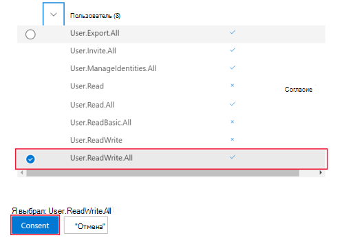
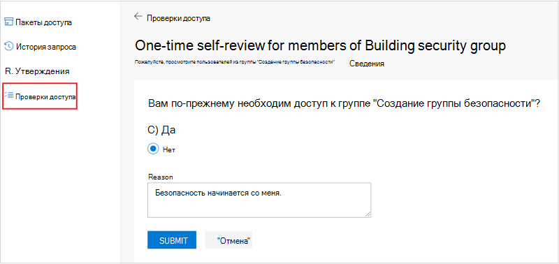

# <a name="tutorial-use-the-access-reviews-api-to-review-access-to-your-security-groups"></a>Руководство. Используйте API обзоров доступа для просмотра доступа к группам безопасности

В этом руководстве вы будете использовать Graph Explorer для проверки доступа к группе безопасности в клиенте.

Вы можете использовать Graph explorer или Postman для проверки вызовов API API отзывов доступа, прежде чем автоматизировать их в сценарий или приложение. Это экономит время, помогая правильно определять и проверять запросы без повторнойкомпилации приложения.

>[!NOTE]
>Объекты отклика, показанные в этом руководстве, могут быть сокращены для чтения.

## <a name="prerequisites"></a>Предварительные требования

Для завершения этого руководства необходимы следующие ресурсы и привилегии:

+ Рабочий клиент Azure AD с включенной Azure AD Premium P2 или emS E5.
+ Войдите в [Graph Explorer](https://developer.microsoft.com/graph/graph-explorer) как пользователь в роли глобального администратора.
  + [Необязательный] Запустите новое **инкогнито** или **сеанс браузера InPrivate** или запустите сеанс в анонимном браузере. Вы войдите позже в этом руководстве.
+ Следующие делегированные разрешения: `AccessReview.ReadWrite.All` , `Group.ReadWrite.All` .

Согласие на необходимые разрешения в Graph Explorer:
1. Выберите значок передач параметров справа от сведений учетной записи пользователя, а затем выберите **выберите разрешения.**
   
   
   <!--:::image type="content" source="../images/../concepts/images/tutorial-accessreviews-api/settings.png" alt-text="Select the Microsoft Graph permissions":::-->

2. Прокрутите список разрешений для этих разрешений:
   + AccessReview (3), расширяйте и выберите **AccessReview.ReadWrite.All**.
   + Группа (2), развиньте и выберите **Group.ReadWrite.All**.
  
    Выберите **Согласие** и в всплывающее  окно выберите Согласие от имени организации, а затем выберите **Accept,** чтобы принять согласие разрешений.
   
   
   <!--:::image type="content" source="../images/../concepts/images/tutorial-accessreviews-api/consentpermissions_M365.png" alt-text="Consent to the Microsoft Graph permissions":::-->

## <a name="step-1-create-test-users-in-your-tenant"></a>Шаг 1. Создание тестовых пользователей в клиенте

Создайте трех новых тестовых пользователей, каждый раз запуская запрос ниже, меняя свойства **displayName,** **mailNickname** и **userPrincipalName.** Запись **их id** s.

### <a name="request"></a>Запрос
<!-- {
  "blockType": "request",
  "name": "tutorial-accessreviews-Securitygroup-createUser"
}-->
```http
POST /users
Content-Type: application/json

{
    "accountEnabled": true,
    "displayName": "Aline Dupuy",
    "mailNickname": "AlineD",
    "userPrincipalName": "AlineD@contoso.com",
    "passwordProfile": {
        "forceChangePasswordNextSignIn": true,
        "password": "xWwvJ]6NMw+bWH-d"
    }
}
```

### <a name="response"></a>Отклик
<!-- {
  "blockType": "response",
  "truncated": true,
  "@odata.type": "microsoft.graph.user"
} -->

```http
HTTP/1.1 201 Created
Content-type: application/json

{
    "@odata.context": "https://graph.microsoft.com/beta/$metadata#users/$entity",
    "id": "43b12b0c-ee2c-4257-96fe-505d823e06ab",
    "displayName": "Aline Dupuy",
    "mailNickname": "AlineD",
    "userPrincipalName": "AlineD@contoso.com",
    "userType": "Member"
}
```

## <a name="step-2-create-a-security-group-assign-owners-and-add-members"></a>Шаг 2. Создание группы безопасности, назначение владельцев и добавление участников

Создайте группу безопасности с именем **Building security group,** которая является целью обзоров доступа в этом руководстве. Назначьте этой группе двух владельцев групп и двух участников. Эти члены будут подвергаться проверке со стороны владельцев групп.

### <a name="request"></a>Запрос

В этом вызове замените:
+ `010b2de0-0ed4-4ece-bfa2-22fff71d0497` и `b828cc0e-4240-46ed-bb25-888744487e2d` с **id** s двух владельцев группы.
  + Один из **id** s принадлежит одному из пользователей, созданных в шаге 1.
  + Другой — ваш **id**. Чтобы получить свой **id,** `GET` запустите `https://graph.microsoft.com/beta/me` .
+ `43b12b0c-ee2c-4257-96fe-505d823e06ab` и `859924d0-7115-422a-9ee8-ea8c0c014707` с **id** s из вас два члена группы. Это два других члена, созданные в шаге 1.

<!-- {
  "blockType": "request",
  "name": "tutorial-accessreviews-Securitygroup-creategroup"
}-->
```http
POST https://graph.microsoft.com/beta/groups
Content-Type: application/json

{
    "description": "Building security group",
    "displayName": "Building security group",
    "groupTypes": [],
    "mailEnabled": false,
    "mailNickname": "buildingsecurity",
    "securityEnabled": true,
    "owners@odata.bind": [
        "https://graph.microsoft.com/beta/users/010b2de0-0ed4-4ece-bfa2-22fff71d0497",
        "https://graph.microsoft.com/beta/users/b828cc0e-4240-46ed-bb25-888744487e2d"
    ],
    "members@odata.bind": [
        "https://graph.microsoft.com/beta/users/43b12b0c-ee2c-4257-96fe-505d823e06ab",
        "https://graph.microsoft.com/beta/users/859924d0-7115-422a-9ee8-ea8c0c014707"
    ]
}
```

### <a name="response"></a>Отклик
<!-- {
  "blockType": "response",
  "truncated": true,
  "@odata.type": "microsoft.graph.group",
  "name": "create_group"
} -->

```http
HTTP/1.1 201 Created
Content-type: application/json

{
    "@odata.context": "https://graph.microsoft.com/beta/$metadata#groups/$entity",
    "id": "825f1b5e-6fb2-4d9a-b393-d491101acc0c",
    "displayName": "Building security group",
    "groupTypes": []
}
```
В ответе зафиксировать **id** новой группы, чтобы использовать его позже в этом учебнике.

## <a name="step-3-create-an-access-review-for-the-security-group"></a>Шаг 3. Создание обзора доступа для группы безопасности

Создайте обзор доступа для членов группы безопасности с помощью следующих параметров:
+ Это обзор самостоятельного просмотра доступа. В этом случае проверяемая пользовательская группа самостоятельно засвидетельна необходимостью доступа к группе.
+ Это разовая проверка доступа. В этом случае после предоставления доступа пользователю не нужно повторно засвидетельстовка в течение периода проверки доступа.
+ Область обзора ограничена членами **группы безопасности Building.**

### <a name="request"></a>Запрос

В этом вызове замените следующее:
+ `825f1b5e-6fb2-4d9a-b393-d491101acc0c` с **id** группы **безопасности Здания**.
+ Область указывает, что обзор применяется для всех членов группы безопасности **здания.** Дополнительные параметры настройки области см. в разделе [See also.](#see-also)
+ Значение **startDate с** сегодняшней датой и **значением endDate** с датой один год с даты начала.

Если не указать значение  свойства рецензентов, этот обзор доступа настраивается как самообсчет с участниками в качестве рецензентов.

<!-- {
  "blockType": "request",
  "name": "tutorial-accessreviews-Securitygroup-create_accessReviewScheduleDefinition"
}-->
```http
POST https://graph.microsoft.com/beta/identityGovernance/accessReviews/definitions
Content-type: application/json

{
    "displayName": "One-time self-review for members of Building security group",
    "descriptionForAdmins": "One-time self-review for members of Building security group",
    "descriptionForReviewers": "One-time self-review for members of Building security group",
    "scope": {
        "query": "/groups/825f1b5e-6fb2-4d9a-b393-d491101acc0c/transitiveMembers",
        "queryType": "MicrosoftGraph"
    },
    "instanceEnumerationScope": {
        "query": "/groups/825f1b5e-6fb2-4d9a-b393-d491101acc0c",
        "queryType": "MicrosoftGraph"
    },
    "reviewers": [],
    "settings": {
        "mailNotificationsEnabled": true,
        "reminderNotificationsEnabled": true,
        "justificationRequiredOnApproval": true,
        "defaultDecisionEnabled": false,
        "defaultDecision": "Deny",
        "instanceDurationInDays": 0,
        "autoApplyDecisionsEnabled": true,
        "recommendationsEnabled": true,
        "recurrence": {
            "pattern": null,
            "range": {
                "type": "numbered",
                "numberOfOccurrences": 0,
                "recurrenceTimeZone": null,
                "startDate": "2021-02-09",
                "endDate": "2022-12-31"
            }
        },
        "applyActions": [
            {
                "@odata.type": "#microsoft.graph.removeAccessApplyAction"
            }
        ]
    }
}
```

### <a name="response"></a>Отклик
<!-- {
  "blockType": "response",
  "truncated": true,
  "@odata.type": "microsoft.graph.accessReviewScheduleDefinition"
} -->

```http
HTTP/1.1 201 Created
Content-type: application/json

{
    "@odata.context": "https://graph.microsoft.com/beta/$metadata#identityGovernance/accessReviews/definitions/$entity",
    "id": "d7286a17-3a01-406a-b872-986b6b40317c",
    "displayName": "One-time self-review for members of Building security group",
    "status": "NotStarted",
    "createdBy": {
        "id": "b828cc0e-4240-46ed-bb25-888744487e2d",
        "displayName": "MOD Administrator",
        "userPrincipalName": "admin@contoso.com"
    },
    "scope": {
        "query": "/groups/825f1b5e-6fb2-4d9a-b393-d491101acc0c/transitiveMembers",
        "queryType": "MicrosoftGraph"
    },
    "instanceEnumerationScope": {
        "query": "/groups/825f1b5e-6fb2-4d9a-b393-d491101acc0c",
        "queryType": "MicrosoftGraph"
    },
    "reviewers": [],
    "backupReviewers": [],
    "settings": {
        "defaultDecisionEnabled": false,
        "defaultDecision": "Deny",
        "autoApplyDecisionsEnabled": true,
        "recommendationsEnabled": true,
        "recurrence": {
            "pattern": null,
            "range": {
                "type": "numbered",
                "numberOfOccurrences": 0,
                "recurrenceTimeZone": null,
                "startDate": "2021-02-09",
                "endDate": "2022-12-31"
            }
        },
        "applyActions": [
            {
                "@odata.type": "#microsoft.graph.removeAccessApplyAction"
            }
        ]
    }
}
```

## <a name="step-4-list-instances-of-the-access-review"></a>Шаг 4. Список экземпляров обзора доступа

В следующем запросе перечислены все экземпляры определения обзора доступа. Так как в шаге 3 был создан разовая проверка доступа, запрос возвращает только один экземпляр, **id** которого является таким же, как и **id определения доступа.**

### <a name="request"></a>Запрос

В этом вызове `d7286a17-3a01-406a-b872-986b6b40317c` замените **id** определения обзора доступа, возвращенного в шаге 3.

<!-- {
  "blockType": "request",
  "name": "tutorial-accessreviews-Securitygroup-list_accessReviewInstance"
}-->
```http
GET https://graph.microsoft.com/beta/identityGovernance/accessReviews/definitions/d7286a17-3a01-406a-b872-986b6b40317c/instances
```

### <a name="response"></a>Отклик

В этом ответе **состояние экземпляра** проверки доступа в том, что `InProgress` **startDateTime** прошло, **а endDateTime** — в будущем. Если **startDateTime** будет в будущем, состояние будет `NotStarted` . С другой стороны, если **endDateTime** в прошлом, состояние будет `Completed` .

<!-- {
  "blockType": "response",
  "truncated": true,
  "@odata.type": "microsoft.graph.accessReviewInstance",
  "isCollection": "true"
} -->
```http
HTTP/1.1 200 OK
Content-type: application/json

{
    "@odata.context": "https://graph.microsoft.com/beta/$metadata#identityGovernance/accessReviews/definitions('d7286a17-3a01-406a-b872-986b6b40317c')/instances",
    "value": [
        {
            "id": "d7286a17-3a01-406a-b872-986b6b40317c",
            "startDateTime": "2021-02-10T15:09:40.153Z",
            "endDateTime": "2022-12-31T08:00:00Z",
            "status": "InProgress",
            "scope": {
                "query": "/groups/825f1b5e-6fb2-4d9a-b393-d491101acc0c/transitiveMembers",
                "queryType": "MicrosoftGraph"
            }
        }
    ]
}
```

## <a name="step-5-get-decisions"></a>Шаг 5. Принятие решений

Вас интересуют решения, принятые в экземпляре обзора доступа.

### <a name="request"></a>Запрос

В этом вызове `d7286a17-3a01-406a-b872-986b6b40317c` замените **id** определения обзора доступа, возвращенного в шаге 3.

<!-- {
  "blockType": "request",
  "name": "tutorial-accessreviews-Securitygroup-list_accessReviewInstanceDecisionItem"
}-->
```http
GET https://graph.microsoft.com/beta/identityGovernance/accessReviews/definitions/d7286a17-3a01-406a-b872-986b6b40317c/instances/d7286a17-3a01-406a-b872-986b6b40317c/decisions
```

### <a name="response"></a>Отклик

В следующем ответе показано решение, принятое для экземпляра обзора.

<!-- {
  "blockType": "response",
  "truncated": true,
  "@odata.type": "microsoft.graph.accessReviewInstanceDecisionItem",
  "isCollection": "true"
} -->
```http
HTTP/1.1 200 OK
Content-type: application/json

{
    "@odata.context": "https://graph.microsoft.com/beta/$metadata#identityGovernance/accessReviews/definitions('d7286a17-3a01-406a-b872-986b6b40317c')/instances('d7286a17-3a01-406a-b872-986b6b40317c')/decisions",
    "@odata.count": 2,
    "value": [
        {
            "id": "1c74f500-9082-4dfe-80ac-784a6edb71d7",
            "accessReviewId": "d7286a17-3a01-406a-b872-986b6b40317c",
            "decision": "NotReviewed",
            "applyResult": "New",
            "recommendation": "Approve",
            "reviewedBy": {
                "id": "00000000-0000-0000-0000-000000000000",
                "displayName": "",
                "userPrincipalName": ""
            },
            "appliedBy": {
                "id": "00000000-0000-0000-0000-000000000000",
                "displayName": "",
                "userPrincipalName": ""
            },
            "target": {
                "@odata.type": "#microsoft.graph.accessReviewInstanceDecisionItemUserTarget",
                "userId": "43b12b0c-ee2c-4257-96fe-505d823e06ab",
                "userDisplayName": "Alex Wilber",
                "userPrincipalName": "AlexW@contoso.com"
            },
            "principal": {
                "@odata.type": "#microsoft.graph.userIdentity",
                "id": "43b12b0c-ee2c-4257-96fe-505d823e06ab",
                "displayName": "Alex Wilber",
                "userPrincipalName": "AlexW@contoso.com"
            }
        },
        {
            "id": "7744be81-7d17-40c9-8fd3-c9072b1ccace",
            "accessReviewId": "d7286a17-3a01-406a-b872-986b6b40317c",
            "decision": "NotReviewed",
            "applyResult": "New",
            "recommendation": "Approve",
            "reviewedBy": {
                "id": "00000000-0000-0000-0000-000000000000",
                "displayName": "",
                "userPrincipalName": ""
            },
            "appliedBy": {
                "id": "00000000-0000-0000-0000-000000000000",
                "displayName": "",
                "userPrincipalName": ""
            },
            "target": {
                "@odata.type": "#microsoft.graph.accessReviewInstanceDecisionItemUserTarget",
                "userId": "859924d0-7115-422a-9ee8-ea8c0c014707",
                "userDisplayName": "Allan Deyoung",
                "userPrincipalName": "AllanD@contoso.com"
            },
            "principal": {
                "@odata.type": "#microsoft.graph.userIdentity",
                "id": "859924d0-7115-422a-9ee8-ea8c0c014707",
                "displayName": "Allan Deyoung",
                "userPrincipalName": "AllanD@contoso.com"
            }
        }
    ]
}
```

По вызову свойство **decision** имеет значение `NotReviewed` . Это потому, что ни один из двух участников не завершил самоаттестацию. Следуйте шагу 6, чтобы узнать, как каждый член может самостоятельно подтвердить свою потребность в просмотре доступа.

## <a name="step-6-self-review-your-pending-access"></a>Шаг 6. Самостоятельное рассмотрение ожидающих доступа

На шаге 3 вы настраивали обзор доступа в качестве самостоятельного просмотра. Это означает, что оба члена **группы безопасности здания** должны самостоятельно подтвердить свою необходимость сохранения доступа к группе. Вы выполните этот шаг в качестве одного из двух членов группы безопасности здания.

In this step, you will:
1. Список ожидающих экземпляров проверки доступа.
2. Завершите процесс самоаттестации проверки доступа.

Запустите новый сеанс браузера в режиме **инкогнито** или **в режиме просмотра InPrivate** или с помощью анонимного браузера и войдите в систему в качестве одного из двух членов группы безопасности **Building.** Таким образом, вы не перебиваете текущий сеанс в качестве пользователя в роли глобального администратора. Кроме того, можно прервать текущий сеанс, выйдя из Graph Explorer и войдя обратно в качестве одного из двух участников группы.

### <a name="list-your-pending-access-review-instances"></a>Список ожидающих экземпляров проверки доступа

В сеансе браузера инкогнито и в Graph Explorer запустите следующий запрос, чтобы перечислить ожидающий экземпляры обзора доступа:

#### <a name="request"></a>Запрос

```http
GET /me/pendingAccessReviewInstances
```

#### <a name="response"></a>Отклик
В ответе ниже пользователь Alex Wilber из **id** имеет 1 ожидающих просмотра доступа к `43b12b0c-ee2c-4257-96fe-505d823e06ab` самостоятельной проверке.

```http
HTTP/1.1 200 OK
Content-type: application/json

{
    "@odata.context": "https://graph.microsoft.com/beta/$metadata#users('43b12b0c-ee2c-4257-96fe-505d823e06ab')/pendingAccessReviewInstances",
    "@odata.count": 1,
    "value": [
        {
            "id": "d7286a17-3a01-406a-b872-986b6b40317c",
            "startDateTime": "2021-02-10T15:09:40.153Z",
            "endDateTime": "2022-12-31T08:00:00Z",
            "status": "InProgress",
            "scope": {
                "query": "/groups/825f1b5e-6fb2-4d9a-b393-d491101acc0c/transitiveMembers",
                "queryType": "MicrosoftGraph"
            }
        }
    ]
}
```
Использование вызова `/me/pendingAccessReviewInstances` в пользовательском контексте имеет ряд преимуществ:
+ Не требуется руководитель службы. Пользователь может звонить и читать ожидающих действий по обзору доступа.
+ Можно использовать виджеты или плагины на странице Интрасети или бот или daemon, которые работают в качестве фоновой службы. Они могут уведомлять вас о новых отзывах доступа или обновлениях для доступа к отзывам. 

### <a name="complete-the-access-review-self-attestation"></a>Завершение самоаттестации проверки доступа

В том же сеансе инкогнито браузера войдите, чтобы https://myaccess.microsoft.com/ завершить самоаттестацию. В правой панели навигации выберите **отзывы о доступе** и выберите обзор доступа. Выберите **Да,** что вам по-прежнему необходим доступ к **группе безопасности здания,** введите причину, а затем нажмите **отправить**.

   
   <!--:::image type="content" source="../images/../concepts/images/tutorial-accessreviews-api/selfattest.png" alt-text="Self-attest to access review":::-->

Теперь вы можете выйти из сеанса браузера инкогнито и выйти из него.

Возвращаясь к основному сеансу браузера, в котором вы все еще входите  в качестве пользователя глобального администратора, повторите шаг 4, чтобы увидеть, что свойство решения для участника, завершившего шаг 5, теперь `Approve` .

Поздравляем! Вы создали обзор доступа и самостоятельно засвидетельстили необходимость доступа. Это можно сделать только один раз и сохранить доступ до истечения срока действия определения проверки доступа.

## <a name="step-7-clean-up-resources"></a>Шаг 7. Очистка ресурсов

Удалите ресурсы, созданные для этого **руководства:** создание группы безопасности, определение расписания проверки доступа и три тестовых пользователя.

### <a name="delete-the-security-group"></a>Удаление группы безопасности

#### <a name="request"></a>Запрос

В этом вызове `825f1b5e-6fb2-4d9a-b393-d491101acc0c` замените **id** группы **безопасности Building.**

<!-- {
  "blockType": "request",
  "name": "tutorial-accessreviews-Securitygroup-delete_group"
}-->
```http
DELETE https://graph.microsoft.com/beta/groups/825f1b5e-6fb2-4d9a-b393-d491101acc0c
```

#### <a name="response"></a>Отклик
<!-- {
  "blockType": "response",
  "truncated": false
} -->

```http
HTTP/1.1 204 No Content
Content-type: text/plain
```

### <a name="delete-the-access-review-definition"></a>Удаление определения обзора доступа

В этом вызове `d7286a17-3a01-406a-b872-986b6b40317c` замените **id** определения обзора доступа. Так как определение расписания проверки доступа является планом обзора доступа, удаление определения удаляет параметры, экземпляры и решения, связанные с обзором доступа.

#### <a name="request"></a>Запрос
<!-- {
  "blockType": "request",
  "name": "tutorial-accessreviews-Securitygroup-delete_accessReviewScheduleDefinition"
}-->
```http
DELETE https://graph.microsoft.com/beta/identityGovernance/accessReviews/definitions/d7286a17-3a01-406a-b872-986b6b40317c
```

#### <a name="response"></a>Отклик
<!-- {
  "blockType": "response",
  "truncated": false
} -->
```http
HTTP/1.1 204 No Content
Content-type: text/plain
```

### <a name="delete-the-three-test-users"></a>Удаление трех тестовых пользователей
В этом вызове `43b12b0c-ee2c-4257-96fe-505d823e06ab` замените **id** тестового пользователя. Повторите это дважды с **помощью id** s двух других пользователей, чтобы удалить их.

#### <a name="request"></a>Запрос

<!-- {
  "blockType": "request",
  "name": "tutorial-accessreviews-Securitygroup-delete_user"
}-->
```http
DELETE https://graph.microsoft.com/beta/users/43b12b0c-ee2c-4257-96fe-505d823e06ab
```

#### <a name="response"></a>Отклик
<!-- {
  "blockType": "response",
  "truncated": true
} -->
```http
HTTP/1.1 204 No Content
Content-type: text/plain
```


## <a name="see-also"></a>См. также

+ [Ссылка на API обзоров доступа](/graph/api/resources/accessreviewsv2-overview?view=graph-rest-beta&preserve-view=true)
+ [Настройка области определения обзора доступа с помощью API microsoft Graph](/graph/accessreviews-scope-concept)
+ [Обзор обзоров доступа и требования к лицензиям](/azure/active-directory/governance/access-reviews-overview)
+ [Создание обзора доступа групп & приложений](/azure/active-directory/governance/create-access-review)
+ [Ссылка на API отзывов о доступе](/graph/api/resources/accessreviewsv2-overview?view=graph-rest-beta&preserve-view=true)
+ [Создание accessReviewScheduleDefinition](/graph/api/accessreviewscheduledefinition-create?view=graph-rest-beta&preserve-view=true)
+ [List accessReviewInstance](/graph/api/accessreviewinstance-list?view=graph-rest-beta&preserve-view=true)
+ [List accessReviewInstanceDecisionItem](/graph/api/accessreviewinstancedecisionitem-list?view=graph-rest-beta&preserve-view=true)
