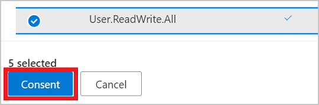
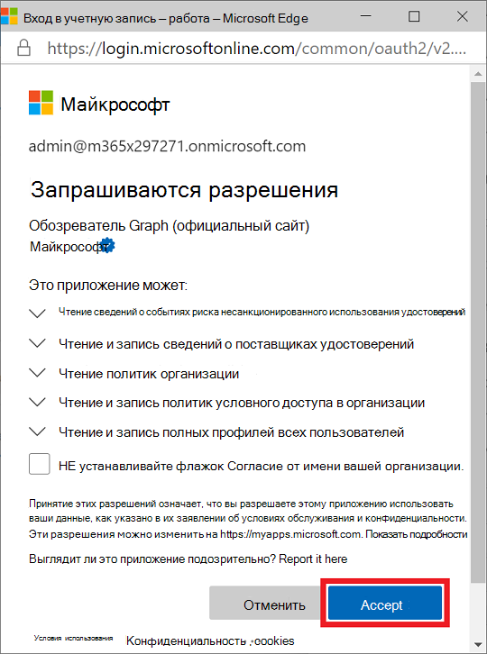
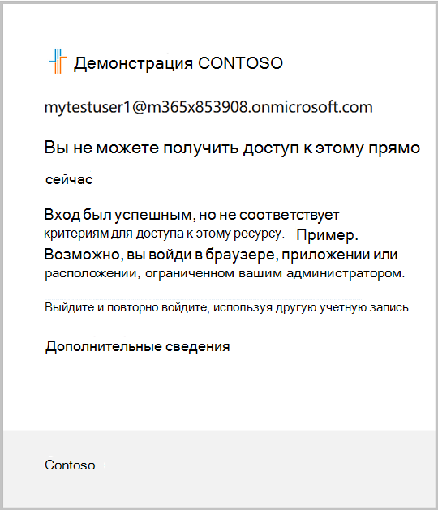

# <a name="tutorial-identify-and-remediate-risks-using-microsoft-graph-apis"></a>Руководство. Определение и устранение рисков с помощью API Graph Microsoft

Azure AD Identity Protection предоставляет организациям представление о риске на основе удостоверений и различных способах расследования и автоматического устранения риска. API защиты удостоверений, используемые в этом руководстве, помогут определить риски и настроить рабочий процесс, чтобы подтвердить компромисс или включить исправление. Дополнительные сведения см. [в дополнительных сведениях о риске?](/azure/active-directory/identity-protection/concept-identity-protection-risks)

В этом руководстве вы узнаете, как создать рискованный вход и реагентировать состояние риска пользователя с помощью политики условного доступа, которая требует многофакторной проверки подлинности (MFA). В необязательный раздел показано, как заблокировать вход пользователя с помощью политики условного доступа и отклонять риск пользователя.

>**Примечание:** Объекты отклика, показанные в этом руководстве, могут быть сокращены для чтения. 

## <a name="prerequisites"></a>Предварительные требования

Чтобы успешно завершить этот учебник, убедитесь, что у вас есть необходимые предпосылки:

- Для использования API обнаружения рисков Azure AD Premium P1 или P2.
- В этом руководстве браузер Tor используется для анонимного вход на портал Azure. Для выполнения задачи можно использовать любой анонимный браузер. Чтобы скачать браузер Tor, см. [в веб-сайте Download Tor Browser.](https://www.torproject.org/download/)
- В этом руководстве предполагается, что вы используете песочницу Microsoft Graph, но вы можете использовать Postman или создать собственное клиентское приложение, чтобы вызывать Microsoft Graph. Чтобы вызвать API Microsoft Graph в этом руководстве, используйте учетную запись с ролью глобального администратора и соответствующими разрешениями. Чтобы настроить разрешения в песочнице Microsoft Graph, выполните следующие действия.
    1. Запустите [песочницу Microsoft Graph](https://developer.microsoft.com/graph/graph-explorer).
    2. Выберите вариант **Вход с помощью учетной записи Майкрософт** и войдите, используя учетную запись глобального администратора Azure AD. После успешного входа вы увидите данные учетной записи пользователя на панели слева.
    3. Щелкните значок параметров справа от сведений об учетной записи пользователя и нажмите **Выбор разрешений**.

        
        
    4. Прокрутите список разрешений для этих разрешений:
        - **IdentityRiskEvents (2)**, расширение и выбор `IdentityRiskEvent.Read.All`
        - **IdentityRiskyUser (2)**, расширение и выбор `IdentityRiskyUser.ReadWrite.All`
        - **Политика (13),** расширение, а затем выбор `Policy.Read.All` и `Policy.ReadWrite.ConditionalAccess`
        - **Пользователь (8)**, расширить, а затем выбрать `User.ReadWrite.All`
        
        
    
    5. Нажмите **Согласие** и выберите **Принять**, чтобы согласиться принять разрешения. Вам не нужно предоставлять согласие от имени организации для этих разрешений.

        

## <a name="step-1-create-a-user-account"></a>Шаг 1. Создание учетной записи пользователя

В этом руководстве создается учетная запись пользователя, которая используется для тестирования обнаружения рисков. В теле запроса `contoso.com` измените доменное имя клиента. Информацию о клиенте можно найти на странице обзора в Azure Active Directory.

### <a name="request"></a>Запрос

``` http
POST https://graph.microsoft.com/v1.0/users
Content-type: application/json

{
  "accountEnabled":true,
  "displayName":"MyTestUser1",
  "mailNickname":"MyTestUser1",
  "userPrincipalName":"MyTestUser1@contoso.com",
  "passwordProfile": {
    "forceChangePasswordNextSignIn":true,
    "password":"Contoso1234"
  }
}
```

### <a name="response"></a>Отклик

```http
{
  "@odata.context": "https://graph.microsoft.com/v1.0/$metadata#users/$entity",
  "id": "4628e7df-dff3-407c-a08f-75f08c0806dc",
  "businessPhones": [],
  "displayName": "MyTestUser1",
  "givenName": null,
  "jobTitle": null,
  "mail": null,
  "mobilePhone": null,
  "officeLocation": null,
  "preferredLanguage": null,
  "surname": null,
  "userPrincipalName": "MyTestUser1@contoso.com"
}
```

## <a name="step-2-trigger-a-risk-detection"></a>Шаг 2. Запуск обнаружения рисков

### <a name="trigger-a-risk-detection"></a>Запуск обнаружения рисков

Одним из способов обнаружения рисков в учетной записи пользователя является анонимное вход на портал Azure. В этом руководстве браузер Tor используется для анонимного входов. 

1. Откройте браузер и `portal.azure.com` введите адрес сайта.
2. Во входе на портал с помощью учетных данных для ранее созданной учетной записи **MyTestUser1.** Вам будет предложено изменить существующий пароль.

### <a name="list-risk-detections"></a>Список обнаружения рисков

При вписыве на портал Azure с помощью анонимного браузера было обнаружено событие `anonymizedIPAddress` риска. Параметр запроса можно использовать для получения только обнаружения рисков, связанных с учетной записью `$filter` **пользователя MyTestUser1.**

#### <a name="request"></a>Запрос

``` http
GET https://graph.microsoft.com/v1.0/identityProtection/riskDetections?$filter=userDisplayName eq 'MyTestUser1'
```

#### <a name="response"></a>Отклик

```http
{
  "@odata.context": "https://graph.microsoft.com/v1.0/$metadata#riskDetections",
  "value": [
    {
      "id": "d52a631815aaa527bf642b196715da5cf0f35b6879204ea5b5c99b21bd4c16f4",
      "requestId": "06f7fd18-b8f1-407d-86a3-f6cbe3a4be00",
      "correlationId": "2a38abff-5701-4073-a81e-fd3aac09cba3",
      "riskType": "anonymizedIPAddress",
      "riskEventType": "anonymizedIPAddress",
      "riskState": "atRisk",
      "riskLevel": "medium",
      "riskDetail": "none",
      "source": "IdentityProtection",
      "detectionTimingType": "realtime",
      "activity": "signin",
      "tokenIssuerType": "AzureAD",
      "ipAddress": "178.17.170.23",
      "activityDateTime": "2020-11-03T20:51:34.6245276Z",
      "detectedDateTime": "2020-11-03T20:51:34.6245276Z",
      "lastUpdatedDateTime": "2020-11-03T20:53:12.1984203Z",
      "userId": "4628e7df-dff3-407c-a08f-75f08c0806dc",
      "userDisplayName": "MyTestUser1",
      "userPrincipalName": "MyTestUser1@contoso.com",
      "additionalInfo": "[{\"Key\":\"userAgent\",\"Value\":\"Mozilla/5.0 (Windows NT 10.0; rv:78.0) Gecko/20100101 Firefox/78.0\"}]",
      "location": {
        "city": "Chisinau",
        "state": "Chisinau",
        "countryOrRegion": "MD",
        "geoCoordinates": {
          "latitude": 47.0269,
          "longitude": 28.8416
        }
      }
    }
  ]
}
```

> **Примечание:** Для возврата события может потребоваться несколько минут.

## <a name="step-3-create-a-conditional-access-policy"></a>Шаг 3. Создание политики условного доступа

Вы можете использовать политики условного доступа в организации, чтобы позволить пользователям самостоятельно устранять риски при обнаружении риска. Самостоятельное исправление позволяет пользователям разблокировать себя для безопасного доступа к своим ресурсам после выполнения запроса политики. На этом шаге создается политика условного доступа, которая требует, чтобы пользователь вошел в использование MFA, если происходит обнаружение средней или высокой степени риска.

### <a name="set-up-multi-factor-authentication"></a>Настройка многофакторной проверки подлинности

При настройке учетной записи для MFA можно выбрать один из нескольких способов проверки подлинности пользователя. Выберите оптимальный метод для выполнения этого руководства. 

1. Во войдите [на](https://aka.ms/MFASetup) безопасном сайте учетной записи с помощью **учетной записи MyTestUser1.**
2. Выполните процедуру установки MFA с помощью соответствующего метода для вашей ситуации, например, отправив текстовое сообщение на телефон.

### <a name="create-the-conditional-access-policy"></a>Создание политики условного доступа

Политика условного доступа предоставляет возможность устанавливать условия политики для определения уровней риска для входных. Уровни риска могут быть `low` `medium` , , `high` `none` . В ответе, который был возвращен из перечисления обнаружения рисков **для MyTestUser1,** мы видим, что уровень риска `medium` . В этом примере показано, как требовать MFA для **MyTestUser1,** который был определен как рискованный пользователь.

#### <a name="request"></a>Запрос 

```http
POST https://graph.microsoft.com/v1.0/identity/conditionalAccess/policies 
Content-type: application/json
 
{ 
  "displayName": "Policy for risky sign-in", 
  "state": "enabled", 
  "conditions": { 
    "signInRiskLevels": [ 
      "high", 
      "medium" 
    ], 
    "applications": { 
      "includeApplications": ["All"]
    }, 
    "users": { 
      "includeUsers": [ 
        "4628e7df-dff3-407c-a08f-75f08c0806dc" 
      ] 
    } 
  }, 
  "grantControls": { 
    "operator": "OR", 
    "builtInControls": [ 
      "mfa" 
    ] 
  } 
} 
```

#### <a name="response"></a>Отклик 

```
{ 
  "@odata.context": "https://graph.microsoft.com/v1.0/$metadata#identity/conditionalAccess/policies/$entity", 
  "id": "9ad78153-b1f8-4714-adc1-1445727678a8", 
  "displayName": "Policy for risky sign-in", 
  "createdDateTime": "2020-11-03T20:56:38.6210843Z", 
  "modifiedDateTime": null, 
  "state": "enabled", 
  "sessionControls": null, 
  "conditions": { 
    "signInRiskLevels": [ 
      "high", 
      "medium" 
    ], 
    "clientAppTypes": [  
      "all"  
    ], 
    "platforms": null, 
    "locations": null, 
    "applications": { 
      "includeApplications": [ 
        "All" 
      ], 
      "excludeApplications": [], 
      "includeUserActions": [] 
    }, 
    "users": { 
      "includeUsers": [ 
        "4628e7df-dff3-407c-a08f-75f08c0806dc" 
      ], 
      "excludeUsers": [], 
      "includeGroups": [], 
      "excludeGroups": [], 
      "includeRoles": [], 
      "excludeRoles": [] 
    } 
  }, 
  "grantControls": { 
    "operator": "OR", 
    "builtInControls": [ 
      "mfa" 
    ], 
    "customAuthenticationFactors": [], 
    "termsOfUse": [] 
  } 
} 
```

С помощью этой политики условного доступа учетная запись **MyTestUser1** теперь обязана использовать MFA при входе, так как уровень риска для входов средний или   высокий. 

### <a name="sign-in-and-complete-multi-factor-authentication"></a>Вход и полная многофакторная проверка подлинности 

При входе в анонимный браузер обнаруживается риск, но он устраняется, заполнив MFA. 

1. Откройте браузер и  `portal.azure.com`   введите адрес сайта. 
2. Вход на портал с использованием учетных данных для учетной записи **MyTestUser1** и   завершение процесса MFA. 

### <a name="list-risk-detections"></a>Список обнаружения рисков

Потому что MFA был завершен. Теперь, когда вы перечисляете обнаружения **рисков, riskState** показывает событие как `remediated` .

#### <a name="request"></a>Запрос

``` http
GET https://graph.microsoft.com/v1.0/identityProtection/riskDetections?$filter=userDisplayName eq 'MyTestUser1'
```

#### <a name="response"></a>Отклик

```http
{
  "id": "ba9d45f16d8f87f6ae974efda7336b2120962a398cb362dfd9e5bdc8e9d149d0",
  "requestId": "156c01fb-31cf-4a10-b9a9-beee93e6a400",
  "correlationId": "a8aaac45-fe22-46df-babf-10a8dba85d62",
  "riskType": "anonymizedIPAddress",
  "riskEventType": "anonymizedIPAddress",
  "riskState": "remediated",
  "riskLevel": "medium",
  "riskDetail": "userPassedMFADrivenByRiskBasedPolicy",
  "source": "IdentityProtection",
  "detectionTimingType": "realtime",
  "activity": "signin",
  "tokenIssuerType": "AzureAD",
  "ipAddress": "185.220.101.213",
  "activityDateTime": "2020-11-12T23:45:22.4092789Z",
  "detectedDateTime": "2020-11-12T23:45:22.4092789Z",
  "lastUpdatedDateTime": "2020-11-12T23:47:57.7831423Z",
  "userId": "4b608561-9258-44ba-8cdb-3286dcbf0e3b",
  "userDisplayName": "MyTestUser1",
  "userPrincipalName": "MyTestUser1@contoso.com",
    "additionalInfo": "[{\"Key\":\"userAgent\",\"Value\":\"Mozilla/5.0 (Windows NT 10.0; rv:78.0) Gecko/20100101 Firefox/78.0\"}]",
  "location": {
    "city": "Schoenwalde-Glien",
    "state": "Brandenburg",
    "countryOrRegion": "DE",
    "geoCoordinates": {
      "latitude": 52.61983,
      "longitude": 13.12743
    }
  }
}
```

## <a name="step-4-optional-block-the-user-from-signing-in"></a>Шаг 4 (необязательный) блокирует вход пользователя

Вместо предоставления пользователю возможности самостоятельного восстановления можно заблокировать вход пользователя. На этом этапе создается новая политика условного доступа, которая блокирует вход пользователя в случае обнаружения средней или высокой опасности. Разница в политиках заключается в том, что **встроенныеInControls** занижают `block` значение .

### <a name="request"></a>Запрос

```http
POST https://graph.microsoft.com/v1.0/identity/conditionalAccess/policies
Content-type: application/json

{
  "displayName": "Policy for risky sign-in block access",
  "state": "enabled",
  "conditions": {
    "signInRiskLevels": [
      "high",
      "medium"
    ],
    "applications": {
      "includeApplications": ["All"]
    },
    "users": {
      "includeUsers": [
        "4628e7df-dff3-407c-a08f-75f08c0806dc"
      ]
    }
  },
  "grantControls": {
    "operator": "OR",
    "builtInControls": [
      "block"
    ]
  }
}
```

### <a name="response"></a>Отклик

```http
{
  "@odata.context": "https://graph.microsoft.com/v1.0/$metadata#identity/conditionalAccess/policies/$entity",
  "id": "9ad78153-b1f8-4714-adc1-1445727678a8",
  "displayName": "Policy for risky sign-in block access",
  "createdDateTime": "2020-11-03T20:56:38.6210843Z",
  "modifiedDateTime": null,
  "state": "enabled",
  "sessionControls": null,
  "conditions": {
    "signInRiskLevels": [
      "high",
      "medium"
    ],
    "clientAppTypes": [ 
      "all" 
    ],
    "platforms": null,
    "locations": null,
    "applications": {
      "includeApplications": [
        "All"
      ],
      "excludeApplications": [],
      "includeUserActions": []
    },
    "users": {
      "includeUsers": [
        "4628e7df-dff3-407c-a08f-75f08c0806dc"
      ],
      "excludeUsers": [],
      "includeGroups": [],
      "excludeGroups": [],
      "includeRoles": [],
      "excludeRoles": []
    }
  },
  "grantControls": {
    "operator": "OR",
    "builtInControls": [
      "block"
    ],
    "customAuthenticationFactors": [],
    "termsOfUse": []
  }
}
```

С помощью этой политики условного доступа учетная запись **MyTestUser1** теперь заблокирована для входов, так как уровень риска входной записи `medium` или `high` .



## <a name="step-5-dismiss-risky-users"></a>Шаг 5. Увольнение рискованных пользователей

Если вы считаете, что пользователю не угрожает опасность и вы не хотите применять политику условного доступа, можно вручную отстранять рискованного пользователя.

### <a name="dismiss-the-risky-user"></a>Увольнение рискованного пользователя

#### <a name="request"></a>Запрос

```http
POST https://graph.microsoft.com/v1.0/identityProtection/riskyUsers/dismiss
Content-Type: application/json

{
  "userIds": [
    "4628e7df-dff3-407c-a08f-75f08c0806dc"
  ]
}
```

#### <a name="response"></a>Отклик

```http
HTTP/1.1 204 No Content
```        

### <a name="list-risky-users"></a>Список рискованных пользователей

После увольнения пользователя с рисками можно увидеть в ответе при перечислении рискованных пользователей, что учетная запись **пользователя MyTestUser1** теперь имеет уровень риска и уровень `none` рискаState `dismissed` .

#### <a name="request"></a>Запрос

```http
GET https://graph.microsoft.com/v1.0/identityProtection/riskyUsers?$filter=userDisplayName eq 'MyTestUser1'
```

#### <a name="response"></a>Отклик

```http
{
  "@odata.context": "https://graph.microsoft.com/beta/$metadata#riskyUsers",
  "value": [
    {
      "id": "4628e7df-dff3-407c-a08f-75f08c0806dc",
      "isDeleted": false,
      "isProcessing": false,
      "riskLevel": "none",
      "riskState": "dismissed",
      "riskDetail": "adminDismissedAllRiskForUser",
      "riskLastUpdatedDateTime": "2020-11-03T21:48:53.4298425Z",
      "userDisplayName": "MyTestUser1",
      "userPrincipalName": "MyTestUser1@contoso.com"
    }
  ]
}
```

## <a name="step-6-clean-up-resources"></a>Шаг 6. Очистка ресурсов

На этом шаге вы удаляете созданные ресурсы.

### <a name="delete-the-user-account"></a>Удаление учетной записи пользователя

Удаление **учетной записи пользователя MyTestUser1.**

#### <a name="request"></a>Запрос

```http
DELETE https://graph.microsoft.com/v1.0/users/4628e7df-dff3-407c-a08f-75f08c0806dc
```

#### <a name="response"></a>Отклик

```http
No Content - 204
```

### <a name="delete-the-conditional-access-policy"></a>Удаление политики условного доступа

Удалите созданную политику условного доступа.

#### <a name="request"></a>Запрос

```http
DELETE https://graph.microsoft.com/v1.0/groups/9ad78153-b1f8-4714-adc1-1445727678a8
```

#### <a name="response"></a>Отклик

```http
No Content - 204
```

## <a name="see-also"></a>См. также

В этом руководстве вы использовали множество API для выполнения задач. Ознакомьтесь со ссылкой на API для этих API, чтобы узнать больше о том, что могут делать API.

- [Что такое защита удостоверений?](/azure/active-directory/identity-protection/overview-identity-protection)
- [Что такое условный доступ?](/azure/active-directory/conditional-access/overview)
- [Как это работает: многофакторная проверка подлинности Azure](/azure/active-directory/authentication/concept-mfa-howitworks)
- [Моделирование обнаружения рисков в области защиты удостоверений](/azure/active-directory/identity-protection/howto-identity-protection-simulate-risk)
- [conditionalAccessPolicy](/graph/api/resources/conditionalaccesspolicy)
- [riskDetection](/graph/api/resources/riskdetection)
- [riskyUser](/graph/api/resources/riskyuser)
- [user](/graph/api/resources/user)
