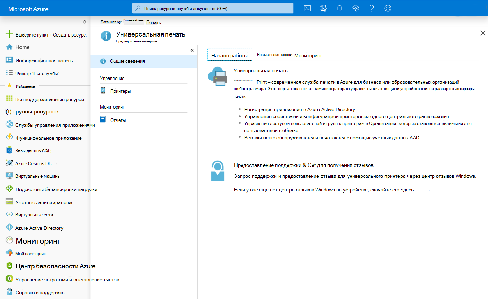

# Обзор API облачной среды универсальной печати

Универсальная печать — это современное решение печати, которое можно использовать в организациях для управления инфраструктурой печати через облачные службы от Майкрософт.

## Зачем нужна универсальная печать?

Универсальная печать — это функции печати Windows Server, перенесенные в облако Microsoft 365, благодаря которым организации теперь могут обойтись без локальных серверов печати и не устанавливать драйверы печати на устройствах. Кроме того, в рамках универсальной печати предусмотрены дополнительные функции, например, группы безопасности для доступа к принтеру, обнаружение принтеров на основе расположения и расширенными возможностями для администраторов.

По мере внедрения универсальной печати в организациях организации и независимые поставщики программного обеспечения могут использовать API универсальной печати в Microsoft Graph, чтобы создавать и расширять приложения для поддержки новых сценариев.

### Печать документов из веб-приложений и мобильных приложений

Благодаря перемещению инфраструктуры печати в облако печатать документы можно непосредственно из веб-приложений и мобильных приложений.
- Пользователи могут отправлять задания печати в printerShare.
- Кроме того, администраторы принтера могут отправлять задания печати на принтер для выполнения предварительного тестирования, прежде чем предоставить организации общий доступ к принтеру.

Выполните указанные ниже действия, чтобы отправить задания печати в printerShare.

1. [Создайте задание печати](/graph/api/printershare-post-jobs) и сохраните идентификатор полученного документа.
2. [Создайте uploadSession](/graph/api/printdocument-createuploadsession) для документа. 
3. [Отправьте байты в созданный сеанс отправки](./upload-data-to-upload-session.md).
4. [Запустите задание печати](/graph/api/printjob-start).

### Управление принтерами

Отследить принтеры организации, настройки принтеров и их использование — непростая задача. Благодаря API универсальной печати можно интегрировать эти три направления.

* **Отслеживать состояние принтеров, их настройки и доступность** можно через [Список принтеров](/graph/api/print-list-printers) и [printerStatus](/graph/api/resources/printerstatus).

* **Узнать, кто из пользователей использует принтеры и сколько страниц они печатают** можно через отчетные API:
  * [List dailyPrintUsageByUser](/graph/api/reportroot-list-dailyprintusagebyuser)
  * [List monthlyPrintUsageByUser](/graph/api/reportroot-list-monthlyprintusagebyuser)
  * [List dailyPrintUsageByPrinter](/graph/api/reportroot-list-dailyprintusagebyprinter)
  * [List monthlyPrintUsageByPrinter](/graph/api/reportroot-list-monthlyprintusagebyprinter)

* **Настройка разрешений для пользователей** через изменения в членстве пользователей и групп касательно принтеров:
  * [Список allowedUsers](/graph/api/printershare-list-allowedusers)
  * [Добавление allowedUser](/graph/api/printershare-post-allowedusers)
  * [Удаление allowedUser](/graph/api/printershare-delete-alloweduser)
  * [Список allowedGroups](/graph/api/printershare-list-allowedgroups)
  * [Добавление allowedGroup](/graph/api/printershare-post-allowedgroups)
  * [Удаление allowedGroup](/graph/api/printershare-delete-allowedgroup)

### Комфорт при замене и обновлении оборудования для печати

Принтеры не видны пользователям до момента, когда они получают к ним [доступ](/graph/api/print-post-shares). Это позволяет администраторам детально контролировать доступность определенного оборудования для печати в определенный момент времени.

При общем доступе к принтеру создается ресурс [printerShare](/graph/api/resources/printershare), который в любой момент можно обновить для перевода на другой принтер, что упрощает замену неисправного оборудования для печати и отправку принтеров в текущий ремонт.

Чтобы применить эту возможность в своем приложении, перейдите в [Обновление printerShare](/graph/api/printershare-update) и обновите ссылку `printer` на printerShare.

### Расширение универсальной печати для поддержки печати по запросу

API универсальной печати Microsoft Graph позволяет приложению поддерживать печать по запросу. Чтобы настроить печать по запросу, необходимо зарегистрировать триггеры, уведомляющие приложение (через коммуникацию в рамках уведомления между службами), когда имеют место определенные события печати, такие как запуск задания печати.

Эти триггеры позволяют приложению прерывать рабочий процесс печати для выполнения таких задач, как перенаправление заданий на различные принтеры и изменение полезных данных документа.

Выполните следующие действия, чтобы включить печать по запросу:

1. [Создайте printTaskDefinition](/graph/api/print-post-taskdefinitions) с помощью разрешений приложения. Это абстрактное определение задачи будет использоваться для создания задачи, которая будет содержать задание для вашего приложения. Необходимо определить по крайней мере одно определение задачи для каждого клиента, которое можно связать с любым количеством принтеров в клиенте с помощью триггеров задач (см. Шаг 4).

2. [Зарегистрируйте один виртуальный принтер или более](/graph/api/printer-create) с помощью администраторского маркера проверки подлинности и `null` **physicalDeviceId**. "Виртуальный принтер" представляет собой объект принтера в Universal Print без прикрепленного физического устройства. Как правило, пользователи выполняют печать на виртуальных принтерах, а затем выбирают свои задания печати на физическом устройстве печати. См. шаг 6.

3. [Обновляйте атрибуты вашего виртуального принтера](/graph/api/printer-update) с помощью разрешений приложения и типа носителя `application/ipp` (см. примеры).

4. [Создайте триггер задачи для вашего виртуального принтера](/graph/api/printer-post-tasktriggers) с помощью администраторского маркера проверки подлинности, который будет использоваться для сопоставления определения задачи с виртуальным принтером.

5. При отправке задания печати на виртуальный принтер оно будет приостановлено по причине [printTaskTrigger](/graph/api/resources/printtasktrigger). Будут созданы [printTask](/graph/api/resources/printtask) с состоянием `processing` на основе связанного [printTaskDefinition](/graph/api/resources/printtaskdefinition).

6. При прокрутке пользователем эмблемы на физическом принтере, принтер уведомит ваше приложение. В это время приложение может [получить задания связанного виртуального принтера](/graph/api/printer-list-jobs) и отфильтровать список на задания, созданные текущим пользователем.

7. При выборе пользователем одного или нескольких заданий для печати, приложение может [перенаправить задание (-я) печати](/graph/api/printjob-redirect) на физический принтер, и задание запустит печать. Вызов на перенаправление будет успешным только в том случае, если присутствует [printTask](/graph/api/resources/printtask) в состоянии `processing` в связанном принтере, запущенном триггером, который был создан этим приложением в Шаге 4. После перенаправления задания, задача автоматически будет настроена на состояние `completed`.

## Справочные материалы по API
Ищете справочные материалы по API для этой службы?

- [API универсальной печати в Microsoft Graph](/graph/api/resources/print)

## Предоставление отзывов

Мы будем рады узнать ваше мнение об API универсальной печати. Укажите свои предложения на [форуме идей платформы для разработчиков Microsoft 365](https://techcommunity.microsoft.com/t5/microsoft-365-developer-platform/idb-p/Microsoft365DeveloperPlatform/label-name/Microsoft%20Graph).

## См. также

- [Что такое универсальная печать](/universal-print/fundamentals/universal-print-whatis)
