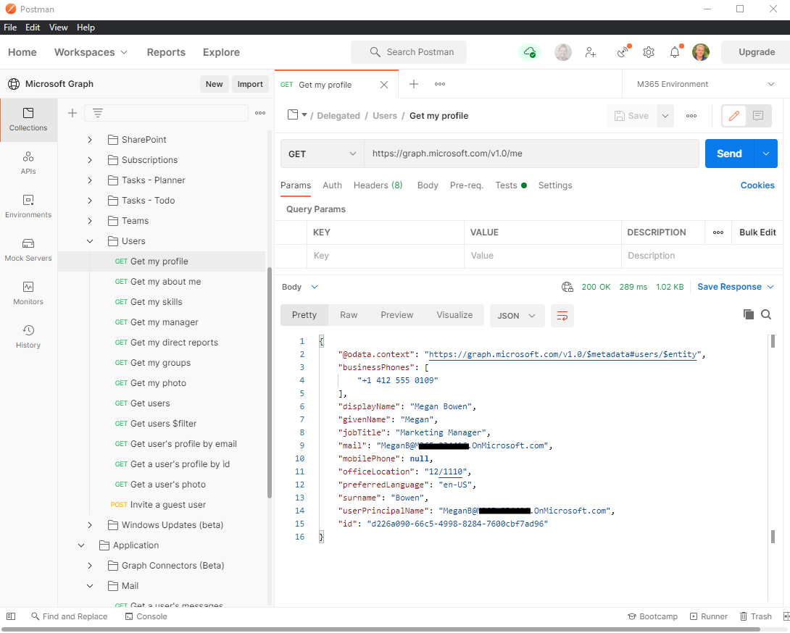

# Использование Postman с API Microsoft Graph

Вы можете использовать коллекцию Microsoft Graph Postman, чтобы начать работу с API Microsoft Graph в считанные минуты.

В этой статье рассказывается о том, как быстро приступить к работе с Postman и Microsoft Graph. Кроме того, вы можете просматривать API Microsoft Graph непосредственно в веб-браузере с помощью [песочницы Graph](https://developer.microsoft.com/graph/graph-explorer).

Чтобы узнать, как это сделать, выполните действия, описанные в этой статье, или посмотрите видео [Начало работы с рабочей областью Microsoft Graph Postman](https://youtu.be/3RTHY3jScmA).

## Шаг 1. Разветвление коллекции Microsoft Graph Postman

Чтобы использовать коллекцию Postman, необходимо разветвить ее в рабочей области Postman. Сделайте это из браузера.

1. Откройте [Postman](https://www.postman.com/) и войдите.
1. Перейдите в коллекцию Postman с меткой [Microsoft Graph](https://www.postman.com/microsoftgraph/workspace/microsoft-graph/collection/455214-085f7047-1bec-4570-9ed0-3a7253be148c/fork).
1. Укажите метку для своей вилки. Это может быть любой текст.
1. В разделе рабочей области выберите **My Workspace** (Моя рабочая область) в раскрывающемся списке.
1. Выберите **Коллекция развилок репозитория**.

Вы будете перенаправлены в вилку главной коллекции Microsoft Graph Postman в своей рабочей области.

## Шаг 2. Скачивание агента (необязательно, только в веб-браузере Postman)

Чтобы использовать эту конкретную коллекцию Postman в своем веб-браузере, скачайте [классический агент Postman](https://www.postman.com/downloads). Без этого вы не можете использовать Postman для Интернета из-за ограничений CORS в веб-браузере.

Вам не требуется агент, если вы используете Postman для приложения Windows. Если вы открываете Postman для Windows, вы увидите эту разветвленную коллекцию в своей рабочей области.

## Шаг 3. Создание приложения Azure AD

Чтобы использовать эту коллекцию в своем клиенте разработчика, создайте приложение Azure AD и предоставьте ему соответствующие разрешения для запросов, которые нужно выполнять. Если у вас нет клиента разработчика, вы можете зарегистрироваться для получения одного из них в [программе для разработчиков Microsoft 365](https://developer.microsoft.com/microsoft-365/dev-program).

1. Перейдите на сайт [portal.azure.com](https://portal.azure.com/) и войдите, используя свою учетную запись администратора клиента разработчика.
1. В разделе **Службы Azure** выберите **Azure Active Directory**.
1. В меню слева выберите **Регистрация приложений**.
1. В горизонтальном меню выберите **Новая регистрация**.
1. В качестве **имени приложения** укажите `Postman`.
1. В раскрывающемся меню выберите **Веб**. 
1. Присвойте параметру **URI перенаправления** значение `https://oauth.pstmn.io/v1/callback`.
1. Нажмите **Зарегистрировать**.
1. В меню слева выберите **Проверка подлинности**.
1. В разделе **URI перенаправления** выберите **Добавить URI**. Установите значение `https://app.getpostman.com/oauth2/callback`, а затем нажмите **Сохранить**.
1. В меню слева выберите **Разрешения API**.
1. В горизонтальном меню выберите **Добавить разрешение**, затем **Microsoft Graph** и **Делегированные разрешения**.
1. Введите `Mail.`, разверните параметры **Mail** и установите флажок **Mail.Read**.
1. Щелкните **Разрешения приложений**, введите `User.`и просмотрите **разрешения приложений**.
1. Разверните параметры **User** и установите флажок **User.Read.All**.
1. Выберите **Добавить разрешения**.
1. В горизонтальном меню выберите **Предоставить согласие администратора для** и нажмите **Да**.
1. В меню слева выберите **Обзор**. Здесь можно узнать **Идентификатор приложения (клиент)** и **Идентификатор каталога (клиент)**. Они понадобятся вам на шаге 4.
1. В меню слева выберите **Сертификаты и секреты**.
1. Выберите **Новый секрет клиента**, введите описание и нажмите **Добавить**. Наведите курсор на **значение** нового секрета клиента и скопируйте его. Оно понадобится вам на шаге 4.

У приложения Azure AD теперь есть разрешения на выполнение запросов от имени пользователя для вызова Mail.Read и вызова User.Read.All в качестве приложения.

## Шаг 4. Настройка проверки подлинности в Postman

На этом шаге вы настроите переменные среды, используемые для получения маркера доступа.

1. Перейдите в [Развилку среды](https://www.postman.com/microsoftgraph/workspace/microsoft-graph/environment/455214-efbc69b2-69bd-402e-9e72-850b3a49bb21/fork).
1. Добавьте метку для развилки. Это может быть любой текст.
1. В разделе рабочей области выберите **My Workspace** (Моя рабочая область) в раскрывающемся списке.
1. Выберите **Среда развилок репозитория**.
1. В `ClientID` задайте **Текущее значение** для значения ИД приложения (клиента) из шага 3.15.
1. В `ClientSecret` задайте **Текущее значение** для секретного значения клиента из шага 3.17.
1. В `TenantID` задайте **Текущее значение** для значения ИД каталога (клиента) из шага 3.15.
1. В правом верхнем углу нажмите **Сохранить**.
1. Закройте диалоговое окно **Управление средами**.
1. В правом верхнем углу рядом со значком глаза убедитесь, что в раскрывающемся меню выбрано значение **Среда M365**, а не значение **Без среды**.

## Шаг 5. Получение маркера делегированного доступа

Так как вы впервые выполняете запрос в виде делегированного потока проверки подлинности, вам потребуется получить маркер доступа.

1. Выберите папку **Делегированные**.
1. Выберите вкладку **Авторизация**.
1. В разделе **Настройка нового маркера** щелкните вкладку **Параметры конфигурации**. Оставьте предварительно настроенные значения для всех полей, включая **Тип предоставления разрешения**, для которого задано значение `Authorization Code`.
1. Прокрутите страницу вправо и щелкните **Получить новый маркер доступа**.
1. Войдите с помощью учетной записи администратора клиента разработчика.
1. Щелкните **Продолжить**, а затем **Использовать маркер**.

Теперь у вас есть действительный маркер доступа для использования в делегированных запросах.

## Шаг 6. Выполнение первого делегированного запроса

В папке **Делегированное** расположены запросы различных рабочих нагрузок Microsoft Graph, которые вы можете вызвать.

1. Разверните папку **Делегированное**, а затем — папку **Почта**.
1. Дважды щелкните **Get my messages** (Получить мои сообщения), чтобы создать запрос.
1. В правом верхнем углу нажмите **Отправить**.

Вы успешно выполнили вызов Microsoft Graph с помощью делегированной проверки подлинности.

## Действие 7. Получение маркера доступа приложения

Так как вы впервые выполняете запрос в виде потока проверки подлинности приложения, вам потребуется получить маркер доступа.

1. Выберите папку **Приложение**.
1. Выберите вкладку **Авторизация**.
1. В разделе **Настройка нового маркера** щелкните вкладку **Параметры конфигурации**. Оставьте предварительно настроенные значения для всех полей, включая **Тип предоставления разрешения**, для которого задано значение `Client Credentials`.
1. Прокрутите страницу вправо и щелкните **Получить новый маркер доступа**.
1. Щелкните **Продолжить**, а затем **Использовать маркер**.

Теперь у вас есть действительный маркер доступа для использования в запросах приложения.

## Шаг 8. Выполнение первого запроса приложения

В папке **Application** (Приложение) расположены запросы различных рабочих нагрузок Microsoft Graph, которые вы можете вызвать.

1. Разверните папку **Application** (Приложение), а затем — папку **User** (Пользователь).
1. Дважды щелкните **Get Users** (Получить пользователей), чтобы создать запрос.
1. В правом верхнем углу нажмите **Отправить**.

Вы успешно выполнили вызов Microsoft Graph с помощью проверки подлинности приложения.

Чтобы осуществить другие запросы в Microsoft Graph, можно выполнить следующие действия. Помните, что для выполнения других запросов вам требуется добавить разрешение для приложения Azure AD. В противном случае в ваших откликах будут возникать ошибки с отказом в получении разрешений.

### Добавление в коллекцию

Если вы хотите добавить собственные запросы, вам потребуется лицензия Postman. Вы можете внести изменения в разветвленную коллекцию, а затем навести курсор на верхний узел коллекции и выбрать пункт **Create pull request** (Создать запрос на вытягивание).

## Известные проблемы

### Ошибка проверки подлинности: "Вы не сможете добраться отсюда"

Определенные [политики условного доступа](/azure/active-directory/conditional-access/overview), настроенные администраторами организации, могут блокировать поток проверки подлинности Postman. Обратитесь к администраторам, чтобы изучить альтернативные варианты.

## См. также

Чтобы узнать, как это сделать, посмотрите видео [Начало работы с коллекцией Microsoft Graph Postman](https://youtu.be/3RTHY3jScmA).
