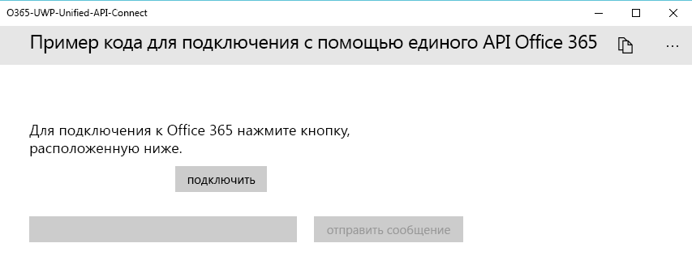
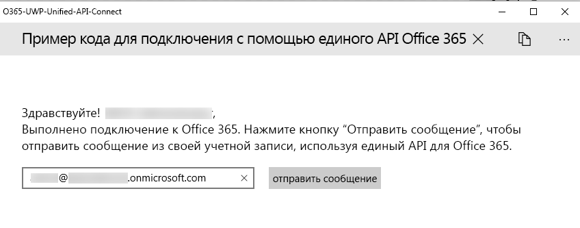

# <a name="get-started-with-microsoft-graph-in-a-universal-windows-10-app"></a><span data-ttu-id="da36f-101">Начало работы с Microsoft Graph в универсальном приложении для Windows 10</span><span class="sxs-lookup"><span data-stu-id="da36f-101">Get started with Microsoft Graph in a universal Windows 10 app</span></span>

> <span data-ttu-id="da36f-p101">**Создаете приложения для корпоративных клиентов?** Ваше приложение может не работать, если корпоративный клиент включит функции корпоративной безопасности для мобильных устройств, например <a href="https://azure.microsoft.com/en-us/documentation/articles/active-directory-conditional-access-device-policies/" target="_newtab">условный доступ с устройств</a>. В этом случае у пользователей могут возникать ошибки, а вы не будете об этом знать.</span><span class="sxs-lookup"><span data-stu-id="da36f-p101">**Building apps for enterprise customers?** Your app may not work if your enterprise customer turns on enterprise mobility security features like <a href="https://azure.microsoft.com/en-us/documentation/articles/active-directory-conditional-access-device-policies/" target="_newtab">conditional device access</a>. In this case, you may not know and your customers may experience errors.</span></span> 

> <span data-ttu-id="da36f-p102">Для поддержки **всех корпоративных клиентов** в **любых корпоративных сценариях** необходимо использовать конечную точку Azure AD и управлять приложениями с помощью [портала Azure](https://aka.ms/aadapplist). Дополнительные сведения см. в разделе [Выбор между конечными точками Azure AD и Azure AD версии 2.0](../concepts/auth_overview.md#deciding-between-the-azure-ad-and-azure-ad-v20-endpoints).</span><span class="sxs-lookup"><span data-stu-id="da36f-p102">To support **all enterprise customers** across **all enterprise scenarios**, you must use the Azure AD endpoint and manage your apps using the [Azure portal](https://aka.ms/aadapplist). For more information, see [Deciding between the Azure AD and Azure AD v2.0 endpoints](../concepts/auth_overview.md#deciding-between-the-azure-ad-and-azure-ad-v20-endpoints).</span></span>

<span data-ttu-id="da36f-p103">В этой статье описаны задачи, которые необходимо выполнить, чтобы получить маркер доступа из [конечной точки Azure AD 2.0](https://developer.microsoft.com/ru-RU/graph/docs/concepts/converged_auth) и вызвать Microsoft Graph. Она содержит разбор кода [примера решения для UWP, позволяющего выполнить подключение и использующего библиотеку Microsoft Graph](https://github.com/microsoftgraph/uwp-csharp-connect-sample). В этой статье также рассмотрены основные понятия, которые необходимо реализовать в приложении, использующем Microsoft Graph.</span><span class="sxs-lookup"><span data-stu-id="da36f-p103">This article describes the tasks required to get an access token from the [Azure AD v2.0 endpoint](https://developer.microsoft.com/ru-RU/graph/docs/concepts/converged_auth) and call Microsoft Graph. It walks you through the code inside the [Microsoft Graph Connect Sample for UWP (Library)](https://github.com/microsoftgraph/uwp-csharp-connect-sample) samples to explain the main concepts that you have to implement in an app that uses Microsoft Graph.</span></span>

<span data-ttu-id="da36f-p104">**Не хотите создавать приложение?** Воспользуйтесь [краткой инструкцией по Microsoft Graph](https://developer.microsoft.com/graph/quick-start) для быстрого начала работы или скачайте [пример решения для UWP, позволяющего выполнить подключение и использующего библиотеку Microsoft Graph](https://github.com/microsoftgraph/uwp-csharp-connect-sample), который рассмотрен в этой статье. Обратите внимание на то, что у нас также есть [REST-версия этого решения](https://github.com/microsoftgraph/uwp-csharp-connect-rest-sample).</span><span class="sxs-lookup"><span data-stu-id="da36f-p104">**Don't feel like building an app?** Use the [Microsoft Graph quick start](https://developer.microsoft.com/graph/quick-start) to get up and running fast, or download the [Microsoft Graph Connect Sample for UWP (Library)](https://github.com/microsoftgraph/uwp-csharp-connect-sample) that this article is based on. Also note that we have a [REST version of this sample](https://github.com/microsoftgraph/uwp-csharp-connect-rest-sample).</span></span>

## <a name="sample-user-interface"></a><span data-ttu-id="da36f-112">Пользовательский интерфейс решения</span><span class="sxs-lookup"><span data-stu-id="da36f-112">Sample user interface</span></span>

<span data-ttu-id="da36f-113">У этого приложения очень простой пользовательский интерфейс, состоящий из верхней панели команд, **кнопки подключения**, кнопки **отправки почты** и текстового поля, в которое автоматически подставляется адрес электронной почты вошедшего пользователя (его можно изменить).</span><span class="sxs-lookup"><span data-stu-id="da36f-113">The sample contains a very simple user interface, consisting of a top command bar, a **connect button**, a **send mail** button, and a text box that is automatically populated with the signed-in user's e-mail address but that can be edited.</span></span>

<span data-ttu-id="da36f-114">Если пользователь не подключен, кнопка **отправки почты** неактивна:</span><span class="sxs-lookup"><span data-stu-id="da36f-114">The **send mail** button is disabled when the user has not connected:</span></span>



<span data-ttu-id="da36f-116">Если пользователь подключен, на верхней панели команд отображается кнопка отключения:</span><span class="sxs-lookup"><span data-stu-id="da36f-116">The top command bar contains a disconnect button when the user has connected:</span></span>



<span data-ttu-id="da36f-118">Все строки пользовательского интерфейса хранятся в файле Resources.resw в папке Assets.</span><span class="sxs-lookup"><span data-stu-id="da36f-118">All of the sample's UI strings are stored in the Resources.resw file inside the Assets folder.</span></span>

## <a name="prerequisites"></a><span data-ttu-id="da36f-119">Необходимые условия</span><span class="sxs-lookup"><span data-stu-id="da36f-119">Prerequisites</span></span>

<span data-ttu-id="da36f-120">Чтобы приступить к работе, вам понадобится следующее:</span><span class="sxs-lookup"><span data-stu-id="da36f-120">To get started, you'll need:</span></span> 

- <span data-ttu-id="da36f-121">[Учетная запись Майкрософт](https://www.outlook.com/) либо [рабочая или учебная учетная запись](https://docs.microsoft.com/ru-RU/office/developer-program/office-365-developer-program-faq#account-types).</span><span class="sxs-lookup"><span data-stu-id="da36f-121">A [Microsoft account](https://www.outlook.com/) or a [work or school account](https://docs.microsoft.com/ru-RU/office/developer-program/office-365-developer-program-faq#account-types)</span></span>
- <span data-ttu-id="da36f-122">Visual Studio 2017</span><span class="sxs-lookup"><span data-stu-id="da36f-122">Visual Studio 2017</span></span> 
- <span data-ttu-id="da36f-p105">[Начальный проект Microsoft Graph для UWP (MSAL)](https://github.com/microsoftgraph/uwp-csharp-connect-sample/tree/master/starter). Оба шаблона содержат пустые классы, в которые вы можете добавить код. Они также содержат строки ресурсов. Чтобы получить этот проект, клонируйте или скачайте [пример решения для UWP, позволяющего выполнить подключение и использующего библиотеку Microsoft Graph](https://github.com/microsoftgraph/uwp-csharp-connect-sample). Затем откройте его в папке **starter**.</span><span class="sxs-lookup"><span data-stu-id="da36f-p105">The [Microsoft Graph Starter Project for UWP (Library)](https://github.com/microsoftgraph/uwp-csharp-connect-sample/tree/master/starter). Both templates contain empty classes that you'll add code to. They also contains resource strings. To get this project, clone or download the [Microsoft Graph Connect Sample for UWP (Library)](https://github.com/microsoftgraph/uwp-csharp-connect-sample) and then open the solution inside the **starter** folder.</span></span>


## <a name="register-the-app"></a><span data-ttu-id="da36f-127">Регистрация приложения</span><span class="sxs-lookup"><span data-stu-id="da36f-127">Register the app</span></span>
 
1. <span data-ttu-id="da36f-128">Войдите на [портал регистрации приложений](https://apps.dev.microsoft.com/) с помощью личной, рабочей или учебной учетной записи.</span><span class="sxs-lookup"><span data-stu-id="da36f-128">Sign into the [App Registration Portal](https://apps.dev.microsoft.com/) using either your personal or work or school account.</span></span>
2. <span data-ttu-id="da36f-129">Выберите пункт **Добавить приложение**.</span><span class="sxs-lookup"><span data-stu-id="da36f-129">Select **Add an app**.</span></span>
3. <span data-ttu-id="da36f-130">Введите имя приложения и выберите пункт **Создать приложение**.</span><span class="sxs-lookup"><span data-stu-id="da36f-130">Enter a name for the app, and select **Create application**.</span></span>
    
    <span data-ttu-id="da36f-131">Откроется страница регистрации со свойствами приложения.</span><span class="sxs-lookup"><span data-stu-id="da36f-131">The registration page displays, listing the properties of your app.</span></span>
 
4. <span data-ttu-id="da36f-132">В разделе **Платформы** нажмите **Добавление платформы**.</span><span class="sxs-lookup"><span data-stu-id="da36f-132">Under **Platforms**, select **Add platform**.</span></span>
5. <span data-ttu-id="da36f-133">Выберите **Собственное приложение**.</span><span class="sxs-lookup"><span data-stu-id="da36f-133">Select **Native Application**.</span></span>
6. <span data-ttu-id="da36f-p106">Скопируйте идентификатор клиента (идентификатор приложения) и URI перенаправления в буфер обмена. Эти значения потребуется ввести в примере приложения.</span><span class="sxs-lookup"><span data-stu-id="da36f-p106">Copy both the Client Id (App Id) and Redirect URI values to the clipboard. You'll need to enter these values into the sample app.</span></span>

    <span data-ttu-id="da36f-p107">Идентификатор приложения уникален. URI перенаправления — это уникальный универсальный код ресурса (URI), предоставляемый каждому приложению операционной системой Windows 10, чтобы гарантировать, что сообщения, отправленные на этот URI, отправляются только этому приложению.</span><span class="sxs-lookup"><span data-stu-id="da36f-p107">The app id is a unique identifier for your app. The redirect URI is a unique URI provided by Windows 10 for each application to ensure that messages sent to that URI are only sent to that application.</span></span> 

7. <span data-ttu-id="da36f-138">Нажмите кнопку **Сохранить**.</span><span class="sxs-lookup"><span data-stu-id="da36f-138">Select **Save**.</span></span>

## <a name="configure-the-project"></a><span data-ttu-id="da36f-139">Настройка проекта</span><span class="sxs-lookup"><span data-stu-id="da36f-139">Configure the project</span></span>

1. <span data-ttu-id="da36f-140">Откройте файл решения для начального проекта в Visual Studio.</span><span class="sxs-lookup"><span data-stu-id="da36f-140">Open the solution file for the starter project in Visual Studio.</span></span>
2. <span data-ttu-id="da36f-p108">Откройте в проекте файл **App.xaml** и найдите узел `Application.Resources`. Замените временные идентификатор приложения и URI перенаправления соответствующими значениями для зарегистрированного приложения.</span><span class="sxs-lookup"><span data-stu-id="da36f-p108">Open the project's **App.xaml** file and locate the `Application.Resources` node. Replace the application ID and redirect URI placeholders with the corresponding values of the app you registered.</span></span>


```xml
    <Application.Resources>
        <!-- Add your Client Id here. -->
        <x:String x:Key="ida:ClientID">ENTER_YOUR_CLIENT_ID</x:String>
        <!-- Add your Redirect URI here. -->
        <x:String x:Key="ida:ReturnUrl">ENTER_YOUR_REDIRECT_URI</x:String>
    </Application.Resources>
```

## <a name="send-an-email-with-microsoft-graph"></a><span data-ttu-id="da36f-143">Отправка электронного сообщения с помощью Microsoft Graph</span><span class="sxs-lookup"><span data-stu-id="da36f-143">Send an email with Microsoft Graph</span></span>

<span data-ttu-id="da36f-p109">Откройте файл MailHelper.cs начального проекта. Этот файл содержит код для создания и отправки электронного сообщения. Он состоит из одного метода (``ComposeAndSendMailAsync``), который создает и отправляет запрос POST в конечную точку **https://graph.microsoft.com/v1.0/me/microsoft.graph.SendMail**.</span><span class="sxs-lookup"><span data-stu-id="da36f-p109">Open the MailHelper.cs file in your starter project. This file contains the code that constructs and sends an email. It consists of a single method --  -- that constructs and sends a POST request to the https://graph.microsoft.com/v1.0/me/microsoft.graph.SendMail endpoint.</span></span> 

<span data-ttu-id="da36f-p110">Метод ``ComposeAndSendMailAsync`` принимает три строковых значения — ``subject``, ``bodyContent`` и ``recipients``, которые передаются в него из файла MainPage.xaml.cs. Строки ``subject`` и ``bodyContent`` хранятся в файле Resources.resw вместе со всеми остальными строками пользовательского интерфейса. Строка ``recipients`` отражает значение из поля "Адрес" в интерфейсе приложения.</span><span class="sxs-lookup"><span data-stu-id="da36f-p110">The ``ComposeAndSendMailAsync`` method takes three string values -- ``subject``, ``bodyContent``, and ``recipients`` -- that are passed to it by the MainPage.xaml.cs file. The ``subject`` and ``bodyContent`` strings are stored, along with all other UI strings, in the Resources.resw file. The ``recipients`` string comes from the address box in the app's interface.</span></span> 

<span data-ttu-id="da36f-p111">Первая задача в методе ``ComposeAndSendMailAsync`` — получение фотографии текущего пользователя из Microsoft Graph. Эта строка вызывает метод `GetCurrentUserPhotoStreamAsync`:</span><span class="sxs-lookup"><span data-stu-id="da36f-p111">The first task inside the ``ComposeAndSendMailAsync`` method is to get the current user's photo from Microsoft Graph. This line calls the `GetCurrentUserPhotoStreamAsync` method:</span></span>

```
            // Get current user photo
            Stream photoStream = await GetCurrentUserPhotoStreamAsync();
```

<span data-ttu-id="da36f-152">Полностью метод `GetCurrentUserPhotoStreamAsync` выглядит так:</span><span class="sxs-lookup"><span data-stu-id="da36f-152">This is what the complete `GetCurrentUserPhotoStreamAsync` method looks like:</span></span>

```
        // Gets the stream content of the signed-in user's photo. 
        // This snippet doesn't work with consumer accounts.
        public async Task<Stream> GetCurrentUserPhotoStreamAsync()
        {
            Stream currentUserPhotoStream = null;

            try
            {
                var graphClient = AuthenticationHelper.GetAuthenticatedClient();
                currentUserPhotoStream = await graphClient.Me.Photo.Content.Request().GetAsync();

            }

            // If the user account is MSA (not work or school), the service will throw an exception.
            catch (ServiceException)
            {
                return null;
            }

            return currentUserPhotoStream;

        }
```

<span data-ttu-id="da36f-153">Если у пользователя нет фотографии, эта логика получает другой файл изображения, включенный в проект:</span><span class="sxs-lookup"><span data-stu-id="da36f-153">If the user doesn't have a photo, this logic gets another image file that has been included with the project:</span></span>

```
            // If the user doesn't have a photo, or if the user account is MSA, we use a default photo

            if (photoStream == null)
            {
                StorageFile file = await Windows.ApplicationModel.Package.Current.InstalledLocation.GetFileAsync("test.jpg");
                photoStream = (await file.OpenReadAsync()).AsStreamForRead();
            }
```

<span data-ttu-id="da36f-154">Теперь, когда у нас есть поток изображений, мы можем отправить файл в OneDrive, вызвав метод `UploadFileToOneDriveAsync`:</span><span class="sxs-lookup"><span data-stu-id="da36f-154">Now that we have an image stream, we can upload the file to OneDrive by calling the `UploadFileToOneDriveAsync` method:</span></span>

```
            MemoryStream photoStreamMS = new MemoryStream();
            // Copy stream to MemoryStream object so that it can be converted to byte array.
            photoStream.CopyTo(photoStreamMS);

            DriveItem photoFile = await UploadFileToOneDriveAsync(photoStreamMS.ToArray());
```

<span data-ttu-id="da36f-155">Полностью метод `UploadFileToOneDriveAsync` выглядит так:</span><span class="sxs-lookup"><span data-stu-id="da36f-155">This is what the complete `UploadFileToOneDriveAsync` method looks like:</span></span>

```
        // Uploads the specified file to the user's root OneDrive directory.
        public async Task<DriveItem> UploadFileToOneDriveAsync(byte[] file)
        {
            DriveItem uploadedFile = null;

            try
            {
                var graphClient = AuthenticationHelper.GetAuthenticatedClient();
                MemoryStream fileStream = new MemoryStream(file);
                uploadedFile = await graphClient.Me.Drive.Root.ItemWithPath("me.png").Content.Request().PutAsync<DriveItem>(fileStream);

            }


            catch (ServiceException)
            {
                return null;
            }

            return uploadedFile;
        }
```

<span data-ttu-id="da36f-156">Мы также можем использовать этот поток для создания объекта `MessageAttachmentsCollectionPage`, который можно передать вместе с сообщением:</span><span class="sxs-lookup"><span data-stu-id="da36f-156">We can also use this stream to create a `MessageAttachmentsCollectionPage` object that we can pass along with the message:</span></span>

```
            MessageAttachmentsCollectionPage attachments = new MessageAttachmentsCollectionPage();
            attachments.Add(new FileAttachment
            {
                ODataType = "#microsoft.graph.fileAttachment",
                ContentBytes = photoStreamMS.ToArray(),
                ContentType = "image/png",
                Name = "me.png"
            });
```

<span data-ttu-id="da36f-p112">Мы можем получить ссылку для предоставления доступа к недавно отправленному в OneDrive файлу, вызвав метод `GetSharingLinkAsync`. Строка `bodyContent` содержит заполнитель для этой ссылки:</span><span class="sxs-lookup"><span data-stu-id="da36f-p112">We can get a sharing link for the newly uploaded OneDrive file by calling the `GetSharingLinkAsync` method. The `bodyContent` string contains a placeholder for the sharing link:</span></span>

```
            // Get the sharing link and insert it into the message body.
            Permission sharingLink = await GetSharingLinkAsync(photoFile.Id);
            string bodyContentWithSharingLink = String.Format(bodyContent, sharingLink.Link.WebUrl);
```

<span data-ttu-id="da36f-159">Полностью метод `GetSharingLinkAsync` выглядит так:</span><span class="sxs-lookup"><span data-stu-id="da36f-159">This is what the complete `GetSharingLinkAsync` method looks like:</span></span>

```
        public static async Task<Permission> GetSharingLinkAsync(string Id)
        {
            Permission permission = null;

            try
            {
                var graphClient = AuthenticationHelper.GetAuthenticatedClient();
                permission = await graphClient.Me.Drive.Items[Id].CreateLink("view").Request().PostAsync();
            }

            catch (ServiceException)
            {
                return null;
            }

            return permission;
        }
```

<span data-ttu-id="da36f-160">Так как пользователь может указать несколько адресов, строку ``recipients`` необходимо разбить на несколько объектов `EmailAddress`, используемых для создания списка объектов `Recipients`, который затем можно передать в теле POST-запроса:</span><span class="sxs-lookup"><span data-stu-id="da36f-160">Since the user can potentially pass more than one address, the next task is to split the ``recipients`` string into a set of `EmailAddress` objects that can then be used to construct the list of `Recipients` objects that will be passed in the POST body of the request:</span></span>

```
            // Prepare the recipient list
            string[] splitter = { ";" };
            var splitRecipientsString = recipients.Split(splitter, StringSplitOptions.RemoveEmptyEntries);
            List<Recipient> recipientList = new List<Recipient>();

            foreach (string recipient in splitRecipientsString)
            {
                recipientList.Add(new Recipient { EmailAddress = new EmailAddress { Address = recipient.Trim() } });
            }
```

<span data-ttu-id="da36f-p113">В конце необходимо создать объект `Message` и отправить его в конечную точку **me/microsoft.graph.SendMail** с помощью `GraphServiceClient`. Так как строка ``bodyContent`` — это документ HTML, запрос задает для параметра **ContentType** значение HTML.</span><span class="sxs-lookup"><span data-stu-id="da36f-p113">The last task is to construct a `Message` object and send it to the **me/microsoft.graph.SendMail** endpoint through the `GraphServiceClient`. Since the ``bodyContent`` string is an HTML document, the request sets the **ContentType** value to HTML.</span></span>

```
            try
            {
                var graphClient = AuthenticationHelper.GetAuthenticatedClient();

                var email = new Message
                {
                    Body = new ItemBody
                    {
                        Content = bodyContentWithSharingLink,
                        ContentType = BodyType.Html,
                    },
                    Subject = subject,
                    ToRecipients = recipientList,
                    Attachments = attachments
                };

                try
                {
                    await graphClient.Me.SendMail(email, true).Request().PostAsync();
                }
                catch (ServiceException exception)
                {
                    throw new Exception("We could not send the message: " + exception.Error == null ? "No error message returned." : exception.Error.Message);
                }


            }

            catch (Exception e)
            {
                throw new Exception("We could not send the message: " + e.Message);
            }
```

<span data-ttu-id="da36f-163">Готовый класс должен выглядеть следующим образом:</span><span class="sxs-lookup"><span data-stu-id="da36f-163">The complete class will look like this:</span></span>

```
    public class MailHelper
    {
        /// <summary>
        /// Compose and send a new email.
        /// </summary>
        /// <param name="subject">The subject line of the email.</param>
        /// <param name="bodyContent">The body of the email.</param>
        /// <param name="recipients">A semicolon-separated list of email addresses.</param>
        /// <returns></returns>
        public async Task ComposeAndSendMailAsync(string subject,
                                                            string bodyContent,
                                                            string recipients)
        {

            // Get current user photo
            Stream photoStream = await GetCurrentUserPhotoStreamAsync();


            // If the user doesn't have a photo, or if the user account is MSA, we use a default photo

            if (photoStream == null)
            {
                StorageFile file = await Windows.ApplicationModel.Package.Current.InstalledLocation.GetFileAsync("test.jpg");
                photoStream = (await file.OpenReadAsync()).AsStreamForRead();
            }

            MemoryStream photoStreamMS = new MemoryStream();
            // Copy stream to MemoryStream object so that it can be converted to byte array.
            photoStream.CopyTo(photoStreamMS);

            DriveItem photoFile = await UploadFileToOneDriveAsync(photoStreamMS.ToArray());

            MessageAttachmentsCollectionPage attachments = new MessageAttachmentsCollectionPage();
            attachments.Add(new FileAttachment
            {
                ODataType = "#microsoft.graph.fileAttachment",
                ContentBytes = photoStreamMS.ToArray(),
                ContentType = "image/png",
                Name = "me.png"
            });

            // Get the sharing link and insert it into the message body.
            Permission sharingLink = await GetSharingLinkAsync(photoFile.Id);
            string bodyContentWithSharingLink = String.Format(bodyContent, sharingLink.Link.WebUrl);

            // Prepare the recipient list
            string[] splitter = { ";" };
            var splitRecipientsString = recipients.Split(splitter, StringSplitOptions.RemoveEmptyEntries);
            List<Recipient> recipientList = new List<Recipient>();

            foreach (string recipient in splitRecipientsString)
            {
                recipientList.Add(new Recipient { EmailAddress = new EmailAddress { Address = recipient.Trim() } });
            }

            try
            {
                var graphClient = AuthenticationHelper.GetAuthenticatedClient();

                var email = new Message
                {
                    Body = new ItemBody
                    {
                        Content = bodyContentWithSharingLink,
                        ContentType = BodyType.Html,
                    },
                    Subject = subject,
                    ToRecipients = recipientList,
                    Attachments = attachments
                };

                try
                {
                    await graphClient.Me.SendMail(email, true).Request().PostAsync();
                }
                catch (ServiceException exception)
                {
                    throw new Exception("We could not send the message: " + exception.Error == null ? "No error message returned." : exception.Error.Message);
                }


            }

            catch (Exception e)
            {
                throw new Exception("We could not send the message: " + e.Message);
            }
        }


        // Gets the stream content of the signed-in user's photo. 
        // This snippet doesn't work with consumer accounts.
        public async Task<Stream> GetCurrentUserPhotoStreamAsync()
        {
            Stream currentUserPhotoStream = null;

            try
            {
                var graphClient = AuthenticationHelper.GetAuthenticatedClient();
                currentUserPhotoStream = await graphClient.Me.Photo.Content.Request().GetAsync();

            }

            // If the user account is MSA (not work or school), the service will throw an exception.
            catch (ServiceException)
            {
                return null;
            }

            return currentUserPhotoStream;

        }

        // Uploads the specified file to the user's root OneDrive directory.
        public async Task<DriveItem> UploadFileToOneDriveAsync(byte[] file)
        {
            DriveItem uploadedFile = null;

            try
            {
                var graphClient = AuthenticationHelper.GetAuthenticatedClient();
                MemoryStream fileStream = new MemoryStream(file);
                uploadedFile = await graphClient.Me.Drive.Root.ItemWithPath("me.png").Content.Request().PutAsync<DriveItem>(fileStream);

            }


            catch (ServiceException)
            {
                return null;
            }

            return uploadedFile;
        }

        public static async Task<Permission> GetSharingLinkAsync(string Id)
        {
            Permission permission = null;

            try
            {
                var graphClient = AuthenticationHelper.GetAuthenticatedClient();
                permission = await graphClient.Me.Drive.Items[Id].CreateLink("view").Request().PostAsync();
            }

            catch (ServiceException)
            {
                return null;
            }

            return permission;
        }

    }
``` 

 
<span data-ttu-id="da36f-164">Вы выполнили действия, необходимые для взаимодействия с Microsoft Graph: регистрацию приложения, аутентификацию пользователя и отправку запросов.</span><span class="sxs-lookup"><span data-stu-id="da36f-164">You've now performed the steps required for interacting with Microsoft Graph: app registration, user authentication, and making the requests.</span></span> 

## <a name="run-the-app"></a><span data-ttu-id="da36f-165">Запуск приложения</span><span class="sxs-lookup"><span data-stu-id="da36f-165">Run the app</span></span>
1. <span data-ttu-id="da36f-166">Нажмите клавишу F5 для сборки и запуска приложения.</span><span class="sxs-lookup"><span data-stu-id="da36f-166">Press F5 to build and run the app.</span></span> 

2. <span data-ttu-id="da36f-167">Войдите с помощью личной, рабочей или учебной учетной записи и предоставьте необходимые разрешения.</span><span class="sxs-lookup"><span data-stu-id="da36f-167">Sign in with your personal or work or school account and grant the requested permissions.</span></span>

3. <span data-ttu-id="da36f-p114">Нажмите кнопку **Send mail** (Отправить сообщение). Под кнопкой появится сообщение о том, что письмо отправлено. Это письмо включает вложенную фотографию и ссылку для предоставления доступа к отправленному в OneDrive файлу.</span><span class="sxs-lookup"><span data-stu-id="da36f-p114">Choose the **Send email** button. When the mail is sent, a Success message is displayed below the button. the mail message includes the photo as an attachment and also provides a sharing link to the uploaded file in OneDrive.</span></span>

## <a name="next-steps"></a><span data-ttu-id="da36f-171">Дальнейшие действия</span><span class="sxs-lookup"><span data-stu-id="da36f-171">Next steps</span></span>
- <span data-ttu-id="da36f-172">Попробуйте REST API, используя [песочницу Graph](https://developer.microsoft.com/ru-RU/graph/graph-explorer).</span><span class="sxs-lookup"><span data-stu-id="da36f-172">Try out the REST API using the [Graph explorer](https://developer.microsoft.com/ru-RU/graph/graph-explorer).</span></span>
- <span data-ttu-id="da36f-173">Найдите примеры распространенных операций как для REST, так и для пакета SDK, во [фрагментах кода Microsoft Graph для UWP (пакет SDK)](https://github.com/microsoftgraph/uwp-csharp-snippets-sample) и [фрагментах кода Microsoft Graph для UWP (REST)](https://github.com/microsoftgraph/uwp-csharp-snippets-rest-sample) или изучите другие [примеры UWP](https://github.com/microsoftgraph?utf8=%E2%9C%93&query=uwp) на сайте GitHub.</span><span class="sxs-lookup"><span data-stu-id="da36f-173">Find examples of common operations for both REST and SDK operations in the [Microsoft Graph UWP Snippets Sample (SDK)](https://github.com/microsoftgraph/uwp-csharp-snippets-sample) and the [Microsoft Graph UWP Snippets Sample (REST)](https://github.com/microsoftgraph/uwp-csharp-snippets-rest-sample), or explore our other [UWP samples](https://github.com/microsoftgraph?utf8=%E2%9C%93&query=uwp) on GitHub.</span></span>

## <a name="see-also"></a><span data-ttu-id="da36f-174">См. также</span><span class="sxs-lookup"><span data-stu-id="da36f-174">See also</span></span>
- [<span data-ttu-id="da36f-175">Клиентская библиотека .NET Microsoft Graph</span><span class="sxs-lookup"><span data-stu-id="da36f-175">Microsoft Graph .NET Client Library</span></span>](https://github.com/microsoftgraph/msgraph-sdk-dotnet)
- [<span data-ttu-id="da36f-176">Протоколы Azure AD версии 2.0</span><span class="sxs-lookup"><span data-stu-id="da36f-176">Azure AD v2.0 protocols</span></span>](https://azure.microsoft.com/ru-RU/documentation/articles/active-directory-v2-protocols/)
- [<span data-ttu-id="da36f-177">Маркеры Azure AD версии 2.0</span><span class="sxs-lookup"><span data-stu-id="da36f-177">Azure AD v2.0 tokens</span></span>](https://azure.microsoft.com/ru-RU/documentation/articles/active-directory-v2-tokens/)

