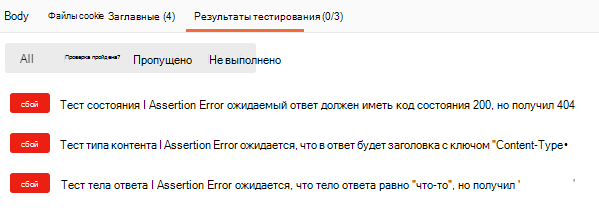

# <a name="set-up-notifications-for-changes-in-user-data"></a><span data-ttu-id="0338d-105">Настройка уведомлений об изменениях в пользовательских данных</span><span class="sxs-lookup"><span data-stu-id="0338d-105">Set up notifications for changes in user data</span></span>

<span data-ttu-id="0338d-p102">API Microsoft Graph использует механизм веб-перехватчиков для доставки уведомлений об изменениях для клиентов. Клиент — это веб-служба, которая настраивает свой URL-адрес для получения уведомлений об изменениях. С помощью этих уведомлений клиентские приложения обновляют свое состояние в случае изменений.</span><span class="sxs-lookup"><span data-stu-id="0338d-p102">The Microsoft Graph API uses a webhook mechanism to deliver change notifications to clients. A client is a web service that configures its own URL to receive change notifications. Client apps use change notifications to update their state upon changes.</span></span>

<span data-ttu-id="0338d-p103">Приняв запрос на подписку, Microsoft Graph отправляет уведомления об изменениях на URL-адрес, указанный в подписке. Затем приложение действует в соответствии с бизнес-логикой. Например, оно получает дополнительные данные, обновляет кэш и представления, а также выполняет другие действия.</span><span class="sxs-lookup"><span data-stu-id="0338d-p103">After Microsoft Graph accepts the subscription request, it pushes change notifications to the URL specified in the subscription. The app then takes action according to its business logic. For example, it fetches more data, updates its cache and views, and so on.</span></span>


> [!VIDEO https://www.youtube-nocookie.com/embed/rC1bunenaq4]
 
> [!div class="nextstepaction"]
> [<span data-ttu-id="0338d-112">Руководство: Использование уведомлений об изменениях и функции отслеживания изменений в Microsoft Graph</span><span class="sxs-lookup"><span data-stu-id="0338d-112">Tutorial: Use Change Notifications and Track Changes with Microsoft Graph</span></span>](/learn/modules/msgraph-changenotifications-trackchanges)

<span data-ttu-id="0338d-113">По умолчанию уведомления об изменениях не включают данные ресурсов, кроме `id`.</span><span class="sxs-lookup"><span data-stu-id="0338d-113">By default, change notifications do not contain resource data, other than the `id`.</span></span> <span data-ttu-id="0338d-114">Если приложению требуются данные ресурса, оно может вызвать API Microsoft Graph, чтобы получить ресурс полностью.</span><span class="sxs-lookup"><span data-stu-id="0338d-114">If the app requires resource data, it can make calls to Microsoft Graph APIs to get the full resource.</span></span> <span data-ttu-id="0338d-115">В этой статье описывается работа с уведомлениями об изменениях на примере ресурса **user**.</span><span class="sxs-lookup"><span data-stu-id="0338d-115">This article uses the **user** resource as an example for working with change notifications.</span></span>

<span data-ttu-id="0338d-116">Приложение также может подписаться на уведомления об изменениях, включающие данные ресурсов, чтобы избежать необходимости дополнительного вызова API для доступа к данным.</span><span class="sxs-lookup"><span data-stu-id="0338d-116">An app can also subscribe to change notifications that include resource data, to avoid having to make additional API calls to access the data.</span></span> <span data-ttu-id="0338d-117">В этом случае приложению необходимо реализовать дополнительный код для обработки требований таких уведомлений, в частности, ответа на уведомления о жизненном цикле подписки, проверки подлинности уведомлений и расшифровки данных ресурсов.</span><span class="sxs-lookup"><span data-stu-id="0338d-117">Such apps will need to implement extra code to handle the requirements of such notifications, specifically: responding to subscription lifecycle notifications, validating the authenticity of notifications, and decrypting the resource data.</span></span> <span data-ttu-id="0338d-118">Дополнительные сведения о работе с такими уведомлениями см. в статье [Настройка уведомлений об изменениях, включающих данные ресурсов](webhooks-with-resource-data.md).</span><span class="sxs-lookup"><span data-stu-id="0338d-118">For details about how to work with these notifications, see [Set up change notifications that include resource data](webhooks-with-resource-data.md).</span></span>

## <a name="supported-resources"></a><span data-ttu-id="0338d-119">Поддерживаемые ресурсы</span><span class="sxs-lookup"><span data-stu-id="0338d-119">Supported resources</span></span>

<span data-ttu-id="0338d-120">С помощью API Microsoft Graph приложение может подписаться на изменения для следующих ресурсов:</span><span class="sxs-lookup"><span data-stu-id="0338d-120">Using the Microsoft Graph API, an app can subscribe to changes on the following resources:</span></span>

- <span data-ttu-id="0338d-121">Облачная печать [printer][]</span><span class="sxs-lookup"><span data-stu-id="0338d-121">Cloud printing [printer][]</span></span>
- <span data-ttu-id="0338d-122">Облачная печать [printTaskDefinition][]</span><span class="sxs-lookup"><span data-stu-id="0338d-122">Cloud printing [printTaskDefinition][]</span></span>
- <span data-ttu-id="0338d-123">Контент внутри иерархии _любой папки_ [driveItem][] на персональном хранилище OneDrive пользователя</span><span class="sxs-lookup"><span data-stu-id="0338d-123">Content within the hierarchy of _any folder_ [driveItem][] on a user's personal OneDrive</span></span>
- <span data-ttu-id="0338d-124">Контент внутри иерархии _корневой папки_ [driveItem][] на персональном хранилище OneDrive для бизнеса</span><span class="sxs-lookup"><span data-stu-id="0338d-124">Content within the hierarchy of the _root folder_ [driveItem][] on OneDrive for Business</span></span>
- <span data-ttu-id="0338d-125">[group][]</span><span class="sxs-lookup"><span data-stu-id="0338d-125">[group][]</span></span>
- <span data-ttu-id="0338d-126">Групповой [чат][] Microsoft 365 </span><span class="sxs-lookup"><span data-stu-id="0338d-126">Microsoft 365 group [conversation][]</span></span>
- <span data-ttu-id="0338d-127">[Событие][] Outlook</span><span class="sxs-lookup"><span data-stu-id="0338d-127">Outlook [event][]</span></span>
- <span data-ttu-id="0338d-128">[Сообщение][] Outlook</span><span class="sxs-lookup"><span data-stu-id="0338d-128">Outlook [message][]</span></span>
- <span data-ttu-id="0338d-129">Личный [контакт][] Outlook</span><span class="sxs-lookup"><span data-stu-id="0338d-129">Outlook personal [contact][]</span></span>
- <span data-ttu-id="0338d-130">[Оповещение][] безопасности</span><span class="sxs-lookup"><span data-stu-id="0338d-130">Security [alert][]</span></span>
- <span data-ttu-id="0338d-131">[Список][] SharePoint</span><span class="sxs-lookup"><span data-stu-id="0338d-131">SharePoint [list][]</span></span>
- <span data-ttu-id="0338d-132">[callRecord][] в Teams</span><span class="sxs-lookup"><span data-stu-id="0338d-132">Teams [callRecord][]</span></span>
- <span data-ttu-id="0338d-133">[Канал][] Teams </span><span class="sxs-lookup"><span data-stu-id="0338d-133">Teams [channel][]</span></span>
- <span data-ttu-id="0338d-134">[chatMessage][] Teams</span><span class="sxs-lookup"><span data-stu-id="0338d-134">Teams [chatMessage][]</span></span>
- <span data-ttu-id="0338d-135">[conversationMember][] в Teams</span><span class="sxs-lookup"><span data-stu-id="0338d-135">Teams [conversationMember][]</span></span>
- <span data-ttu-id="0338d-136">[Присутствие][] в Teams (предварительная версия)</span><span class="sxs-lookup"><span data-stu-id="0338d-136">Teams [presence][] (preview)</span></span>
- <span data-ttu-id="0338d-137">[Команда][] Teams</span><span class="sxs-lookup"><span data-stu-id="0338d-137">Teams [team][]</span></span>
- <span data-ttu-id="0338d-138">[todoTask][] (предварительная версия)</span><span class="sxs-lookup"><span data-stu-id="0338d-138">[todoTask][] (preview)</span></span>
- <span data-ttu-id="0338d-139">[пользователь][]</span><span class="sxs-lookup"><span data-stu-id="0338d-139">[user][]</span></span>

<span data-ttu-id="0338d-140">Вы можете создать подписку на определенную папку Outlook, например, папку Входящие: `me/mailFolders('inbox')/messages`</span><span class="sxs-lookup"><span data-stu-id="0338d-140">You can create a subscription to a specific Outlook folder such as the Inbox: `me/mailFolders('inbox')/messages`</span></span>

<span data-ttu-id="0338d-141">либо на ресурс верхнего уровня: `/me/messages`, `/me/contacts`, `/me/events`, `users`, `groups`, `/communications/callRecords`</span><span class="sxs-lookup"><span data-stu-id="0338d-141">Or to a top-level resource: `/me/messages`, `/me/contacts`, `/me/events`, `users`, `groups`, `/communications/callRecords`</span></span>

<span data-ttu-id="0338d-142">либо на определенный экземпляр ресурса: `users/{id}`, `groups/{id}`, `groups/{id}/conversations`, `sites/{site-id}/lists/{list-id}`, `/communications/presences/{id}`</span><span class="sxs-lookup"><span data-stu-id="0338d-142">Or to a specific resource instance: `users/{id}`, `groups/{id}`, `groups/{id}/conversations`, `sites/{site-id}/lists/{list-id}`, `/communications/presences/{id}`</span></span>

<span data-ttu-id="0338d-143">либо на личное хранилище OneDrive пользователя: `/drives/{id}/root`
`/drives/{id}/root/subfolder`.</span><span class="sxs-lookup"><span data-stu-id="0338d-143">Or to any folder in a user's personal OneDrive: `/drives/{id}/root`
`/drives/{id}/root/subfolder`</span></span>

<span data-ttu-id="0338d-144">либо на корневую папку диска SharePoint/OneDrive для бизнеса: `/drive/root`</span><span class="sxs-lookup"><span data-stu-id="0338d-144">Or to the root folder of a SharePoint/OneDrive for Business drive: `/drive/root`</span></span>

<span data-ttu-id="0338d-145">либо на новое оповещение [API безопасности](security-concept-overview.md): `/security/alerts?$filter=status eq 'newAlert'`, `/security/alerts?$filter=vendorInformation/provider eq 'ASC'`</span><span class="sxs-lookup"><span data-stu-id="0338d-145">Or to a new [Security API](security-concept-overview.md) alert: `/security/alerts?$filter=status eq 'newAlert'`, `/security/alerts?$filter=vendorInformation/provider eq 'ASC'`</span></span>

<span data-ttu-id="0338d-146">либо на задачи в списке дел пользователя: `/me/todo/lists/{todoTaskListId}/tasks`</span><span class="sxs-lookup"><span data-stu-id="0338d-146">Or to the tasks in a user's To Do list: `/me/todo/lists/{todoTaskListId}/tasks`</span></span>

### <a name="azure-ad-resource-limitations"></a><span data-ttu-id="0338d-147">Ограничения ресурсов Azure AD</span><span class="sxs-lookup"><span data-stu-id="0338d-147">Azure AD resource limitations</span></span>

<span data-ttu-id="0338d-148">К ресурсам Azure AD (пользователи, группы) применяются определенные ограничения. В случае их превышения возникают ошибки.</span><span class="sxs-lookup"><span data-stu-id="0338d-148">Certain limits apply to Azure AD based resources (users, groups) and will generate errors when exceeded:</span></span>

> <span data-ttu-id="0338d-149">**Примечание**. Эти ограничения не применяются к ресурсам служб, не относящихся к Azure AD.</span><span class="sxs-lookup"><span data-stu-id="0338d-149">**Note**: These limits do not apply to resources from services other than Azure AD.</span></span> <span data-ttu-id="0338d-150">Например, приложение может создать больше дополнительных подписок на ресурсы `message` или `event`, поддерживаемые службой Exchange Online в составе Microsoft Graph.</span><span class="sxs-lookup"><span data-stu-id="0338d-150">For example, an app can create many more subscriptions to `message` or `event` resources, which are supported by the Exchange Online service as part of Microsoft Graph.</span></span>

- <span data-ttu-id="0338d-151">Квоты максимальной подписки:</span><span class="sxs-lookup"><span data-stu-id="0338d-151">Maximum subscription quotas:</span></span>

  - <span data-ttu-id="0338d-152">На приложение (для сочетания всех клиентов): 50 000 подписок всего</span><span class="sxs-lookup"><span data-stu-id="0338d-152">Per app (for all tenants combined): 50,000 total subscriptions</span></span>
  - <span data-ttu-id="0338d-153">На клиента (для сочетания всех приложений): 1000 подписок всего во всех приложениях</span><span class="sxs-lookup"><span data-stu-id="0338d-153">Per tenant (for all applications combined): 1000 total subscriptions across all apps</span></span>
  - <span data-ttu-id="0338d-154">На сочетание приложения и клиента: 100 подписок всего</span><span class="sxs-lookup"><span data-stu-id="0338d-154">Per app and tenant combination: 100 total subscriptions</span></span>

<span data-ttu-id="0338d-155">Если какое-либо ограничение превышено, попытки создать подписку приведут к [ответу с ошибкой](errors.md) - `403 Forbidden`.</span><span class="sxs-lookup"><span data-stu-id="0338d-155">When any limit is exceeded, attempts to create a subscription will result in an [error response](errors.md) - `403 Forbidden`.</span></span> <span data-ttu-id="0338d-156">Свойство `message` указывает, какое ограничение превышено.</span><span class="sxs-lookup"><span data-stu-id="0338d-156">The `message` property will explain which limit has been exceeded.</span></span>

- <span data-ttu-id="0338d-157">Клиенты Azure AD B2C не поддерживаются.</span><span class="sxs-lookup"><span data-stu-id="0338d-157">Azure AD B2C tenants are not supported.</span></span>

- <span data-ttu-id="0338d-158">Уведомления об изменениях для сущностей пользователей не поддерживаются для личных учетных записей Майкрософт.</span><span class="sxs-lookup"><span data-stu-id="0338d-158">Change notification for user entities are not supported for personal Microsoft accounts.</span></span>

- <span data-ttu-id="0338d-159">В подписках пользователей и групп существует [известная проблема](known-issues.md#change-notifications).</span><span class="sxs-lookup"><span data-stu-id="0338d-159">A [known issue](known-issues.md#change-notifications) exists with user and group subscriptions.</span></span>

### <a name="outlook-resource-limitations"></a><span data-ttu-id="0338d-160">Ограничения ресурсов Outlook</span><span class="sxs-lookup"><span data-stu-id="0338d-160">Outlook resource limitations</span></span>

<span data-ttu-id="0338d-161">Если вы используете *имя участника-пользователя* на пути к ресурсу при оформлении подписки на ресурсы Outlook, например **сообщения**, **события** или **контакты**, запрос на подписку может быть не выполнен, если это имя содержит апостроф. </span><span class="sxs-lookup"><span data-stu-id="0338d-161">When subscribing to Outlook resources such as **messages**, **events** or **contacts**, if you choose to use the *user principal name* UPN in the resource path, the subscription request might fail if the UPN contains an apostrophe.</span></span> <span data-ttu-id="0338d-162">Используйте ИД GUID пользователей вместо имен участников-пользователей, чтобы избежать этой проблемы.</span><span class="sxs-lookup"><span data-stu-id="0338d-162">Consider using GUID user IDs instead of UPNs to avoid running into this problem.</span></span> <span data-ttu-id="0338d-163">Например, вместо пути к ресурсу:</span><span class="sxs-lookup"><span data-stu-id="0338d-163">For example, instead of using resource path:</span></span>

`/users/sh.o'neal@contoso.com/messages`

<span data-ttu-id="0338d-164">Используйте:</span><span class="sxs-lookup"><span data-stu-id="0338d-164">Use:</span></span>

`/users/{guid-user-id}/messages`

<span data-ttu-id="0338d-165">Доступно не более 1000 активных подписок на почтовый ящик для всех приложений.</span><span class="sxs-lookup"><span data-stu-id="0338d-165">A maximum of 1000 active subscriptions per mailbox for all applications is allowed.</span></span>

### <a name="teams-resource-limitations"></a><span data-ttu-id="0338d-166">Ограничения ресурсов Teams</span><span class="sxs-lookup"><span data-stu-id="0338d-166">Teams resource limitations</span></span>

<span data-ttu-id="0338d-167">Каждый ресурс Teams имеет различные квоты подписки.</span><span class="sxs-lookup"><span data-stu-id="0338d-167">Each Teams resource has different subscription quotas.</span></span>

- <span data-ttu-id="0338d-168">Для подписок на **callRecords**:</span><span class="sxs-lookup"><span data-stu-id="0338d-168">For subscriptions to **callRecords**:</span></span>
  - <span data-ttu-id="0338d-169">На организацию: всего 100 подписок</span><span class="sxs-lookup"><span data-stu-id="0338d-169">Per organization: 100 total subscriptions</span></span>

- <span data-ttu-id="0338d-170">Для подписок на **chatMessages** (каналы или чаты):</span><span class="sxs-lookup"><span data-stu-id="0338d-170">For subscriptions to **chatMessages** (channels or chats):</span></span>
  - <span data-ttu-id="0338d-171">На сочетание приложения и канала или чата: 1 подписка</span><span class="sxs-lookup"><span data-stu-id="0338d-171">Per app and channel or chat combination: 1 subscription</span></span>
  - <span data-ttu-id="0338d-172">На организацию: всего 10 000 подписок</span><span class="sxs-lookup"><span data-stu-id="0338d-172">Per organization: 10,000 total subscriptions</span></span>

## <a name="subscription-lifetime"></a><span data-ttu-id="0338d-173">Время существования подписки</span><span class="sxs-lookup"><span data-stu-id="0338d-173">Subscription lifetime</span></span>

<span data-ttu-id="0338d-174">Время существования подписок ограничено.</span><span class="sxs-lookup"><span data-stu-id="0338d-174">Subscriptions have a limited lifetime.</span></span> <span data-ttu-id="0338d-175">Приложениям необходимо обновлять подписки до истечения срока их действия.</span><span class="sxs-lookup"><span data-stu-id="0338d-175">Apps need to renew their subscriptions before the expiration time.</span></span> <span data-ttu-id="0338d-176">В противном случае им потребуется создавать новые подписки.</span><span class="sxs-lookup"><span data-stu-id="0338d-176">Otherwise, they need to create a new subscription.</span></span> <span data-ttu-id="0338d-177">Список значений, представляющих собой максимально допустимый срок действия, см. в разделе [Максимальный период подписки для каждого из типов ресурсов](/graph/api/resources/subscription?view=graph-rest-1.0#maximum-length-of-subscription-per-resource-type).</span><span class="sxs-lookup"><span data-stu-id="0338d-177">For a list of maximum expiration times, see [Maximum length of subscription per resource type](/graph/api/resources/subscription?view=graph-rest-1.0#maximum-length-of-subscription-per-resource-type).</span></span>

<span data-ttu-id="0338d-178">Кроме того, приложение в любое время может отменить подписку, чтобы больше не получать уведомления об изменениях.</span><span class="sxs-lookup"><span data-stu-id="0338d-178">Apps can also unsubscribe at any time to stop getting change notifications.</span></span>

## <a name="managing-subscriptions"></a><span data-ttu-id="0338d-179">Управление подписками</span><span class="sxs-lookup"><span data-stu-id="0338d-179">Managing subscriptions</span></span>

<span data-ttu-id="0338d-180">Клиенты могут создавать, продлевать и удалять подписки.</span><span class="sxs-lookup"><span data-stu-id="0338d-180">Clients can create subscriptions, renew subscriptions, and delete subscriptions.</span></span>

### <a name="creating-a-subscription"></a><span data-ttu-id="0338d-181">Создание подписки</span><span class="sxs-lookup"><span data-stu-id="0338d-181">Creating a subscription</span></span>

<span data-ttu-id="0338d-p110">Чтобы начать получать уведомления об изменениях ресурса, сначала необходимо создать подписку. Это выполняется следующим образом.</span><span class="sxs-lookup"><span data-stu-id="0338d-p110">Creating a subscription is the first step to start receiving change notifications for a resource. The subscription process is as follows:</span></span>

1. <span data-ttu-id="0338d-184">Клиент отправляет запрос (POST) на подписку для определенного ресурса.</span><span class="sxs-lookup"><span data-stu-id="0338d-184">The client sends a subscription (POST) request for a specific resource.</span></span>

1. <span data-ttu-id="0338d-185">Microsoft Graph проверяет запрос.</span><span class="sxs-lookup"><span data-stu-id="0338d-185">Microsoft Graph verifies the request.</span></span>

    - <span data-ttu-id="0338d-186">Если запрос является допустимым, Microsoft Graph отправляет маркер проверки на URL-адрес уведомлений.</span><span class="sxs-lookup"><span data-stu-id="0338d-186">If the request is valid, Microsoft Graph sends a validation token to the notification URL.</span></span>
    - <span data-ttu-id="0338d-187">В противном случае Microsoft Graph возвращает сообщение об ошибке с кодом и подробными сведениями.</span><span class="sxs-lookup"><span data-stu-id="0338d-187">If the request is invalid, Microsoft Graph sends an error response with code and details.</span></span>

1. <span data-ttu-id="0338d-188">Клиент отправляет маркер проверки в Microsoft Graph.</span><span class="sxs-lookup"><span data-stu-id="0338d-188">The client sends the validation token back to Microsoft Graph.</span></span>

1. <span data-ttu-id="0338d-189">Клиент получает ответ от Microsoft Graph.</span><span class="sxs-lookup"><span data-stu-id="0338d-189">The Microsoft Graph sends a response back to the client.</span></span>

<span data-ttu-id="0338d-190">Клиент должен хранить идентификатор подписки, чтобы можно было сопоставлять уведомления об изменениях с подписками.</span><span class="sxs-lookup"><span data-stu-id="0338d-190">The client must store the subscription ID to correlate change notifications with the subscription.</span></span>

#### <a name="subscription-request-example"></a><span data-ttu-id="0338d-191">Пример запроса на подписку</span><span class="sxs-lookup"><span data-stu-id="0338d-191">Subscription request example</span></span>

```http
POST https://graph.microsoft.com/v1.0/subscriptions
Content-Type: application/json
{
  "changeType": "created,updated",
  "notificationUrl": "https://webhook.azurewebsites.net/notificationClient",
  "resource": "/me/mailfolders('inbox')/messages",
  "expirationDateTime": "2016-03-20T11:00:00.0000000Z",
  "clientState": "SecretClientState"
}
```

<span data-ttu-id="0338d-192">Необходимы свойства `changeType`, `notificationUrl`, `resource` и `expirationDateTime`.</span><span class="sxs-lookup"><span data-stu-id="0338d-192">The `changeType`, `notificationUrl`, `resource`, and `expirationDateTime` properties are required.</span></span> <span data-ttu-id="0338d-193">Определения и значения свойств представлены в [описании типа ресурса подписки](/graph/api/resources/subscription?view=graph-rest-1.0).</span><span class="sxs-lookup"><span data-stu-id="0338d-193">See [subscription resource type](/graph/api/resources/subscription?view=graph-rest-1.0) for property definitions and values.</span></span>

<span data-ttu-id="0338d-194">Свойство `resource` указывает ресурс, для которого будут отслеживаться изменения.</span><span class="sxs-lookup"><span data-stu-id="0338d-194">The `resource` property specifies the resource that will be monitored for changes.</span></span> <span data-ttu-id="0338d-195">Например, вы можете создать подписку на определенную почтовую папку: `me/mailFolders('inbox')/messages` или сделать это от имени пользователя с согласия администратора: `users/john.doe@onmicrosoft.com/mailFolders('inbox')/messages`.</span><span class="sxs-lookup"><span data-stu-id="0338d-195">For example, you can create a subscription to a specific mail folder: `me/mailFolders('inbox')/messages` or on behalf of a user given by an administrator  consent: `users/john.doe@onmicrosoft.com/mailFolders('inbox')/messages`.</span></span>

<span data-ttu-id="0338d-196">Хотя свойство `clientState` необязательное, рекомендуем указать его в нашем процессе обработки уведомлений об изменениях.</span><span class="sxs-lookup"><span data-stu-id="0338d-196">Although `clientState` is not required, you must include it to comply with our recommended change notification handling process.</span></span> <span data-ttu-id="0338d-197">Задание этого свойства позволит подтверждать, что полученные уведомления об изменениях поступают от службы Microsoft Graph.</span><span class="sxs-lookup"><span data-stu-id="0338d-197">Setting this property will allow you to confirm that change notifications you receive originate from the Microsoft Graph service.</span></span> <span data-ttu-id="0338d-198">По этой причине значение свойства должно оставаться секретным и быть известно только приложению и службе Microsoft Graph.</span><span class="sxs-lookup"><span data-stu-id="0338d-198">For this reason, the value of the property should remain secret and known only to your application and the Microsoft Graph service.</span></span>

<span data-ttu-id="0338d-199">В случае успешного выполнения Microsoft Graph возвращает код `201 Created` и объект [подписки](/graph/api/resources/subscription?view=graph-rest-1.0) в теле отклика.</span><span class="sxs-lookup"><span data-stu-id="0338d-199">If successful, Microsoft Graph returns a `201 Created` code and a [subscription](/graph/api/resources/subscription?view=graph-rest-1.0) object in the body.</span></span>

> <span data-ttu-id="0338d-200">**Примечание.** Любой параметр строки запроса, включенный в свойство **notificationUrl**, будет включен в HTTP-запрос POST при доставке уведомлений.</span><span class="sxs-lookup"><span data-stu-id="0338d-200">**Note:** Any query string parameter included in the **notificationUrl** property will be included in the HTTP POST request when notifications are being delivered.</span></span>

#### <a name="notification-endpoint-validation"></a><span data-ttu-id="0338d-201">Проверка конечной точки уведомлений</span><span class="sxs-lookup"><span data-stu-id="0338d-201">Notification endpoint validation</span></span>

<span data-ttu-id="0338d-202">Прежде чем создавать подписку, Microsoft Graph проверяет конечную точку уведомлений в `notificationUrl` запросе на свойство подписки.</span><span class="sxs-lookup"><span data-stu-id="0338d-202">Microsoft Graph validates the notification endpoint provided in the `notificationUrl` property of the subscription request before creating the subscription.</span></span> <span data-ttu-id="0338d-203">Проверка происходит следующим образом:</span><span class="sxs-lookup"><span data-stu-id="0338d-203">The validation process occurs as follows:</span></span>

1. <span data-ttu-id="0338d-204">Microsoft Graph кодирует маркер проверки и включает его в запрос POST URL-адреса уведомления:</span><span class="sxs-lookup"><span data-stu-id="0338d-204">Microsoft Graph encodes a validation token and includes it in a POST request to the notification URL:</span></span>

    ``` http
    Content-Type: text/plain; charset=utf-8
    POST https://{notificationUrl}?validationToken={opaqueTokenCreatedByMicrosoftGraph}
    ```

1. <span data-ttu-id="0338d-205">Клиенту необходимо правильно расшифровать URL-адрес параметра запроса`validationToken`, предоставленный на предыдущем этапе, и избегать любого HTML или JavaScript.</span><span class="sxs-lookup"><span data-stu-id="0338d-205">The client must properly URL decode the `validationToken` query parameter provided in the preceding step, and escape any HTML/JavaScript.</span></span>

   <span data-ttu-id="0338d-206">Рекомендуется их избегать, поскольку злоумышленники могут использовать конечную точку уведомления для атаки типа межсайтовых сценариев.</span><span class="sxs-lookup"><span data-stu-id="0338d-206">Escaping is a good practice because malicious actors can use the notification endpoint for cross-site scripting type of attacks.</span></span>

   <span data-ttu-id="0338d-207">Как правило, значение маркера проверки рассматривается как непрозрачное, так как формат маркера обычно меняется без уведомлений.</span><span class="sxs-lookup"><span data-stu-id="0338d-207">In general, treat the validation token value as opaque, as the token format can generally change without notice.</span></span> <span data-ttu-id="0338d-208">Microsoft Graph никогда не отправляет значения, содержащие код HTML или JavaScript.</span><span class="sxs-lookup"><span data-stu-id="0338d-208">Microsoft Graph never sends any value containing HTML or JavaScript code.</span></span>

1. <span data-ttu-id="0338d-209">В течение 10 секунд первого этапа клиент должен предоставить ответ со следующими характеристиками:</span><span class="sxs-lookup"><span data-stu-id="0338d-209">The client must provide a response with the following characteristics within 10 seconds of step 1:</span></span>

    - <span data-ttu-id="0338d-210">Код состояния `HTTP 200 OK`.</span><span class="sxs-lookup"><span data-stu-id="0338d-210">A status code of `HTTP 200 OK`.</span></span>
    - <span data-ttu-id="0338d-211">Тип контента `text/plain`.</span><span class="sxs-lookup"><span data-stu-id="0338d-211">A content type of `text/plain`.</span></span>
    - <span data-ttu-id="0338d-212">Основной текст, включающий маркер проверки с _расшифрованным URL-адресом_.</span><span class="sxs-lookup"><span data-stu-id="0338d-212">A body that includes the _URL decoded_ validation token.</span></span> <span data-ttu-id="0338d-213">Просто отобразите ту же строку, которая была отправлена в параметре запроса `validationToken`.</span><span class="sxs-lookup"><span data-stu-id="0338d-213">Simply reflect back the same string that was sent in the `validationToken` query parameter.</span></span>

    <span data-ttu-id="0338d-214">Клиент должен удалить маркер проверки после того, как укажет его в отклике.</span><span class="sxs-lookup"><span data-stu-id="0338d-214">The client should discard the validation token after providing it in the response.</span></span>

    > <span data-ttu-id="0338d-215">**Важно!** Если клиент возвращает зашифрованный маркер проверки, проверка завершится ошибкой.</span><span class="sxs-lookup"><span data-stu-id="0338d-215">**Important:** If the client returns an encoded validation token, the validation will fail.</span></span>

<span data-ttu-id="0338d-216">Кроме того, можно использовать [коллекцию Microsoft Graph Postman](use-postman.md), чтобы убедиться в правильности реализации запроса проверки в вашей конечной точке.</span><span class="sxs-lookup"><span data-stu-id="0338d-216">Additionally, you can use the [Microsoft Graph Postman collection](use-postman.md) to confirm that your endpoint properly implements the validation request.</span></span> <span data-ttu-id="0338d-217">Запрос **Проверка подписки** в папке **Прочее** предоставляет модульные тесты, проверяющие отклик вашей конечной точки.</span><span class="sxs-lookup"><span data-stu-id="0338d-217">The **Subscription Validation** request in the **Misc** folder provides unit tests that validate the response provided by your endpoint.</span></span>  



### <a name="renewing-a-subscription"></a><span data-ttu-id="0338d-219">Возобновление подписки</span><span class="sxs-lookup"><span data-stu-id="0338d-219">Renewing a subscription</span></span>

<span data-ttu-id="0338d-220">Клиент может продлить подписку, указав срок действия до трех дней с момента отправки запроса.</span><span class="sxs-lookup"><span data-stu-id="0338d-220">The client can renew a subscription with a specific expiration date of up to three days from the time of request.</span></span> <span data-ttu-id="0338d-221">Свойство `expirationDateTime` является обязательным.</span><span class="sxs-lookup"><span data-stu-id="0338d-221">The `expirationDateTime` property is required.</span></span>

#### <a name="subscription-renewal-example"></a><span data-ttu-id="0338d-222">Пример возобновления подписки</span><span class="sxs-lookup"><span data-stu-id="0338d-222">Subscription renewal example</span></span>

```http
PATCH https://graph.microsoft.com/v1.0/subscriptions/{id}
Content-Type: application/json

{
  "expirationDateTime": "2016-03-22T11:00:00.0000000Z"
}
```

<span data-ttu-id="0338d-223">В случае успешного выполнения Microsoft Graph возвращает код `200 OK` и объект [подписки](/graph/api/resources/subscription?view=graph-rest-1.0) в теле отклика.</span><span class="sxs-lookup"><span data-stu-id="0338d-223">If successful, Microsoft Graph returns a `200 OK` code and a [subscription](/graph/api/resources/subscription?view=graph-rest-1.0) object in the body.</span></span> <span data-ttu-id="0338d-224">Объект подписки включает новое значение `expirationDateTime`.</span><span class="sxs-lookup"><span data-stu-id="0338d-224">The subscription object includes the new `expirationDateTime` value.</span></span>

### <a name="deleting-a-subscription"></a><span data-ttu-id="0338d-225">Удаление подписки</span><span class="sxs-lookup"><span data-stu-id="0338d-225">Deleting a subscription</span></span>

<span data-ttu-id="0338d-226">Клиент может прекратить получать уведомления об изменениях, удалив подписку по ее идентификатору.</span><span class="sxs-lookup"><span data-stu-id="0338d-226">The client can stop receiving change notifications by deleting the subscription using its ID.</span></span>

```http
DELETE https://graph.microsoft.com/v1.0/subscriptions/{id}
```

<span data-ttu-id="0338d-227">В случае успешного выполнения Microsoft Graph возвращает код `204 No Content`.</span><span class="sxs-lookup"><span data-stu-id="0338d-227">If successful, Microsoft Graph returns a `204 No Content` code.</span></span>

## <a name="change-notifications"></a><span data-ttu-id="0338d-228">Уведомления об изменениях</span><span class="sxs-lookup"><span data-stu-id="0338d-228">Change notifications</span></span>

<span data-ttu-id="0338d-229">Когда клиент подписывается на изменения ресурса, Microsoft Graph отправляет запрос `POST` в URL-адрес уведомления при каждом изменении ресурса.</span><span class="sxs-lookup"><span data-stu-id="0338d-229">With a client subscribing to changes to a resource, Microsoft Graph sends a `POST` request to the notification URL whenever the resource changes.</span></span> <span data-ttu-id="0338d-230">Уведомления отправляются только при изменениях типа, указанного в подписке, например, `created`.</span><span class="sxs-lookup"><span data-stu-id="0338d-230">It sends notifications only for changes of the type that's specified in the subscription, for example, `created`.</span></span>

> <span data-ttu-id="0338d-231">**Примечание.** Если клиент имеет несколько подписок, которые контролируют один ресурс и используют один URL-адрес уведомлений, Microsoft Graph может отправлять несколько уведомлений об изменениях, соответствующих разным подпискам, каждое из которых показывает идентификатор подписки.</span><span class="sxs-lookup"><span data-stu-id="0338d-231">**Note:** If a client has multiple subscriptions that monitor the same resource and use the same notification URL, Microsoft Graph can send multiple change notifications that correspond to different subscriptions, each showing the corresponding subscription ID.</span></span> <span data-ttu-id="0338d-232">Уведомления об изменениях из сообщения `POST` могут принадлежать разным подпискам.</span><span class="sxs-lookup"><span data-stu-id="0338d-232">There is no guarantee that all change notifications in the `POST` request belong to a single subscription.</span></span>

### <a name="change-notification-example"></a><span data-ttu-id="0338d-233">Пример уведомления об изменениях</span><span class="sxs-lookup"><span data-stu-id="0338d-233">Change notification example</span></span>

<span data-ttu-id="0338d-234">В этом разделе указан пример уведомления для создания сообщения.</span><span class="sxs-lookup"><span data-stu-id="0338d-234">This section shows an example of a notification for a message creation.</span></span> <span data-ttu-id="0338d-235">Когда пользователь получает электронное письмо, Microsoft Graph отправляет уведомления об изменениях, как показано в примере ниже.</span><span class="sxs-lookup"><span data-stu-id="0338d-235">When the user receives an email, Microsoft Graph sends a change notification as shown in the following example.</span></span>
<span data-ttu-id="0338d-236">Обратите внимание на то, что уведомление является коллекцией, представленной в поле "`value`".</span><span class="sxs-lookup"><span data-stu-id="0338d-236">Note that the notification is in a collection represented in the `value` field.</span></span> <span data-ttu-id="0338d-237">Дополнительные сведения о полезных данных уведомлений см. в [changeNotificationCollection](/graph/api/resources/changenotificationcollection)</span><span class="sxs-lookup"><span data-stu-id="0338d-237">See [changeNotificationCollection](/graph/api/resources/changenotificationcollection) for details of the notification payload.</span></span> 

<span data-ttu-id="0338d-238">При многочисленных изменениях Microsoft Graph может отправлять несколько уведомлений, соответствующих разным подпискам, в одном и том же запросе `POST`.</span><span class="sxs-lookup"><span data-stu-id="0338d-238">When many changes occur, Microsoft Graph may send multiple notifications that correspond to different subscriptions in the same `POST` request.</span></span>

```json
{
  "value": [
    {
      "id": "lsgTZMr9KwAAA",
      "subscriptionId":"{subscription_guid}",
      "subscriptionExpirationDateTime":"2016-03-19T22:11:09.952Z",
      "clientState":"secretClientValue",
      "changeType":"created",
      "resource":"users/{user_guid}@{tenant_guid}/messages/{long_id_string}",
      "tenantId": "84bd8158-6d4d-4958-8b9f-9d6445542f95",
      "resourceData":
      {
        "@odata.type":"#Microsoft.Graph.Message",
        "@odata.id":"Users/{user_guid}@{tenant_guid}/Messages/{long_id_string}",
        "@odata.etag":"W/\"CQAAABYAAADkrWGo7bouTKlsgTZMr9KwAAAUWRHf\"",
        "id":"{long_id_string}"
      }
    }
  ]
}
```

### <a name="processing-the-change-notification"></a><span data-ttu-id="0338d-239">Обработка уведомлений об изменениях</span><span class="sxs-lookup"><span data-stu-id="0338d-239">Processing the change notification</span></span>

<span data-ttu-id="0338d-240">Процесс должен обрабатывать каждое уведомление об изменениях.</span><span class="sxs-lookup"><span data-stu-id="0338d-240">Your process should process every change notification it receives.</span></span> <span data-ttu-id="0338d-241">Ниже перечислены основные задачи, которые приложение должно выполнить для обработки таких уведомлений.</span><span class="sxs-lookup"><span data-stu-id="0338d-241">The following are the minimum tasks that your app must perform to process a change notification:</span></span>

1. <span data-ttu-id="0338d-242">Отправьте код состояния `202 - Accepted` в ответе, предназначенном Microsoft Graph.</span><span class="sxs-lookup"><span data-stu-id="0338d-242">Send a `202 - Accepted` status code in your response to Microsoft Graph.</span></span> <span data-ttu-id="0338d-243">Если 2хх код не будет получен, Microsoft Graph попытается опубликовать уведомление об изменении несколько раз в течение 4 часов. После этого это уведомление будет удалено.</span><span class="sxs-lookup"><span data-stu-id="0338d-243">If Microsoft Graph doesn't receive a 2xx class code, it will try to publishing the change notification a number of times, for a period of about 4 hours; after that, the change notification will be dropped and won't be delivered.</span></span>

    > <span data-ttu-id="0338d-244">**Примечание.** Отправьте код состояния `202 - Accepted` сразу после получения уведомления об изменениях, еще перед проверкой подлинности.</span><span class="sxs-lookup"><span data-stu-id="0338d-244">**Note:** Send a `202 - Accepted` status code as soon as you receive the change notification, even before validating its authenticity.</span></span> <span data-ttu-id="0338d-245">Просто подтвердите получение уведомления об изменениях, чтобы избежать ненужных повторных попыток.</span><span class="sxs-lookup"><span data-stu-id="0338d-245">You are simply acknowledging the receipt of the change notification and preventing unnecessary retries.</span></span> <span data-ttu-id="0338d-246">Текущее значение времени ожидания — 30 секунд, но это время может быть сокращено в будущем для оптимизации производительности службы.</span><span class="sxs-lookup"><span data-stu-id="0338d-246">The current timeout is 30 seconds, but it might be reduced in the future to optimize service performance.</span></span> <span data-ttu-id="0338d-247">Если URL-адрес уведомления не отвечает в течение 30 секунд на более чем 10% запросов от Microsoft Graph за 10 минут, все уведомления ниже будут отложены и повторено выполнены в течение 4 часов.</span><span class="sxs-lookup"><span data-stu-id="0338d-247">If the notification URL doesn't reply within 30 seconds for more than 10% of the requests from Microsoft Graph over a 10 minute period, all following notifications will be delayed and retried for a period of 4 hours.</span></span> <span data-ttu-id="0338d-248">Если URL-адрес уведомления не отвечает в течение 30 секунд на более чем 20% запросов от Microsoft Graph за 10 минут, все уведомления ниже будут удалены.</span><span class="sxs-lookup"><span data-stu-id="0338d-248">If a notification URL doesn't reply within 30 seconds for more than 20% of the requests from Microsoft Graph over a 10 minute period, all following notifications will be dropped.</span></span>

1. <span data-ttu-id="0338d-249">Проверьте свойство `clientState`.</span><span class="sxs-lookup"><span data-stu-id="0338d-249">Validate the `clientState` property.</span></span> <span data-ttu-id="0338d-250">Оно должно соответствовать значению, отправленному с запросом на создание подписки.</span><span class="sxs-lookup"><span data-stu-id="0338d-250">It must match the value originally submitted with the subscription creation request.</span></span>

    > <span data-ttu-id="0338d-251">**Примечание.** Если это не так, уведомление об изменениях не следует рассматривать как действительное.</span><span class="sxs-lookup"><span data-stu-id="0338d-251">**Note:** If this isn't true, you should not consider this a valid change notification.</span></span> <span data-ttu-id="0338d-252">Возможно оно создано не Microsoft Graph и отправлено незаконным субъектом.</span><span class="sxs-lookup"><span data-stu-id="0338d-252">It is possible that the change notification has not originated from Microsoft Graph and may have been sent by a rogue actor.</span></span> <span data-ttu-id="0338d-253">Вы также можете определить, откуда поступило уведомление об изменениях, и выполнить соответствующие действия.</span><span class="sxs-lookup"><span data-stu-id="0338d-253">You should also investigate where the change notification comes from and take appropriate action.</span></span>

1. <span data-ttu-id="0338d-254">Обновляйте приложение в соответствии с бизнес-логикой.</span><span class="sxs-lookup"><span data-stu-id="0338d-254">Update your application based on your business logic.</span></span>

<span data-ttu-id="0338d-255">Повторяйте эти действия для других уведомлений об изменениях в запросе.</span><span class="sxs-lookup"><span data-stu-id="0338d-255">Repeat for other change notifications in the request.</span></span>

## <a name="code-samples"></a><span data-ttu-id="0338d-256">Примеры кода</span><span class="sxs-lookup"><span data-stu-id="0338d-256">Code samples</span></span>

<span data-ttu-id="0338d-257">Указанные ниже примеры кода доступны на сайте GitHub.</span><span class="sxs-lookup"><span data-stu-id="0338d-257">The following code samples are available on GitHub.</span></span>

- [<span data-ttu-id="0338d-258">Обучающий модуль по Microsoft Graph: использование уведомлений об изменениях и отслеживание изменений с помощью Microsoft Graph</span><span class="sxs-lookup"><span data-stu-id="0338d-258">Microsoft Graph Training Module - Using Change Notifications and Track Changes with Microsoft Graph</span></span>](https://github.com/microsoftgraph/msgraph-training-changenotifications)
- [<span data-ttu-id="0338d-259">Пример веб-перехватчиков Microsoft Graph для Node.js</span><span class="sxs-lookup"><span data-stu-id="0338d-259">Microsoft Graph Webhooks Sample for Node.js</span></span>](https://github.com/microsoftgraph/nodejs-webhooks-rest-sample)
- [<span data-ttu-id="0338d-260">Пример веб-перехватчиков Microsoft Graph для ASP.NET Core</span><span class="sxs-lookup"><span data-stu-id="0338d-260">Microsoft Graph Webhooks Sample for ASP.NET Core</span></span>](https://github.com/microsoftgraph/aspnetcore-webhooks-sample)
- [<span data-ttu-id="0338d-261">Пример веб-перехватчиков Microsoft Graph для Java Spring</span><span class="sxs-lookup"><span data-stu-id="0338d-261">Microsoft Graph Webhooks Sample for Java Spring</span></span>](https://github.com/microsoftgraph/java-spring-webhooks-sample)

## <a name="firewall-configuration"></a><span data-ttu-id="0338d-262">Конфигурация брандмауэра</span><span class="sxs-lookup"><span data-stu-id="0338d-262">Firewall configuration</span></span>

<span data-ttu-id="0338d-263">При необходимости можно настроить брандмауэр, который защищает URL-адрес уведомления, чтобы разрешить входящие подключения только из Microsoft Graph.</span><span class="sxs-lookup"><span data-stu-id="0338d-263">You can optionally configure the firewall that protects your notification URL to allow inbound connections only from Microsoft Graph.</span></span> <span data-ttu-id="0338d-264">Это позволит снизить дополнительное воздействие недопустимых уведомлений об изменениях, которые отправляются на URL-адрес уведомления.</span><span class="sxs-lookup"><span data-stu-id="0338d-264">This allows you to reduce further exposure to invalid change notifications that are sent to your notification URL.</span></span> <span data-ttu-id="0338d-265">Такие недействительные уведомления об изменениях могут пытаться активировать реализуемую вами пользовательскую логику.</span><span class="sxs-lookup"><span data-stu-id="0338d-265">These invalid change notifications can be trying to trigger the custom logic that you implemented.</span></span> <span data-ttu-id="0338d-266">Полный список IP-адресов, которые используются Microsoft Graph для доставки уведомлений об изменениях, см в сведениях о[дополнительных конечных точках для Microsoft 365](/office365/enterprise/additional-office365-ip-addresses-and-urls).</span><span class="sxs-lookup"><span data-stu-id="0338d-266">For a complete list of IP addresses used by Microsoft Graph to deliver change notifications, see [additional endpoints for Microsoft 365](/office365/enterprise/additional-office365-ip-addresses-and-urls).</span></span>

> <span data-ttu-id="0338d-267">**Примечание.** Указанные IP-адреса, которые используются для доставки уведомлений об изменениях, можно обновлять в любой момент без предварительных примечаний.</span><span class="sxs-lookup"><span data-stu-id="0338d-267">**Note:** The listed IP addresses that are used to deliver change notifications can be updated at any time without notice.</span></span>

## <a name="latency"></a><span data-ttu-id="0338d-268">Задержка</span><span class="sxs-lookup"><span data-stu-id="0338d-268">Latency</span></span>

<span data-ttu-id="0338d-269">В следующей таблице указаны ожидаемые задержки между возникновением события в службе и доставкой уведомления об изменении.</span><span class="sxs-lookup"><span data-stu-id="0338d-269">The following table lists the latency to expect between an event happening in the service and the delivery of the change notification.</span></span>

| <span data-ttu-id="0338d-270">Ресурс</span><span class="sxs-lookup"><span data-stu-id="0338d-270">Resource</span></span> | <span data-ttu-id="0338d-271">Средняя задержка</span><span class="sxs-lookup"><span data-stu-id="0338d-271">Average latency</span></span> | <span data-ttu-id="0338d-272">Максимальная задержка</span><span class="sxs-lookup"><span data-stu-id="0338d-272">Maximum latency</span></span> |
|:-----|:-----|:-----|
|<span data-ttu-id="0338d-273">[alert][]</span><span class="sxs-lookup"><span data-stu-id="0338d-273">[alert][]</span></span> | <span data-ttu-id="0338d-274">Менее 3 минут</span><span class="sxs-lookup"><span data-stu-id="0338d-274">Less than 3 minutes</span></span> | <span data-ttu-id="0338d-275">5 минут</span><span class="sxs-lookup"><span data-stu-id="0338d-275">5 minutes</span></span> |
|<span data-ttu-id="0338d-276">[callRecord][]</span><span class="sxs-lookup"><span data-stu-id="0338d-276">[callRecord][]</span></span> | <span data-ttu-id="0338d-277">Менее 15 минут</span><span class="sxs-lookup"><span data-stu-id="0338d-277">Less than 15 minutes</span></span> | <span data-ttu-id="0338d-278">60 минут</span><span class="sxs-lookup"><span data-stu-id="0338d-278">60 minutes</span></span> |
|<span data-ttu-id="0338d-279">[channel][]</span><span class="sxs-lookup"><span data-stu-id="0338d-279">[channel][]</span></span> | <span data-ttu-id="0338d-280">Менее 10 секунд</span><span class="sxs-lookup"><span data-stu-id="0338d-280">Less than 10 seconds</span></span> | <span data-ttu-id="0338d-281">60 минут</span><span class="sxs-lookup"><span data-stu-id="0338d-281">60 minutes</span></span> |
|<span data-ttu-id="0338d-282">[chatMessage][]</span><span class="sxs-lookup"><span data-stu-id="0338d-282">[chatMessage][]</span></span> | <span data-ttu-id="0338d-283">Менее 10 секунд</span><span class="sxs-lookup"><span data-stu-id="0338d-283">Less than 10 seconds</span></span> | <span data-ttu-id="0338d-284">1 минута</span><span class="sxs-lookup"><span data-stu-id="0338d-284">1 minute</span></span> |
|<span data-ttu-id="0338d-285">[contact][]</span><span class="sxs-lookup"><span data-stu-id="0338d-285">[contact][]</span></span> | <span data-ttu-id="0338d-286">Неизвестно</span><span class="sxs-lookup"><span data-stu-id="0338d-286">Unknown</span></span> | <span data-ttu-id="0338d-287">Неизвестно</span><span class="sxs-lookup"><span data-stu-id="0338d-287">Unknown</span></span> |
|<span data-ttu-id="0338d-288">[conversation][]</span><span class="sxs-lookup"><span data-stu-id="0338d-288">[conversation][]</span></span> | <span data-ttu-id="0338d-289">Неизвестно</span><span class="sxs-lookup"><span data-stu-id="0338d-289">Unknown</span></span> | <span data-ttu-id="0338d-290">Неизвестно</span><span class="sxs-lookup"><span data-stu-id="0338d-290">Unknown</span></span> |
|<span data-ttu-id="0338d-291">[conversationMember][]</span><span class="sxs-lookup"><span data-stu-id="0338d-291">[conversationMember][]</span></span> | <span data-ttu-id="0338d-292">Менее 10 секунд</span><span class="sxs-lookup"><span data-stu-id="0338d-292">Less than 10 seconds</span></span> | <span data-ttu-id="0338d-293">60 минут</span><span class="sxs-lookup"><span data-stu-id="0338d-293">60 minutes</span></span> |
|<span data-ttu-id="0338d-294">[driveItem][]</span><span class="sxs-lookup"><span data-stu-id="0338d-294">[driveItem][]</span></span> | <span data-ttu-id="0338d-295">Менее 1 минуты</span><span class="sxs-lookup"><span data-stu-id="0338d-295">Less than 1 minute</span></span> | <span data-ttu-id="0338d-296">5 минут</span><span class="sxs-lookup"><span data-stu-id="0338d-296">5 minutes</span></span> |
|<span data-ttu-id="0338d-297">[event][]</span><span class="sxs-lookup"><span data-stu-id="0338d-297">[event][]</span></span> | <span data-ttu-id="0338d-298">Неизвестно</span><span class="sxs-lookup"><span data-stu-id="0338d-298">Unknown</span></span> | <span data-ttu-id="0338d-299">Неизвестно</span><span class="sxs-lookup"><span data-stu-id="0338d-299">Unknown</span></span> |
|<span data-ttu-id="0338d-300">[group][]</span><span class="sxs-lookup"><span data-stu-id="0338d-300">[group][]</span></span> | <span data-ttu-id="0338d-301">Менее 2 минут</span><span class="sxs-lookup"><span data-stu-id="0338d-301">Less than 2 minutes</span></span> | <span data-ttu-id="0338d-302">15 минут</span><span class="sxs-lookup"><span data-stu-id="0338d-302">15 minutes</span></span> |
|<span data-ttu-id="0338d-303">[list][]</span><span class="sxs-lookup"><span data-stu-id="0338d-303">[list][]</span></span> | <span data-ttu-id="0338d-304">Менее 1 минуты</span><span class="sxs-lookup"><span data-stu-id="0338d-304">Less than 1 minute</span></span> | <span data-ttu-id="0338d-305">5 минут</span><span class="sxs-lookup"><span data-stu-id="0338d-305">5 minutes</span></span> |
|<span data-ttu-id="0338d-306">[message][]</span><span class="sxs-lookup"><span data-stu-id="0338d-306">[message][]</span></span> | <span data-ttu-id="0338d-307">Неизвестно</span><span class="sxs-lookup"><span data-stu-id="0338d-307">Unknown</span></span> | <span data-ttu-id="0338d-308">Неизвестно</span><span class="sxs-lookup"><span data-stu-id="0338d-308">Unknown</span></span> |
|<span data-ttu-id="0338d-309">[presence][] (предварительная версия)</span><span class="sxs-lookup"><span data-stu-id="0338d-309">[presence][] (preview)</span></span> | <span data-ttu-id="0338d-310">Менее 10 секунд</span><span class="sxs-lookup"><span data-stu-id="0338d-310">Less than 10 seconds</span></span> | <span data-ttu-id="0338d-311">1 минута</span><span class="sxs-lookup"><span data-stu-id="0338d-311">1 minute</span></span> |
|<span data-ttu-id="0338d-312">[printer][]</span><span class="sxs-lookup"><span data-stu-id="0338d-312">[printer][]</span></span> | <span data-ttu-id="0338d-313">Менее 1 минуты</span><span class="sxs-lookup"><span data-stu-id="0338d-313">Less than 1 minute</span></span> | <span data-ttu-id="0338d-314">5 минут</span><span class="sxs-lookup"><span data-stu-id="0338d-314">5 minutes</span></span> |
|<span data-ttu-id="0338d-315">[printTaskDefinition][]</span><span class="sxs-lookup"><span data-stu-id="0338d-315">[printTaskDefinition][]</span></span> | <span data-ttu-id="0338d-316">Менее 1 минуты</span><span class="sxs-lookup"><span data-stu-id="0338d-316">Less than 1 minute</span></span> | <span data-ttu-id="0338d-317">5 минут</span><span class="sxs-lookup"><span data-stu-id="0338d-317">5 minutes</span></span> |
|<span data-ttu-id="0338d-318">[team][]</span><span class="sxs-lookup"><span data-stu-id="0338d-318">[team][]</span></span> | <span data-ttu-id="0338d-319">Менее 10 секунд</span><span class="sxs-lookup"><span data-stu-id="0338d-319">Less than 10 seconds</span></span> | <span data-ttu-id="0338d-320">60 минут</span><span class="sxs-lookup"><span data-stu-id="0338d-320">60 minutes</span></span> |
|<span data-ttu-id="0338d-321">[todoTask][]</span><span class="sxs-lookup"><span data-stu-id="0338d-321">[todoTask][]</span></span> | <span data-ttu-id="0338d-322">Менее 2 минут</span><span class="sxs-lookup"><span data-stu-id="0338d-322">Less than 2 minutes</span></span> | <span data-ttu-id="0338d-323">15 минут</span><span class="sxs-lookup"><span data-stu-id="0338d-323">15 minutes</span></span> |
|<span data-ttu-id="0338d-324">[user][]</span><span class="sxs-lookup"><span data-stu-id="0338d-324">[user][]</span></span> | <span data-ttu-id="0338d-325">Менее 2 минут</span><span class="sxs-lookup"><span data-stu-id="0338d-325">Less than 2 minutes</span></span> | <span data-ttu-id="0338d-326">15 минут</span><span class="sxs-lookup"><span data-stu-id="0338d-326">15 minutes</span></span> |

><span data-ttu-id="0338d-327">**Примечание.** Задержка, предусматриваемая для ресурса **alert**, применяется только после создания самого оповещения.</span><span class="sxs-lookup"><span data-stu-id="0338d-327">**Note:** The latency provided for the **alert** resource is only applicable after the alert itself has been created.</span></span> <span data-ttu-id="0338d-328">Она не включает в себя время, необходимое правилу для создания оповещения на основе данных.</span><span class="sxs-lookup"><span data-stu-id="0338d-328">It does not include the time it takes for a rule to create an alert from the data.</span></span>

## <a name="see-also"></a><span data-ttu-id="0338d-329">См. также</span><span class="sxs-lookup"><span data-stu-id="0338d-329">See also</span></span>

- [<span data-ttu-id="0338d-330">Тип ресурса subscription</span><span class="sxs-lookup"><span data-stu-id="0338d-330">Subscription resource type</span></span>](/graph/api/resources/subscription?view=graph-rest-1.0)
- [<span data-ttu-id="0338d-331">Получение подписки</span><span class="sxs-lookup"><span data-stu-id="0338d-331">Get subscription</span></span>](/graph/api/subscription-get?view=graph-rest-1.0)
- [<span data-ttu-id="0338d-332">Создание подписки</span><span class="sxs-lookup"><span data-stu-id="0338d-332">Create subscription</span></span>](/graph/api/subscription-post-subscriptions?view=graph-rest-1.0)
- <span data-ttu-id="0338d-333">Тип ресурса [changeNotification](/graph/api/resources/changenotification?view=graph-rest-beta)</span><span class="sxs-lookup"><span data-stu-id="0338d-333">[changeNotification](/graph/api/resources/changenotification?view=graph-rest-beta) resource type</span></span>
- <span data-ttu-id="0338d-334">Тип ресурса [changeNotificationCollection](/graph/api/resources/changenotificationcollection?view=graph-rest-beta)</span><span class="sxs-lookup"><span data-stu-id="0338d-334">[changeNotificationCollection](/graph/api/resources/changenotificationcollection?view=graph-rest-beta) resource type</span></span>
- [<span data-ttu-id="0338d-335">Руководство по уведомлениям об изменениях и отслеживанию изменений</span><span class="sxs-lookup"><span data-stu-id="0338d-335">Change notifications and change tracking tutorial</span></span>](/learn/modules/msgraph-changenotifications-trackchanges)
- [<span data-ttu-id="0338d-336">Уведомления жизненного цикла</span><span class="sxs-lookup"><span data-stu-id="0338d-336">Lifecycle notifications</span></span>](./webhooks-lifecycle.md)

[contact]: /graph/api/resources/contact?view=graph-rest-1.0
[conversation]: /graph/api/resources/conversation?view=graph-rest-1.0
[driveItem]: /graph/api/resources/driveitem?view=graph-rest-1.0
[event]: /graph/api/resources/event?view=graph-rest-1.0
[group]: /graph/api/resources/group?view=graph-rest-1.0
[message]: /graph/api/resources/message?view=graph-rest-1.0
[user]: /graph/api/resources/user?view=graph-rest-1.0
[alert]: /graph/api/resources/alert?view=graph-rest-1.0
[callRecord]: /graph/api/resources/callrecords-callrecord?view=graph-rest-1.0
[presence]: /graph/api/resources/presence
[chatMessage]: /graph/api/resources/chatmessage
[list]: /graph/api/resources/list
[printer]: /graph/api/resources/printer
[printTaskDefinition]: /graph/api/resources/printtaskdefinition
[todoTask]: /graph/api/resources/todotask
[channel]: /graph/api/resources/channel
[conversationMember]: /graph/api/resources/conversationmember
[team]: /graph/api/resources/team
