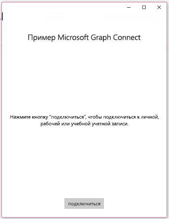
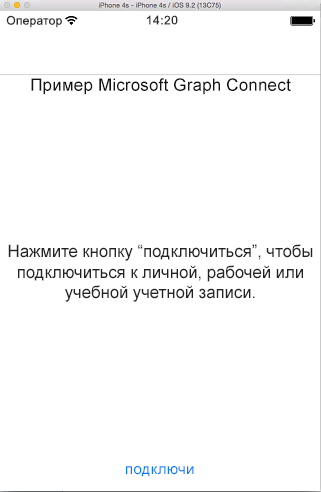

# <a name="get-started-with-microsoft-graph-in-a-xamarin-forms-app"></a><span data-ttu-id="64e21-101">Начало работы с Microsoft Graph в приложении на базе Xamarin.Forms</span><span class="sxs-lookup"><span data-stu-id="64e21-101">Get started with Microsoft Graph in a Xamarin Forms app</span></span>

> <span data-ttu-id="64e21-p101">**Создаете приложения для корпоративных клиентов?** Ваше приложение может не работать, если корпоративный клиент включит функции корпоративной безопасности для мобильных устройств, например <a href="https://azure.microsoft.com/documentation/articles/active-directory-conditional-access-device-policies/" target="_newtab">условный доступ с устройств</a>. В этом случае у пользователей могут возникать ошибки, а вы не будете об этом знать.</span><span class="sxs-lookup"><span data-stu-id="64e21-p101">**Building apps for enterprise customers?** Your app may not work if your enterprise customer turns on enterprise mobility security features like <a href="https://azure.microsoft.com/documentation/articles/active-directory-conditional-access-device-policies/" target="_newtab">conditional device access</a>. In this case, you may not know and your customers may experience errors.</span></span> 

<span data-ttu-id="64e21-p102">В этой статье описываются задачи, которые необходимо выполнить, чтобы получить маркер доступа из [конечной точки Azure AD версии 2.0](https://developer.microsoft.com/graph/docs/concepts/converged_auth) и вызвать Microsoft Graph. В ней представлен разбор кода [приложения Microsoft Graph Connect для Xamarin.Forms](https://github.com/microsoftgraph/xamarin-csharp-connect-sample) и рассматриваются основные понятия, которые необходимо реализовать в приложении, использующем Microsoft Graph. В этой статье также описывается доступ к Microsoft Graph с помощью [клиентской библиотеки Microsoft Graph](http://www.nuget.org/packages/Microsoft.Graph/).</span><span class="sxs-lookup"><span data-stu-id="64e21-p102">This article describes the tasks required to get an access token from the [Azure AD v2.0 endpoint](https://developer.microsoft.com/graph/docs/concepts/converged_auth) and call Microsoft Graph. It walks you through the code inside the [Microsoft Graph Connect Sample for Xamarin Forms](https://github.com/microsoftgraph/xamarin-csharp-connect-sample) sample to explain the main concepts that you have to implement in an app that uses Microsoft Graph. The article also describes how to access Microsoft Graph by using the [Microsoft Graph Client Library](http://www.nuget.org/packages/Microsoft.Graph/).</span></span>

<span data-ttu-id="64e21-108">Вы создадите такое приложение.</span><span class="sxs-lookup"><span data-stu-id="64e21-108">This is the app you'll create.</span></span>

| <span data-ttu-id="64e21-109">UWP</span><span class="sxs-lookup"><span data-stu-id="64e21-109">UWP</span></span> | <span data-ttu-id="64e21-110">Android</span><span class="sxs-lookup"><span data-stu-id="64e21-110">Android</span></span> | <span data-ttu-id="64e21-111">iOS</span><span class="sxs-lookup"><span data-stu-id="64e21-111">iOS</span></span> |
| --- | ------- | ----|
|  |  |  |

<span data-ttu-id="64e21-p103">**Не хотите создавать приложение?** Вы можете быстро приступить к работе с помощью [краткого руководства по Microsoft Graph](https://developer.microsoft.com/graph/quick-start) или скачать [приложение Microsoft Graph Connect для Xamarin.Forms](https://github.com/microsoftgraph/xamarin-csharp-connect-sample), которое рассматривается в этой статье.</span><span class="sxs-lookup"><span data-stu-id="64e21-p103">**Don't feel like building an app?** Use the [Microsoft Graph quick start](https://developer.microsoft.com/graph/quick-start) to get up and running fast, or download the [Microsoft Graph Connect Sample for Xamarin Forms](https://github.com/microsoftgraph/xamarin-csharp-connect-sample) that this article is based on.</span></span>

## <a name="prerequisites"></a><span data-ttu-id="64e21-114">Необходимые компоненты</span><span class="sxs-lookup"><span data-stu-id="64e21-114">Prerequisites</span></span>

<span data-ttu-id="64e21-115">Чтобы приступить к работе, вам понадобится следующее:</span><span class="sxs-lookup"><span data-stu-id="64e21-115">To get started, you'll need:</span></span> 

- <span data-ttu-id="64e21-116">[Учетная запись Майкрософт](https://www.outlook.com/) либо [рабочая или учебная учетная запись](https://docs.microsoft.com/ru-RU/office/developer-program/office-365-developer-program-faq#account-types).</span><span class="sxs-lookup"><span data-stu-id="64e21-116">A [Microsoft account](https://www.outlook.com/) or a [work or school account](https://docs.microsoft.com/ru-RU/office/developer-program/office-365-developer-program-faq#account-types)</span></span>
- <span data-ttu-id="64e21-117">Visual Studio 2015.</span><span class="sxs-lookup"><span data-stu-id="64e21-117">Visual Studio 2015</span></span> 
- <span data-ttu-id="64e21-118">[Xamarin для Visual Studio](https://www.xamarin.com/visual-studio).</span><span class="sxs-lookup"><span data-stu-id="64e21-118">[Xamarin for Visual Studio](https://www.xamarin.com/visual-studio)</span></span>
- <span data-ttu-id="64e21-119">Windows 10 ([с включенным режимом разработки](https://msdn.microsoft.com/library/windows/apps/xaml/dn706236.aspx)).</span><span class="sxs-lookup"><span data-stu-id="64e21-119">Windows 10 ([development mode enabled](https://msdn.microsoft.com/library/windows/apps/xaml/dn706236.aspx))</span></span>
- <span data-ttu-id="64e21-p104">[Начальный проект Microsoft Graph Connect для Xamarin.Forms](https://github.com/microsoftgraph/xamarin-csharp-connect-sample/tree/master/starter). Этот шаблон содержит несколько классов, в которые вы можете добавлять код. В нем также есть полные представления и строки ресурсов. Чтобы получить этот проект, клонируйте или скачайте [приложение Microsoft Graph Connect для Xamarin.Forms](https://github.com/microsoftgraph/xamarin-csharp-connect-sample) и откройте решение **XamarinConnect** в папке **starter**.</span><span class="sxs-lookup"><span data-stu-id="64e21-p104">The [Microsoft Graph Connect Starter Project for Xamarin Forms](https://github.com/microsoftgraph/xamarin-csharp-connect-sample/tree/master/starter). This template contains several classes that you'll add code to. It also contains complete views and resource strings. To get this project, clone or download the [Microsoft Graph Connect Sample for Xamarin Forms](https://github.com/microsoftgraph/xamarin-csharp-connect-sample) and open the **XamarinConnect** solution inside the **starter** folder.</span></span> 

<span data-ttu-id="64e21-124">Чтобы выполнить проект iOS в этом примере, вам потребуются следующие компоненты:</span><span class="sxs-lookup"><span data-stu-id="64e21-124">If you want to run the iOS project in this sample, you'll need the following:</span></span>

- <span data-ttu-id="64e21-125">Последний пакет SDK для iOS</span><span class="sxs-lookup"><span data-stu-id="64e21-125">The latest iOS SDK</span></span>
- <span data-ttu-id="64e21-126">Последняя версия Xcode</span><span class="sxs-lookup"><span data-stu-id="64e21-126">The latest version of Xcode</span></span>
- <span data-ttu-id="64e21-127">Mac OS X Sierra (10.12) и более поздней версии</span><span class="sxs-lookup"><span data-stu-id="64e21-127">Mac OS X Sierra(10.12) & above</span></span> 
- [<span data-ttu-id="64e21-128">Xamarin.iOS</span><span class="sxs-lookup"><span data-stu-id="64e21-128">Xamarin.iOS</span></span>](https://docs.microsoft.com/visualstudio/mac/installation)
- <span data-ttu-id="64e21-129">[Агент Xamarin Mac, подключенный к Visual Studio](https://developer.xamarin.com/guides/ios/getting_started/installation/windows/connecting-to-mac/)</span><span class="sxs-lookup"><span data-stu-id="64e21-129">A [Xamarin Mac agent connected to Visual Studio](https://developer.xamarin.com/guides/ios/getting_started/installation/windows/connecting-to-mac/)</span></span>


## <a name="register-the-app"></a><span data-ttu-id="64e21-130">Регистрация приложения</span><span class="sxs-lookup"><span data-stu-id="64e21-130">Register the app</span></span>
 
1. <span data-ttu-id="64e21-131">Войдите на [портал регистрации приложений](https://apps.dev.microsoft.com/) с помощью личной, рабочей или учебной учетной записи.</span><span class="sxs-lookup"><span data-stu-id="64e21-131">Sign into the [App Registration Portal](https://apps.dev.microsoft.com/) using either your personal or work or school account.</span></span>
2. <span data-ttu-id="64e21-132">Выберите **Добавить приложение**.</span><span class="sxs-lookup"><span data-stu-id="64e21-132">Select **Add an app**.</span></span>
3. <span data-ttu-id="64e21-133">Введите имя приложения и выберите **Создать**.</span><span class="sxs-lookup"><span data-stu-id="64e21-133">Enter a name for the app, and select **Create**.</span></span>
    
    <span data-ttu-id="64e21-134">Откроется страница регистрации со свойствами приложения.</span><span class="sxs-lookup"><span data-stu-id="64e21-134">The registration page displays, listing the properties of your app.</span></span>
 
4. <span data-ttu-id="64e21-135">В разделе **Платформы** нажмите **Добавление платформы**.</span><span class="sxs-lookup"><span data-stu-id="64e21-135">Under **Platforms**, select **Add platform**.</span></span>
5. <span data-ttu-id="64e21-136">Выберите **Собственное приложение**.</span><span class="sxs-lookup"><span data-stu-id="64e21-136">Select **Native Application**.</span></span>
6. <span data-ttu-id="64e21-p105">Скопируйте значение идентификатора приложения и значение пользовательского URI перенаправления (под заголовком **Собственное приложение**), которые были созданы для вас при добавлении платформы **Собственное приложение**. Это значение URI должно содержать значение идентификатора приложения и иметь такой формат: `msal[Application Id]://auth`. Эти значения потребуется ввести в демонстрационном приложении.</span><span class="sxs-lookup"><span data-stu-id="64e21-p105">Copy the Application Id value and the Custom Redirect URI value (under the **Native Application** header) that was created for you when you added the **Native Application** platform. This URI should contain your Application Id value and be in this form: `msal[Application Id]://auth` You'll need to enter these values into the sample app.</span></span>

    <span data-ttu-id="64e21-139">Идентификатор приложения является уникальным.</span><span class="sxs-lookup"><span data-stu-id="64e21-139">The app id is a unique identifier for your app.</span></span> 

7. <span data-ttu-id="64e21-140">Нажмите кнопку **Сохранить**.</span><span class="sxs-lookup"><span data-stu-id="64e21-140">Select **Save**.</span></span>

## <a name="configure-the-project"></a><span data-ttu-id="64e21-141">Настройка проекта</span><span class="sxs-lookup"><span data-stu-id="64e21-141">Configure the project</span></span>

1. <span data-ttu-id="64e21-142">Откройте файл решения для начального проекта в Visual Studio.</span><span class="sxs-lookup"><span data-stu-id="64e21-142">Open the solution file for the starter project in Visual Studio.</span></span>
2. <span data-ttu-id="64e21-p106">Откройте файл **App.cs** в проекте **XamarinConnect (Portable)** и найдите поле `ClientId`. Замените временное значение идентификатором зарегистрированного приложения.</span><span class="sxs-lookup"><span data-stu-id="64e21-p106">Open the **App.cs** file inside the **XamarinConnect (Portable)** project and locate the `ClientId` field. Replace the application ID placeholder with the application id of the app you registered.</span></span>

    ```
    public static string ClientID = "ENTER_YOUR_CLIENT_ID";
    public static string RedirectUri = "msal" + ClientID + "://auth";
    public static string[] Scopes = { "User.Read", "Mail.Send", "Files.ReadWrite" };
    ```
    <span data-ttu-id="64e21-p107">В значении `Scopes` хранятся области разрешений Microsoft Graph, запрашиваемые приложением, когда пользователь проходит проверку подлинности. Обратите внимание, что конструктор класса `App` использует значение ClientID для создания экземпляра класса MSAL `PublicClientApplication`. Этот класс потребуется позже для проверки подлинности пользователя.</span><span class="sxs-lookup"><span data-stu-id="64e21-p107">The `Scopes` value stores the Microsoft Graph permission scopes that the app will need to request when the user authenticates. Note that the `App` class constructor uses the ClientID value to instantiate an instance of the MSAL `PublicClientApplication` class. You'll use this class later to authenticate the user.</span></span>
    
    ```
    IdentityClientApp = new PublicClientApplication(ClientID);
    ```

3. <span data-ttu-id="64e21-p108">Откройте файл UserDetailsClient.iOS\info.plist в текстовом редакторе. К сожалению, этот файл невозможно редактировать в Visual Studio. Найдите элемент `<string>msalENTER_YOUR_CLIENT_ID</string>` в ключе `CFBundleURLSchemes`.</span><span class="sxs-lookup"><span data-stu-id="64e21-p108">Open the UserDetailsClient.iOS\info.plist file in a text editor. Unfortunately you can't edit this file in Visual Studio. Locate the `<string>msalENTER_YOUR_CLIENT_ID</string>` element under `CFBundleURLSchemes` key.</span></span>

4. <span data-ttu-id="64e21-p109">Замените `ENTER_YOUR_CLIENT_ID` на идентификатор приложения, который вы получили при регистрации. Оставьте `msal` перед идентификатором приложения. В результате полученное строковое значение должно выглядеть так: `<string>msal[application id]</string>`.</span><span class="sxs-lookup"><span data-stu-id="64e21-p109">Replace `ENTER_YOUR_CLIENT_ID` with the application id value that you got when you registered your app. Be sure to retain `msal` before the application id. The resulting string value should look like this: `<string>msal[application id]</string>`.</span></span>

5. <span data-ttu-id="64e21-p110">Откройте файл UserDetailsClient.Droid\Properties\AndroidManifest.xml. Найдите элемент `<data android:scheme="msalENTER_YOUR_CLIENT_ID" android:host="auth" />`.</span><span class="sxs-lookup"><span data-stu-id="64e21-p110">Open the UserDetailsClient.Droid\Properties\AndroidManifest.xml file. Locate this element: `<data android:scheme="msalENTER_YOUR_CLIENT_ID" android:host="auth" />`.</span></span>

6. <span data-ttu-id="64e21-p111">Замените `ENTER_YOUR_CLIENT_ID` на идентификатор приложения, который вы получили при регистрации. Оставьте `msal` перед идентификатором приложения. В результате полученное строковое значение должно выглядеть так: `<data android:scheme="msal[application id]" android:host="auth" />`.</span><span class="sxs-lookup"><span data-stu-id="64e21-p111">Replace `ENTER_YOUR_CLIENT_ID` with the application id value that you got when you registered your app. Be sure to retain `msal` before the application id. The resulting string value should look like this: `<data android:scheme="msal[application id]" android:host="auth" />`.</span></span>

## <a name="send-an-email-with-microsoft-graph"></a><span data-ttu-id="64e21-157">Отправка электронного сообщения с помощью Microsoft Graph</span><span class="sxs-lookup"><span data-stu-id="64e21-157">Send an email with Microsoft Graph</span></span>

<span data-ttu-id="64e21-158">Откройте файл MailHelper.cs начального проекта.</span><span class="sxs-lookup"><span data-stu-id="64e21-158">Open the MailHelper.cs file in your starter project.</span></span> <span data-ttu-id="64e21-159">Этот файл содержит код для создания и отправки электронного сообщения.</span><span class="sxs-lookup"><span data-stu-id="64e21-159">This file contains the code that constructs and sends an email.</span></span> <span data-ttu-id="64e21-160">Код состоит из одного метода (``ComposeAndSendMailAsync``), который создает и отправляет запрос POST в конечную точку **https://graph.microsoft.com/v1.0/me/microsoft.graph.SendMail**.</span><span class="sxs-lookup"><span data-stu-id="64e21-160">The MailHelper.cs file contains the code that constructs and sends an email. It consists of a single method --  -- that constructs and sends a POST request to the https://graph.microsoft.com/v1.0/me/microsoft.graph.SendMail endpoint.</span></span> 

<span data-ttu-id="64e21-p113">Метод ``ComposeAndSendMailAsync`` принимает три строковых значения — ``subject``, ``bodyContent`` и ``recipients``, которые передаются ему посредством файла MainPage.xaml.cs. Строки ``subject`` и ``bodyContent`` хранятся в файле AppResources.resx вместе со всеми остальными строками пользовательского интерфейса. Строка ``recipients`` принимает значения из поля адреса в интерфейсе приложения.</span><span class="sxs-lookup"><span data-stu-id="64e21-p113">The ``ComposeAndSendMailAsync`` method takes three string values -- ``subject``, ``bodyContent``, and ``recipients`` -- that are passed to it by the MainPage.xaml.cs file. The ``subject`` and ``bodyContent`` strings are stored, along with all other UI strings, in the AppResources.resx file. The ``recipients`` string comes from the address box in the app's interface.</span></span> 

<span data-ttu-id="64e21-164">**Использование объявлений**</span><span class="sxs-lookup"><span data-stu-id="64e21-164">**Using declarations**</span></span>

<span data-ttu-id="64e21-165">Убедитесь, что вверху файла есть указанные ниже объявления.</span><span class="sxs-lookup"><span data-stu-id="64e21-165">Make sure you have these declarations at the top of the file:</span></span>

```
using System;
using System.Collections.Generic;
using System.Linq;
using System.Reflection;
using System.Threading.Tasks;
using Microsoft.Graph;
```

<span data-ttu-id="64e21-p114">Первая задача в методе ``ComposeAndSendMailAsync`` — получение фотографии текущего пользователя из Microsoft Graph. В этой строке выполняется вызов усеченного метода `GetCurrentUserPhotoStreamAsync`:</span><span class="sxs-lookup"><span data-stu-id="64e21-p114">The first task inside the ``ComposeAndSendMailAsync`` method is to get the current user's photo from Microsoft Graph. This line calls the stubbed-out `GetCurrentUserPhotoStreamAsync` method:</span></span>

```
            // Get current user photo
            Stream photoStream = await GetCurrentUserPhotoStreamAsync();
```

<span data-ttu-id="64e21-168">Полностью метод `GetCurrentUserPhotoStreamAsync` выглядит так:</span><span class="sxs-lookup"><span data-stu-id="64e21-168">This is what the complete `GetCurrentUserPhotoStreamAsync` method looks like:</span></span>

```
        // Gets the stream content of the signed-in user's photo. 
        // This snippet doesn't work with consumer accounts.
        public async Task<Stream> GetCurrentUserPhotoStreamAsync()
        {
            Stream currentUserPhotoStream = null;

            try
            {
                var graphClient = AuthenticationHelper.GetAuthenticatedClient();
                currentUserPhotoStream = await graphClient.Me.Photo.Content.Request().GetAsync();

            }

            // If the user account is MSA (not work or school), the service will throw an exception.
            catch (ServiceException)
            {
                return null;
            }

            return currentUserPhotoStream;

        }
```

<span data-ttu-id="64e21-169">Если у пользователя нет фотографии, то эта логика получает другой файл изображения, включенный в проект:</span><span class="sxs-lookup"><span data-stu-id="64e21-169">If the user doesn't have a photo, this logic gets another image file that has been included with the project:</span></span>

```
            // If the user doesn't have a photo, or if the user account is MSA, we use a default photo

            if (photoStream == null)
            {
                var assembly = typeof(MailHelper).GetTypeInfo().Assembly;
                photoStream = assembly.GetManifestResourceStream("XamarinConnect.test.jpg");
            }
```

<span data-ttu-id="64e21-170">Теперь, когда у нас есть поток изображений, мы можем отправить файл в OneDrive, вызвав усеченный метод `UploadFileToOneDriveAsync`:</span><span class="sxs-lookup"><span data-stu-id="64e21-170">Now that we have an image stream, we can upload the file to OneDrive by calling the stubbed-out `UploadFileToOneDriveAsync` method:</span></span>

```
            MemoryStream photoStreamMS = new MemoryStream();
            // Copy stream to MemoryStream object so that it can be converted to byte array.
            photoStream.CopyTo(photoStreamMS);

            DriveItem photoFile = await UploadFileToOneDriveAsync(photoStreamMS.ToArray());
```

<span data-ttu-id="64e21-171">Полностью метод `UploadFileToOneDriveAsync` выглядит так:</span><span class="sxs-lookup"><span data-stu-id="64e21-171">This is what the complete `UploadFileToOneDriveAsync` method looks like:</span></span>

```
        // Uploads the specified file to the user's root OneDrive directory.
        public async Task<DriveItem> UploadFileToOneDriveAsync(byte[] file)
        {
            DriveItem uploadedFile = null;

            try
            {
                var graphClient = AuthenticationHelper.GetAuthenticatedClient();
                MemoryStream fileStream = new MemoryStream(file);
                uploadedFile = await graphClient.Me.Drive.Root.ItemWithPath("me.png").Content.Request().PutAsync<DriveItem>(fileStream);

            }


            catch (ServiceException)
            {
                return null;
            }

            return uploadedFile;
        }
```

<span data-ttu-id="64e21-172">Мы также можем использовать этот поток для создания объекта `MessageAttachmentsCollectionPage`, который можно передать вместе с сообщением:</span><span class="sxs-lookup"><span data-stu-id="64e21-172">We can also use this stream to create a `MessageAttachmentsCollectionPage` object that we can pass along with the message:</span></span>

```
            MessageAttachmentsCollectionPage attachments = new MessageAttachmentsCollectionPage();
            attachments.Add(new FileAttachment
            {
                ODataType = "#microsoft.graph.fileAttachment",
                ContentBytes = photoStreamMS.ToArray(),
                ContentType = "image/png",
                Name = "me.png"
            });
```

<span data-ttu-id="64e21-p115">Мы можем получить ссылку для общего доступа к недавно добавленному в OneDrive файлу, вызвав усеченный метод `GetSharingLinkAsync`. Строка `bodyContent` содержит заполнитель для этой ссылки:</span><span class="sxs-lookup"><span data-stu-id="64e21-p115">We can get a sharing link for the newly uploaded OneDrive file by calling the stubbed-out `GetSharingLinkAsync` method. The `bodyContent` string contains a placeholder for the sharing link:</span></span>

```
            // Get the sharing link and insert it into the message body.
            Permission sharingLink = await GetSharingLinkAsync(photoFile.Id);
            string bodyContentWithSharingLink = String.Format(bodyContent, sharingLink.Link.WebUrl);
```

<span data-ttu-id="64e21-175">Полностью метод `GetSharingLinkAsync` выглядит так:</span><span class="sxs-lookup"><span data-stu-id="64e21-175">This is what the complete `GetSharingLinkAsync` method looks like:</span></span>

```
        public static async Task<Permission> GetSharingLinkAsync(string Id)
        {
            Permission permission = null;

            try
            {
                var graphClient = AuthenticationHelper.GetAuthenticatedClient();
                permission = await graphClient.Me.Drive.Items[Id].CreateLink("view").Request().PostAsync();
            }

            catch (ServiceException)
            {
                return null;
            }

            return permission;
        }
```

<span data-ttu-id="64e21-176">Так как пользователь может указать несколько адресов, строку ``recipients`` необходимо разбить на несколько объектов `EmailAddress`, используемых для создания списка объектов `Recipients`, который затем можно передать в теле POST-запроса:</span><span class="sxs-lookup"><span data-stu-id="64e21-176">Since the user can potentially pass more than one address, the next task is to split the ``recipients`` string into a set of `EmailAddress` objects that can then be used to construct the list of `Recipients` objects that will be passed in the POST body of the request:</span></span>

```
            // Prepare the recipient list
            string[] splitter = { ";" };
            var splitRecipientsString = recipients.Split(splitter, StringSplitOptions.RemoveEmptyEntries);
            List<Recipient> recipientList = new List<Recipient>();

            foreach (string recipient in splitRecipientsString)
            {
                recipientList.Add(new Recipient { EmailAddress = new EmailAddress { Address = recipient.Trim() } });
            }
```

<span data-ttu-id="64e21-p116">В конце необходимо создать объект `Message` и отправить его в конечную точку **me/microsoft.graph.SendMail** с помощью `GraphServiceClient`. Так как строка ``bodyContent`` — это документ HTML, запрос задает для параметра **ContentType** значение HTML.</span><span class="sxs-lookup"><span data-stu-id="64e21-p116">The last task is to construct a `Message` object and send it to the **me/microsoft.graph.SendMail** endpoint through the `GraphServiceClient`. Since the ``bodyContent`` string is an HTML document, the request sets the **ContentType** value to HTML.</span></span>

```
            try
            {
                var graphClient = AuthenticationHelper.GetAuthenticatedClient();

                var email = new Message
                {
                    Body = new ItemBody
                    {
                        Content = bodyContentWithSharingLink,
                        ContentType = BodyType.Html,
                    },
                    Subject = subject,
                    ToRecipients = recipientList,
                    Attachments = attachments
                };

                try
                {
                    await graphClient.Me.SendMail(email, true).Request().PostAsync();
                }
                catch (ServiceException exception)
                {
                    throw new Exception("We could not send the message: " + exception.Error == null ? "No error message returned." : exception.Error.Message);
                }


            }

            catch (Exception e)
            {
                throw new Exception("We could not send the message: " + e.Message);
            }
```

<span data-ttu-id="64e21-179">Готовый класс должен выглядеть следующим образом:</span><span class="sxs-lookup"><span data-stu-id="64e21-179">The complete class will look like this:</span></span>

```
    public class MailHelper
    {
        /// <summary>
        /// Compose and send a new email.
        /// </summary>
        /// <param name="subject">The subject line of the email.</param>
        /// <param name="bodyContent">The body of the email.</param>
        /// <param name="recipients">A semicolon-separated list of email addresses.</param>
        /// <returns></returns>
        public async Task ComposeAndSendMailAsync(string subject,
                                                            string bodyContent,
                                                            string recipients)
        {

            // Get current user photo
            Stream photoStream = await GetCurrentUserPhotoStreamAsync();


            // If the user doesn't have a photo, or if the user account is MSA, we use a default photo

            if (photoStream == null)
            {
                var assembly = typeof(MailHelper).GetTypeInfo().Assembly;
                photoStream = assembly.GetManifestResourceStream("XamarinConnect.test.jpg");
            }

            MemoryStream photoStreamMS = new MemoryStream();
            // Copy stream to MemoryStream object so that it can be converted to byte array.
            photoStream.CopyTo(photoStreamMS);

            DriveItem photoFile = await UploadFileToOneDriveAsync(photoStreamMS.ToArray());

            MessageAttachmentsCollectionPage attachments = new MessageAttachmentsCollectionPage();
            attachments.Add(new FileAttachment
            {
                ODataType = "#microsoft.graph.fileAttachment",
                ContentBytes = photoStreamMS.ToArray(),
                ContentType = "image/png",
                Name = "me.png"
            });

            // Get the sharing link and insert it into the message body.
            Permission sharingLink = await GetSharingLinkAsync(photoFile.Id);
            string bodyContentWithSharingLink = String.Format(bodyContent, sharingLink.Link.WebUrl);


            // Prepare the recipient list
            string[] splitter = { ";" };
            var splitRecipientsString = recipients.Split(splitter, StringSplitOptions.RemoveEmptyEntries);
            List<Recipient> recipientList = new List<Recipient>();

            foreach (string recipient in splitRecipientsString)
            {
                recipientList.Add(new Recipient { EmailAddress = new EmailAddress { Address = recipient.Trim() } });
            }

            try
            {
                var graphClient = AuthenticationHelper.GetAuthenticatedClient();

                var email = new Message
                {
                    Body = new ItemBody
                    {
                        Content = bodyContentWithSharingLink,
                        ContentType = BodyType.Html,
                    },
                    Subject = subject,
                    ToRecipients = recipientList,
                    Attachments = attachments
                };

                try
                {
                    await graphClient.Me.SendMail(email, true).Request().PostAsync();
                }
                catch (ServiceException exception)
                {
                    throw new Exception("We could not send the message: " + exception.Error == null ? "No error message returned." : exception.Error.Message);
                }


            }

            catch (Exception e)
            {
                throw new Exception("We could not send the message: " + e.Message);
            }
        }

        // Gets the stream content of the signed-in user's photo. 
        // This snippet doesn't work with consumer accounts.
        public async Task<Stream> GetCurrentUserPhotoStreamAsync()
        {
            Stream currentUserPhotoStream = null;

            try
            {
                var graphClient = AuthenticationHelper.GetAuthenticatedClient();
                currentUserPhotoStream = await graphClient.Me.Photo.Content.Request().GetAsync();

            }

            // If the user account is MSA (not work or school), the service will throw an exception.
            catch (ServiceException)
            {
                return null;
            }

            return currentUserPhotoStream;

        }

        // Uploads the specified file to the user's root OneDrive directory.
        public async Task<DriveItem> UploadFileToOneDriveAsync(byte[] file)
        {
            DriveItem uploadedFile = null;

            try
            {
                var graphClient = AuthenticationHelper.GetAuthenticatedClient();
                MemoryStream fileStream = new MemoryStream(file);
                uploadedFile = await graphClient.Me.Drive.Root.ItemWithPath("me.png").Content.Request().PutAsync<DriveItem>(fileStream);

            }


            catch (ServiceException)
            {
                return null;
            }

            return uploadedFile;
        }

        public static async Task<Permission> GetSharingLinkAsync(string Id)
        {
            Permission permission = null;

            try
            {
                var graphClient = AuthenticationHelper.GetAuthenticatedClient();
                permission = await graphClient.Me.Drive.Items[Id].CreateLink("view").Request().PostAsync();
            }

            catch (ServiceException)
            {
                return null;
            }

            return permission;
        }


    }
``` 

<span data-ttu-id="64e21-180">Вы выполнили три действия, необходимых для взаимодействия с Microsoft Graph: регистрацию приложения, проверку подлинности пользователя и создание запроса.</span><span class="sxs-lookup"><span data-stu-id="64e21-180">You've now performed the three steps required for interacting with Microsoft Graph: app registration, user authentication, and making a request.</span></span> 

## <a name="run-the-app"></a><span data-ttu-id="64e21-181">Запуск приложения</span><span class="sxs-lookup"><span data-stu-id="64e21-181">Run the app</span></span>
1. <span data-ttu-id="64e21-p117">Выберите проект, который нужно запустить. Если выбрать универсальную платформу Windows, пример можно запустить на локальном компьютере. Чтобы запустить проект iOS, вам потребуется подключиться к [компьютеру Mac, на котором установлены средства Xamarin](https://developer.xamarin.com/guides/ios/getting_started/installation/windows/connecting-to-mac/). (Вы также можете открыть это решение в Xamarin Studio на компьютере Mac и запустить пример прямо оттуда.) Чтобы запустить проект для Android, вы можете использовать [эмулятор Visual Studio для Android](https://www.visualstudio.com/features/msft-android-emulator-vs.aspx).</span><span class="sxs-lookup"><span data-stu-id="64e21-p117">Select the project that you want to run. If you select the Universal Windows Platform option, you can run the sample on the local machine. If you want to run the iOS project, you'll need to connect to a [Mac that has the Xamarin tools](https://developer.xamarin.com/guides/ios/getting_started/installation/windows/connecting-to-mac/) installed on it. (You can also open this solution in Xamarin Studio on a Mac and run the sample directly from there.) You can use the [Visual Studio Emulator for Android](https://www.visualstudio.com/features/msft-android-emulator-vs.aspx) if you want to run the Android project.</span></span> 

    <span data-ttu-id="64e21-186"></span><span class="sxs-lookup"><span data-stu-id="64e21-186"></span></span>

2. <span data-ttu-id="64e21-p118">Нажмите клавишу F5 для сборки и отладки. Запустите решение и войдите, используя личную, рабочую или учебную учетную запись.</span><span class="sxs-lookup"><span data-stu-id="64e21-p118">Press F5 to build and debug. Run the solution and sign in with either your personal or work or school account.</span></span>
    > <span data-ttu-id="64e21-189">**Примечание.** Возможно, потребуется открыть диспетчер конфигурации сборки и убедиться, что для проекта UWP выбраны этапы сборки и развертывания.</span><span class="sxs-lookup"><span data-stu-id="64e21-189">**Note** You might have to open the Build Configuration Manager to make sure that the Build and Deploy steps are selected for the UWP project.</span></span> 

3. <span data-ttu-id="64e21-190">Войдите с помощью личной, рабочей или учебной учетной записи и предоставьте необходимые разрешения.</span><span class="sxs-lookup"><span data-stu-id="64e21-190">Sign in with your personal or work or school account and grant the requested permissions.</span></span>

4. <span data-ttu-id="64e21-p119">Нажмите кнопку **Отправить сообщение**. После отправки письма отобразится сообщение об успешном выполнении этой операции. Это письмо включает фотографию в виде вложения, а также ссылку для общего доступа к добавленному в OneDrive файлу.</span><span class="sxs-lookup"><span data-stu-id="64e21-p119">Choose the **Send mail** button. When the mail is sent, a Success message is displayed. This mail message includes the photo as an attachment and also provides a sharing link to the uploaded file in OneDrive.</span></span>

## <a name="next-steps"></a><span data-ttu-id="64e21-194">Дальнейшие действия</span><span class="sxs-lookup"><span data-stu-id="64e21-194">Next steps</span></span>
- <span data-ttu-id="64e21-195">Попробуйте REST API, используя [песочницу Graph](https://developer.microsoft.com/graph/graph-explorer).</span><span class="sxs-lookup"><span data-stu-id="64e21-195">Try out the REST API using the [Graph explorer](https://developer.microsoft.com/graph/graph-explorer).</span></span>
- <span data-ttu-id="64e21-196">Вы можете найти примеры распространенных операций в [библиотеке фрагментов кода с использованием пакеты SDK Microsoft Graph для Xamarin.Forms](https://github.com/microsoftgraph/xamarin-csharp-snippets-sample) или изучить другие [примеры для Xamarin](https://github.com/microsoftgraph?utf8=%E2%9C%93&query=xamarin) на сайте GitHub.</span><span class="sxs-lookup"><span data-stu-id="64e21-196">Find examples of common operations in the [Microsoft Graph SDK Snippets Library for Xamarin.Forms](https://github.com/microsoftgraph/xamarin-csharp-snippets-sample), or explore our other [Xamarin samples](https://github.com/microsoftgraph?utf8=%E2%9C%93&query=xamarin) on GitHub.</span></span>

## <a name="see-also"></a><span data-ttu-id="64e21-197">См. также</span><span class="sxs-lookup"><span data-stu-id="64e21-197">See also</span></span>
- [<span data-ttu-id="64e21-198">Клиентская библиотека .NET Microsoft Graph</span><span class="sxs-lookup"><span data-stu-id="64e21-198">Microsoft Graph .NET Client Library</span></span>](https://github.com/microsoftgraph/msgraph-sdk-dotnet)
- [<span data-ttu-id="64e21-199">Протоколы Azure AD версии 2.0</span><span class="sxs-lookup"><span data-stu-id="64e21-199">Azure AD v2.0 protocols</span></span>](https://azure.microsoft.com/documentation/articles/active-directory-v2-protocols/)
- [<span data-ttu-id="64e21-200">Маркеры Azure AD версии 2.0</span><span class="sxs-lookup"><span data-stu-id="64e21-200">Azure AD v2.0 tokens</span></span>](https://azure.microsoft.com/documentation/articles/active-directory-v2-tokens/)
