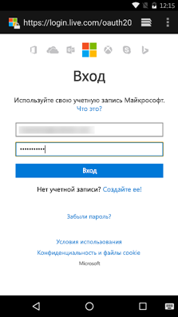

# <a name="get-started-with-microsoft-graph-in-an-android-app"></a>Начало работы с Microsoft Graph в приложении для Android

> **Создаете приложения для корпоративных клиентов?** Ваше приложение может не работать, если корпоративный клиент включит функции корпоративной безопасности для мобильных устройств, например <a href="https://azure.microsoft.com/en-us/documentation/articles/active-directory-conditional-access-device-policies/" target="_newtab">условный доступ с устройств</a>. В этом случае у пользователей могут возникать ошибки, а вы не будете об этом знать. 

> Для поддержки **всех корпоративных клиентов** в **любых корпоративных сценариях** необходимо использовать конечную точку Azure AD и управлять приложениями с помощью [портала управления Azure](https://aka.ms/aadapplist). Дополнительные сведения см. в разделе [Выбор между конечными точками Azure AD и Azure AD версии 2.0](../authorization/auth_overview.md#deciding-between-the-azure-ad-and-azure-ad-v20-endpoints).

В этой статье описываются задачи, которые необходимо выполнить, чтобы получить маркер доступа из конечной точки Azure AD версии 2.0 и вызвать Microsoft Graph. В ней рассматривается создание [примера приложения Connect для Android](https://github.com/microsoftgraph/android-java-connect-sample) и объясняются основные понятия, которые необходимо реализовать для использования Microsoft Graph в приложении для Android. В этой статье также описывается, как получить доступ к Microsoft Graph с помощью [пакета SDK Microsoft Graph для Android](https://github.com/microsoftgraph/msgraph-sdk-android) или необработанных вызовов REST.

Чтобы использовать Microsoft Graph в приложении для Android, необходимо предоставить пользователям страницу входа в учетную запись Майкрософт, как показано на приведенном ниже снимке экрана.



**Не хотите создавать приложение?** Скачайте пример [приложения Connect для Android](https://github.com/microsoftgraph/android-java-connect-sample), на котором основана эта статья, и вы будете готовы к работе.


## <a name="prerequisites"></a>Необходимые условия

Чтобы приступить к работе, вам понадобится следующее: 

- [Учетная запись Майкрософт](https://www.outlook.com/) либо [рабочая или учебная учетная запись](http://dev.office.com/devprogram).
- Android Studio 2.0 или более поздней версии.


## <a name="register-the-application"></a>Регистрация приложения
Зарегистрируйте приложение на портале регистрации приложений Майкрософт. При этом будут созданы идентификатор и пароль приложения, которые понадобятся при его настройке.

1. Войдите на [портал регистрации приложений Майкрософт](https://apps.dev.microsoft.com/) с помощью личной, рабочей или учебной учетной записи.

2. Нажмите кнопку **Добавить приложение**.

3. Введите имя приложения и нажмите кнопку **Создать приложение**. 
    
    Откроется страница регистрации со свойствами приложения.

4. Скопируйте идентификатор приложения. Это уникальный идентификатор приложения. 

5. Нажмите **Добавление платформы** и выберите **Мобильное приложение**.

    > **Примечание.** На портале регистрации приложений предоставляется URI перенаправления со значением *urn:ietf:wg:oauth:2.0:oob*. Однако мы будем использовать значение *https://login.microsoftonline.com/common/oauth2/nativeclient*.

6. Нажмите кнопку **Сохранить**.


## <a name="configure-the-project"></a>Настройка проекта

Создайте новый проект в Android Studio. Большинство параметров в мастере можно оставить без изменений, но обязательно выберите следующие параметры:

* На странице Target Android Devices (Целевые устройства Android) установите флажок **Phone and Tablet (Телефон и планшет)**
    * В поле Minimum SDK (Минимальная версия пакета SDK) выберите значение **API 16: Android 4.1 (Jelly Bean)**
* На странице Add an Activity to Mobile (Добавить действие к мобильному устройству) выберите **Basic Activity (Основное действие)**
 
В результате получится проект Android с действием и кнопкой для проверки подлинности пользователя.

> Примечание. Вы также можете использовать [начальный проект](https://github.com/microsoftgraph/android-java-connect-sample/tree/master/starter-project) с готовой конфигурацией, чтобы сосредоточиться на программировании.

## <a name="authenticate-the-user-and-get-an-access-token"></a>Проверка подлинности пользователя и получение маркера доступа
Для упрощения проверки подлинности мы будем использовать библиотеку OAuth. [OpenID](http://openid.net) предоставляет библиотеку [AppAuth для Android](https://github.com/openid/AppAuth-Android), которую можно использовать в этом проекте.

### <a name="add-the-dependency-to-appbuildgradle"></a>Добавление зависимости в файл app/build.gradle

Откройте файл `build.gradle` в модуле приложения и добавьте следующую зависимость:

```gradle
compile 'net.openid:appauth:0.3.0'
```

### <a name="start-the-authentication-flow"></a>Запуск потока проверки подлинности

1. Откройте файл **MainActivity** и объявите объект **AuthorizationService** в методе **onCreate**.
    ```java
    final AuthorizationService authorizationService =
        new AuthorizationService(this);
    ```
    
2. Найдите обработчик события для нажатия кнопки *FloatingActionButton*. Замените метод **onClick** приведенным ниже кодом. Вставьте **идентификатор** приложения вместо заполнителя **\<YOUR_APPLICATION_ID\>**.
    ```java
    @Override
    public void onClick(View view) {
        Uri authorizationEndpoint =
            Uri.parse("https://login.microsoftonline.com/common/oauth2/v2.0/authorize");
        Uri tokenEndpoint =
            Uri.parse("https://login.microsoftonline.com/common/oauth2/v2.0/token");
        AuthorizationServiceConfiguration config =
            new AuthorizationServiceConfiguration(
                    authorizationEndpoint,
                    tokenEndpoint,null);

        List<String> scopes = new ArrayList<>(
            Arrays.asList("openid mail.send".split(" ")));

        AuthorizationRequest authorizationRequest = new AuthorizationRequest.Builder(
            config,
            "<YOUR_APPLICATION_ID>",
            ResponseTypeValues.CODE,
            Uri.parse("https://login.microsoftonline.com/common/oauth2/nativeclient"))
            .setScopes(scopes)
            .build();

        Intent intent = new Intent(view.getContext(), MainActivity.class);

        PendingIntent redirectIntent =
            PendingIntent.getActivity(
                    view.getContext(),
                    authorizationRequest.hashCode(),
                    intent, 0);

        authorizationService.performAuthorizationRequest(
            authorizationRequest,
            redirectIntent);
    }
    ```
    
На этом этапе у вас должно получиться приложение Android с кнопкой. При нажатии кнопки приложение открывает страницу проверки подлинности в браузере устройства. Теперь необходимо обработать код, отправляемый сервером авторизации на URI перенаправления, и обменять его на маркер доступа.

### <a name="exchange-the-authorization-code-for-an-access-token"></a>Обмен кода авторизации на маркер доступа

Приложение необходимо подготовить к обработке ответа от сервера авторизации, содержащего код, который можно обменять на маркер доступа.

1. Необходимо сообщить системе Android, что элемент **MainActivity** может обрабатывать запросы по адресу *https://login.microsoftonline.com/common/oauth2/nativeclient*. Для этого откройте файл **AndroidManifest** и добавьте представленные ниже дочерние элементы в элемент действия MainActivity **intent-filter**.
    ```xml
    <action android:name="android.intent.action.VIEW"/>
    <category android:name="android.intent.category.DEFAULT"/>
    <category android:name="android.intent.category.BROWSABLE"/>
    <data android:scheme="https"/>
    <data android:host="login.microsoftonline.com"/>
    <data android:path="/common/oauth2/nativeclient"/>
    ```

2. Это действие будет вызываться, когда сервер авторизации отправляет ответ. Вы можете запросить маркер доступа с ответом от сервера авторизации. Вернитесь к действию **MainActivity** и добавьте приведенный ниже код к методу **onCreate**.
    ```java
    Bundle extras = getIntent().getExtras();
    if (extras != null) {
        AuthorizationResponse authorizationResponse = AuthorizationResponse.fromIntent(getIntent());
        AuthorizationException authorizationException = AuthorizationException.fromIntent(getIntent());
        final AuthState authState = new AuthState(authorizationResponse, authorizationException);

        if (authorizationResponse != null) {
            HashMap<String, String> additionalParams = new HashMap<>();
            TokenRequest tokenRequest = authorizationResponse.createTokenExchangeRequest(additionalParams);

            authorizationService.performTokenRequest(
                tokenRequest,
                new AuthorizationService.TokenResponseCallback() {
                    @Override
                    public void onTokenRequestCompleted(
                            @Nullable TokenResponse tokenResponse,
                            @Nullable AuthorizationException ex) {
                        authState.update(tokenResponse, ex);
                        if (tokenResponse != null) {
                            String accessToken = tokenResponse.accessToken;
                        }
                    }
                });
        } else {
            Log.i("MainActivity", "Authorization failed: " + authorizationException);
        }
    }
    ```

Обратите внимание, что маркер доступа содержится в строке `String accessToken = tokenResponse.accessToken;`. Теперь вы готовы добавить код для вызова Microsoft Graph. 

## <a name="call-microsoft-graph"></a>Вызов Microsoft Graph
Для вызова Microsoft Graph можно [использовать пакет SDK Microsoft Graph](#call-microsoft-graph-using-the-microsoft-graph-sdk) или [Microsoft Graph REST API](#call-microsoft-graph-using-the-microsoft-graph-rest-api).

### <a name="call-microsoft-graph-using-the-microsoft-graph-sdk"></a>Вызов Microsoft Graph с помощью пакета SDK Microsoft Graph
[Пакет SDK Microsoft Graph для Android](https://github.com/microsoftgraph/msgraph-sdk-android) содержит классы, которые создают запросы и обрабатывают результаты из Microsoft Graph. Чтобы использовать пакет SDK Microsoft Graph, выполните указанные ниже действия.

1. Предоставьте приложению разрешения на доступ к Интернету. Откройте файл **AndroidManifest** и добавьте к элементу манифеста представленный ниже дочерний элемент.
    ```xml
    <uses-permission android:name="android.permission.INTERNET" />
    ```

2. Добавьте зависимости от пакета SDK Microsoft Graph и GSON.
    ```gradle
    compile 'com.microsoft.graph:msgraph-sdk-android:1.0.0'
    compile 'com.google.code.gson:gson:2.7'
    ```
   
3. Замените строку `String accessToken = tokenResponse.accessToken;` приведенным ниже кодом. Вставьте свой адрес электронной почты вместо заполнителя **\<YOUR_EMAIL_ADDRESS\>**.
    ```java
    final String accessToken = tokenResponse.accessToken;
    final IClientConfig clientConfig = 
            DefaultClientConfig.createWithAuthenticationProvider(new IAuthenticationProvider() {
        @Override
        public void authenticateRequest(IHttpRequest request) {
            request.addHeader("Authorization", "Bearer " + accessToken);
        }
    });

    final IGraphServiceClient graphServiceClient = new GraphServiceClient
        .Builder()
        .fromConfig(clientConfig)
        .buildClient();

    final Message message = new Message();
    EmailAddress emailAddress = new EmailAddress();
    emailAddress.address = "<YOUR_EMAIL_ADDRESS>";
    Recipient recipient = new Recipient();
    recipient.emailAddress = emailAddress;
    message.toRecipients = Collections.singletonList(recipient);
    ItemBody itemBody = new ItemBody();
    itemBody.content = "This is the email body";
    itemBody.contentType = BodyType.text;
    message.body = itemBody;
    message.subject = "Sent using the Microsoft Graph SDK";

    AsyncTask.execute(new Runnable() {
        @Override
        public void run() {
            graphServiceClient
                .getMe()
                .getSendMail(message, false)
                .buildRequest()
                .post();
        }
    });
    ```

### <a name="call-microsoft-graph-using-the-microsoft-graph-rest-api"></a>Вызов Microsoft Graph с помощью Microsoft Graph REST API
[Microsoft Graph REST API](http://developer.microsoft.com/en-us/graph/docs) предоставляет несколько API-интерфейсов из облачных служб Майкрософт через одну конечную точку REST API. Чтобы использовать REST API, выполните указанные ниже действия.

1. Предоставьте приложению разрешения на доступ к Интернету. Откройте файл **AndroidManifest** и добавьте к элементу манифеста представленный ниже дочерний элемент.
    ```xml
    <uses-permission android:name="android.permission.INTERNET" />
    ```

2. Добавьте зависимость от библиотеки HTTP Volley.

    ```gradle
    compile 'com.android.volley:volley:1.0.0'
    ```
   
3. Замените строку `String accessToken = tokenResponse.accessToken;` приведенным ниже кодом. Вставьте свой адрес электронной почты вместо заполнителя **\<YOUR_EMAIL_ADDRESS\>**.
    ```java
    final String accessToken = tokenResponse.accessToken;

    final RequestQueue queue = Volley.newRequestQueue(getApplicationContext());
    String url ="https://graph.microsoft.com/v1.0/me/sendMail";
    final String body = "{" +
        "  Message: {" +
        "    subject: 'Sent using the Microsoft Graph REST API'," +
        "    body: {" +
        "      contentType: 'text'," +
        "      content: 'This is the email body'" +
        "    }," +
        "    toRecipients: [" +
        "      {" +
        "        emailAddress: {" +
        "          address: '<YOUR_EMAIL_ADDRESS>'" +
        "        }" +
        "      }" +
        "    ]}" +
        "}";

    final StringRequest stringRequest = new StringRequest(Request.Method.POST, url,
        new Response.Listener<String>() {
            @Override
            public void onResponse(String response) {
                Log.d("Response", response);
            }
        },
        new Response.ErrorListener() {
            @Override
            public void onErrorResponse(VolleyError error) {
                Log.d("ERROR","error => " + error.getMessage());
            }
        }
    ) {
        @Override
        public Map<String, String> getHeaders() throws AuthFailureError {
            Map<String,String> params = new HashMap<>();
            params.put("Authorization", "Bearer " + accessToken);
            params.put("Content-Length", String.valueOf(body.getBytes().length));
            return params;
        }
        @Override
        public String getBodyContentType() {
            return "application/json";
        }
        @Override
        public byte[] getBody() throws AuthFailureError {
            return body.getBytes();
        }
    };

    AsyncTask.execute(new Runnable() {
        @Override
        public void run() {
            queue.add(stringRequest);
        }
    });
    ```

## <a name="run-the-app"></a>Запуск приложения
Теперь вы можете испытать свое приложение для Android.

1. Запустите эмулятор Android или подключите к компьютеру физическое устройство.
2. Нажмите в Android Studio клавиши SHIFT+F10, чтобы запустить приложение.
3. Выберите эмулятор Android или устройство в диалоговом окне развертывания.
4. Нажмите плавающую кнопку основного действия.
5. Войдите с помощью личной, рабочей или учебной учетной записи и предоставьте необходимые разрешения.
6. Чтобы продолжить, выберите свое приложение в диалоговом окне выбора приложения.

Проверьте папку "Входящие" в почтовом ящике, выбранном в разделе [Вызов Microsoft Graph](#call-microsoft-graph). Вы должны получить сообщение от учетной записи, которая использовалась для входа в приложение.

## <a name="next-steps"></a>Дальнейшие действия
- Опробуйте [песочницу Microsoft Graph](https://graph.microsoft.io/graph-explorer).
- Вы можете найти примеры распространенных операций в [примере приложения Snippets для Android](https://github.com/microsoftgraph/android-java-snippets-sample) и других [примерах для Android](https://github.com/microsoftgraph?utf8=%E2%9C%93&query=android) на сайте GitHub.


## <a name="see-also"></a>См. также
* [Пакет SDK Microsoft Graph для Android](https://github.com/microsoftgraph/msgraph-sdk-android) 
* [Протоколы Azure AD версии 2.0](https://azure.microsoft.com/en-us/documentation/articles/active-directory-v2-protocols/)
* [Маркеры Azure AD версии 2.0](https://azure.microsoft.com/en-us/documentation/articles/active-directory-v2-tokens/)
