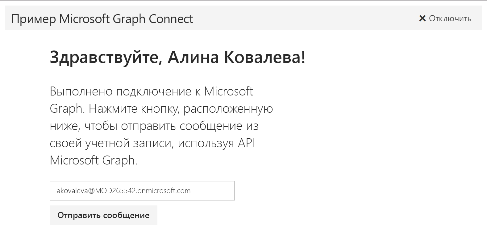

# Начало работы с Microsoft Graph в приложении AngularJS

В этой статье описываются задачи, которые необходимо выполнить, чтобы получить маркер доступа из конечной точки Azure AD версии 2.0 и вызвать Microsoft Graph. В ней рассматривается создание [приложения Microsoft Connect для AngularJS](https://github.com/microsoftgraph/angular-connect-rest-sample) и объясняются основные понятия, которые необходимо реализовать для использования Microsoft Graph. В этой статье также описывается, как получить доступ к Microsoft Graph с помощью [пакета SDK Microsoft Graph для JavaScript](https://github.com/microsoftgraph/msgraph-sdk-javascript) или необработанных вызовов REST.

На приведенном ниже рисунке показано создаваемое приложение. 

**Не хотите создавать приложение?** С помощью [краткого руководства по Microsoft Graph](https://graph.microsoft.io/en-us/getting-started) вы сможете быстро приступить к работе.

Скачать вариант этого примера, использующий конечную точку Azure AD, можно на странице [приложения Microsoft Graph Connect для AngularJS](https://github.com/microsoftgraph/angular-connect-rest-sample/releases/tag/last_v1_auth).

## Необходимые условия

Чтобы приступить к работе, вам понадобится следующее: 

- [Учетная запись Майкрософт](https://www.outlook.com/) либо [рабочая или учебная учетная запись](http://dev.office.com/devprogram).
- [Node.js с npm](https://nodejs.org/en/download/).
- [Bower](https://bower.io).
- [Приложение Microsoft Graph Connect для AngularJS](https://github.com/microsoftgraph/angular-connect-rest-sample). Вы будете использовать папку **starter-project** в примерах файлов для этого пошагового руководства.

## Регистрация приложения
Зарегистрируйте приложение на портале регистрации приложений (Майкрософт). При этом будут созданы идентификатор и пароль приложения, которые понадобятся при его настройке в Visual Studio.

1. Войдите на [портал регистрации приложений Майкрософт](https://apps.dev.microsoft.com/) с помощью личной, рабочей или учебной учетной записи.

2. Нажмите кнопку **Добавить приложение**.

3. Введите имя приложения и нажмите кнопку **Создать приложение**. 
    
    Откроется страница регистрации со свойствами приложения.

4. Скопируйте идентификатор приложения. Это уникальный идентификатор приложения, который используется для его настройки.

5. В разделе **Платформы** нажмите **Добавление платформы** > **Интернет**.

6. Убедитесь, что установлен флажок **Разрешить неявный поток** и введите универсальный код ресурса (URI) перенаправления *http://localhost:8080*. 

7. Нажмите кнопку **Сохранить**.

## Настройка проекта
1. Откройте папку **starter-project** с файлами примера.
2. Откройте командную строку и выполните приведенные ниже команды в корневом каталоге начального проекта. При этом устанавливаются зависимости проекта.

        npm install  
        bower install
    
3. В файлах начального проекта перейдите к папке **public/scripts** и откройте файл config.js.
4. В поле **clientId** замените текст **ENTER_YOUR_CLIENT_ID** на скопированный идентификатор приложения.
5. **Если вы используете пакет SDK Microsoft Graph**, установите этот пакет и добавьте ссылку на него.  
   a. Выполните в командной строке приведенную ниже команду, чтобы установить пакет SDK.
        
        bower install https://github.com/microsoftgraph/msgraph-sdk-javascript.git
         
   b. В файле **public/index.html** добавьте следующий код в элемент **head** над разделом `<!-- App code. -->`:
   
        <!--Include Graph SDK -->
        

  
## Проверка подлинности пользователя и получение маркера доступа
На этом этапе вы добавите код для входа и получения маркера. Но для начала подробнее рассмотрим поток проверки подлинности.

В этом одностраничном приложении используется очень простая реализация неявного потока предоставления, для которой требуются идентификатор и URI перенаправления из зарегистрированного приложения. 

Поток проверки подлинности можно разделить на следующие основные этапы:

1. Перенаправление пользователя для проверки подлинности и согласия.
2. Получение маркера доступа.

Приложение использует клиентскую библиотеку [HelloJS](https://adodson.com/hello.js) для проверки подлинности и получения маркеров. Приложение сохраняет маркер доступа в локальном хранилище.
    
   >**Важно!** Простые процедуры проверки подлинности и обработки маркеров в этом проекте представлены исключительно в качестве примера. В рабочем приложении следует реализовать более надежную процедуру проверки подлинности, включающую утверждение и безопасную обработку маркеров.

Теперь вернемся к созданию приложения.

1. Откройте файл aad.js и добавьте приведенный ниже код. Этот код настраивает связь с поставщиком аутентификации Azure AD и добавляет прослушиватель, который сохраняет ответ авторизации, содержащий маркер доступа. (Ссылки на сценарии HelloJS уже добавлены в представление index.html.)

        hello.init({

          aad: {
            name: 'Azure Active Directory',    
            oauth: {
              version: 2,
              auth: 'https://login.microsoftonline.com/common/oauth2/v2.0/authorize',
              grant: 'https://login.microsoftonline.com/common/oauth2/v2.0/token'
            },
            scope_delim: ' ',

            // Don't even try submitting via form.
            // This means no POST operations in <=IE9
            form: false
          }
        });

        hello.on('auth.login', function (auth) {

          // save the auth info into localStorage
          localStorage.auth = angular.toJson(auth.authResponse);
        });

2. В файле graphHelper.js замените строку *// Initialize the auth request* на приведенный ниже код. Этот код задает параметры запроса аутентификации.

        // Initialize the auth request.
        hello.init( {
          aad: clientId // from public/scripts/config.js
          }, {
          redirect_uri: redirectUrl,
          scope: graphScopes
        });

3. Замените строку *// Sign in and sign out the user* на приведенный ниже код. Функция **login** получает данные маркера с помощью HelloJS. Прослушиватель в файле aad.js сохраняет эти сведения — в том числе маркер доступа — в локальном хранилище.

        // Sign in and sign out the user.
        login: function login() {
          hello('aad').login({
            display: 'page',
            state: 'abcd'
          });
        },
        logout: function logout() {
          hello('aad').logout();
          delete localStorage.auth;
          delete localStorage.user;
        },

4. **Если вы используете пакет SDK Microsoft Graph SDK,** откройте файл app.js и добавьте приведенный ниже код в конце файла. Этот код инициализирует пакет SDK.

        var authToken;
        var graphClient = MicrosoftGraph.init({
            authProvider: function(done) {
                if (typeof authToken === "undefined") {
                  done({err: "No auth token"})
                } else {
                  done(null, authToken); //first parameter takes an error if you can't get an access token
                }
            }
        });

Теперь вы готовы добавить код для вызова Microsoft Graph. 

## Вызов Microsoft Graph
Приложение вызывает Microsoft Graph, чтобы получить данные пользователя и отправить электронное сообщение от его имени. Такие вызовы отправляются из MainController в ответ на события пользовательского интерфейса.

Если вы используете пакет SDK Microsoft Graph, читайте дальше. Если вы используете REST, см. раздел [Использование API REST](#using-the-rest-api).

### Использование пакета SDK
1. В файле graphHelper.js замените строку *// Get the profile of the current user* на приведенный ниже код. Этот код настраивает и отправляет запрос GET конечной точке */me*, а затем обрабатывает ответ.

        // Get the profile of the current user.
        me: function me() {
          return graphClient.api('/me').get();
        },
  
2. Замените строку *// Send an email on behalf of the current user* на приведенный ниже код. Этот код настраивает и отправляет запрос POST конечной точке */me/sendMail*, а затем обрабатывает ответ.

        // Send an email on behalf of the current user.
        sendMail: function sendMail(email) {
          return graphClient.api('/me/sendMail').post({ 'message' : email, 'saveToSentItems': true });
        }

3. В папке **public/controllers** откройте файл mainController.js.

4. Замените строку *// Set the default headers and user properties* на приведенный ниже код. Этот код добавляет маркер доступа к HTTP-запросу, вызывает **GraphHelper.me**, чтобы получить профиль текущего пользователя, и обрабатывает ответ.

        // Set the default headers and user properties.
        function processAuth() {
            let auth = angular.fromJson(localStorage.auth); 

            // Check token expiry. If the token is valid for another 5 minutes, we'll use it.       
            let expiration = new Date();
            expiration.setTime((auth.expires - 300) * 1000); 
            if (expiration > new Date()) {

              // let the authProvider access the access token
              authToken = auth.access_token;

              // This header has been added to identify our sample in the Microsoft Graph service. If extracting this code for your project please remove.
              $http.defaults.headers.common.SampleID = 'angular-connect-starter';

              if (localStorage.getItem('user') === null) {

                // Get the profile of the current user.
                GraphHelper.me().then(function(user) {

                  // Save the user to localStorage.
                  localStorage.setItem('user', angular.toJson(user));

                  vm.displayName = user.displayName;
                  vm.emailAddress = user.mail || user.userPrincipalName;
                });
              } else {
                let user = angular.fromJson(localStorage.user);

                vm.displayName = user.displayName;
                vm.emailAddress = user.mail || user.userPrincipalName;
              }
           }
        }

5. Замените строку *// Send an email on behalf of the current user* на приведенный ниже код. Этот код создает электронное сообщение, вызывает метод **GraphHelper.sendMail** и обрабатывает ответ.

        // Send an email on behalf of the current user.
        function sendMail() {

          // Check token expiry. If the token is valid for another 5 minutes, we'll use it.
          let auth = angular.fromJson(localStorage.auth);       
          let expiration = new Date();
          expiration.setTime((auth.expires - 300) * 1000); 
          if (expiration > new Date()) {

            // Build the HTTP request payload (the Message object).
            var email = {
                Subject: 'Welcome to Microsoft Graph development with Angular and the Microsoft Graph Connect sample',
                Body: {
                  ContentType: 'HTML',
                  Content: getEmailContent()
                },
                ToRecipients: [
                  {
                    EmailAddress: {
                      Address: vm.emailAddress
                    }
                  }
                ]
            };

            // Save email address so it doesn't get lost with two way data binding.
            vm.emailAddressSent = vm.emailAddress;

            GraphHelper.sendMail(email)
              .then(function (response) {
                $log.debug('HTTP request to the Microsoft Graph API returned successfully.', response);
                vm.requestSuccess = true;
                vm.requestFinished = true;
              }, function (error) {
                $log.error('HTTP request to the Microsoft Graph API failed.');
                vm.requestSuccess = false;
                vm.requestFinished = true;
              });
           } else {

             // If the token is expired, this sample just redirects the user to sign in.
             GraphHelper.login();
           }
        };

        // Get the HTMl for the email to send.
        function getEmailContent() {
          return "<html><head> <meta http-equiv=\'Content-Type\' content=\'text/html; charset=us-ascii\'> <title></title> </head><body style=\'font-family:calibri\'> 
Congratulations " + vm.displayName + ",
 
This is a message from the Microsoft Graph Connect sample. You are well on your way to incorporating Microsoft Graph endpoints in your apps. 
 <h3>What&#8217;s next?</h3><ul><li>Check out <a href='https://graph.microsoft.io' target='_blank'>graph.microsoft.io</a> to start building Microsoft Graph apps today with all the latest tools, templates, and guidance to get started quickly.</li><li>Use the <a href='https://graph.microsoft.io/graph-explorer' target='_blank'>Graph explorer</a> to explore the rest of the APIs and start your testing.</li><li>Browse other <a href='https://github.com/microsoftgraph/' target='_blank'>samples on GitHub</a> to see more of the APIs in action.</li></ul> <h3>Give us feedback</h3> <ul><li>If you have any trouble running this sample, please <a href='https://github.com/microsoftgraph/angular-connect-sample/issues' target='_blank'>log an issue</a>.</li><li>For general questions about the Microsoft Graph API, post to <a href='https://stackoverflow.com/questions/tagged/microsoftgraph?sort=newest' target='blank'>Stack Overflow</a>. Make sure that your questions or comments are tagged with [microsoftgraph].</li></ul>
Thanks and happy coding! Your Microsoft Graph samples development team
 
 <table style=\'width:100%; font-family:calibri\'> <tbody> <tr> <td><a href=\'https://github.com/microsoftgraph/angular-connect-sample\'>See on GitHub</a> </td> <td><a href=\'https://officespdev.uservoice.com/\'>Suggest on UserVoice</a> </td> <td><a href=\'https://twitter.com/share?text=I%20just%20started%20developing%20%23Angular%20apps%20using%20the%20%23MicrosoftGraph%20Connect%20sample!%20&url=https://github.com/microsoftgraph/angular-connect-sample\'>Share on Twitter</a> </td> </tr> </tbody> </table> 
  </body> </html>";
        };
    
6. Сохраните все изменения. Теперь вы готовы к [запуску приложения](#run-the-app).
    
### Использование REST API
1. В файле graphHelper.js замените строку *// Get the profile of the current user* на приведенный ниже код. Этот код настраивает и отправляет запрос GET конечной точке */me*, а затем обрабатывает ответ.

        // Get the profile of the current user.
        me: function me() {
          return $http.get('https://graph.microsoft.com/v1.0/me');
        },
  
2. Замените строку *// Send an email on behalf of the current user* на приведенный ниже код. Этот код настраивает и отправляет запрос POST конечной точке */me/sendMail*, а затем обрабатывает ответ.

        // Send an email.n sendMail(email) {
          return $http.post('https://graph.microsoft.com/v1.0/me/sendMail', { 'message' : email, 'saveToSentItems': true });        
        }

3. В папке **public/controllers** откройте файл mainController.js.

4. Замените строку *// Set the default headers and user properties* на приведенный ниже код. Этот код добавляет маркер доступа к HTTP-запросу, вызывает **GraphHelper.me**, чтобы получить профиль текущего пользователя, и обрабатывает ответ.

        // Set the default headers and user properties.
        function processAuth() {
          let auth = angular.fromJson(localStorage.auth); 

          // Check token expiry. If the token is valid for another 5 minutes, we'll use it.       
          let expiration = new Date();
          expiration.setTime((auth.expires - 300) * 1000); 
          if (expiration > new Date()) {

            // Add the required Authorization header with bearer token.
            $http.defaults.headers.common.Authorization = 'Bearer ' + auth.access_token;

            // This header has been added to identify our sample in the Microsoft Graph service. If extracting this code for your project please remove.
            $http.defaults.headers.common.SampleID = 'angular-connect-rest-starter';

            if (localStorage.getItem('user') === null) {

              // Get the profile of the current user.
              GraphHelper.me().then(function(response) {

                // Save the user to localStorage.
                let user =response.data;
                localStorage.setItem('user', angular.toJson(user));

                vm.displayName = user.displayName;
                vm.emailAddress = user.mail || user.userPrincipalName;
              });
           } else {
             let user = angular.fromJson(localStorage.user);

             vm.displayName = user.displayName;
             vm.emailAddress = user.mail || user.userPrincipalName;
            }
          }
        } 

5. Замените строку *// Send an email on behalf of the current user* на приведенный ниже код. Этот код создает электронное сообщение, вызывает метод **GraphHelper.sendMail** и обрабатывает ответ.

        // Send an email on behalf of the current user.
        function sendMail() {

          // Check token expiry. If the token is valid for another 5 minutes, we'll use it.
          let auth = angular.fromJson(localStorage.auth);
          let expiration = new Date();
          expiration.setTime((auth.expires - 300) * 1000);
          if (expiration > new Date()) {

            // Build the HTTP request payload (the Message object).
            var email = {
                Subject: 'Welcome to Microsoft Graph development with AngularJS and the Microsoft Graph Connect sample',
                Body: {
                    ContentType: 'HTML',
                    Content: getEmailContent()
                },
                ToRecipients: [
                    {
                        EmailAddress: {
                            Address: vm.emailAddress
                        }
                    }
                ]
            };

            // Save email address so it doesn't get lost with two way data binding.
            vm.emailAddressSent = vm.emailAddress;

            GraphHelper.sendMail(email)
                .then(function (response) {
                    $log.debug('HTTP request to the Microsoft Graph API returned successfully.', response);
                    response.status === 202 ? vm.requestSuccess = true : vm.requestSuccess = false;
                    vm.requestFinished = true;
                }, function (error) {
                    $log.error('HTTP request to the Microsoft Graph API failed.');
                    vm.requestSuccess = false;
                    vm.requestFinished = true;
                });
            } else {

            // If the token is expired, this sample just redirects the user to sign in.
            GraphHelper.login();
            }
        };

        // Get the HTMl for the email to send.
        function getEmailContent() {
          return "<html><head> <meta http-equiv=\'Content-Type\' content=\'text/html; charset=us-ascii\'> <title></title> </head><body style=\'font-family:calibri\'> 
Congratulations " + vm.displayName + ",
 
This is a message from the Microsoft Graph Connect sample. You are well on your way to incorporating Microsoft Graph endpoints in your apps. 
 <h3>What&#8217;s next?</h3><ul><li>Check out <a href='https://graph.microsoft.io' target='_blank'>graph.microsoft.io</a> to start building Microsoft Graph apps today with all the latest tools, templates, and guidance to get started quickly.</li><li>Use the <a href='https://graph.microsoft.io/graph-explorer' target='_blank'>Graph explorer</a> to explore the rest of the APIs and start your testing.</li><li>Browse other <a href='https://github.com/microsoftgraph/' target='_blank'>samples on GitHub</a> to see more of the APIs in action.</li></ul> <h3>Give us feedback</h3> <ul><li>If you have any trouble running this sample, please <a href='https://github.com/microsoftgraph/angular-connect-rest-sample/issues' target='_blank'>log an issue</a>.</li><li>For general questions about the Microsoft Graph API, post to <a href='https://stackoverflow.com/questions/tagged/microsoftgraph?sort=newest' target='blank'>Stack Overflow</a>. Make sure that your questions or comments are tagged with [microsoftgraph].</li></ul>
Thanks and happy coding! Your Microsoft Graph samples development team
 
 <table style=\'width:100%; font-family:calibri\'> <tbody> <tr> <td><a href=\'https://github.com/microsoftgraph/angular-connect-rest-sample\'>See on GitHub</a> </td> <td><a href=\'https://officespdev.uservoice.com/\'>Suggest on UserVoice</a> </td> <td><a href=\'https://twitter.com/share?text=I%20just%20started%20developing%20%23Angular%20apps%20using%20the%20%23MicrosoftGraph%20Connect%20sample!%20&url=https://github.com/microsoftgraph/angular-connect-rest-sample\'>Share on Twitter</a> </td> </tr> </tbody> </table> 
  </body> </html>";
        };

6. Сохраните все изменения.

## Запуск приложения

1. Откройте командную строку и выполните приведенную ниже команду в корневом каталоге начального проекта.

        npm start

2. Введите в браузере адрес *http://localhost:8080* и нажмите кнопку **Подключиться**.

3. Выполните вход и предоставьте запрашиваемые разрешения. 

4. При необходимости измените электронный адрес получателя и нажмите кнопку **Отправить сообщение**. Под кнопкой появится сообщение, что отправка выполнена успешно. 

## Дальнейшие действия
- Опробуйте REST API с помощью [песочницы Graph](https://graph.microsoft.io/graph-explorer).
- Просмотрите другие [примеры AngularJS](https://github.com/search?utf8=%E2%9C%93&q=angular+sample+user%3Amicrosoftgraph&type=Repositories&ref=searchresults) на сайте GitHub.

## См. также
- [Протоколы Azure AD версии 2.0](https://azure.microsoft.com/en-us/documentation/articles/active-directory-v2-protocols/)
- [Маркеры Azure AD версии 2.0](https://azure.microsoft.com/en-us/documentation/articles/active-directory-v2-tokens/)