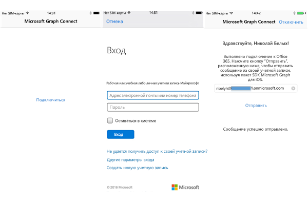

# Начало работы с Microsoft Graph в приложении для iOS

> **Создаете приложения для корпоративных клиентов?** Ваше приложение может не работать, если корпоративный клиент включит функции корпоративной безопасности для мобильных устройств, например <a href="https://azure.microsoft.com/en-us/documentation/articles/active-directory-conditional-access-device-policies/" target="_newtab">условный доступ с устройств</a>. В этом случае у пользователей могут возникать ошибки, а вы не будете об этом знать. 

> Для поддержки **всех корпоративных клиентов** в **любых корпоративных сценариях** необходимо использовать конечную точку Azure AD и управлять приложениями с помощью [портала управления Azure](https://aka.ms/aadapplist). Дополнительные сведения см. в разделе [Выбор между конечными точками Azure AD и Azure AD версии 2.0](../authorization/auth_overview.md#deciding-between-the-azure-ad-and-azure-ad-v20-endpoints).

В этой статье описываются задачи, которые необходимо выполнить, чтобы получить маркер доступа из [конечной точки Azure AD версии 2.0](https://developer.microsoft.com/en-us/graph/docs/authorization/converged_auth) и вызвать Microsoft Graph. В ней представлен разбор кода [приложения Office 365 Connect для iOS (пакет SDK)](https://github.com/microsoftgraph/ios-objectivec-connect-sample) и рассматриваются основные понятия, которые необходимо реализовать в приложении, использующем Microsoft Graph. Кроме того, в ней описывается доступ к Microsoft Graph с помощью [пакета SDK Microsoft Graph для iOS](https://github.com/microsoftgraph/msgraph-sdk-ios).

Вы можете скачать подходящую вам версию приложения из следующего репозитория GitHub:

* [Приложение Office 365 Connect для iOS, использующее пакет SDK Microsoft Graph](https://github.com/microsoftgraph/ios-objectivec-connect-sample)

На приведенном ниже рисунке показано создаваемое приложение.

Рабочий процесс состоит из подключения к Microsoft Graph, проверки подлинности, входа с помощью рабочей или личной учетной записи и отправки сообщения получателю.

**Не хотите создавать приложение?** С помощью [краткого руководства по Microsoft Graph](https://graph.microsoft.io/en-us/getting-started) вы сможете быстро приступить к работе.

## Необходимые компоненты

Чтобы приступить к работе, вам понадобится следующее: 

* [Xcode](https://developer.apple.com/xcode/downloads/) от Apple.
* Установка [CocoaPods](https://guides.cocoapods.org/using/using-cocoapods.html) в качестве диспетчера зависимостей.
* [Учетная запись Майкрософт](https://www.outlook.com/) либо [рабочая или учебная учетная запись](http://dev.office.com/devprogram).
* [Начальный проект Microsoft Graph для iOS](https://github.com/microsoftgraph/ios-objectivec-connect-sample). Этот шаблон содержит классы, в которые вы можете добавлять код. Чтобы получить этот проект, клонируйте или скачайте пример проекта из этого расположения и используйте рабочую область в папке **starter-project** (**O365-iOS-Microsoft-Graph-SDK.xcworkspace**).

## Регистрация приложения
 
1. Войдите на [портал регистрации приложений](https://apps.dev.microsoft.com/) с помощью личной, рабочей или учебной учетной записи.
2. Выберите пункт **Добавить приложение**.
3. Введите имя приложения и выберите пункт **Создать приложение**.
    
    Откроется страница регистрации со свойствами приложения.
 
4. В разделе **Платформы** нажмите **Добавление платформы**.
5. Выберите **мобильную платформу**.
6. Скопируйте идентификатор клиента в буфер обмена. Это значение потребуется ввести в примере приложения.

    Идентификатор приложения является уникальным. 

7. Нажмите кнопку **Сохранить**.

## Импорт зависимостей проекта

1. Клонируйте этот репозиторий, [Приложение Office 365 Connect для iOS, использующее пакета SDK Microsoft Graph](https://github.com/microsoftgraph/ios-objectivec-connect-sample). **Помните, что вы будете использовать пример из папки starter-project, а не из корневого каталога проекта.**
2. Импортируйте зависимости пакета SDK Microsoft Graph и проверки подлинности с помощью CocoaPods. Этот пример приложения уже содержит файл, который добавит компоненты pod в проект. Перейдите к папке **starter-project** в приложении **Терминал**, а затем из приложения **Терминал** выполните следующую команду:

        pod install

   Вы получите подтверждение импорта компонентов pod в проект. Дополнительные сведения см. в статье [CocoaPods](https://guides.cocoapods.org/using/using-cocoapods.html).

## Включение общего доступа к цепочке ключей
 
Для Xcode 8 необходимо добавить группу цепочки ключей. В противном случае приложению не удастся получить доступ к цепочке ключей. Чтобы добавить группу цепочки ключей:
 
1. На панели управления проектом в Xcode выберите нужный проект (клавиши ⌘+1).
 
2. Выберите проект **O365-iOS-Microsoft-Graph-SDK**.
 
3. На вкладке "Возможности" включите **общий доступ к цепочке ключей**.
 
4. Добавьте адрес **com.microsoft.O365-iOS-Microsoft-Graph-SDK** в группы цепочек ключей.
 

## Проверка подлинности с помощью Microsoft Graph

Чтобы вернуться к рабочему процессу пользовательского интерфейса, приложение должно выполнить проверку подлинности пользователя, после чего оно сможет отправить сообщение указанному пользователю. Чтобы отправлять запросы службе Microsoft Graph, необходимо указать поставщика проверки подлинности, который способен проверять подлинность HTTPS-запросов с помощью соответствующего маркера носителя OAuth 2.0. Пример проекта содержит готовый класс проверки подлинности с именем **AuthenticationProvider.m.** Мы добавим функцию, которая запрашивает (и получает) маркер доступа для вызова API Microsoft Graph. 

1. Откройте рабочую область проекта Xcode (**O365-iOS-Microsoft-Graph-SDK.xcworkspace**) в папке **starter-project**, перейдите к папке **Authentication** и откройте файл **AuthenticationProvider.m.** Добавьте в этот класс приведенный ниже код.

        -(void) connectToGraphWithClientId:(NSString *)clientId scopes:(NSArray *)scopes completion:(void (^)    (NSError *))completion{
            [NXOAuth2AuthenticationProvider setClientId:kClientId
                                              scopes:scopes];
    
    
            /**
             Obtains access token by performing login with UI, where viewController specifies the parent view controller.
             @param viewController The view controller to present the UI on.
             @param completionHandler The completion handler to be called when the authentication has completed.
             error should be non nil if there was no error, and should contain any error(s) that occurred.
             */

                if ([[NXOAuth2AuthenticationProvider sharedAuthProvider] loginSilent]) {
                completion(nil);
                }
                else {
                    [[NXOAuth2AuthenticationProvider sharedAuthProvider] loginWithViewController:nil completion:^(NSError *error) {
                    if (!error) {
                    NSLog(@"Authentication successful.");
                    completion(nil);
                    }
                    else {
                        NSLog(@"Authentication failed - %@", error.localizedDescription);
                    completion(error);
                    }
                    }];
            }
    
        }

2. Затем добавьте метод в файл заголовка. Откройте файл **AuthenticationProvider.h** и добавьте в класс приведенный ниже код.

        -(void) connectToGraphWithClientId:(NSString *)clientId
                            scopes:(NSArray *)scopes
                        completion:(void (^)(NSError *error))completion;

2. Наконец, мы вызовем этот метод из файла **ConnectViewController.m**. Этот контроллер является представлением по умолчанию для приложения и содержит одну кнопку с надписью **Connect** (Подключиться), при нажатии который запускается проверка подлинности. Этот метод принимает два параметра: **идентификатор клиента** и **разрешения**. Далее в этой статье мы подробнее рассмотрим их. Добавьте представленное ниже действие в файл **ConnectViewController.m**.

        - (IBAction)connectTapped:(id)sender {
            [self showLoadingUI:YES];   
            NSArray *scopes = [kScopes componentsSeparatedByString:@","];
            [self.authProvider connectToGraphWithClientId:kClientId scopes:scopes completion:^(NSError *error) {
                if (!error) {
                    [self performSegueWithIdentifier:@"showSendMail" sender:nil];
                    [self showLoadingUI:NO];
                    NSLog(@"Authentication successful.");
                    }
                else{
                    NSLog(NSLocalizedString(@"CHECK_LOG_ERROR", error.localizedDescription));
                    [self showLoadingUI:NO];
                    };
                }];
        }

## Отправка электронного сообщения с помощью Microsoft Graph

Когда в приложении будет настроена проверка подлинности, необходимо отправить пользователю сообщение с помощью API Microsoft Graph. По умолчанию получателем будет вошедший пользователь, но вы можете указать любой адрес. Соответствующий код находится в папке **Controllers**, в классе **SendMailViewController.m.** Вы заметите, что здесь имеется другой код для пользовательского интерфейса, а также вспомогательный метод для получения данных профиля пользователя из службы Microsoft Graph. Мы сосредоточимся на методах для создания и отправки электронного сообщения.

1. Откройте файл **SendMailViewController.m.** из папки Controllers и добавьте в класс следующий вспомогательный метод:

        // Create a sample test message to send to specified user account
        -(MSGraphMessage*) getSampleMessage{
            MSGraphMessage *message = [[MSGraphMessage alloc]init];
            MSGraphRecipient *toRecipient = [[MSGraphRecipient alloc]init];
            MSGraphEmailAddress *email = [[MSGraphEmailAddress alloc]init];
    
            email.address = self.emailAddress;
            toRecipient.emailAddress = email;
    
            NSMutableArray *toRecipients = [[NSMutableArray alloc]init];
            [toRecipients addObject:toRecipient];
    
            message.subject = NSLocalizedString(@"MAIL_SUBJECT", comment: "");
    
            MSGraphItemBody *emailBody = [[MSGraphItemBody alloc]init];
            NSString *htmlContentPath = [[NSBundle mainBundle] pathForResource:@"EmailBody" ofType:@"html"];
            NSString *htmlContentString = [NSString stringWithContentsOfFile:htmlContentPath encoding:NSUTF8StringEncoding error:nil];
    
            emailBody.content = htmlContentString;
            emailBody.contentType = [MSGraphBodyType html];
            message.body = emailBody;
    
            message.toRecipients = toRecipients;
    
            return message;
    
        }

2. Откройте файл **SendMailViewController.m.** Добавьте в класс приведенный ниже метод отправки почты.  

        //Send mail to the specified user in the email text field
        -(void) sendMail {   
            MSGraphMessage *message = [self getSampleMessage];
            MSGraphUserSendMailRequestBuilder *requestBuilder = [[self.graphClient me]sendMailWithMessage:message saveToSentItems:true];
            NSLog(@"%@", requestBuilder);
            MSGraphUserSendMailRequest *mailRequest = [requestBuilder request];
            [mailRequest executeWithCompletion:^(NSDictionary *response, NSError *error) {
                if(!error){
                    NSLog(@"response %@", response);
                    NSLog(NSLocalizedString(@"ERROR", ""), error.localizedDescription);
            
                    dispatch_async(dispatch_get_main_queue(), ^{
                        self.statusTextView.text = NSLocalizedString(@"SEND_SUCCESS", comment: "");
                });
            }
            else {
                NSLog(NSLocalizedString(@"ERROR", ""), error.localizedDescription);
                    self.statusTextView.text = NSLocalizedString(@"SEND_FAILURE", comment: "");
                }
            }];
    
        }

Поэтому для демонстрации метод **getSampleMessage** создает черновик сообщения HTML. Затем следующий метод, **sendMail**, выполняет запрос на отправку этого сообщения. И снова получателем по умолчанию будет вошедший пользователь.

## Запуск приложения
1. Прежде чем запускать пример, необходимо указать идентификатор клиента, полученный во время регистрации (раздел **Регистрация приложения**). Откройте файл **AuthenticationConstants.m** в папке **Application**. Вы увидите, что в начало файла можно добавить идентификатор клиента, скопированный в ходе регистрации.  

        // You will set your application's clientId
        NSString * const kClientId    = @"ENTER_CLIENT_ID_HERE";
        NSString * const kScopes = @"https://graph.microsoft.com/Mail.Send, https://graph.microsoft.com/User.Read, offline_access";
Примечание. Вы заметите, что для этого проекта настроены следующие разрешения: **"https://graph.microsoft.com/Mail.Send", "https://graph.microsoft.com/User.Read", "offline_access"**. Эти разрешения необходимы для правильной работы приложения, в частности отправки сообщения в учетную запись почты и получения данных профиля (отображаемое имя, адрес электронной почты).

2. Запустите приложение, нажмите кнопку **Connect** (Подключиться), войдите с помощью рабочей или учебной учетной записи и предоставьте запрашиваемые разрешения.

3. Нажмите кнопку **Отправить сообщение**. Под кнопкой появится сообщение, что отправка выполнена успешно.

## Дальнейшие действия
- Опробуйте REST API с помощью [песочницы Graph](https://graph.microsoft.io/graph-explorer).
- Примеры распространенных операций REST и SDK вы найдете во [фрагментах кода на языке Objective C с использованием Microsoft Graph для iOS](https://github.com/microsoftgraph/ios-objectiveC-snippets-sample).

## См. также
- [Microsoft Graph SDK для iOS](https://github.com/microsoftgraph/msgraph-sdk-ios)
- [Протоколы Azure AD версии 2.0](https://azure.microsoft.com/en-us/documentation/articles/active-directory-v2-protocols/)
- [Маркеры Azure AD версии 2.0](https://azure.microsoft.com/en-us/documentation/articles/active-directory-v2-tokens/)
