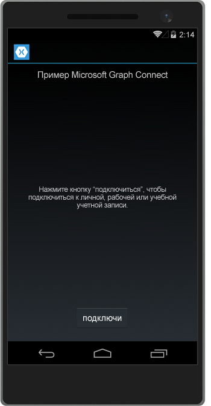
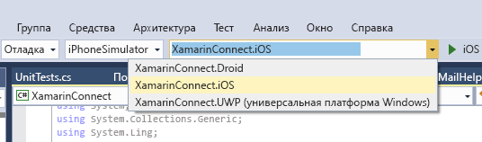

# <a name="get-started-with-microsoft-graph-in-a-xamarin-forms-app"></a>Начало работы с Microsoft Graph в приложении с Xamarin.Forms

В этой статье описываются задачи, которые необходимо выполнить, чтобы получить маркер доступа из [конечной точки Azure AD версии 2.0](https://developer.microsoft.com/en-us/graph/docs/authorization/converged_auth) и вызвать Microsoft Graph. В ней представлен разбор кода [приложения Microsoft Graph Connect для Xamarin.Forms](https://github.com/microsoftgraph/xamarin-csharp-connect-sample) и рассматриваются основные понятия, которые необходимо реализовать в приложении, использующем Microsoft Graph. В этой статье также описывается доступ к Microsoft Graph с помощью [клиентской библиотеки Microsoft Graph](http://www.nuget.org/packages/Microsoft.Graph/).

Вы создадите такое приложение.

| UWP | Android | iOS |
| --- | ------- | ----|
|  |  |  |

**Не хотите создавать приложение?** Вы можете быстро приступить к работе с помощью [краткого руководства по Microsoft Graph](https://graph.microsoft.io/en-us/getting-started) или скачать [приложение Microsoft Graph Connect для Xamarin.Forms](https://github.com/microsoftgraph/xamarin-csharp-connect-sample), которое рассматривается в этой статье.

## <a name="prerequisites"></a>Необходимые компоненты

Чтобы приступить к работе, вам понадобится следующее: 

- [Учетная запись Майкрософт](https://www.outlook.com/) либо [рабочая или учебная учетная запись](http://dev.office.com/devprogram).
- Visual Studio 2015. 
- [Xamarin для Visual Studio](https://www.xamarin.com/visual-studio).
- Windows 10 ([с включенным режимом разработки](https://msdn.microsoft.com/library/windows/apps/xaml/dn706236.aspx)).
- [Начальный проект Microsoft Graph Connect для Xamarin.Forms](https://github.com/microsoftgraph/xamarin-csharp-connect-sample/tree/master/starter). Этот шаблон содержит несколько классов, в которые вы можете добавлять код. В нем также есть полные представления и строки ресурсов. Чтобы получить этот проект, клонируйте или скачайте [приложение Microsoft Graph Connect для Xamarin.Forms](https://github.com/microsoftgraph/xamarin-csharp-connect-sample) и откройте решение **XamarinConnect** в папке **starter**. 

Чтобы выполнить проект iOS в этом примере, вам потребуются следующие компоненты:

- Последний пакет SDK для iOS
- Последняя версия Xcode
- Mac OS X Yosemite (10.10) или более поздней версии 
- [Xamarin.iOS](https://developer.xamarin.com/guides/ios/getting_started/installation/mac/)
- [Агент Xamarin Mac, подключенный к Visual Studio](https://developer.xamarin.com/guides/ios/getting_started/installation/windows/connecting-to-mac/)


## <a name="register-the-app"></a>Регистрация приложения
 
1. Войдите на [портал регистрации приложений](https://apps.dev.microsoft.com/) с помощью личной, рабочей или учебной учетной записи.
2. Выберите пункт **Добавить приложение**.
3. Введите имя приложения и выберите пункт **Создать приложение**.
    
    Откроется страница регистрации со свойствами приложения.
 
4. В разделе **Платформы** нажмите **Добавление платформы**.
5. Выберите **мобильную платформу**.
6. Скопируйте идентификатор приложения. Эти значения потребуется ввести в примере приложения.

    Идентификатор приложения уникален. URI перенаправления — это уникальный универсальный код ресурса (URI), предоставляемый каждому приложению операционной системой Windows 10, чтобы гарантировать, что сообщения, отправленные на этот URI, отправляются только этому приложению. 

7. Нажмите кнопку **Сохранить**.

## <a name="configure-the-project"></a>Настройка проекта

1. Откройте файл решения для начального проекта в Visual Studio.
2. Откройте файл **App.cs** в проекте **XamarinConnect (Portable)** и найдите поле `ClientId`. Замените временное значение идентификатором зарегистрированного приложения.

```c#
public static string ClientID = "ENTER_YOUR_CLIENT_ID";
public static string[] Scopes = { "User.Read", "Mail.Send" };
```
В значении `Scopes` хранятся области разрешений Microsoft Graph, запрашиваемые приложением, когда пользователь проходит проверку подлинности. Обратите внимание, что конструктор класса `App` использует значение ClientID для создания экземпляра класса MSAL `PublicClientApplication`. Этот класс потребуется позже для проверки подлинности пользователя.

```c#
IdentityClientApp = new PublicClientApplication(ClientID);
```

## <a name="install-the-microsoft-authentication-library-msal"></a>Установка библиотеки проверки подлинности (Майкрософт) — MSAL

[Библиотека проверки подлинности (Майкрософт)](https://www.nuget.org/packages/Microsoft.Identity.Client) содержит классы и методы, которые упрощают проверку подлинности пользователей через конечную точку версии 2.0.

1. В обозревателе решений щелкните правой кнопкой мыши проект **XamarinConnect (Portable)** и выберите пункт **Управление пакетами NuGet...**
2. Нажмите кнопку "Обзор" и найдите файл Microsoft.Identity.Client.
3. Выберите последнюю версию библиотеки проверки подлинности (Майкрософт) и нажмите кнопку **Установить**.

Повторите эти действия для проектов **XamarinConnect.Droid**, **XamarinConnect.iOS** и **XamarinConnect.UWP**. Сборка приложения не удастся, если MSAL не установлена во всех четырех проектах.

## <a name="install-the-microsoft-graph-client-library"></a>Установка клиентской библиотеки Microsoft Graph

1. В обозревателе решений щелкните правой кнопкой мыши проект **XamarinConnect (Portable)** и выберите пункт **Управление пакетами NuGet...**
2. Нажмите кнопку "Обзор" и найдите файл Microsoft.Graph.
3. Выберите последнюю версию клиентской библиотеки Microsoft Graph и нажмите кнопку **Установить**.

## <a name="create-the-authenticationhelpercs-class"></a>Создание класса AuthenticationHelper.cs

Откройте файл AuthenticationHelper.cs в проекте **XamarinConnect (Portable)**. Этот файл содержит весь код проверки подлинности, а также дополнительную логику, которая сохраняет сведения о пользователях и выполняет принудительную проверку подлинности только при выходе пользователя из приложения. Этот класс содержит как минимум три метода: `GetTokenForUserAsync`, `Signout` и `GetAuthenticatedClient`.

Метод `GetTokenHelperAsync` выполняется только во время проверки подлинности пользователя и каждый раз, когда приложение вызывает Microsoft Graph.

**Использование объявлений**

Убедитесь, что в начале файла есть следующие объявления:

```c#
using Microsoft.Graph;
using System;
using System.Diagnostics;
using System.Net.Http.Headers;
using System.Threading.Tasks;
using Microsoft.Identity.Client;
```

**Поля класса**

Убедитесь, что класс AuthenticationHelper содержит следующие поля:

```c#
public static string TokenForUser = null;
public static DateTimeOffset expiration;
private static GraphServiceClient graphClient = null;
```

Пример сохраняет в поле объект `GraphServicesClient`, чтобы его не пришлось создавать несколько раз. Он сохраняет `DateTimeOffset` для срока действия маркера доступа, чтобы не получать новый маркер, пока срок действия текущего не будет близок к завершению.

**GetTokenForUserAsync**

Метод `GetTokenForUserAsync` использует класс `PublicClientApplicationClass`, экземпляр которого создан в файле **App.cs**, чтобы получить маркер доступа для пользователя. Если пользователь еще не прошел проверку подлинности, открывается пользовательский интерфейс проверки подлинности.

```c#
        public static async Task<string> GetTokenForUserAsync()
        {
            if (TokenForUser == null || expiration <= DateTimeOffset.UtcNow.AddMinutes(5))
            {
                AuthenticationResult authResult = await App.IdentityClientApp.AcquireTokenAsync(App.Scopes);

                TokenForUser = authResult.Token;
                expiration = authResult.ExpiresOn;
            }

            return TokenForUser;
        }
```

**Выход**

Метод `Signout` выполняет выход из системы для всех пользователей, вошедших с помощью `PublicClientApplication` (в данном случае — только для одного пользователя), и обнуляет значение `TokenForUser`. Кроме того, он обнуляет значение `GraphServicesClient`.

```c#
        public static void SignOut()
        {
            foreach (var user in App.IdentityClientApp.Users)
            {
                user.SignOut();
            }
            graphClient = null;
            TokenForUser = null;

        }
``` 

**GetAuthenticatedClient**

Наконец, вам потребуется метод, создающий `GraphServicesClient`. Этот метод создает клиент, использующий метод `GetTokenForUserAsync` для каждого вызова Microsoft Graph через клиент.

```c#
        public static GraphServiceClient GetAuthenticatedClient()
        {
            if (graphClient == null)
            {
                // Create Microsoft Graph client.
                try
                {
                    graphClient = new GraphServiceClient(
                        "https://graph.microsoft.com/v1.0",
                        new DelegateAuthenticationProvider(
                            async (requestMessage) =>
                            {
                                var token = await GetTokenForUserAsync();
                                requestMessage.Headers.Authorization = new AuthenticationHeaderValue("bearer", token);
                            }));
                    return graphClient;
                }

                catch (Exception ex)
                {
                    Debug.WriteLine("Could not create a graph client: " + ex.Message);
                }
            }

            return graphClient;
        }
```

## <a name="send-an-email-with-microsoft-graph"></a>Отправка электронного сообщения с помощью Microsoft Graph

Откройте файл MailHelper.cs начального проекта. Этот файл содержит код для создания и отправки электронного сообщения. Он состоит из одного метода (``ComposeAndSendMailAsync``), который создает и отправляет запрос POST конечной точке **https://graph.microsoft.com/v1.0/me/microsoft.graph.SendMail**. 

Метод ``ComposeAndSendMailAsync`` принимает три строковых значения — ``subject``, ``bodyContent`` и ``recipients``, которые передаются ему посредством файла MainPage.xaml.cs. Строки ``subject`` и ``bodyContent`` хранятся в файле AppResources.resx вместе со всеми остальными строками пользовательского интерфейса. Строка ``recipients`` принимает значения из поля адреса в интерфейсе приложения. 

**Использование объявлений**

Добавьте в начало файла следующие объявления:

```c#
using System;
using System.Collections.Generic;
using System.Threading.Tasks;
using Microsoft.Graph;
```

Так как пользователь может указать несколько адресов, строку ``recipients`` необходимо разбить на несколько объектов `EmailAddress`, используемых для создания списка объектов `Recipients`, которые затем можно передать в POST-тексте запроса:

```c#
            // Prepare the recipient list
            string[] splitter = { ";" };
            var splitRecipientsString = recipients.Split(splitter, StringSplitOptions.RemoveEmptyEntries);
            List<Recipient> recipientList = new List<Recipient>();

            foreach (string recipient in splitRecipientsString)
            {
                recipientList.Add(new Recipient { EmailAddress = new EmailAddress { Address = recipient.Trim() } });
            }
```

Затем необходимо создать объект `Message` и отправить его конечной точке **me/microsoft.graph.SendMail** с помощью `GraphServiceClient`. Так как строка ``bodyContent`` — это документ HTML, запрос задает для параметра **ContentType** значение HTML.

```c#
            try
            {
                var graphClient = AuthenticationHelper.GetAuthenticatedClient();

                var email = new Message
                {
                    Body = new ItemBody
                    {
                        Content = bodyContent,
                        ContentType = BodyType.Html,
                    },
                    Subject = subject,
                    ToRecipients = recipientList,
                };

                try
                {
                    await graphClient.Me.SendMail(email, true).Request().PostAsync();
                }
                catch (ServiceException exception)
                {
                    throw new Exception("We could not send the message: " + exception.Error == null ? "No error message returned." : exception.Error.Message);
                }


            }

            catch (Exception e)
            {
                throw new Exception("We could not send the message: " + e.Message);
            }
```

Готовый класс должен выглядеть следующим образом:

```c#
    public class MailHelper
    {
        /// <summary>
        /// Compose and send a new email.
        /// </summary>
        /// <param name="subject">The subject line of the email.</param>
        /// <param name="bodyContent">The body of the email.</param>
        /// <param name="recipients">A semicolon-separated list of email addresses.</param>
        /// <returns></returns>
        public async Task ComposeAndSendMailAsync(string subject,
                                                            string bodyContent,
                                                            string recipients)
        {

            // Prepare the recipient list
            string[] splitter = { ";" };
            var splitRecipientsString = recipients.Split(splitter, StringSplitOptions.RemoveEmptyEntries);
            List<Recipient> recipientList = new List<Recipient>();

            foreach (string recipient in splitRecipientsString)
            {
                recipientList.Add(new Recipient { EmailAddress = new EmailAddress { Address = recipient.Trim() } });
            }

            try
            {
                var graphClient = AuthenticationHelper.GetAuthenticatedClient();

                var email = new Message
                {
                    Body = new ItemBody
                    {
                        Content = bodyContent,
                        ContentType = BodyType.Html,
                    },
                    Subject = subject,
                    ToRecipients = recipientList,
                };

                try
                {
                    await graphClient.Me.SendMail(email, true).Request().PostAsync();
                }
                catch (ServiceException exception)
                {
                    throw new Exception("We could not send the message: " + exception.Error == null ? "No error message returned." : exception.Error.Message);
                }


            }

            catch (Exception e)
            {
                throw new Exception("We could not send the message: " + e.Message);
            }
        }
    }
``` 

Вы выполнили три действия, необходимых для взаимодействия с Microsoft Graph: регистрацию приложения, проверку подлинности пользователя и создание запроса. 

## <a name="run-the-app"></a>Запуск приложения
1. Выберите проект, который нужно запустить. Если выбрать универсальную платформу Windows, пример можно запустить на локальном компьютере. Чтобы запустить проект iOS, вам потребуется подключиться к [компьютеру Mac, на котором установлены средства Xamarin](https://developer.xamarin.com/guides/ios/getting_started/installation/windows/connecting-to-mac/). (Вы также можете открыть это решение в Xamarin Studio на компьютере Mac и запустить пример прямо оттуда.) Чтобы запустить проект для Android, вы можете использовать [эмулятор Visual Studio для Android](https://www.visualstudio.com/features/msft-android-emulator-vs.aspx). 

    

2. Нажмите клавишу F5 для сборки и отладки. Запустите решение и войдите в систему с помощью личной, рабочей или учебной учетной записи.
    > **Примечание.** Возможно, потребуется открыть диспетчер конфигурации сборки и убедиться, что для проекта UWP выбраны этапы сборки и развертывания. 

3. Войдите с помощью личной, рабочей или учебной учетной записи и предоставьте необходимые разрешения.

4. Нажмите кнопку **Отправить сообщение**. Появится сообщение об успешной отправке сообщения.

## <a name="next-steps"></a>Дальнейшие действия
- Попробуйте REST API, используя [песочницу Graph](https://graph.microsoft.io/graph-explorer).
- Вы можете найти примеры распространенных операций в [библиотеке фрагментов кода с использованием пакеты SDK Microsoft Graph для Xamarin.Forms](https://github.com/microsoftgraph/xamarin-csharp-snippets-sample) или изучить другие [примеры для Xamarin](https://github.com/microsoftgraph?utf8=%E2%9C%93&query=xamarin) на сайте GitHub.

## <a name="see-also"></a>См. также
- [Клиентская библиотека .NET Microsoft Graph](https://github.com/microsoftgraph/msgraph-sdk-dotnet)
- [Протоколы Azure AD версии 2.0](https://azure.microsoft.com/en-us/documentation/articles/active-directory-v2-protocols/)
- [Маркеры Azure AD версии 2.0](https://azure.microsoft.com/en-us/documentation/articles/active-directory-v2-tokens/)
