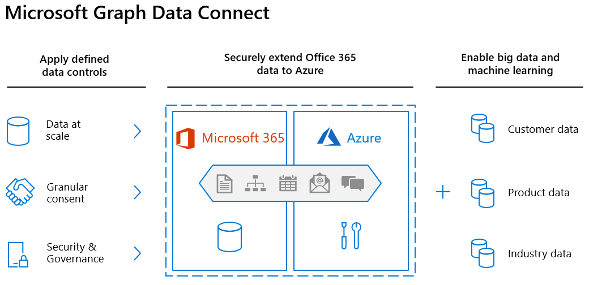

<!-- markdownlint-disable MD002 MD041 -->

Подключение к данным Microsoft Graph дополняет транзакционную модель Microsoft Graph интеллектуальным способом получения масштабируемого доступа к сложным данным. Эти данные показывают, как сотрудники общаются, совместно работают и управляют своим временем во всех приложениях и службах Microsoft 365. Функция подключения к данным идеально подходит для больших данных и машинного обучения. Она позволяет разрабатывать приложения для аналитики, средств искусственного интеллекта и оптимизации бизнес-процессов путем расширения данных Microsoft 365 в Azure. Благодаря интеграции таким образом вы сможете воспользоваться преимуществами огромного набора вычислительных ресурсов, хранилища в Azure, при этом соблюдая отраслевые стандарты и обеспечивая безопасность своих данных.

Подключение к данным Microsoft Graph использует фабрику данных Azure для копирования данных Microsoft 365 в хранилище приложения через настраиваемые интервалы. Она также предоставляет набор средств для упрощения доставки этих данных в Microsoft Azure, позволяя получить доступ к наиболее применимым средствам разработки и размещения. Подключение к данным также предоставляет более детальную модель управления и согласия: вы можете управлять данными, видеть, кто к ним обращается, и запрашивать определенные свойства объекта. Это улучшает модель Microsoft Graph, которая предоставляет или запрещает приложениям доступ ко всем объектам.

Подключение к данным можно использовать для включения сценариев машинного обучения для вашей организации. В этих сценариях можно создавать приложения, которые предоставляют ценные сведения заинтересованным лицам, обучают модели машинного обучения и даже выполняют прогнозирование на основе больших объемов полученных данных.

## Начало работы

В этом руководстве вы создайте свое первое приложение Microsoft Graph Data Connect. Интересно, верно? Мы тоже так считаем! Чтобы приступить к работе, сначала необходимо настроить несколько вещей.

### Предварительные требования

Для выполнения этой лабораторной работы вам потребуются следующие подписки или лицензии.

1. **Аренда Microsoft 365**

   - Если у вас ее нет, вы получите ее (бесплатно), зарегистрируйтесь в [программе для разработчиков Microsoft 365](https://developer.microsoft.com/microsoft-365/dev-program).
   - Несколько пользователей Microsoft 365 с отправленными и полученными электронными письмами.
   - Доступ по крайней мере к двум учетным записям, которые соответствуют следующим требованиям:
      - Должна быть **назначена глобальный администратор** роли.
      - Должен иметь доступ к Microsoft 365 Admin Center.

1. **Подписка на Microsoft Azure**.

   - Если у вас ее нет, вы можете получить ее (бесплатно) на нашем [веб-сайте Azure](https://azure.microsoft.com/free/).
   - Учетной записи, используемой для входа, должна быть предоставлена **глобальный администратор** роли.
   - Подписка Azure должна находиться в том же клиенте, что и клиент Microsoft 365, так как Graph Data Connect будет экспортировать данные только в подписку Azure в том же клиенте, а не между клиентами.
   - Клиенты Microsoft 365 и Azure должны находиться в одной Microsoft Azure Active Directory клиенте.

1. Убедитесь, что на компьютере [разработки установлена среда Visual](https://visualstudio.microsoft.com/vs/) Studio.

> [!NOTE]
> Снимки экрана и примеры, используемые в этой лаборатории, из тестового клиента Microsoft 365 с примером электронной почты тестовых пользователей. Для выполнения тех же действий можно использовать собственный клиент Microsoft 365. Данные в Microsoft 365 не записываются. Копия данных электронной почты извлекается из всех пользователей в клиенте Microsoft 365 и копируется в учетную запись Хранилище BLOB-объектов Azure, которая обеспечивает контроль над доступом к данным в Хранилище BLOB-объектов Azure.
