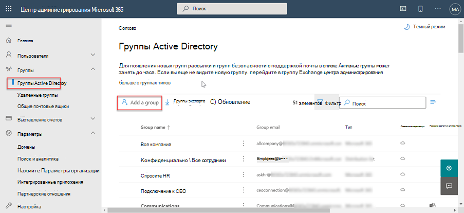
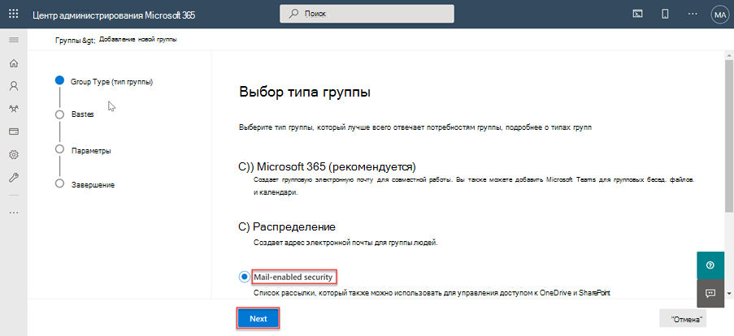
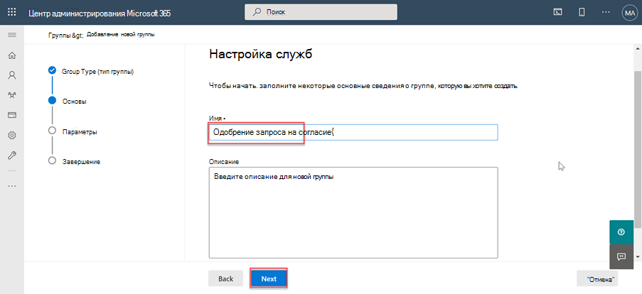
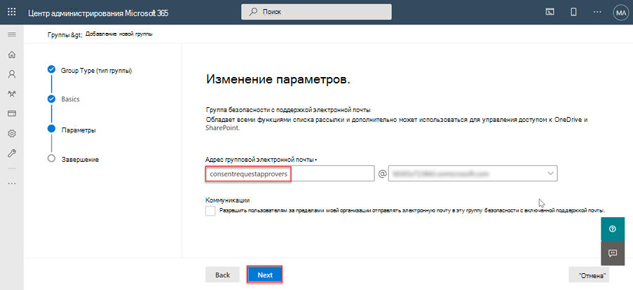
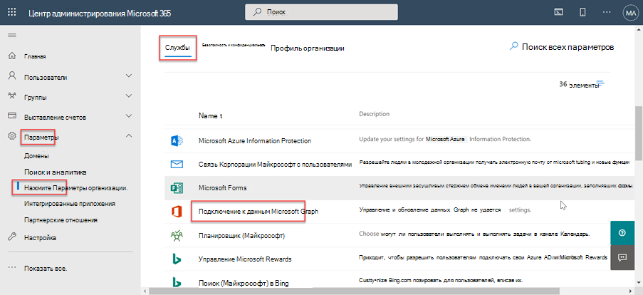
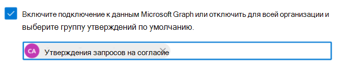

<!-- markdownlint-disable MD002 MD041 -->

Прежде чем использовать Microsoft Graph Data Connect в первый раз, необходимо настроить клиент Microsoft 365. Это включает включение службы и настройку группы безопасности с разрешениями на утверждение запросов на извлечение данных.

## Предоставьте Azure AD пользователям роль глобальный администратор.

На этом шаге вы убедитесь, что у двух пользователей в клиенте Microsoft 365 **включена глобальный администратор** роли.

- [Встроенная роль глобального администратора](/azure/active-directory/roles/permissions-reference#global-administrator).
- [Повышение прав доступа для получения роли глобального администратора](/azure/role-based-access-control/elevate-access-global-admin).

## Настройка группы утверждающего запроса на согласие в Microsoft Graph Data Connect

На этом шаге вы настроите клиент Microsoft 365, чтобы включить использование Microsoft Graph Data Connect.

1. Откройте браузер и перейдите на портал [Microsoft 365 Admin.](https://admin.microsoft.com/)

1. На боковой панели навигации выберите " **Активные группы"**.

    

1. Нажмите **кнопку "Добавить группу** ".

1. Используйте следующую команду, чтобы **создать группу** безопасности с поддержкой почты и нажатие кнопки **"Добавить** ".
   - **Тип**: безопасность с поддержкой почты

    

   - **Имя**: утверждающие запрос согласия

    

   - **Префикс электронной почты**: consentrequestapprovers

    

1. **Отображение созданной** группы в списке может занять до часа. После создания группы выберите ее.

1. Снова перейдите **к параметру "** Активные группы" и найдите только что созданную группу.

1. Выберите группу и на **вкладке "Участники** " выберите " **Просмотреть всех участников" и "Управление ими"**.

1. Добавьте двух пользователей, для **которых вы** включили глобальный администратор роли, в эту новую группу.

## Включение Подключения к данным Microsoft Graph в клиенте Microsoft 365

На этом шаге вы включите службу Microsoft Graph Data Connect в клиенте Microsoft 365.

1. Пока вы все еще вошли на портал Microsoft 365 Admin, выберите пункт меню > **параметров** организации.

1. Выберите **службу Microsoft Graph Data Connect** .

    

1. Установите флажок с сообщением о включении или отключении Подключения к данным **Microsoft Graph** для всей организации, чтобы включить подключение к данным.

    

1. **Введите утверждающих** запрос согласия (или имя созданной ранее группы) в группе пользователей, чтобы принять решения об утверждении **, и** нажмите кнопку **"Сохранить"**.
