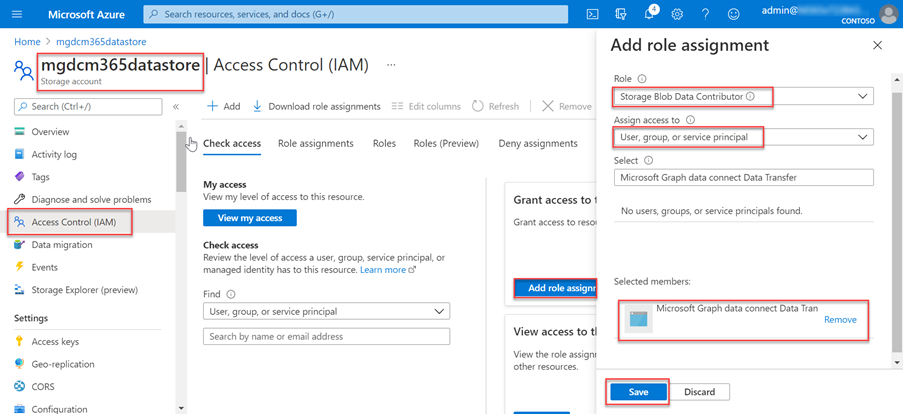

<!-- markdownlint-disable MD002 MD041 -->

На этом шаге вы создадим учетную запись хранения Azure, в которой подключение к данным Microsoft Graph будет хранить данные, извлеченные из Microsoft 365, для дальнейшей обработки.

1. Откройте браузер и перейдите на портал [Azure](https://portal.azure.com/).

1. Войдите с помощью учетной **записи с глобальный администратор** правами на доступ к клиентам Azure и Microsoft 365.

1. На боковой панели навигации выберите **"Создать ресурс"**.

1. Найдите **тип ресурса учетной** записи хранения и используйте следующие значения, чтобы создать его, а затем выберите " **Просмотр и создание"**.

    - **Подписка**: выберите подписку Azure.
    - **Группа ресурсов**: GraphDataConnect (или выберите существующую группу ресурсов)
    - **Имя учетной записи** хранения: mgdcm365datastore
    - **Регион**: выберите регион Azure в том же регионе, что и ваш регион Microsoft 365
    - **Производительность**: стандартный
    - **Избыточность**: геоизбыточное хранилище (GRS)
    - **Вкладка "Дополнительно"**:
      - **Уровень доступа**: горячий

1. Проверьте, соответствуют ли параметры параметрам, показанным на предыдущем шаге, и нажмите кнопку **"Создать"**.

1. После создания учетной записи хранения Azure предоставьте приложению Azure AD ранее созданный соответствующий доступ к ней.

    1. Выберите **учетную запись хранения Azure**.
    2. В меню боковой панели выберите **элемент "Управление доступом (IAM)"**.
    3. Нажмите **кнопку "** Добавить" в **блоке "Добавить назначение ролей** ".
    4. Используйте следующие значения, чтобы найти приложение, выбранное ранее, чтобы предоставить ему роль участника  данных BLOB-объектов хранилища, а затем нажмите **кнопку "Сохранить"**.

        - **Роль**: участник данных BLOB-объектов хранилища
        - **Назначение доступа: пользователю**, группе или субъекту-службе
        - **Выберите**: Microsoft Graph data connect Data Transfer (имя созданного ранее Azure AD)

        

1. Создайте контейнер в учетной записи **хранения Azure mgdcm365datastore** .

    1. Выберите **учетную запись хранения Azure mgdcm365datastore** .
    2. В меню боковой панели выберите **"Контейнеры** " в разделе **службы BLOB-объектов** .
    3. Нажмите **кнопку +Контейнер** в верхней части страницы и используйте следующие значения, а затем нажмите кнопку **"Создать"**.

        - **Имя**: m365mails
        - **Уровень общего доступа**: частный (без анонимного доступа)

        
