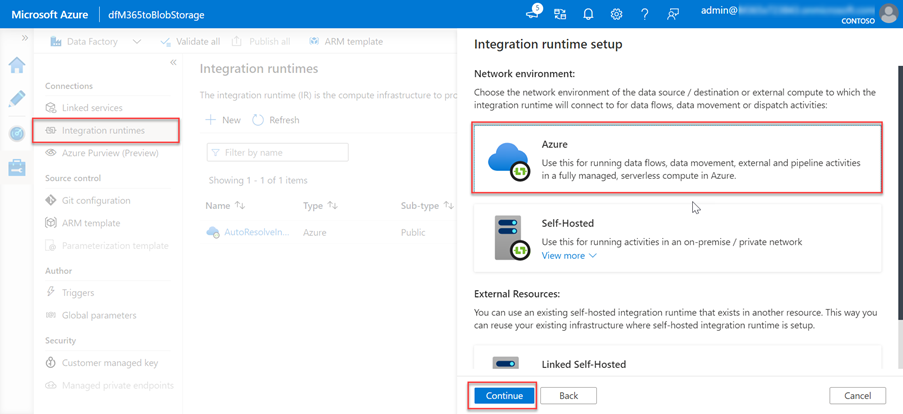
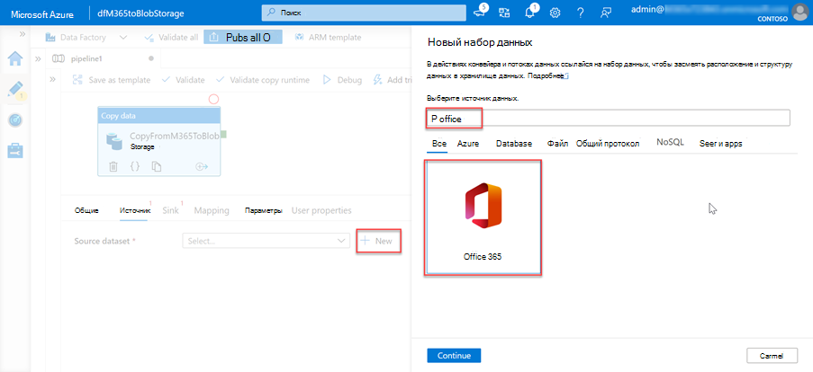

<!-- markdownlint-disable MD002 MD041 -->

Следующим шагом является использование Фабрика данных Azure для создания конвейера для извлечения данных из Microsoft 365 в учетную запись хранения Azure с помощью подключения к данным Microsoft Graph.

## Создание конвейера Фабрика данных Azure конвейера

1. Откройте браузер и перейдите на портал [Azure](https://portal.azure.com/).

1. Войдите с помощью учетной **записи с глобальный администратор** правами на доступ к клиентам Azure и Microsoft 365.

1. На боковой панели навигации выберите **"Создать ресурс"**.

1. Найдите **тип ресурса фабрики** данных и используйте следующие значения, чтобы создать его, а затем нажмите кнопку **"Создать"**.

    1. **Подписка**: выберите подписку Azure.
    2. **Группа ресурсов**: GraphDataConnect
    3. **Регион**: выберите регион Azure в том же регионе, что и ваш регион Microsoft 365
    4. **Имя**: dfM365toBlobStorage
    5. **Версия**: V2

        

    6. На **вкладке "Конфигурация Git** " убедитесь, что вы настроите Git или выберите параметр _"Настроить Git" позже_.

1. После создания Фабрика данных Azure выберите плитку **"** Автор" и "Монитор", чтобы запустить Фабрика данных Azure полноэкранный редактор.

    

1. Переключитесь с **обзора** на интерфейс **управления** , выбрав его в области навигации слева.

1. По умолчанию Фабрика данных Azure будет использовать среду выполнения интеграции, которая автоматически разрешает регион. Так как Data Connect требует, чтобы источник и назначение, а также среда выполнения интеграции существовали в одном регионе Microsoft 365, рекомендуется создать новую среду выполнения интеграции с фиксированным регионом.

    1. Выберите **"Новые среды выполнения интеграции** > **"**.
    2. Выберите **"Azure", "Self-Hosted" (** Локальная среда) и " **Continue" (Продолжить**).
    3. Выберите **Azure** для сетевой среды и нажмите кнопку **"Продолжить"**.

        

    4. Используйте следующие сведения, чтобы завершить форму на последнем экране, а затем нажмите кнопку **"Создать"**.

        - **Имя**: имя среды выполнения интеграции
        - **Описание**: введите описание
        - **Регион**: выберите регион, соответствующий вашему региону Microsoft 365
        - **Конфигурация виртуальной сети (предварительная версия)**: отключено

1. Переключитесь с **интерфейса "** Управление" на **"Автор** ", выбрав его в области навигации слева.
1. Создайте конвейер, щелкни значок **"плюс** ", а затем **конвейер**.

    

    - **Перетащите действие копирования** данных из раздела **"Перемещение и** преобразование" в область конструктора.

        

    - Выберите действие в конструкторе.
    - Выберите **вкладку "** Общие" и присвойте ему имя и описание.

      - **Имя**: CopyFromM365toBlobStorage
      - **Описание**: необходимое описание.

    - В области редактора действий под конструктором выберите вкладку **"** Источник" и нажмите кнопку **"Создать"**.
    - Найдите набор данных **Office 365**, выберите его и нажмите кнопку "**Продолжить**".

        

    - Конструктор обно сведения обновит вкладку **"** Источник" с помощью параметров соединителя Microsoft 365.
    - Выберите параметр **"Открыть** " рядом с полем **"Исходный набор данных** ".
    - В параметрах таблицы выберите вкладку **"Подключение** " и нажмите **кнопку "Создать** ".
    - В отобразившемся диалоговом окне введите ранее созданные Azure AD  и секретный идентификатор  приложения в полях идентификатора субъекта-службы и ключа субъекта-службы соответственно, а затем нажмите кнопку **"Создать"**. 
    - Выберите среду выполнения интеграции, созданную ранее в раскрывающемся списке **"Подключение через среду выполнения интеграции** ".

        

    - После создания подключения Microsoft 365 в поле "Таблица  **" выберите BasicDataSet_v0. Message_v0**.
    - Переключитесь с **Office365Table** на **pipeline > источника**. Используйте следующие значения для фильтра **даты**.

      - **Имя столбца**: CreatedDateTime
      - **Время начала (UTC)**: выберите дату, которая предвеает текущую дату.
      - **Время окончания (UTC)**: выберите текущую дату
      - Выберите **"Импорт схемы** " в разделе _"Выходные столбцы_ ".

    - Выберите действие **копирования данных** на вкладке конвейера, а затем — вкладку **"Приемник** ".

      - Нажмите **кнопку "** Создать"**, Хранилище BLOB-объектов Azure и** нажмите кнопку "**Продолжить**".
      - Выберите **двоичный** файл в качестве формата данных, а затем нажмите кнопку **"Продолжить** ".
      - Присвойте набору данных имя **M365JsonFile** и создайте связанную службу, если она еще не существует.

    - В таблице выберите вкладку **"Подключение** ", а затем нажмите кнопку **"Создать"**.
    - Задайте следующие значения в диалоговом окне, а затем нажмите кнопку **"Готово"**.

        - **Метод проверки подлинности**: субъект-служба
        - **Подписка Azure**: выберите все
        - **Имя учетной записи** хранения: mgdcm365datastore
          - Это учетная запись хранения, созданная ранее в этом упражнении.
        - **Клиент**: введите идентификатор клиента Azure.
        - **Идентификатор субъекта-службы**: введите идентификатор созданного Azure AD приложения.
        - **Ключ субъекта-службы**: введите хэш-ключ созданного ранее Azure AD приложения.

    - Рядом с полем **"Путь к файлу** " нажмите кнопку " **Обзор"**.
    - Выберите имя контейнера хранилища, созданного ранее.

      

1. После создания конвейера нажмите кнопку **"Проверить все** " в верхней части конструктора.

1. После проверки (и устранения всех найденных проблем) нажмите кнопку **"Опубликовать** все" в верхней части конструктора.

## Запуск конвейера Фабрика данных Azure конвейера

Теперь, когда конвейер создан, его можно запустить.

> [!NOTE]
> Отображение запроса на согласие может занять несколько минут, и в этом случае для всего процесса (запуск, запрос согласия и после утверждения согласия после завершения выполнения конвейера) может потребоваться более 40 минут.

1. В конструкторе Фабрика данных Azure, где открыт конвейер, выберите "Добавить триггер **> trigger now"**.

    

1. После запуска задания в меню боковой панели **выберите "Монитор** ", чтобы просмотреть текущие выполняемые задания.

1. На панели навигации слева найдите вкладку **"Запуски** конвейера" и выберите ее. Выберите конвейер в столбце **имени конвейера** , чтобы просмотреть **запуски действий**. Этот конвейер будет отображаться как _выполняется_.

    

1. В представлении выполнения действий перейдите к разделу _"_ Запуски действий", который находится в нижней части страницы.

1. Наведите **указатель мыши на имя действия** и выберите переключатель. Откроется вкладка **"Сведения** ".

    

1. На экране **сведений** найдите состояние действия конвейера, как показано на следующем рисунке. В этом случае вы увидите, что он находится в состоянии **RequestingConsent**.

    

1. На этом этапе выполнение действия внутренне приостановлено до тех пор, пока кто-то вручную не утвердит запрос на согласие через Центр администрирования Microsoft 365 или с помощью PowerShell.
