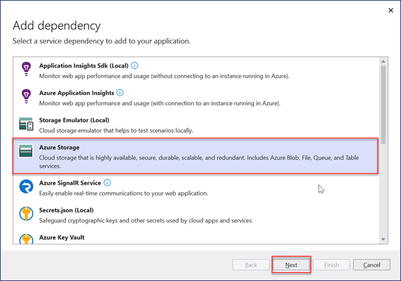
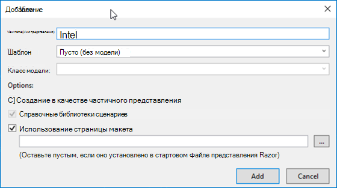
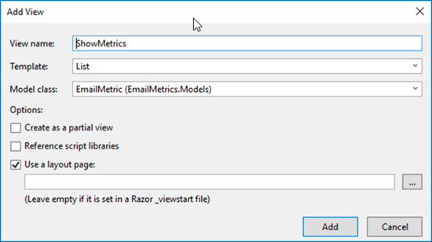

<!-- markdownlint-disable MD002 MD041 -->

В этом разделе мы создадим первое приложение ASP.NET проекта для обработки экспортированных данных Microsoft Graph Data Connect.

## <a name="create-a-new-aspnet-project"></a>Создание нового ASP.NET проекта

1. Откройте Visual Studio и выберите **файл > "> Project"**.

1. В **диалоговом** окне "Новый проект" выполните следующие действия.

    1. **Выполните ASP.NET веб-приложение** в поле поиска и выберите ASP.NET **веб-приложения (платформа .NET Framework).**
    1. Нажмите кнопку **"Далее"**.

        

    1. **Введите EmailMetrics** в имя проекта.
    1. Выберите **платформа .NET Framework 4.7.2** для параметра платформы.
    1. Нажмите **Создать**.

    > [!IMPORTANT]
    > Убедитесь, что введите точно такое же имя проекта Visual Studio, как указано в инструкциях по началу работы. Имя проекта Visual Studio становится частью пространства имен в коде. Для кода в этих инструкциях важно, чтобы пространство имен совпадало с именем проекта Visual Studio, указанным в этих инструкциях. Если ввести другое имя проекта, код не будет компилироваться, пока вы не настроите все пространства имен в соответствии с именем, которое вы указали для проекта Visual Studio при его создании.

    1. В **диалоговом окне ASP.NET** веб-приложения выберите MVC.
    1. Нажмите **Создать**.

    

## <a name="add-and-configure-your-azure-storage-as-a-connected-service"></a>Добавление и настройка службы хранилища Azure в качестве подключенной службы

1. В **окне Обозреватель решений** инструментов щелкните правой кнопкой мыши узел **"** Подключенные службы" и выберите "**Добавить подключенную службу"**.

    

1. В **диалоговом окне** "Подключенные службы" выберите зеленый знак, **+** расположенный в правом верхнем углу диалогового окна.

1. В **диалоговом окне "Добавление зависимостей** " выберите **службу хранилища Azure** и нажмите кнопку **"Далее"**.

    

1. В **диалоговом** окне службы хранилища Azure выберите подписку и учетную запись хранения, в которую экспортированы данные в предыдущем упражнении, и нажмите **кнопку "Далее"**.

    

1. Укажите **для подключения к службе** хранилища **Azure имя AzureStorageConnectionString** и нажмите кнопку **"Далее"**.
1. Нажмите **Готово**.

    

## <a name="create-a-new-model-class-that-will-be-used-to-store-the-email-metrics"></a>Создание класса модели, который будет использоваться для хранения метрик электронной почты

1. В **окне Обозреватель решений** инструментов щелкните правой кнопкой мыши папку **Models** и **выберите команду "Добавить > Класс"**.

    

1. В **диалоговом** окне "Добавление нового элемента" выберите **"** Класс", задайте для файла имя _EmailMetric.cs_ и нажмите **кнопку "Добавить"**.

1. Добавьте следующий код в только что созданный класс EmailMetric.

    ```csharp
    public string Email;
    public double RecipientsToEmail;
    ```

## <a name="create-a-new-controller-that-will-calculate-and-display-the-results"></a>Создание нового контроллера, который будет вычислять и отображать результаты

1. Щелкните правой кнопкой мыши **папку** "Контроллеры" **и выберите "> Контроллер"**.

1. В **диалоговом окне** "Добавление шаблона" выберите "Контроллер **MVC 5 — пустой** " и нажмите кнопку **"Добавить"**.

1. При появлении запроса приведите имя **контроллера EmailMetricsController** и нажмите кнопку **"ОК"**.

1. Добавьте следующие операторы using после существующих операторов using в верхней части файла, содержащего класс **EmailMetricsController** .

    ```csharp
    using System.Collections.Generic;
    using System.Configuration;
    using System.IO;
    using System.Linq;
    using System.Threading.Tasks;
    using System.Web.Mvc;
    using Azure.Storage.Blobs;
    using Azure.Storage.Blobs.Models;
    using Newtonsoft.Json.Linq;
    ```

1. Добавьте следующий код в класс **EmailMetricsController** . Они будут использоваться для подключения к учетной записи хранения **Azure** , которая содержит экспортированные данные.

    ```csharp
    private const string connectionStringName = "AzureStorageConnectionString";
    private const string emailBlobName = "m365mails";

    ```

1. Добавьте следующий метод в класс **EmailMetricsController** . Это позволит обработать **большой** двоичный объект Azure и обновить коллекцию, представляющую учетные записи электронной почты и количество получателей, которые были объединены во всех сообщениях электронной почты, найденных для извлеченных учетных записей.

    ```csharp
    private async Task ProcessBlobEmails(List<Models.EmailMetric> emailMetrics, BlobClient emailBlob)
    {
        using (var stream = new MemoryStream())
        {
            var response = await emailBlob.DownloadToAsync(stream);
            var pos = stream.Seek(0, SeekOrigin.Begin);

            using (var reader = new StreamReader(stream))
            {

                string line;
                while ((line = reader.ReadLine()) != null)
                {
                    var jsonObj = JObject.Parse(line);

                    // extract sender
                    var sender = jsonObj.SelectToken("Sender.EmailAddress.Address")?.ToString();
                    // No sender - skip this one
                    if (string.IsNullOrEmpty(sender)) continue;

                    // extract and count up recipients
                    var totalRecipients = 0;
                    totalRecipients += jsonObj.SelectToken("ToRecipients")?.Children().Count() ?? 0;
                    totalRecipients += jsonObj.SelectToken("CcRecipients")?.Children().Count() ?? 0;
                    totalRecipients += jsonObj.SelectToken("BccRecipients")?.Children().Count() ?? 0;

                    var emailMetric = new Models.EmailMetric();
                    emailMetric.Email = sender;
                    emailMetric.RecipientsToEmail = totalRecipients;

                    // if already have this sender...
                    var existingMetric = emailMetrics.FirstOrDefault(metric => metric.Email == emailMetric.Email);
                    if (existingMetric != null)
                    {
                        existingMetric.RecipientsToEmail += emailMetric.RecipientsToEmail;
                    }
                    else
                    {
                        emailMetrics.Add(emailMetric);
                    }
                }
            }
        }
    }
    ```

1. Добавьте следующий метод в класс **EmailMetricsController** . При этом будут перечисляются все большие двоичные объекты в указанном контейнере указанной учетной записи хранения **Azure** и отправляется каждый из `ProcessBlobEmails()` них в метод, добавленный на последнем шаге.

    ```csharp
    private async Task<List<Models.EmailMetric>> ProcessBlobFiles()
    {
        var emailMetrics = new List<Models.EmailMetric>();
        var connectionString = ConfigurationManager.ConnectionStrings[connectionStringName];

        // Connect to the storage account
        var containerClient = new BlobContainerClient(connectionString.ConnectionString, emailBlobName);

        foreach (var blob in containerClient.GetBlobs())
        {
            if (blob.Properties.BlobType == BlobType.Block &&
                // Don't process blobs in the metadata folder
                !blob.Name.StartsWith("metadata/"))
            {
                var blobClient = containerClient.GetBlobClient(blob.Name);
                await ProcessBlobEmails(emailMetrics, blobClient);
            }
        }

        return emailMetrics;
    }
    ```

1. Добавьте следующее действие в **EmailMetricsController** , который будет использовать методы, добавленные этим классом, для обработки сообщений электронной почты и отправки результатов в представление.

    ```csharp
    [HttpPost, ActionName("ShowMetrics")]
    [ValidateAntiForgeryToken]
    public async Task<ActionResult> ShowMetrics()
    {
        var emailMetrics = await ProcessBlobFiles();

        return View(emailMetrics);
    }
    ```

## <a name="create-a-new-view-for-the-emailmetrics-index-action"></a>Создание представления для действия индекса EmailMetrics

1. В **окне Обозреватель решений** инструментов щелкните правой кнопкой мыши папку **Views > EmailMetrics** и выберите команду **"Добавить >"**.

1. В **диалоговом** окне "Добавление нового шаблонного элемента" выберите представление **MVC 5**, а затем нажмите кнопку **"Добавить"**.

1. В **диалоговом** окне "Добавление представления" задайте для имени представления значение **Index**, оставьте значения по умолчанию для остальных элементов управления входными данными и нажмите **кнопку "Добавить"**.

    

1. Обновите разметку в новых представлениях > **EmailMetrics > _Index.cshtml_** следующим образом. В результате будет добавлена форма с одной кнопкой, которая отправит HTTP POST в действие пользовательского контроллера, добавленное на последнем шаге.

    ```html
    @{
    ViewBag.Title = "Index";
    }

    <h2>Email Metrics</h2>
    ```

1. Это приложение будет просмотреть данные электронной почты для сообщений электронной  почты, извлеченных в учетную запись Хранилище BLOB-объектов Azure, и отобразит общее количество получателей от каждого отправителя.

    ```html
    @using (Html.BeginForm("ShowMetrics", "EmailMetrics", FormMethod.Post))
    {
    @Html.AntiForgeryToken()
    <div>
        <button type="submit">View email metrics</button>
    </div>

    <div>
        <em>Please be patient as this can take a few moments to calculate depending on the size of the exported data...</em>
    </div>
    }
    ```

## <a name="create-a-new-view-for-the-emailmetrics-showmetrics-action"></a>Создание представления для действия EmailMetrics ShowMetrics

1. В **окне Обозреватель решений** инструментов щелкните правой кнопкой мыши папку **Views > EmailMetrics** и выберите команду **"Добавить >"**.

1. В **диалоговом** окне "Добавление представления" задайте следующие значения и оставьте для остальных элементов управления вводом значения по умолчанию и нажмите **кнопку "Добавить"**.

    - **Имя представления**: ShowMetrics
    - **Шаблон**: список
    - **Класс модели**: EmailMetric (EmailMetric.Models)

        

    >[!TIP]
    > Если модель **EmailMetric** не отображается в раскрывающемся списке, создайте решение.

1. Обновите разметку в новых представлениях > **EmailMetrics > _ShowMetrics.cshtml_** следующим образом. Отобразится результат вычислений.

    ```html
    @model IEnumerable<EmailMetrics.Models.EmailMetric>

    @{
    ViewBag.Title = "ShowMetrics";
    }

    <h2>Email Metrics</h2>

    <table class="table">
    <tr>
        <th>Sender</th>
        <th>Number of Recipients</th>
    </tr>

    @foreach (var item in Model)
    {
    <tr>
        <td>@Html.DisplayFor(modelItem => item.Email)</td>
        <td>@Html.DisplayFor(modelItem => item.RecipientsToEmail)</td>
    </tr>
    }

    </table>
    ```

## <a name="update-the-navigation-to-have-a-way-to-get-to-the-new-controller"></a>Обновите навигацию, чтобы получить доступ к новому контроллеру.

1. В **окне Обозреватель решений** найдите и откройте файл Views **> Shared > _Layout.cshtml_**.
1. Замените содержимое приведенным ниже кодом.

    ```html
    <!-- new code -->
    <li>@Html.ActionLink("Email Metrics", "Index", "EmailMetrics")</li>
    ```

## <a name="test-the-application"></a>Тестирование приложения

1. В Visual Studio выберите **"Отладка > начать отладку"**.

1. Когда приложение будет создано и загружено в новом окне браузера, выберите элемент  "Метрики электронной почты" на верхней панели навигации.

1. На странице **"Метрики электронной почты** " нажмите кнопку **"Просмотреть метрики электронной почты** ".

    

1. При загрузке страницы вы увидите список адресов электронной почты, найденных среди всех сообщений электронной почты с суммой всех получателей, отправленных между ними, как показано из небольшого набора примеров в тестовом извлечении электронной почты на следующем рисунке.

    
